# Java基础

## Class类

Class类是类的类型信息。

所有被JVM装载进内存的类，都会被JVM使用类加载器自动创建一个Class类。

注意，Class类是被而且只能被JVM创建的。因为Class类的构造函数是private的

Class类的作用是运行时提供某个对象的类型信息。

我们生成的每个字段都有字段记录该对象所属类的Class类的对象的位置，如下

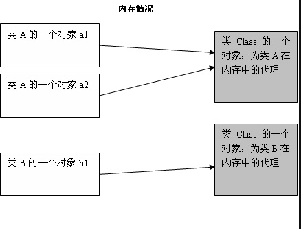

如果获取一个类的Class对象：

- Class类的`forName(String)`函数
- 使用类字面常量 Class c=Test.class
- 使用类对象的`getClass()方法（继承于Object方法）

我们可以用Class对象做什么？

- 获取Class对象对应类的域

```java
public Field[] getFields() throws SecurityException
```

- 获取方法

```java
public Method getMethod(String name, Class<?>... parameterTypes)
  
public Method[] getMethods() throws SecurityException
```

- 获取构造函数，进而创建实例

```java
public Constructor<T> getConstructor(Class<?>... parameterTypes)
        throws NoSuchMethodException, SecurityException
        
public Constructor<?>[] getConstructors() throws SecurityException
```

## Object类

Object是所有类的祖先类，当不显式表明继承自哪个父类时，其实就默认了是继承Object类。

Object中具有哪些属性和行为，是Java语言设计背后的思维体现

具体方法：

### clone()

```java
protected native Object clone() throws CloneNotSupportedException;
```

实现浅拷贝，返回拷贝新对象的引用。

是protected方法。

protected修饰的属性或方法表示：在同一个包内或者不同包的子类可以访问。

也就是说，如果在另一个包中调用一个Object类的实例obj.clone()是会出现权限错误的

但是调用一个继承Object类的Test类的实例test.clone()是可以正常的。

**"不同包中的子类可以访问"，是指当两个类不在同一个包中的时候，继承自父类的子类内部且主调（调用者）为子类的引用时才能访问父类用protected修饰的成员（属性/方法）。 在子类内部，主调为父类的引用时并不能访问此protected修饰的成员。！（super关键字除外）**

错误理解protected:

```java
public class Test extends Object implements Cloneable {
    public static void main(String[] args) throws CloneNotSupportedException {
        Object object = new Object();
        Object clone = object.clone();
      //出错信息
      //Error:(10, 30) java: clone() 在 java.lang.Object 中是 protected 访问控制
    }
}
```

正常使用形式：

```java
public class Test extends Object implements Cloneable {
    public static void main(String[] args) throws CloneNotSupportedException {
        Test test = new Test();
        Object clone = test.clone();
        Test clone1 = (Test) test.clone();
    }
}
```

### getClass()方法

```java
public final native Class<?> getClass();
```

getClass()也是一个native方法，返回的是此Object对象的类对象/运行时类对象Class<?>。效果与Object.class相同。

而且是final方法，不能被重写

### equals()方法

```java
public boolean equals(Object obj) {
    return (this == obj);
}
```

==对于基本类型数据是会判断值是否相等，而对于引用数据的话，判断的是地址。

因此，如果对一个继承于Object的类，没有重写equals的方法的话，默认继承Object方法，实现是使用==判断两个的地址是否相等。

因此，自己定义的类，很多时候需要自己将判断两个对象是否相等的逻辑重写到equals方法中

比较典型的是String的equals方法。

```java
public boolean equals(Object anObject) {
    if (this == anObject) {
        return true;
    }
    if (anObject instanceof String) {
        String aString = (String)anObject;
        if (!COMPACT_STRINGS || this.coder == aString.coder) {
            return StringLatin1.equals(value, aString.value);
        }
    }
    return false;
}
```

可以看到，在==比较地址相等时直接返回是没有问题的，因为地址相同肯定所有都相同。

当地址不相同时，很有可能出现内部保存字符串的内容是相同的，但是指向了两个不同的String对象，因此在下面判断具体字符是否相等。

### hashCode()

```java
public native int hashCode();
```

hashCode()方法返回一个整形数值，表示该对象的哈希码值。

需要注意的是在重写hashCode()和equals()方法时，要注意逻辑的一致性。

即如果两个对象相等（**并不是指==比较相等，而是调用equals()方法意义上相等），那么这两个对象的hashCode()返回值也要相同。

就是说，逻辑是，我们认为

```
两个对象相等 <=>  equals()相等  => hashCode()相等
```

所以，严格意义上来说，重写了equals方法后一定要重写hashCode方法

### toString()

```java
public String toString() {
    return getClass().getName() + "@" + Integer.toHexString(hashCode());
}
```

toString()方法返回该对象的字符串表示

当我们调用`System.out.println(obj)`的时候，其实就等价于`System.out.println(obj.toString())`

### wait()/notify()/notifyall()

主要用于多线程之间的协作

`wait()`方法：调用此方法的当前线程等待。直到其他线程上调用此方法的对象的`notify()/notifyall()`方法。

`notify()/notifyAll()`：唤醒在此对象监视器上等待的单个线程/所有线程。


# Java容器

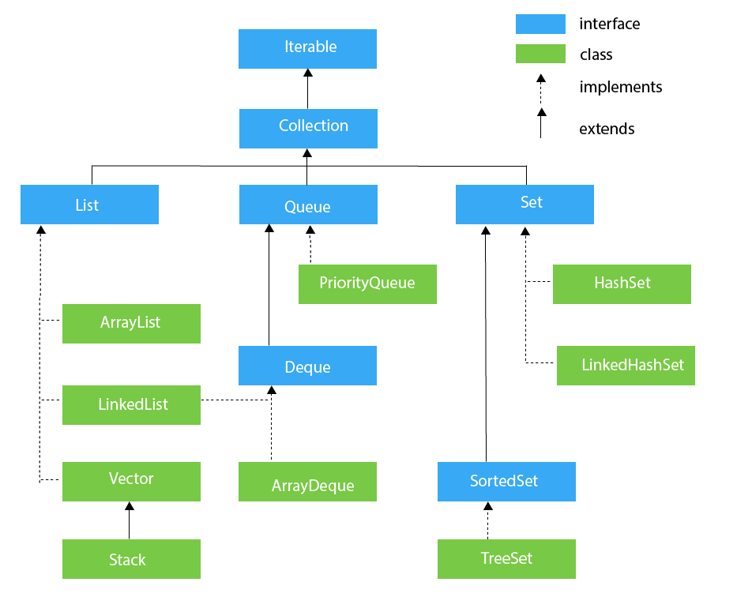

## 1. Collection:List

list中主要有三种：ArrayList、LinkedList、Vector

### ArrayList

**Field：**

```java
//默认初始容量为10
private static final int DEFAULT_CAPACITY = 10;

//底层实现是一个Object数组
transient Object[] elementData;

//List尺寸，并不是最大容量，而是加入的元素容量
private int size;

//维护一个变化的标记位
//每次List变化就++
//在forEach迭代过程中，如果对list进行操作就会马上抛出异常。因为modcount不等于期望的expectdmodCount
//需要调用iterrator的remove或者add方法
protected transient int modCount = 0;
```

**扩容**

当add的时候，发现数组不够用的时候，就调用grow方法进行扩容。默认扩容会变成原来的1.5倍。

```java
    private Object[] grow(int minCapacity) {
        int oldCapacity = elementData.length;
        if (oldCapacity > 0 || elementData != DEFAULTCAPACITY_EMPTY_ELEMENTDATA) {
            int newCapacity = ArraysSupport.newLength(oldCapacity,
                    minCapacity - oldCapacity, /* minimum growth */
                    oldCapacity >> 1           /* preferred growth */);
            return elementData = Arrays.copyOf(elementData, newCapacity);
        } else {
            return elementData = new Object[Math.max(DEFAULT_CAPACITY, minCapacity)];
        }
    }

		int newLength = Math.max(minGrowth, prefGrowth) + oldLength;
```

如果我们初识容量是10，某一时刻我们突然要大量加入元素例如10000个。那么在这种情况下，就会发生频繁扩容的情况。而扩容又需要拷贝所有数组元素，无疑很费时。可以调用ensureCapacity方法，直接将数组扩容成想要的容量。

```java
    public void ensureCapacity(int minCapacity) {
      //数组不空，提供的数组大小大于现在大小
      //就直接调用grow方法扩容到指定容量
        if (minCapacity > elementData.length
            && !(elementData == DEFAULTCAPACITY_EMPTY_ELEMENTDATA
                 && minCapacity <= DEFAULT_CAPACITY)) {
            modCount++;
            grow(minCapacity);
        }
    }
```

### LinkedList

#### 节点Node

```java
    private static class Node<E> {
        E item;
        Node<E> next;
        Node<E> prev;

        Node(Node<E> prev, E element, Node<E> next) {
            this.item = element;
            this.next = next;
            this.prev = prev;
        }
    }
```

Node节点是LinkedList中的数据结构，是一个有前驱后继两个指针的节点

链在一起就成了双向链表

同时，LinkedList本身还保存着指向头节点和尾节点的指针

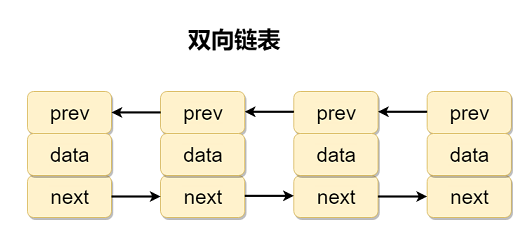

### 实现的接口

```java
public class LinkedList<E>
    extends AbstractSequentialList<E>
    implements List<E>, Deque<E>, Cloneable, java.io.Serializable
```

LinkedList实现的功能性接口有List和Deque。

实现List说明可以作为List列表

实现Deque说明可以作为双端队列，同时Deque又是继承自普通队列Queue的，所以也可以作为普通队列

### Vector

**过时**的并发列表。

和hashtable一样，Vector中的每个方法都是对方法加synchronized，这样锁住的是实例对象也就是整个Vector，开销太大。

**特别注意**

Stack是继承自Vector的，因此，Stack也有Vector这样的问题。因此，尽量避免使用这两个类。

在需要使用栈的时候，可以使用LinkedList作为Deque，使用其中的push和pop操作。

**Deque的实现类有LinkedList、ArrayDeque**

测试了一下，LinkedList比Stack还要慢。实际使用应该用ArrayDeque（实际采用数组作为循环数组实现）

## 2. Collection:Set

Set主要也是三种：HashSet、LinkedHashSet、TreeSet

### HashSet

HashSet是无序的，底层使用HashMap来实现。即将value设为同一个Object实例对象，用key来去重。

```java
private transient HashMap<E,Object> map;

private static final Object PRESENT = new Object();

public boolean add(E e) {
  return map.put(e, PRESENT)==null;
}
```

### LinkedHashSet

LinkedHashSet是继承自HashSet的，在自身的构造函数中调用了HashSet中专门为其设计的构造函数。

注意，HashSet中将map设置为LinkedHashMap的构造函数不是public的，就只有LinkedHashSet能访问。

**可以实现按照插入顺序遍历**

具体实现方式见LinkedHashMap

```java
public LinkedHashSet(int initialCapacity, float loadFactor) {
  super(initialCapacity, loadFactor, true);
}
HashSet(int initialCapacity, float loadFactor, boolean dummy) {
  map = new LinkedHashMap<>(initialCapacity, loadFactor);
}
```

### TreeSet

```java
public class TreeSet<E> extends AbstractSet<E>
    implements NavigableSet<E>, Cloneable, java.io.Serializable
```

- 实现了NavigableSet接口，这个接口首先是继承自SortedSet接口的。

- SortedSet接口可以实现找到最小元素、最大元素、某个范围内的元素等等操作

- 而NavigableSet接口实现了
  - ceiling(e)：集合中最小的大于等于e的元素
  - floor(e)：集合中最大的小于等于e的元素
  - higher(e)：集合中最小的大于e的元素
  - lower(e)：集合中最大的小于e的元素

- 底层是通过一个NavigableMap来实现的，不传参的话默认使用TreeMap来实现

## 3. Map

### 3.1 HashMap

#### 数据结构

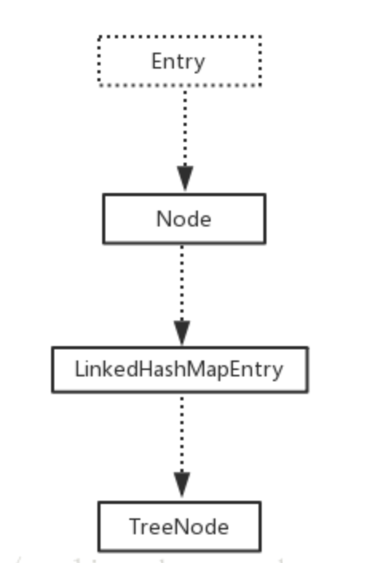

- `Node<K,V>`

```java
static class Node<K,V> implements Map.Entry<K,V> {
    final int hash;
    final K key;
    V value;
    Node<K,V> next;
```

链表形式开链组织

- `TreeNode<K,V>`

```java
static final class TreeNode<K,V> extends LinkedHashMap.Entry<K,V> {
    TreeNode<K,V> parent;  // red-black tree links
    TreeNode<K,V> left;
    TreeNode<K,V> right;
    TreeNode<K,V> prev;    // needed to unlink next upon deletion
    boolean red;
```

树结构组织，红黑树

- TreeNode是Node的子类。HashMap中保存的是一个Node的数组。数组的元素就是相同哈希值的访问入口（可能是链表，可能是红黑树）

```java
transient Node<K,V>[] table;
```

为什么HashMap长度会扩展到2的幂次？

- 其实是和求hash的操作有关，因为希望用位运算来代替取余操作提高运算效率，这样计算出来的hash值就是0到2的次方-1

#### put方法增加元素

```java
if (p.hash == hash &&
    ((k = p.key) == key || (key != null && key.equals(k))))
  e = p;
else if (p instanceof TreeNode)
  e = ((TreeNode<K,V>)p).putTreeVal(this, tab, hash, key, value);
else {
  for (int binCount = 0; ; ++binCount) {
    if ((e = p.next) == null) {
      p.next = newNode(hash, key, value, null);
      if (binCount >= TREEIFY_THRESHOLD - 1) // -1 for 1st
        treeifyBin(tab, hash);
      break;
    }
    if (e.hash == hash &&
        ((k = e.key) == key || (key != null && key.equals(k))))
      break;
    p = e;
  }
}
```

- 当hash后发现对应的槽为空时，直接插入

- 是红黑树时，调用红黑树的插入方法插入

- 否则就是链表，遍历链表
  - 如果找到相同的key，说明之前被添加过，break直接在后面更新值即可
  - 找到最后为空了还是找不到
    - 如果此时长度小于`TREEIFY_THRESHOLD=8`时，就直接在尾部插入
    - 如果此时长度大于TREEIFY_THRESHOLD，就会尝试将这个槽的链表转换为红黑树，只是尝试
      - 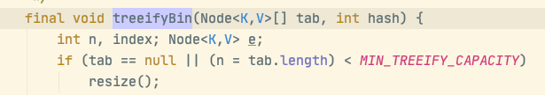
      - 当Node数组的长度小于一个`MIN_TREEIFY_CAPACITY=64`的时候，默认是先对Hashmap扩容而不是转换红黑树。扩容方法会扩容成原来的两倍，然后重新hash。
      - 否则才是将链表转换为红黑树，转换是在treeifyBin中将所有节点变为TreeNode节点，此时并没有变成红黑树结构。然后再调用treeify()函数才变为红黑树，但同时还是维护着一条Node链。

---

可以看到，是采用的尾插法。避免了更改之前元素的相对顺序。因为1.8之前采用头插法，会将元素链的顺序反过来，在多线程情况下出现环的情况。

### 遍历HashMap的方式快慢

1. 使用keySet的迭代器iterator
2. 使用entrySet的迭代器iterator
3. 使用forEach KeySet
4. 使用forEach EntrySet

- 使用迭代器或者是forEach没有明显区别
- 使用keySet进行遍历会比使用EntrySet进行遍历慢一倍左右，原因是因为在我们遍历一遍得到key以后，还要进行map.get(key)操作，相当于遍历了两遍HashMap

### 3.2 HashTable

HashTable是线程安全的，但是在线程竞争激烈的情况下效率低下。

原因是因为他的所有方法都是用synchronized来修饰方法，对方法加synchronized的话，锁住的是当前的实例对象，也就是当前的HashTable。

因此，所有访问此HashTable都要竞争同一把锁，效率低下

```java
public synchronized V get(Object key)
public synchronized V put(K key, V value)
public synchronized V replace(K key, V value)
public synchronized V remove(Object key)
```

### 3.3 ConcurrentHashMap

因为HashMap即使是使用尾插法也只是保证了不会出现环的情况，也就是说HashMap在结构上还是正确的。但是在多线程下还是有可能出现重复数据以及数据不一致的情况。

所以ConcurrentHashMap就是为了解决这个问题。

在1.8版本之前，是采用分段锁的技术，将数据分为一段一段进行存储，给每一段数据配一把锁。也就是分配一个数组的锁，每一个锁管理一段数据。读操作和现在的ConcurrentHashMap一样也是不加锁的，由volatile来保证可见性，写操作需要获取分段锁。具体实现是使用的重入锁Reentrantlock

**在1.8（包括）之后，取消了分段锁技术，因为并发性还是不够高。**

#### 数据结构

- `Node<K,V>`：和HashMap中类似，不过需要注意的是val值和next指针都变成了volatile的，这样可以保证在get方法时不需要加锁，因为volatile保证了可见性。

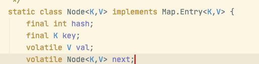

- `TreeNode<K,V>`：和HashMap中类似，和Node不一样的是，TreeNode并没有任何锁的结构，在查找的时候也不加锁。
- `TreeBin<K,V>`：也是继承自Node节点，所以可以作为Node数组的元素。这也是TreeNode不加锁的原因。TreeBin是一个用来保管整个红黑树的数据结构，他保存了整个红黑树的根节点，以及红黑树对应链表的起始节点。同时还有一个**读写锁结构**（通过CAS和volatile来实现），通过控制这个访问入口来控制TreeNode。

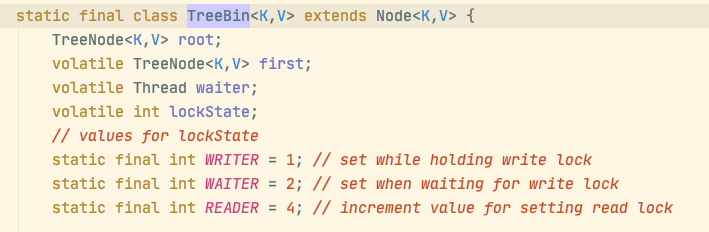

#### put方法增加元素

- 对hash的槽进行判断，如果这个槽现在是空的，直接用CAS操作new一个新的Node，不需要加锁

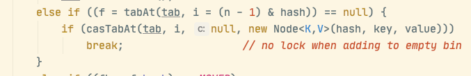

- 这部分函数是只有当onlyIfAbsent为true，也就是调用下面这个方法的时候才会生效。putIfAbsent是只有当要插入的键值对不存在的时候才会插入，存在时不插入更新直接返回值。当调用这个方法check头节点的时候是不用加锁的。

  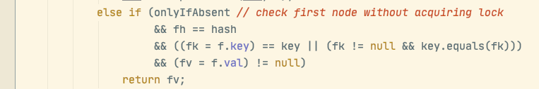

```java
/**
 * {@inheritDoc}
 *
 * @return the previous value associated with the specified key,
 *         or {@code null} if there was no mapping for the key
 * @throws NullPointerException if the specified key or value is null
 */
public V putIfAbsent(K key, V value
```

- 接下来就需要沿着Node的链或者Node的红黑树进行查找，查找key相等的元素。
  - 采用对Node数组中的每个入口Node（可能是链表Node，也有可能是红黑树TreeNode）加锁。锁住的是链表或者红黑树的入口节点TreeBin。
  - 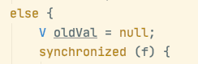
  - 在**链表**中插入元素时，有可能会触发扩容或这转为红黑树。如果转为红黑树的话，不是简单的转为红黑树，其实还会保留一条链表的数据结构。因为TreeNode是Node的子类，其自己的left right指针保存的是一个红黑树的数据结构，继承自Node的next指针保存的是链表的数据结构。
    - 转为红黑树是先将链表中的Node全部变为TreeNode节点，然后next链关系保持不变
    - 再通过TreeBin的构造方法，将该TreeNode链变为一个由left right数组保存的红黑树结构。
  - 在**红黑树**中插入元素时，首先我们通过hash得到的是TreeBin的数据结构，我们先用syn锁住这个TreeBin。然后通过key的compare方法来进行二叉搜索树的查找，查找完再进行插入。插入的时候会对TreeBin的读写锁进行加锁。加锁的目的是为了让读的其他线程知道现在正在进行修改，可以读写并发。
- 扩容的操作和HashMap类似，不过在更改一些变量的时候用了CAS操作来保证原子性。同时在迁移的时候还会设置一个标志，当其他put操作发现有线程正在迁移的时候会帮忙一起迁移。

#### get方法获取元素

需要特别注意的是，get方法会根据请求的是链表还是红黑树有着完全不同的流程。具体体现在find方法的多态性。

- Node节点的value和next都是volatile的，这样如果按照链表的结构来进行查找就能保证能读取到最新的改动，而不用加锁。所以Node节点的find方法是没有进行任何显式同步操作的。
- 也就是说，get方法不用同步操作的原因是Node节点的value和next是volatile的。而Node数组本身是volatile的是为了保证扩容时候的可见性，不要混淆。

```java
static class Node<K,V> implements Map.Entry<K,V> {
    final int hash;
    final K key;
    volatile V val;
    volatile Node<K,V> next;
  
  
  Node<K,V> find(int h, Object k) {
    Node<K,V> e = this;
    if (k != null) {
      do {
        K ek;
        if (e.hash == h &&
            ((ek = e.key) == k || (ek != null && k.equals(ek))))
          return e;
      } while ((e = e.next) != null);
    }
    return null;
  }
```

- 而TreeBin的find方法就比较有意思了。因为TreeBin通过CAS和volatile关键字实现了一个读写锁lockState。
  - 即当被加了写锁的时候，直接用Node用next维护的链表利用volatile的可见性进行查找
  - 不然的话就加读锁，利用锁进行同步操作保证可见性用红黑树进行查找

```java
final Node<K,V> find(int h, Object k) {
    if (k != null) {
        for (Node<K,V> e = first; e != null; ) {
            int s; K ek;
          //当发现有别的线程正在等待或者正在写时，就不能通过红黑树结构进行查找了，因为TreeNode并没有进行同步措施
          //所以此时就利用还一直在维护的Node构成的链表来进行查找，因为Node的val和next是volatile的，所以可以保证可见性
            if (((s = lockState) & (WAITER|WRITER)) != 0) {
                if (e.hash == h &&
                    ((ek = e.key) == k || (ek != null && k.equals(ek))))
                    return e;
                e = e.next;
            }
          //如果此时没有别的线程加了锁，就用cas加读锁
          //加完就可以继续读了
            else if (U.compareAndSetInt(this, LOCKSTATE, s,
                                         s + READER)) {
                TreeNode<K,V> r, p;
                try {
                    p = ((r = root) == null ? null :
                         r.findTreeNode(h, k, null));
                } finally {
                    Thread w;
                    if (U.getAndAddInt(this, LOCKSTATE, -READER) ==
                        (READER|WAITER) && (w = waiter) != null)
                        LockSupport.unpark(w);
                }
                return p;
            }
        }
    }
    return null;
}
```

#### key和value==null？

和hashmap对比，HashMap中key和value都可以为空，而ConcurrentHashMap中key和value都不为空。

- key==null？

  - 首先在hashmap中，需要得到key的hash来保存元素。

  - 但是key为null的话，是没法调用hashcode方法来得到hash的。

  - 在hashmap中，做了一层处理，将null的hash值设置为0

    ```java
    static final int hash(Object key) {
        int h;
        return (key == null) ? 0 : (h = key.hashCode()) ^ (h >>> 16);
    }
    ```

  - 在concurrenthashmap中，直接拒绝了key为null的操作，抛出空指针异常

    ```java
    if (key == null || value == null) throw new NullPointerException();
    ```

  - 我认为，concurrenthashmap是完全能做到保存null的key，但是为了和value的统一，就这样进行处理了。

- value==null？

  - 对于value==null，并不会产生任何编程上的异常。主要是语义上的二义性。
  - 当我们get(key)得到null返回值的时候，可能的情况有两种：
    - map中不包含这个key
    - map中这个key的value就是null
  - 如果对于单线程的hashmap，我们可以通过调用containskey(key)来判断是哪种情况。
  - 但是对于多线程的concurrenthashmap，在多一次调用的过程中，有可能刚刚确实不包含这个key，但是别的线程put了一个value==null的进来。让你以为之前的是第一种情况。造成误解。

- [JUC包作者Doug Lea认为](http://cs.oswego.edu/pipermail/concurrency-interest/2006-May/002485.html)，不论是key还是value都应该统一的不允许key和value为null。他认为hashmap允许null的key和value是设计的问题，虽然在技术层面没有问题。

### LinkedHashMap

内部定义了内部类：

```java
    static class Entry<K,V> extends HashMap.Node<K,V> {
        Entry<K,V> before, after;
        Entry(int hash, K key, V value, Node<K,V> next) {
            super(hash, key, value, next);
        }
    }
```

就是在HashMap的Node的基础上，除了next指针用来组成一条冲突链

还加上了before和after指针，用来组成一条按插入顺序组成的链

在HashMap中遍历的方式是遍历Node数组，不为空再遍历冲突链

而在LinkedHashMap中，遍历的方式就是按照插入顺序，从头节点开始遍历到尾节点

### TreeMap

```java
    static final class Entry<K,V> implements Map.Entry<K,V> {
        K key;
        V value;
        Entry<K,V> left;
        Entry<K,V> right;
        Entry<K,V> parent;
        boolean color = BLACK;
    }
```

- `comparable` 接口实际上是出自`java.lang`包 它有一个 `compareTo(Object obj)`方法用来排序
- `comparator`接口实际上是出自 java.util 包它有一个`compare(Object obj1, Object obj2)`方法用来排序

将所有的key-value组成一颗红黑树，然后进行二叉搜索树的查找。

查找和插入的时间复杂度是log n。

## 4. Collections类

是一个工具类，在该类中定义很多类静态方法用来对Collection进行操作，即传入具体的Collection然后进行操作。常用的函数有：

### 4.1 排序操作

```java
void reverse(List list)//反转
void shuffle(List list)//随机排序
void sort(List list)//按自然排序的升序排序
void sort(List list, Comparator c)//定制排序，由Comparator控制排序逻辑
void swap(List list, int i , int j)//交换两个索引位置的元素
void rotate(List list, int distance)//旋转。当distance为正数时，将list后distance个元素整体移到前面。当distance为负数时，将 list的前distance个元素整体移到后面
```

### 4.2 查找替换操作

```java
int binarySearch(List list, Object key)//对List进行二分查找，返回索引，注意List必须是有序的
int max(Collection coll)//根据元素的自然顺序，返回最大的元素。 类比int min(Collection coll)
int max(Collection coll, Comparator c)//根据定制排序，返回最大元素，排序规则由Comparatator类控制。类比int min(Collection coll, Comparator c)
void fill(List list, Object obj)//用指定的元素代替指定list中的所有元素
int frequency(Collection c, Object o)//统计元素出现次数
int indexOfSubList(List list, List target)//统计target在list中第一次出现的索引，找不到则返回-1，类比int lastIndexOfSubList(List source, list target)
boolean replaceAll(List list, Object oldVal, Object newVal)//用新元素替换旧元素
```

# java虚拟机

# JavaI/O

## 序列化

必须实现 Serializable 接口，只是一个标准，并没有任何方法需要实现

### transient

- ArrayList中保存数据的数组是transient的，因为ArrayList的数组是动态扩展的，并不是所有空间都被使用，因此不需要所有内容序列化，通过重写序列化和反序列化方法，可以只序列化数组中有内容的那部分数据。
- 而LinkedList和HashMap中，均有着只保存了链的引用的情况，这部分也是transient的，也是需要重写序列化和反序列化方法，通过引用来将所有数据序列化

# 常见设计模式

## 设计原则

```
可维护、可扩展、可复用、灵活性高
```

### 单一职责原则

```
单一职责原则：就一个类而言，应该仅有一个引起它变化的原因
```

如果一个类承担的职责过多，就等于将这些职责耦合在了一起，这样这其中任何一个职责的变化都会削弱或者改变这个类完成其他职责的能力，而且当我们要修改任意一个职责的时候，都会导致我们要修改该类，容易导致不安全或者增大出错的可能。

因此，软件设计就是要发现职责并把职责相互分离。

### 开放-封闭原则

```
开放-封闭原则：是说软件（类、模块、函数）等应该可以扩展，但是不可修改
```

即对修改封闭，对扩展开放。也就是说不允许修改，允许扩展。

但是，一个东西不可能是一成不变的，当情况发生改变的时候就必须要修改。

这个原则是提示我们，在设计一个类的时候，首先先去思考如果未来可能发生哪些变化，可能会导致我们必须要修改这个类才能解决。如果有这种情况，我们就要针对这种情况对类进行抽象来隔离变化。

例如，当我们写一个加法程序的时候，如果我们能考虑到未来有可能加入减法的话，就可以将加法类抽象称为运算类，然后在运算类中继承出一个减法类，这样当未来需要增加减法时，就只需要让减法去继承运算类，而不需要修改加法类。这就是对扩展开放，对修改封闭。

但是，另一方面来说，我们并不可能完美的预测未来的变化。因此，这个原则还指导我们，未来当不在预料之中的变化发生的时候，导致必须进行修改时，我们就应该考虑针对已经发生的这种变化进行抽象，去避免相同的变化再次发生时仍然进行修改。

例子如上，意思就是假设我们一开始没有想到未来可能会加入减法的操作，但是当这个需求来了之后，我们就应该将运算操作抽象出来，避免未来可能又需要增加乘法除法等，做到亡羊补牢。

### 依赖倒转原则

```
依赖倒转原则：抽象不依赖于细节，细节应该依赖于抽象
```

当我们在需要修改或者替换某个类时，希望可以在不影响别的类的前提下进行。也就是要做到强内聚，松耦合。

要做到这一点，就要针对接口进行编程，不要对具体的实现编程。

### 里氏代换原则

```
里氏代换原则：子类型必须能够替换掉他们的父类型。
```

也就是说，如果将一个父类全部替换为他的子类，我们的程序行为应该是没有变化的。

当子类继承父类后，子类一定是可以以父类的身份出现的。也就是向上转型是必然可以成功的。反之则不一定。

只有当这一点能够满足的时候，父类才能真正被复用，我们才能将子类的行为抽象成父类，并面向抽象编程。

由于子类的可替换性才能使使用父类的模块在无需修改的情况下就可以完成扩展。

也就是说，里氏代换原则的实现，是开放-封闭原则成为了可能。

### 迪米特法则

```
迪米特法则：如果两个类之间不必彼此通信，那么这两个类就不应当发生直接的相互作用。如果其中一个类需要调用另一个类的某一个方法的话，可以通过第三方转发这个调用。
```

迪米特法则的根本思想就是强调类之间的松耦合。

类之间的耦合越弱，越有利于复用，一个处在弱耦合的类被修改，不会对有关系的类造成波及。                                                                                                                                                                                                                                                                                                                                                                                                                               

## 1. 单例模式

单例模式的定义：

```
保证一个类有且仅有一个实例，并提供一个访问他的全局访问点
```

首先，我们需要保证类只有一个，那么构造方法就不能是public给外界访问，不然直接调用构造方法就会破坏只有一个的情况。同时，我们又要访问到单个的实例，所以必须提供一个全局访问点。

### 懒汉式

#### 简单按需创建

即我们当需要用到实例时，才开始分配。即按需创建。

最常见的，提供一个公有的静态方法`getInstance`，判断单例对象`instance`不为空的时候直接返回该对象，为空的时候才创建

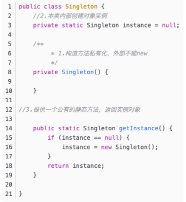

问题是，这样的情况在单线程中是很高效的，但是在多线程环境中，在判断`instance==null`可能会发生问题

#### 双重检查加锁，线程安全

- 将instance变为volatile，保证每个线程改动后其他线程都能立即获取，这样才保证第一次instance==null判断结果正确
- 第一次判断instance==null是为了避免每次判断实例是否存在的时候都需要加锁操作，去掉也能正常运行，但是效率低
- 加锁是为了避免两个线程同时调用同时判断，最后生成两个实例
- 第二次则是正常的判断实例是否存在。
  - 如果没有第二次判断的话，如果有两个线程恰好同时获取锁，那么只有一个线程获取到了，另一个在等待。当前一个创建返回完毕释放锁时，下一个如果直接进来没有第二次判断的话就会导致创建两次。

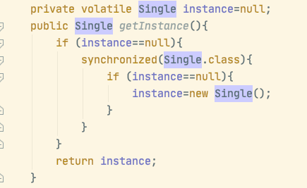

### 饿汉式

饿汉式指的是无论是否使用到，我们都提前创建好唯一的那个实例。

#### 简单提前分配

在java中用类中静态域的初始化来完成，正确性由虚拟机通过类加载机制来保证。

缺点是，无论该单例未来是否用到，都会被提前创建

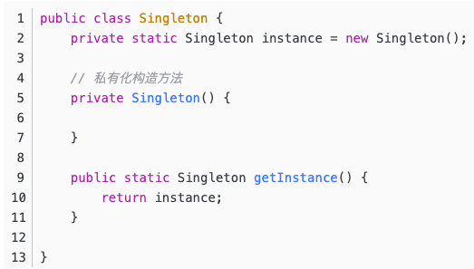

为了避免资源浪费，我们尝试看是否可以用相同的机制实现按需创建。

#### 静态内部类按需提前创建

饿汉式是通过虚拟机的类加载机制来完成的，也就是说当我加载自己这个对象时，就必然导致该静态单例对象被创建。但是，如果通过不是自身的类，而是其他类，也是通过虚拟机的类加载机制来完成的话，就可以达到用的时候才创建了，同时保证正确性。

因此，使用一个静态内部类，我们在该内部类中设置一个静态域的初始化条件等于一个新的单例对象，这样当不用的时候，该静态内部类不会被加载，也就不会创建。当需要用到的时候，虚拟机会加载该类，也就会创建新的单例对象，正确性也还是由虚拟机保证的。

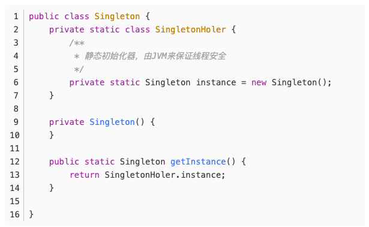

### 破坏单例模式

#### 1. 反射

因为我们避免重复创建的方式是将构造函数设为private，让获取新对象只能通过我们设置的函数来获取，进而来进行控制。

因此如果通过反射来直接获取构造函数，并通过设置setAccessible来直接调用，就可以获取一个新的不同的单例对象。

**解决方法**

既然我们无法阻止通过反射来获取并调用构造函数，那么我们就可以在构造函数中来进行控制。

也就是说，我们让构造函数来识别之前此次调用是不是第一次创建对象。

那么就可以通过判断instance是不是null或者设置一个flag标志位默认为false，当调用一次构造函数后就设置为true都可以。

#### 2. 调用clone()方法进行破坏

因为如果调用父类Object的clone()方法的话，必须实现Cloneable接口。此时确实会生成一个新的对象，判断两个也是不等的。

**解决方法**

第一，可以不实现Cloneable接口，禁止调用clone方法

第二，可以override clone方法，是其返回已经创建的实例对象

#### 3. 序列化+反序列化

和clone()方法类似，如果实现了Serializable接口的话，通过序列化转换，最后得到的对象也是不等的。

**解决方法**

第一，可以不实现Serializable接口，禁止序列化

第二，通过写readResolve方法。如果反序列化的目标类有readResolve方法，就会通过反射的方式调用该类的readResolve方法，返回一个对象。那我们在该方法中返回instance即可保证反序列化的也相同即可。

#### 完整代码

```Java
import java.io.*;
import java.lang.reflect.Constructor;

public class Test implements Cloneable, Serializable {

    public static void main(String[] args) throws Exception {

        System.out.println("-----------序列化----------------------");
        Test originTest = Test.getInstance();
        ByteArrayOutputStream bos = new ByteArrayOutputStream();
        ObjectOutputStream oos = new ObjectOutputStream(bos);
        oos.writeObject(Test.getInstance());
        ByteArrayInputStream bis = new ByteArrayInputStream(bos.toByteArray());
        ObjectInputStream ois = new ObjectInputStream(bis);
        Test serializeTest = (Test) ois.readObject();
        System.out.println(originTest == serializeTest);//true or false

        System.out.println("-----------反射----------------------");
        //通过反射获取
        Constructor<Test> cons = Test.class.getDeclaredConstructor();
        ((Constructor) cons).setAccessible(true);
        Test reflextTest = cons.newInstance();
        System.out.println(reflextTest == originTest);//true or false

        System.out.println("---------------------------克隆----------------------");

        Object clone = originTest.clone();
        Test cloneTest=(Test) clone;
        System.out.println(cloneTest == originTest);//true or false
    }
    private Test() {
    }
    private static class TestHolder{
        private static volatile Test instance=new Test();
    }
    public static Test getInstance(){
        return TestHolder.instance;
    }
    private Object readResolve(){
        return TestHolder.instance;
    }
}
```

## 2. 工厂模式

分为三大类

- 简单工厂模式
- 工厂方法模式
- 抽象工厂模式

### 简单工厂模式

工厂模式主要是用于对实现逻辑的封装，并且通过对公共的接口提供对象的实例化的服务

在添加新的类时不需大动干戈，只要修改一点点就好。

**静态简单工厂**

首先我们有着多种对象可能需要返回，如下面的ProductA和ProductB

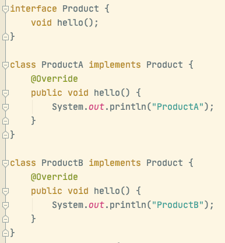

但是如果我们直接使用的话，就需要在业务层面去主动选择要实例化成哪一个Product。

因此，我们考虑将选择的逻辑封装到工厂类中。

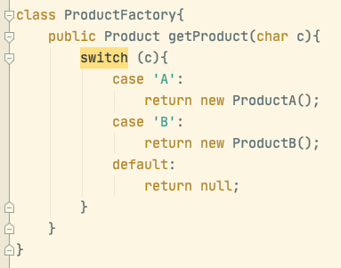

简单工厂的好处在于当我们对具体的实现类需要进行修改的时候，不需要改动工厂和使用的业务代码。即通过工厂将实现类和使用解耦合，将耦合关系封装到了工厂内部获取的逻辑。

但是，如果要增加类的话，不需要更改其他的类，但是需要对工厂内的判断逻辑进行增加。

因此，简单工厂是完成了开放-封闭原则中的对扩展开放，但是没做到对修改封闭。

### 工厂方法模式

上文说到简单工厂模式，对修改是开放的。即如果需要增加一个ProductC的话，是需要修改ProductFactory的。

因此，我们考虑对简单工厂进一步抽象，将具体的逻辑代码转移到实现的子类工厂中。

具体实现是将工厂也抽象出来，变成每个工厂生产对应的产品。

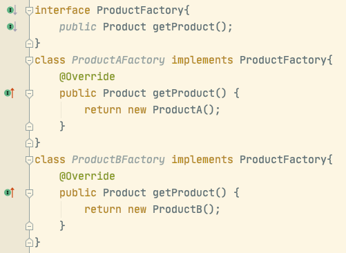

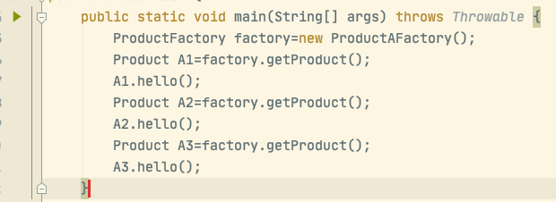

这样做就是将选择的逻辑由简单工厂内部转移到了业务代码的地方。

那么这么做和不使用工厂模式有什么区别呢？因为不使用工厂模式也可以直接在业务代码中选择所需要的实现类。

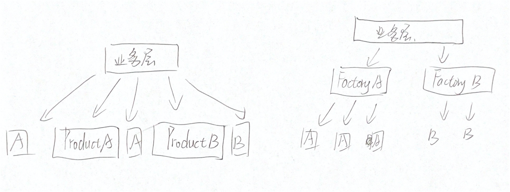

可以看到，之前的业务层是和每一个产品耦合的，这也意味着如果我们需要更改产品A为产品C，需要更改每一处。

而现在工厂方法模式，业务层是和具体的工厂耦合的，如果我们需要更改A为C，只需要将FactoryA改为FactoryC即可，只需要修改一处

同时，当使用简单方法模式中，创建逻辑非常复杂，比如需要组合其他类对象，可以通过将创建逻辑拆分到各个工厂类中。

### 抽象工厂模式

在工厂方法类中，只有一个抽象方法，要想实现多种不同的类对象，只能去创建不同的具体工厂方法的子类来实例化。而抽象工厂就是让一个工厂负责创建多个不同的对象。

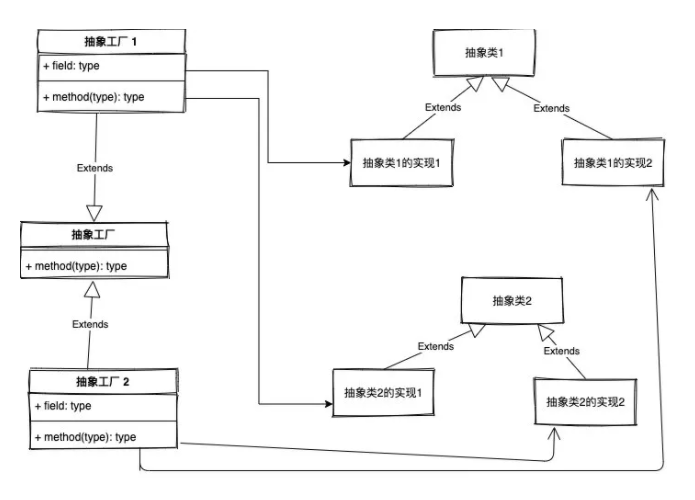

可以看到，当只有抽象类1的时候，抽象工厂1和抽象工厂2就是工厂方法模式。

但是加入了多个抽象类，抽象工厂能生产的对象就变多了。等于是在内部增加了维度。

比较适用于底层的实现依赖于上层的情况，例如数据库使用的是mysql，那么抽象类1和抽象类2就都要用mysql的实现，就要用抽象工厂1。如果使用的是oracle，就要用抽象工厂2生产抽象类1和抽象类2的oracle实现。

## 3. 建造者模式

```
建造者模式：将一个复杂对象的构建和它的表示分离，使得同样的构建过程可以创建不同的表示
```

首先，我们先建立一个抽象的需要被构建的对象`AbstractBuilder`。

在抽象的Builder中我们去定义对象的构建过程，此时并没有实现。即我们去定义它需要由哪些部分组成

然后在具体的实现中再去给出组成部分的具体实现

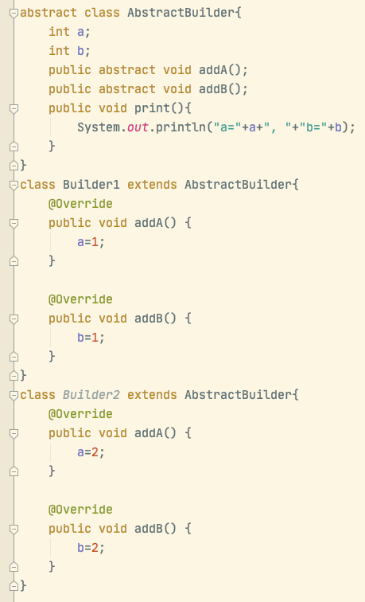

然后我们建立一个指挥类，将如何构建对象的逻辑写到指挥类中，即需要去调用哪些以及怎么顺序调用Builder类中的方法来完成构建

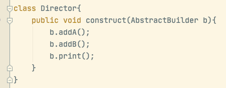

最后，我们是使用的时候就只需要new一个我们想要的Builder类，然后交给指挥类即可。

简而言之，类是由哪些部分组成的封装到了抽象的Builder类中，具体实现在实现类中。怎么将这些部分组装起来封装到了指挥类中。

## 4. 原型模式

```
原型模式：通过拷贝，用原型的实例来创建一个新的对象
```

其实就是通过clone()方法来获得新对象。

在java中，需要通过实现Cloneable接口以后去override clone方法来实现

需要注意的是，Object的clone方法实现的只是浅拷贝，即只会对基本类型以及那些不可变的引用实现复制

如果是引用的类型的话，复制的只是地址。这就意味着，拷贝完以后的新对象和旧对象还是共用了同一个对象。

因此，实现深拷贝的方法有两种：

- 对引用对象再进行一次拷贝，如果引用有多级的话，就要用到递归实现
- 通过序列化将对象写入流中再读取出来

## 5. 责任链模式

```
责任链模式：将请求的发送和接收解耦，让多个处理对象都有机会处理请求，将接受对象串成一条链，并沿着这条链传递请求，直到有一个对象能够处理为止。
```

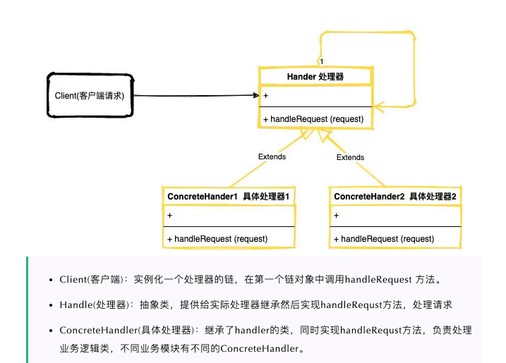

其实就是通过Handler指针设置一个后继，通过这种方式将Handler链成一个链表。然后在自己的handleRequest中写处理的业务逻辑，决定是自己处理还是说转发给自己的后继。

如下例子中，Handler是抽象类，定义了一个抽象方法handle

Handler1是实现类，负责过滤掉小于0的数，并且将大于10的数转发给后面的节点。只有在0-10之间的才自己处理

Handler2是实现类，负责处理<20的数，其他的转发给后面的节点。

可以看到，对于每个实现类来说，他并没有获取到当前请求后面的节点能不能处理的信息，他只是负责将自己处理不了的任务往后传递。当传递到最后都没有人处理的时候，需要提前考虑这种情况应该怎么办。

另外，指责链模式的好处在于每个Handler都是独立的个体，个体的指责很明确，如果要扩展也很方便。

```java
abstract class Handler{
    public Handler next;
    abstract void handle(int no);
}
class Handler1 extends Handler{
    public Handler1(){
        this(null);
    }
    public Handler1(Handler _next) {
        next=_next;
    }
    @Override
    void handle(int no) {
        if(no<0) {
            System.out.println(this+"error input");
            return;
        }
        if(no>=10) {
            if(next!=null) next.handle(no);
            else {
                System.out.println(this+"end of chain!");
            }
            return;
        }
        System.out.println(this+"no%2="+no%2);
    }
}
class Handler2 extends Handler{
    public Handler2(){
        this(null);
    }
    public Handler2(Handler _next) {
        next=_next;
    }
    @Override
    void handle(int no) {
        if(no>=20) {
            if(next!=null) next.handle(no);
            else {
                System.out.println(this+"end of chain!");
            }
            return;
        }
        System.out.println(this+"no%2="+no%2);
    }
}
```

## 6. 观察者模式

```
观察者模式又称发布-订阅模式，定义了一种一对多的依赖关系，让多个观察对象同时监听某一个主题对象。当这个主题对象在状态发生变化的时候会通知所有观察者对象，让观察者对象作出相应的操作。
```

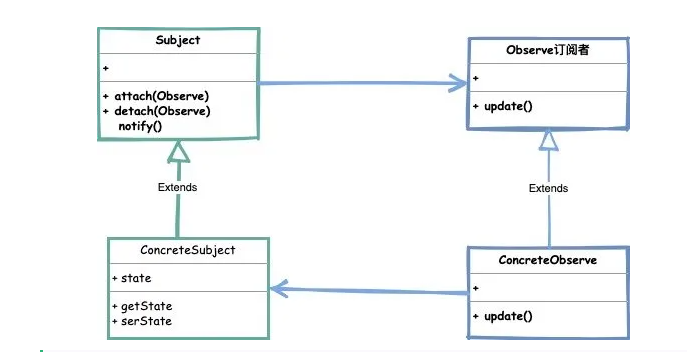

- Subject（主题）: 主要由类实现的可观察的接口，通知观察者使用notify()方法，以及增加取消观察者的attach()、detach方法。
- ConcreteSubject（具体主题）: 是一个实现主题接口的类，处理观察者的变化
- Observe（订阅/观察者）: 观察者是一个接受主题通知的接口，根据主题中的更改而进行更新。

由于一个主题可能有多个订阅者，所以主题需要用一个容器来保存订阅自己的所有观察者。并且在满足通知条件的时候，通知所有的观察者。

例如，我们微信发动态时，好友是会收到通知的。如果用观察者来表现的话，发动态的我们就是被订阅的主题，我们需要保存我们所有的好友，然后在发动态也就是主题状态改变之后，调用notify()通知所有观察者。

```java
public interface Subject {
    // 添加订阅关系
    void attach(Observer observer);
    // 移除订阅关系
    void detach(Observer observer);
    // 通知订阅者
    void notifyObservers(String message);
}

public class ConcreteSubject implements Subject {

    // 订阅者容器
    private List<Observer> observers = new ArrayList<Observer>();

    @Override
    public void attach(Observer observer) {
        // 添加订阅关系
        observers.add(observer);
    }

    @Override
    public void detach(Observer observer) {
        // 移除订阅关系
        observers.remove(observer);
    }

    @Override
    public void notifyObservers(String message) {
        // 通知订阅者们
        for (Observer observer : observers) {
            observer.update(message);
        }
    }
}
```

```java
public interface Observer {
    // 处理业务逻辑
    void update(String message);
}

public class FriendOneObserver implements Observer {
   
  @Override
    public void update(String message) {
        // 模拟处理业务逻辑
        System.out.println("FriendOne 知道了你发动态了" + message);
    }
}
```

### 7. 策略模式

```
策略模式：定义了一系列算法家族，分别封装起来，让他们之间可以互相替换，不同的策略可以让算法独立于使用它们的客户而变化。
```

例如，在商场收银的场景中，商场收银的打折策略可能有很多，因此我们将策略抽象出来，并且将不同的算法策略有不同的实现，随时可以替换。同时，定一个一个context来保存调用。

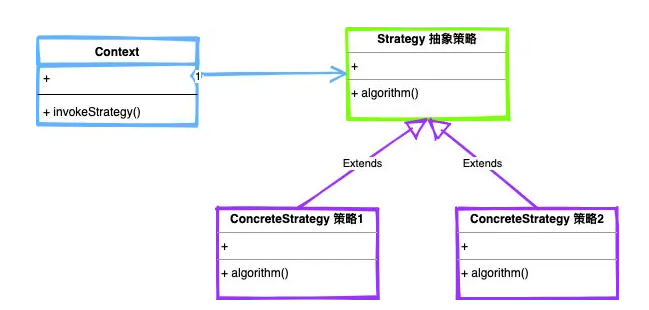

- Strategy（抽象策略）：抽象策略类，并且定义策略执行入口
- ConcreteStrategy（具体策略）：实现抽象策略，实现algorithm方法
- Context（环境）：运行特定的策略类。

策略模式和工厂模式的区别？

- 工厂模式是创建型模式，目的是为了创建对象。而策略模式是行为模式，目的是在多种策略中按照我们提供的条件选择正确的策略来计算返回正确的结果。
- 工厂模式是解决资源的统一分发，将对象的创立从客户端中分离出来。策略模式是为了解决策略的切换和扩展。

**策略模式在框架中的应用：**

典型的如ThreadPoolExecutor中的拒绝策略

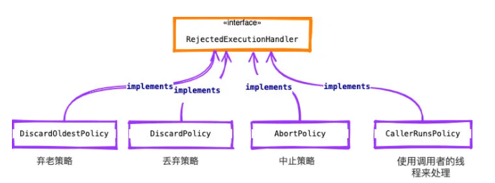

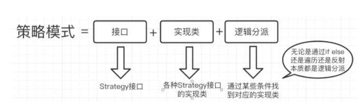

其实策略模式可以看成是将if-else的逻辑分派给封装到了context中，并且将实现和逻辑分派解耦合。

```java
public class Strategy {
    public static void main(String[] args) {
        Context context=new Context('+');
        context.getResult(6,3);
        context=new Context('-');
        context.getResult(6,3);
        context=new Context('*');
        context.getResult(6,3);
        context=new Context('/');
        context.getResult(6,3);
    }
}
interface StrategyInterface{
    int cal(int a,int b);
}
class StrategyA implements StrategyInterface{
    @Override
    public int cal(int a, int b) {
        return a+b;
    }
}
class StrategyB implements StrategyInterface{
    @Override
    public int cal(int a, int b) {
        return a-b;
    }
}
class StrategyC implements StrategyInterface{
    @Override
    public int cal(int a, int b) {
        return a*b;
    }
}
class StrategyD implements StrategyInterface{
    @Override
    public int cal(int a, int b) {
        return a/b;
    }
}
class Context{
    StrategyInterface strategy;

    public Context(char c) {
        switch (c){
            case '+':
                strategy=new StrategyA();
                break;
            case '-':
                strategy=new StrategyB();
                break;
            case '*':
                strategy=new StrategyC();
                break;
            case '/':
                strategy=new StrategyD();
                break;
        }
    }
    public int getResult(int a,int b){
        int result=strategy.cal(a,b);
        System.out.println("result="+result);
        return result;
    }
}
```

