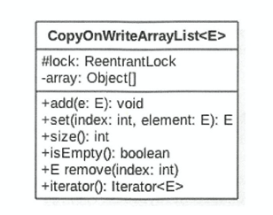
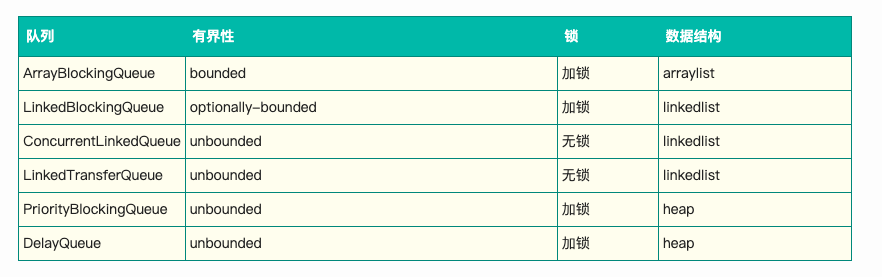

# Java并发

# 1. volatile关键字

是轻量级的synchronized，保证共享变量的**可见性**，即当一个线程修改一个共享变量时，另外一个线程能读到这个修改的值。比synchronized的使用和执行成本更低，因为不用切换线程，没有上下文切换和调度的开销。

### 实现原理

即在修改之后，立即从缓存中写回到内存。这时，尽管其他处理器缓存的值还是旧值，但是由于缓存对应的内存地址被修改了，该缓存会被标记为过期（由缓存一致性协议保证的，每个处理器通过嗅探在总线上传播的数据来检查自己缓存的值是不是过期了）。因此当处理器后续需要对这个数据进行操作时，就需要重新从系统内存中把数据读到处理器缓存中。保证了可见性。

即关键点有二：

- 通过lock前缀指令，将缓存立刻写回内存
- 当缓存写回内存后，会导致其他处理器的缓存无效。其他处理器通过总线嗅探来检查自己缓存内的数据是否过期。
  - 嗅探：每个处理器通过嗅探在总线上传播的数据来检查自己缓存的值是不是过期了，当处理器发现自己缓存行对应的内存地址被修改，就会将当前处理器的缓存行设置成无效状态，当处理器对这个数据进行修改操作的时候，会重新从系统内存中把数据读到处理器缓存里。
- 因此，其他处理需要处理该数据时，就必然需要重新读取，所以读取到的必然是最新的值

P.S. 因为需要通过对总线嗅探来检查缓存内的数据是否过期，如果大量使用cas操作（cas操作需要读取当前的最新内存中的值，所以要用volatile）加上volatile导致的缓存问题的总线嗅探机制，就会不断占用总线带宽，导致总线流量激增，产生总线风暴。


如上图的例子，当主线程拿到子线程的副本到自己的工作内存中时，子线程还没有把flag变为true。因此，虽然之后子线程更改了flag的值，但是主线程中的仍然没有更改，所以永远不会输出success。

但是如果给flag加了volatile，就会保证flag的可见性，只要子线程一修改主线程就能看到，就能输出可见性。

另外，如果主线程在子线程将flag变为true以后再启动判断，也能输出success

# 2. syschronized关键字

- 在java1.6的时候对synchronized进行了优化：为了减少获得锁和释放锁带来的性能消耗而引入的偏向锁和轻量级锁
- 每一个对象都可以作为锁
  - 对于普通方法，锁的是当前实例对象
  - 对于静态同步方法，锁的是当前类的class对象
  - 对于同步方法块，锁的是Synchonized括号里配置的对象

- **使用monitorenter和monitorexit指令来实现**
- synchronized用的锁是存在对象头里的

**java 1.6升级后，锁共有4种状态，级别从低到高分别是：无锁状态、偏向锁、轻量级锁、重量级锁**

**锁只能升级但不能降级**

### 偏向锁

经过研究发现，大多数情况下， 锁不仅不存在多线程竞争，而且总是由同一线程多次获得。**为了让同一线程重复获取锁的代价更低引入了偏向锁**

偏向锁是一种等到竞争出现才释放锁的。也就是如果同一线程重复需求锁的话，不需要释放重新获得锁，减少开销。

- 偏向锁的升级：
  - 当线程1访问代码块并获取锁对象时，会在java对象头和栈帧中记录偏向的锁的threadID，因为偏向锁不会主动释放锁，因此以后线程1再次获取锁的时候，需要比较当前线程的threadID和Java对象头中的threadID是否一致
    - 如果一致（还是线程1获取锁对象），则无需使用CAS来加锁、解锁
    - 如果不一致（其他线程，如线程2要竞争锁对象，而偏向锁不会主动释放因此还是存储的线程1的threadID），那么需要查看Java对象头中记录的线程1是否存活，如果没有存活，那么锁对象被重置为无锁状态，其它线程（线程2）可以竞争将其设置为偏向锁；如果存活，那么立刻查找该线程（线程1）的栈帧信息，如果还是需要继续持有这个锁对象，那么暂停当前线程1，撤销偏向锁，升级为轻量级锁，如果线程1 不再使用该锁对象，那么将锁对象状态设为无锁状态，重新偏向新的线程。

### 轻量级锁

竞争失败的话，自旋来获取锁

轻量级锁考虑的是竞争锁对象的线程不多，而且线程持有锁的时间也不长的情景。因为阻塞线程需要CPU从用户态转到内核态，代价较大，如果刚刚阻塞不久这个锁就被释放了，那这个代价就有点得不偿失了，因此这个时候就干脆不阻塞这个线程，让它自旋这等待锁释放。

- 轻量级锁的升级

  - 线程1获取轻量级锁时会先把锁对象的对象头MarkWord复制一份到线程1的栈帧中创建的用于存储锁记录的空间（称为DisplacedMarkWord），然后使用CAS把对象头中的内容替换为线程1存储的锁记录（DisplacedMarkWord）的地址；

    如果在线程1复制对象头的同时（在线程1CAS之前），线程2也准备获取锁，复制了对象头到线程2的锁记录空间中，但是在线程2CAS的时候，发现线程1已经把对象头换了，线程2的CAS失败，那么线程2就尝试使用自旋锁来等待线程1释放锁。

    但是如果自旋的时间太长也不行，因为自旋是要消耗CPU的，因此自旋的次数是有限制的，比如10次或者100次，如果自旋次数到了线程1还没有释放锁，或者线程1还在执行，线程2还在自旋等待，这时又有一个线程3过来竞争这个锁对象，那么这个时候轻量级锁就会膨胀为重量级锁。重量级锁把除了拥有锁的线程都阻塞，防止CPU空转。


# 3. Java内存模型

并发编程的两个关键问题：

1. 线程之间如何通信
2. 线程之间如何同步

- java中，实例域、静态域、数组元素都存储在堆内存中，而堆内存是在线程之间共享的。
- 局部变量则是不会在线程之间共享的，也就是说不会有内存可见性问题，也不受内存模型的影响

**java内存模型**定义了线程和主内存之间的抽象关系：线程之间的共享变量存在主内存中，每个线程有一个私有的本地内存，本地内存中存储了该线程以读/写共享变量的**副本**。抽象示意图如下：


- 也就是说如果线程A和线程B要通过共享变量通信的话，首先A需要把本地内存A中的更新过的共享变量副本刷新回主内存中，然后B去主内存中读取并且更新自己本地内存的共享变量的副本。

- 也就是说，这个步骤实质是线程A在向线程B发送消息，而且这个通信过程必须经过主内存。**Java内存模型通过控制主内存与每个线程的本地内存之间的交互，来为程序员提供内存可见性保证**

---

在执行程序时，为了提高性能，编译器和处理器常常会对指令做重排序。主要分为以下三种，其中2，3都是处理器重排序：

- 编译器优化的重排序
- 指令级并行的重排序
- 内存系统的重排序


**重排序可能会导致多线程程序出现内存可见性问题。**

JMM属于语言级的内存模型，在不同的编译器和处理器上，通过**禁止特定的编译器重排序和处理器重排序**来保证内存可见性。对于处理器重排序，在生成指令序列时，插入内存屏障指令来禁止特定的处理器重排序。


在JDK5之后，采用happens-before的概念阐述操作之间的内存可见性。这并不意味着前一个操作必须要在后一个操作之前执行，仅要求前一个操作（执行的结果）对后一个操作可见。

### happens-before


## 延迟初始化

在java多线程程序中，有时候需要采用延迟初始化来降低初始化类和创建对象的开销

### 双重检查锁定


- 但是，在判断instance==null的时候，可能会发生已经正确赋值引用，但是还没有初始化的问题。
  - 
  - 正常来说，是需要先初始化再将引用指向已经初始化好的地址。
  - 但是，将2、3调换，并不会更改单线程内的程序执行结果，就有可能发现另一个线程访问时，只赋值了引用并没有初始化的情况
- 为了避免这种情况，也就是双重检查锁定的线程不安全，可以采用两种方法来实现线程安全的延迟初始化：
  - 不允许2和3重排序
  - 允许2和3重排序，但不允许其他线程看到这个重排序。

### 1. 基于volatile的解决方案

将instance设置为volatile，这样2和3的重排序在多线程环境中就会被禁止

### 2. 基于类初始化的解决方案

在jvm执行类的初始化期间，jvm会去获取一个锁。这个锁可以同步多个线程对同一个类的初始化。


该方法的实质是，允许2和3重排序，但是由于锁的存在，不允许非构造线程看到这个重排序的操作

只能对静态字段实现延迟初始化

---

常见处理器的内存模型比java内存模型要更弱，所以java编译器在生成字节码是，会在指令序列中插入内存屏障来限制处理器的重排序

也正是通过这个操作，JMM屏蔽了不同处理器内存模型的差异，在不同处理器平台上为java程序员提供了一个一致的内存模型

# 4. Java并发编程基础

启动一个Java程序，操作系统就会创建一个Java进程。但是这个进程下面天然就有多线程，执行main方法的是一个名称为main的线程。从下图可以看到，Java程序的运行不仅仅是main方法的运行，而是main线程和其他多个线程的同时运行。


- Java线程的状态


### 等待/通知机制

一个线程修改了值，另一个线程要对此作出相应的操作。如果采用不断轮询的方法，轮询间隔太短消耗cpu资源，轮询间隔太长可能会出现相应不及时。

因此采用等待/通知机制。

- 等待/通知机制，是指⼀个线程A调⽤了对象O的wait()⽅法进⼊等待状态，⽽另⼀个线程B调⽤了对象O的notify()或者notifyAll()⽅法，线 程A收到通知后从对象O的wait()⽅法返回，进⽽执⾏后续操作。
- **上述两个线程通过对象O来完成交互**，⽽对象上的wait()和notify/notifyAll()的 关系就如同开关信号⼀样，⽤来完成等待⽅和通知⽅之间的交互⼯作。

- 需要注意的是，wait和notify需要先对对象O加锁。也正是由于此，当调用notify方法调用后，等待的线程依旧不会从wait返回，只有在notify的线程释放锁之后，等待的线程**才有机会从wait返回**

- 也就是说从wait方法返回的前提是获得了调用对象的锁。notify只是将等待队列中的线程移到了同步队列
- **等待/通知机制依托于同步机制**

- 

- 应用：`thread.join()`机制，等待某个线程结束。被等待的线程在终止时，会调用线程自身的notifyAll方法，通知等待他的线程。同样也要经历加锁、循环和处理逻辑三个步骤。

#### ThreadLocal：线程变量

ThreadLocal，线程变量，是一个以ThreadLocal对象为键、任意对象为值的存储结构。

**这个结构被附带在线程上，也就是说每个线程都可以根据一个ThreadLocal对象查询到绑定在当前自己这个线程上的一个值**

### 线程池技术

通过预先创建若干数量的线程池，重复使用固定的线程来完成任务的执行。**消除了频繁创建、销毁线程的系统资源开销**。这样的设计也可以复用到其他资源获取的场景，比如数据库连接池等。

- 本质上是使用了一个线程安全的工作队列连接工作者线程和客户端线程。客户端线程将任务房屋工作队列后就返回。而工作者线程则不断从工作队列上取出工作并执行。

- 当工作队列为空是，所有的工作者线程都对工作队列进行等待。

- 当客户端提交任务后，会通知任意一个工作者线程。

- 而大量任务被提交时，只能等空闲下来的工作者线程来取任务。

#### 基于线程池技术的简单web服务器

使用main线程不断接受客户端的Socket连接，将连接以及请求提交给线程池进行处理，这样就可以同时处理多个客户端请求

# 5. Java中的锁

## 1. Lock接口

锁是用来控制多个线程访问共享资源的方式，一般来说，一个锁能够防止多个线程同时访问共享资源

不同于synchronized，锁在使用时需要显示地获取和释放锁。虽然synchronized有着隐式获取释放锁的便捷性，但lock拥有锁获取和释放的可操作性、可中断的获取锁以及超时获取锁等多种synchronized关键字锁不具备的同步功能。

## 2. 队列同步器AbstractQueueSynchronizer

同步器使用了一个int成员变量表示同步状态，通过内置的FIFO队列来完成资源获取线程的派对工作

同步器是实现锁的关键，简化了锁的实现方式，屏蔽了同步状态管理、线程的排队、等待与唤醒灯底层操作

### 实现：

#### 1. 同步队列

同步队列中的节点是用来保存获取同步状态失败的线程引用、等待状态以及前驱后继节点。

当线程获取同步失败时，就会将当前线程以及等待状态等信息构造成一个节点加入同步队列，同时阻塞线程。同步状态释放时，就会将首个节点的线程唤醒，再次尝试获取同步状态。

同步队列有指向首和尾的指针，新加入的节点是插到尾部的。插入的过程也是基于CAS的设置尾节点的方法`compareAndSetTail(Node expect, Node update)`

而设置首节点是获取同步状态成功的线程来完成的，而只有一个线程能成功获取到同步状态，因此设置首节点的方法并不需要用CAS来保证。

#### 2. 独占式同步状态获取与释放

- `acquire(int arg)`：该方法获取同步状态对中断不敏感，也就是获取失败进入同步队列后，如果后续中断，线程并不会从同步队列中移除
  - 
- 

#### 3. 共享式同步状态获取与释放

例如，在文件读写中，读和写操作是独占的，但是读和读操作可以是共享的。

#### 4. 超时获取同步状态

会先获取同步状态，如果获取失败，则会等待指定的时间后再次获取，若还是没有获取到，则直接返回。按理来说是获取两次。

但是由于睡眠时间的不确定性，如果醒来的时候离规定的时间只有很少的时间（小于1000纳秒），就会疯狂自旋获取锁。因为，如果此时仍然再进行超市等待，反而会让时间不精确。

## 3. 重入锁

#### ReentrantLock

重入锁，能够支持一个线程对资源的重复加锁，还支持获取锁时的公平与非公平选择

要实现重复加锁，必须实现以下两点

- 再次获取锁时，要识别当前获取锁的线程是否为当前占据锁的线程
- 锁的释放，当获取了n次锁后，只有在n次释放锁后，锁才被释放，其他线程才能获取到锁。也就是说，需要要求锁对于获取进行计数

公平锁保证了锁的获取按FIFO原则，能够最大化减少饥饿现象，但是代价时大量的线程切换

非公平锁虽然可能造成饥饿现象，但是极少的线程切换，保证了更大的吞吐量

## 4. 读写锁

#### ReentranReadWriteLock

读写锁是典型的非独占锁，在同一时刻，读写锁可以允许多个读线程访问，不允许写进程访问。或者允许一个写进程访问， 不允许其他的读写进行访问。

**读写锁维护了一对锁，一个读锁和一个写锁**

读写锁降级：当前获取到写锁的线程，可以先获取读锁再释放写锁，将写锁降级成为读锁

读写状态：将int类型的状态切分为高16位和低16位，高16位代表获取读锁的次数，低16位代表获取写锁的次数

当存在读写任意锁时，不能获取写锁。当只有读锁时，还是可以获取读锁，哪怕不是同一个线程。

- 获取写锁的条件：
  - 当前线程已经获取了写锁，则次数+1
  - 当前没有线程获取锁
- 获取读锁的条件：
  - 当前线程已经获取了读锁或者写锁
  - 写锁没有被获取，其他线程获取了读锁，可重入
  - 当前没有线程获取锁

需要注意的是，写锁的释放不需要额外保证线程安全性，因为此时只有获取到写锁的线程能够修改状态。**但是读锁的获取和释放都需要用CAS来保证，因为可能有多个读线程同时释放读锁**

读写锁只支持锁降级，不支持锁升级。因为如果读锁被多个线程获取，其中任意线程成功获取了写锁并更新了数据，则这更新对其他获取到的读锁时不可见的。

## 5. Condition接口

用来更好的实现等待通知模式。Object.wait()方法中，一个锁只会有一个等待队列。当notify的时候会唤醒等待队列中所有的节点进入同步队列获取锁。

而Condition可以为一个锁提供多个等待队列，并针对他们所需要的条件分队列，这样在唤醒的时候就可以只唤醒需要被唤醒的一部分即可。

**使用方式是：`lock.newCondition()`**

# 6. Java并发容器和框架

## 1. ConcurrentHashMap

ConcurrentHashMap是**线程安全且高效**的HashMap

**用ConcurrentHashMap的原因：**

- **HashMap线程不安全**：多线程会导致Entry链表形成环形数据结构。
  - 比如，当两个线程同时触发扩容机制的时候，假设有位置1原先连接的节点A和节点B:`1->A->B`，扩容之后还在同一位置。如果线程1已经完成了扩容，线程2被阻塞，此时刚好获取到指针A,next为B，由于是头插法，此时有`B->A`。此时线程1结束退场。线程2继续做他之前被停止的扩容工作，从A开始，他会将A放到位置1，变成`1->A->其他数据`。然后工作指针指向B，但是此时B的指向是A，继续将B放入，工作指针变成A，变为`1->B->A->其他数据`。继续放A，此时工作指针变成其他数据，变成`1->A->B->A->其他数据`。环形数据结构产生。
  - 可以看出，环形数据结构的来源是因为头插法改变了之前指针指向的方向，导致环形的可能。
  - **尾插法不会导致环形数据结构的产生，但这并不说明尾插法是线程安全的。**刚才同样的步骤下，如果采用尾插法，虽然不会导致环形数据结构的产生，但是会导致重复数据，或者刚put进去的数据，get到不同的值（由于多线程）。

- HashTable采用synchronized来保证线程安全，**但是在线程竞争激烈的情况下效率低下。**
  - 所有访问HashTable的线程都需要竞争同一把锁，对get和put方法加synchronized锁住的是当前Hashtable的实例对象
  - 
  - 

由于HashTbale中，所有访问HashTable的线程都需要竞争同一把锁。

**ConcurrentHashMap在JDK1.8之前采用分段锁技术**，即将数据分为一段一段存储，给每一段数据配一把锁（ReentrantLock可重入锁），当一个线程占用其中一个段的锁时，其他段的数据也能被正常访问。大大增加并发访问效率。

---

但是在1.8（包括）之后，却弃用了这个分段锁技术，采用synchronized+CAS操作。

- 减少内存开销:如果使用ReentrantLock则需要节点继承AQS来获得同步支持，增加内存开销，而1.8中只有头节点需要进行同步。
- 内部优化:synchronized则是JVM直接支持的**关键字**，JVM能够在运行时作出相应的优化措施：锁粗化、锁消除、锁自旋等等。

**具体实现**

如果是Nodo链表中第一个节点，也就是之前是emtpy的，直接用cas插入，不需要获取锁


如果不是第一个，则会对第一个加锁，然后插入到链表的最后（如果是红黑树，则会对根结点加锁，然后插入红黑树中）。一直都是对第一个加锁，直到扩容或者操作了第一个object为止

**扩容机制**

有两种扩容的机制：

1. 当链表达到转为红黑树的阈值时，会调用treeifyBin方法试图将链表变为红黑树。


但是，此时会检查数组的长度，如果小于MIN_TREEIFY_CAPAITY(默认是64)，则优先扩容而不是将链表转树，即调用tryPresize方法，并且在最后设置新的阈值SIZECTL，调用transfer调整原来节点的位置。


2. 当新增节点后，会调用addCount（）方法记录当前元素个数，并且检查是否需要扩容。当数组元素达到阈值时，调用transfer方法重新调整节点的位置，数组大小为之前的**两倍**。
   - SIZECTL在新建时，记录初始容量大小，初始化过程中标记为-1.
   - 初始化完成后，就是当前的负载容量值，超过就会扩容
   - 正在扩容时为负数，标记着正在扩容的线程数

特别的，当另一个线程发现他要访问的节点由于扩容被移走以后，就会帮忙一起transfer

## 2.ConcurrentLinkedQueue

采用CAS算法来实现

#### 入队

插入到尾节点后面

定位尾节点

不断尝试，然后用cas插入到尾节点后面。但不主动更新tail，当tail节点和尾节点的距离大于HOPS的值才更新。因为tail是volatile变量，这样做可以减少对volatile变量的写操作，增加了读操作。但是因为写操作开销更大，所以入队效率还是有所提升的。

#### 出队

用cas返回需要出队的节点

和入队类似，head也不总是指向第一个有效节点。而是可能会指向有空元素的节点。同时是通过hops操作减少对volatile变量的写操作，增加了读操作。

## 3. 并发List—CopyOnWriteArrayList

线程安全的ArrayList，修改操作都是在底层的一个复制的数组（快照）上进行的，即**写时复制**



- array对象用来存放元素
- 并发对数组进行修改的时候，先获取锁，然后对数组的copy进行修改，然后更改array对象指向新数组。
- 并发进行读的时候，不需要获取锁。

- 其中锁是ReentrantLock，可重入的独占锁

### 添加元素

```java
    public boolean add(E e) {
        synchronized (lock) {
            Object[] es = getArray();
            int len = es.length;
            es = Arrays.copyOf(es, len + 1);
            es[len] = e;
            setArray(es);
            return true;
        }
    }
```

- 先获取独占锁，保证并发的正确性
- 然后复制更新后大小的元素，再添加元素，再更改array的指向
- 设置、删除类似。

### 获取元素

```java
    public E get(int index) {
        return elementAt(getArray(), index);
    }
		final Object[] getArray() {
        return array;
    }
    static <E> E elementAt(Object[] a, int index) {
        return (E) a[index];
    }
```

- 可以看到，获取的步骤有两步，第一步先获取当前array的指向，然后再去获取对应位置的元素。
- 获取是不需要加锁的，所以不能保证原子性。
- 因为采用的是写时复制，所有有可能出现在获取完array以后，另一个线程修改了array并指向了新的数组。但是当前已经获取到的array并没有被修改，所以会出现弱一致性的问题。

### 弱一致性的迭代器

CopyOnWriteArrayList的迭代器是当前array的迭代器，同时修改是在新数组上的。

因此，在使用迭代器的过程中，对数组的修改对迭代器是不可见的。

## 4. 阻塞队列

阻塞队列就是有着最大容量的队列，当队列满的时候，会阻塞插入元素的线程，直到队列不满。当队列空时，获取元素的线程会被阻塞直到等待队列变为非空。

**常用于生产者和消费者场景**，生产者向队列里添加元素，消费者从队列中取元素。阻塞队列用来存放、获取元素。


插入 移除方法有多种，每一种对于失败的处理方式不同。

都是继承自AbstractQueue



#### ArrayBlockingQueue


实例化时必须指定容量，会分配数组。lock是ReetranLock，可以设置公不公平。有两个等待队列，用Condition来实现的。

#### LinkedBlockingQueue


默认最大长度是int的最大值。因为不用预分配空间，所以意义不大。

#### PriorityBlockingQueue

支持优先级的阻塞队列。默认情况升序排列，也可以指定元素排序规则。**但是不能保证同优先级元素的顺序**


#### Delayqueue

支持延时获取元素的无界阻塞队列

队列使用PriorityQueue来实现


队列中的元素必须实现Delayed接口，图中的`E extends Delayed`，该接口其实就定义了一个函数，用来返回剩余时间，判断是否过期。正数表示还没过期


**应用**

- 缓存系统的设计：可以用DelayQueue保存缓存元素的有效期，当一个缓存元素能在DelayQueue中查到时，就表示缓存有效期到了
- 定时任务的调度等。

#### SynchronousQueue

是一个不存储元素的阻塞队列。每一个put操作必须等下一个take操作，否则不能继续添加元素。也就是说，可以看成最大容量为1。

**吞吐量高于LinkedBlockingQueue和ArrayBlockingQueue**

#### LinkedTransferQueue

无锁实现

和SynchronousQueue类似，只不过他的容量不是为1.

同样有transfer方法，可以直接将要加入队列的元素传递给之前想取但是因为队列空在等待的线程。

#### LinkedBlockingDeque

加锁实现

链表构成的双向阻塞队列

同样可以在初始化的时候设置容量，防止变得太大

## 5. Fork/Join框架

是⼀ 个把⼤任务分割成若⼲个⼩任务，最终汇总每个⼩任务结果后得到⼤任务结果的框架。

有返回结果的继承`RecursiveTask`，没有的继承`RecursiveAction`

**工作窃取模式**：

某个线程从其他队列里窃取任务。即干完活的线程与其等着，不如去帮其他线程干活，就从其他线程的任务队列中窃取一个任务来运行。窃取从尾部取，原线程从头部取。所以需要用双端队列

# 7. Java中的原子操作类

为了避免当多个线程同时对同一个变量进行更新时，更新覆盖的问题。

## 原子更新基本类型类

- `AtomicBoolean`
- `AtomicInteger`
- `AtomicLong`

使用unsafe类中的CAS操作来进行原子更新操作。其中的value是volatile的，保证修改了以后其他线程读取到的都是最新的值。

需要注意的是，`getAndIncrement()`方法会返回增加前的值

## 原子更新数组

- `AtomicIntegerArray`
- `AtomicLongArray`
- `AtomicReferenceArray`


需要注意的是，在将数组从构造函数传入时，会将当前数组复制一份保存，所以对内部元素进行修改时，不会影响之前传入的数组。

## 原子更新引用类型

- `AtomicReference`
- ` AtomicReferenceFieldUpdater`
- `AtomicMarkableReference`

## 原子更新字段类

- `AtomicIntegerFieldUpdater`
- `AtomicLongFieldUpdater`
- `AtomicStampedRerfence`

这些类都是抽象类，使用前必须用静态方法`newUpdater()`创建一个更信息，并且设置想要更新的类以及对应的字段

而且**更新类的字段（属性）必须使用public volatile修饰符**

# 8. Java中的线程池

- **降低资源消耗**：通过重复利用已创建的线程降低**线程创建和消耗的消耗**
- **提高响应速度**：当任务到达时，不需要临时创建线程就能立即执行
- **提高线程的可管理性**：可以使用线程池对线程进行**统一分配、调优和监控**


### 线程池的7个参数

- 核心线程数（必选）
- 最大线程数量（必选）
  - 可以看到，在初始化线程池的时候并没有增加线程。也就是说初始化的时候，线程池还是0个线程。
  - 当任务来的时候，调用execute(Runnable)才会增加线程。
    - 此时当线程数小于核心线程数的时候，直接增加调用addWorker()线程数。addWorker的flag标志为true，代表以核心线程数作为边界
    - 当线程数大于等于核心线程数的时候，是会放入任务队列中，直到队列也满了才会调用addWorker()增加线程数，标志为false，代表以最大线程数为边界
- 空闲线程存活时间（必选）：long类型的数据
- 空闲线程存活时间单位（必选）：TimeUnit枚举类型的数据，有微妙、毫秒、秒、分钟等各种时间单位
- 工作队列（必选）：新任务提交后会先加入到工作队列中，调度的时候再从队列中取出任务
  - 比较常用的有四个
  - ArrayBlockingQueue。必须给定容量大小
  - LinkedBlockingQueue。可以给定容量大小，也可以不给，不给此时最大容量是Integer.Max_VALUE
  - PriorityBlockingQueue。可以给定容量大小，也可以不给，默认容量大小为11。用数组实现
  - SynchronousQueue。不缓存任务，可以看成容量为1。新任务进来直接执行，如果没有可用线程，则创建新线程。
- threadFactory（可选）：创建线程的工厂，可以用来设定线程名字，是否为daemon线程等
- handler（可选）：拒绝策略，就是当工作队列达到最大限制，并且线程数量也达到最大限制的时候，执行什么拒绝策略
  - 总有四种
  - 1. AbortPolicy：直接丢弃任务，并且抛出异常
    2. DIscardPolicy：直接丢弃任务，然后什么都不做
    3. DiscardOldestPolicy：直接丢弃最先进来的任务，然后把当前任务加入队列
    4. CallerRunsPolicy：在当前调用者线程中执行该任务，除非线程池被关闭则直接丢弃

### 调用流程

- 从execute()函数进来，如果当前worker数小于核心线程数，直接addWorker。否则，加入工作队列中。如果工作队列也满了，转到addWorker中。
- 在addWoker的函数中，有一个flag是用来标志边界是核心线程数还是最大线程数的。因此，当超过边界以后，会直接返回false，在execute中调用拒绝策略。
  - 在addWorker中会不停的用CAS来尝试增加worker，直到超过边界或者线程池关闭
  - 增加完worker后，就会直接运行这个任务。并且在运行完这个任务后不断的从队列中取元素

# 9. Executor框架

Java中的线程既是**工作单元**，也是**执行机制**。从JDK5开始，把工作单元和执行机制分离开。

- 工作单元包括Runnable和Callable
- 执行机制由Executor框架提供

