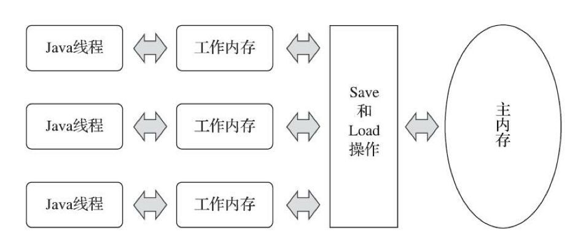
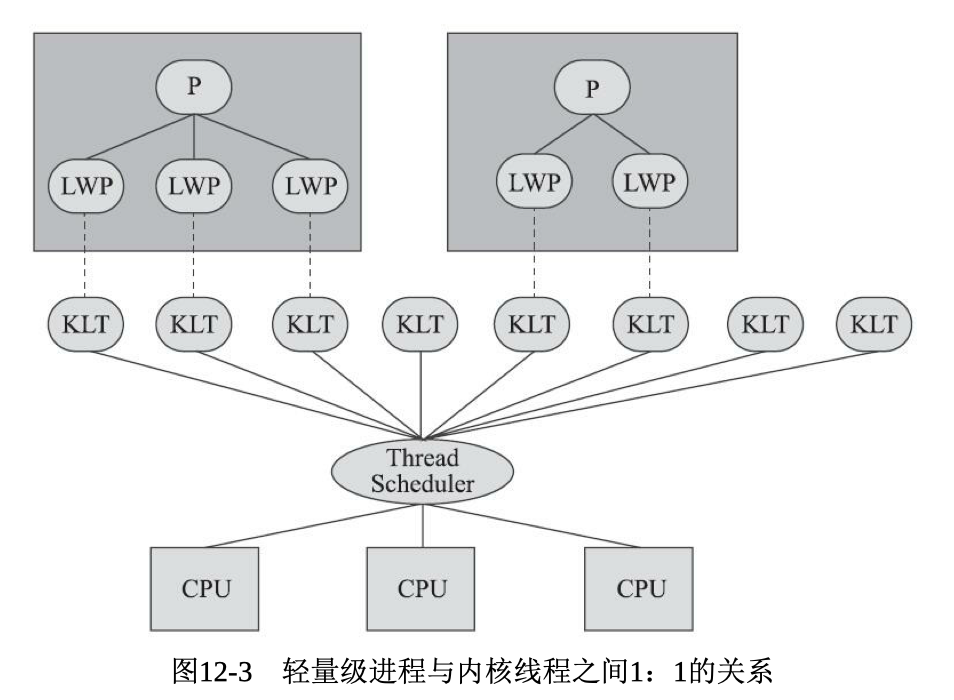
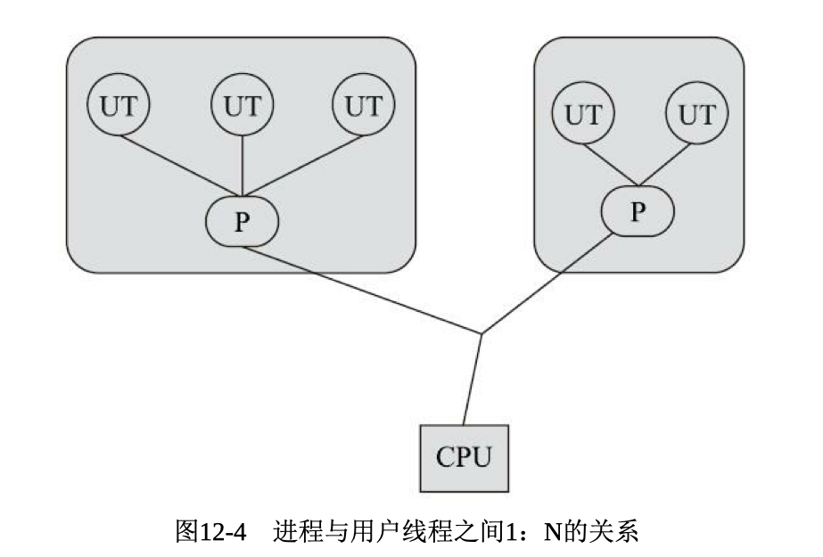
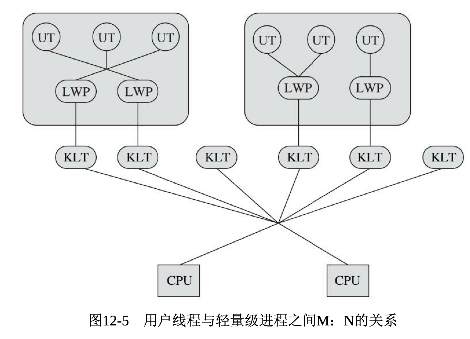

# Java内存区域


所有线程共享的数据区有方法区和堆

线程隔离的有虚拟机栈、本地方法栈、程序计数器

## 程序计数器

是一块很小的内存空间，代表了当前线程执行字节码的行号，是**程序控制流的指示器**

需要特别说明的是，在执行native方法时，由于不是真正意义上的java程序，程序计数器的值应该为空Undefiend

## 虚拟机栈

Java虚拟机栈是**线程私有的**

里面存储的是**栈帧**

**每个方法**被执行的时候会创建一个栈帧，方法被调用到执行完毕就对应栈帧在虚拟机栈中入栈出栈的过程。


例如此时main线程的虚拟机栈中就先有一个main方法的栈帧，然后有一个在main方法中调用的其他方法的栈帧

栈帧中通常保存的是局部变量表、操作数、方法出口等信息

**当进入一个方法时，这个方法需要在栈帧中分配多大的局部变量空间时完全确定的**

## 本地方法栈

类似于虚拟机栈，只不过是执行native方法用到的栈

## Java堆

**Java堆是被所有线程共享的一块内存区域，在虚拟机启动时创，用来存放对象实例**

Java堆是由垃圾回收器来管理的内存区域

## 方法区

和java堆一样，是各个线程共享的内存区域

用于存储已被虚拟机加载的类型信息、域（Field）信息、方法信息（Method）信息、常量、静态变量、即时编译器编译后的代码缓存等数据

- 比如类的名称、该类父类的名称
- 域的名称、类型、修饰符
- 方法的名称、返回参数、修饰符、字节码、操作数栈、局部变量表、异常表等

### 运行时常量池

相关Java的class文件中有一个常量池表，包含编译器生成的各种字面量和符号引用

这部分会在类加载的时候存放到方法区的运行时常量池中

## 直接内存

直接内存（Direct Memory）并不是虚拟机运行时数据区的一部分

使用Native函数库直接分配堆外内存

在NIO中用得很多，为了避免频繁的在堆内和native堆中移动IO数据


---

# Java垃圾回收

需要解决三个问题：

1. 哪些对象需要回收？
2. 什么时候回收？
3. 怎么回收？

## 哪些对象需要回收

### 引用计数法（现有主流Java虚拟机中没有使用）

在对象中添加一个 引用计数器，每当有一个地方引用它时，计数器值就加一；当引用失效时，计数器值就减一；任何时刻计数器为零的对象就是不可能再被使用的

实现简单

很难解决对象之间相互循环引用的问题

### 可达性分析

从一系列叫作**GC Roots**的根节点出发，通过**引用关系**向下搜索**引用链**，当从GC Roots到某个对象之间没有引用链，也就是不可达的时候，证明这个对象是不可能再被使用的。


**并不是在可达性分析中第一次不可达就直接回收**，一般宣告死亡至少要经历两次标记过程。还和finalize()方法有关系

#### 根节点的枚举

固定可以作为根节点的一般是全局性的引用，比如常量或者类静态属性与执行上下文（比如栈帧中的本地变量表）

但是还是有很多节点， 因此所有的收集器在**根节点枚举都必须暂停用户线程即Stop The World**，在耗时更长的引用链分析可以和用户线程一起并发

#### 引用的四种类型

- 强引用：正常状态下的引用
- 软引用：

SoftReference，要发生内存溢出异常前，会进行回收

- 弱引用

只能生存到下一次垃圾收集发生为止

- 虚引用

PhantomReference，是否有引用不会对生存时间构成影响，可以用来作为是否存活的监控

## 如何回收？算法

### 分代理论

**两个理论假说：**

- 绝大部分对象都是朝生夕灭，存活时间很短的
- 存活时间越久的对象就越难消亡

收集器应该将Java堆划分出不同的区域，然后将回收对象依据其年龄（年龄即对象熬过垃圾收集过程的次数）分配到不同的区域之中存 储。

同时针对不同的区域安排不同的垃圾回收算法

### 标记-清除算法

标记过程就是判断哪些对象需要回收的过程。将需要回收的对象的内存区域直接回收。

**缺点**：

- 如果包含的对象多，需要进行大量标记清除工作，效率低

- 容易导致内存的碎片化问题。


### 标记-复制算法

为了解决标记-清除面对大量可回收对象执行效率低的问题。

将可用内存划分为两个半区，每次只用一块，在用完前不进行回收。当用完之后，将还活着的一次性移到另一个半区。

**优点**

- 简单高效
- 能提升大量可回收对象的情况下的效率

**提升**

- 对大量对象不可回收的情况需要大量内存间复制的开销
- 可用内存缩小为原来的一半
  - 因此，这种收集算法很适合于新生代的对象，即那些存活时间很短的对象


### 标记-整理算法

针对老年代对象死亡率很低的情况，提出在标记-清除的基础上对对象进行移动，来避免内存碎片的产生。

**优点**

能够解决内存碎片问题，增大程序吞吐量

**缺点**

移动对象、更新引用需要暂停用户程序，需要stop the world。

因此，关注吞吐量的收集器会基于标记-整理，关注延迟的收集器会基于标记-清除

## 如何回收？垃圾收集器

收集算法是内存回收的方法论，那垃圾收集器就是内存回收的实践者

### CMS收集器

全名Concurrent Mark Sweep

是一种以获取最短回收停顿时间为目标的收集器

**主要有四个步骤**

- 初始标记：确定GC Roots并且标记可以直达的节点，需要Stop The World
- 并发标记：通过引用链从GC Roots和之前标记过的直达节点向下分析，耗时较长但是不需要暂停用户线程
- 重新标记：这部分主要是为了修正在并发标记期间产生变动的那一部分，也需要Stop The World
- 并发清除：就是清理删除被标记为死亡的对象，**因为不需要移动对象**，所以也可以并发


#### 优点

耗时长的过程是可以和用户线程并行的，能够有较短的回收停顿时间

#### 缺点

- 对处理器资源比较敏感。因为大量并发时的标记清除工作是要和用户并行的，当处理器核心数比较少时，对用户程序的执行速度影响较大

- 无法处理浮动垃圾，只能等下一次GC
- 基于标记清除，会产生内存碎片。所以过一段时间需要进行一次内存碎片的合并过程，这过程无法并发

### G1收集器

全名Garbage First收集器，从整体上看基于标记-整理算法，从Region上看属于标记-复制算法

在对延迟要求比较高的场景，希望能控制暂停世界的时间。

停顿时间模型：能够支持指定在一个长度为M毫秒的时间片段内，消耗在垃圾收集上的时间大概率不超过N毫秒这样的目标

- 并不是把内存区域固定的分为各个区域。而是将堆内存分为多个Region，多个大小相等的独立区域。每一个Region都可以根据需要，作为各个分代的空间。
- 因此，新生代老年代并不再是一个连续的内存区域，而是逻辑上连续，物理上不连续的Region的集合
- 将Region作为单次回收的最小单元，根据对各个区域回收的收益来判断该在给定的短时间内去回收哪个Region
- 追求的目标从原来的将整个java堆清理干净变为只要能跟得上应用的分配速率即可

### 新的低延迟垃圾收集器

- Shenandoah
- ZGC

---

# 虚拟机执行子系统

各种不同平台的Java虚拟机，以及所有平台都统一支持的程序存储 格式——字节码（Byte Code）是构成平台无关性的基石

Java虚拟机并不和Java语言绑定，他只与"Class文件"这种特定的二进制文件所关联。如下图：


## Class类文件的结构

Class文件是一组以8个字节为基础单位的二进制流

需要分割的时候会按照高位在前的方式分割成若干个8个字节

---

- 头4个字节是魔数，是用来确认当前文件是否是一个能被虚拟机接受的Class文件

- 接下来4个字节是版本号，分为主版本号和次版本号
  - 在校验文件的时候，会对版本号进行检验，虚拟机会拒绝执行超过其版本号的Class文件

### 常量池

开头有一个u2类型的，代表常量池容量的数字。从1开始编号，把0留给未定义，不引用。

常量池中主要存放两大类常量：

- 字面量，Java语言层面的常量概念，比如文本字符串，被声明为final的常量等
- 符号引用，就是一个字面量，用来描述要引用的目标的。
  - 这些符号引用并不会在编译的时候就像c++那样进行连接的过程。
  - 而是在虚拟机加载Class文件的时候才进行**动态链接**，并且经过类加载器的解析翻译为 类的地址，变为直接引用

存放常量的方式为开头两个字节放下一个常量的类型，根据类型就可以确定长度

```
生成字节码文件 javac xxx.java
运行字节码文件 java xxx.class
看常量池，可以通过javap -verbose xxx.class文件 看到具体结构
javap -c xxx.class可以看到字节码格式的代码
```

- 常量池结束后的两个字节，标注当前类的类型，比如是否是public、final、注解、枚举等
- 接下来是描述了当前类的名字的索引、父类的索引、以及接口的索引集合

### 字段表集合

用于描述接口或者类中声明的变量

包括变量的修饰符、变量的简单名字和描述符的索引（实际存储在常量池中）。其实就是记录变量的类型和修饰符

**不会列出从父类或者父接口中即成来的字段**

### 方法表集合

和字段表相同，用于描述方法

包括变量的修饰符、方法的简单名和描述符的索引

### 属性表

Code属性，编译后的字节码指令就存储在Code属性中

其他一些比如可能抛出的异常、源码和字节码行号的对应关系等都是在属性表中

## 类加载机制

Java虚拟机把描述类的数据从Class文件加载到内存，并对数据进行校验、转换解析和初始化，最终形成可以直接被虚拟机使用的类型，这个过程被称为虚拟机的类加载机制

在Java语言中，和在编译时就需要进行连接的语言不同，类型的加载、连接和初始化过程都是在程序运行期间完成的，这提供了极高的扩展性和灵活性

### 类的生命周期


### 加载

1. 通过类的**全限定名**来获取此类的class文件的**二进制流**
2. 将字节流代表的**静态数据结构**转化为**方法区**的运行时数据结构

3. 在内存中**生成**一个代表这个类得到`java.lang.Class`对象，作为方法区这个类的各种数据的访问入口

- 这些都是由类加载器来完成的，可以用java虚拟机内置的引导类加载器来完成，也可以使用自己定义的类加载器完成

- **需要注意的是，数组类本身不通过类加载器创建，是由虚拟机直接在内存中动态构造出来的**

### 连接阶段

连接阶段包括验证、准备、解析

#### 验证

确保Class字节流中的信息符合Java虚拟机规范中的全部约束要求。

可以关闭，如果是反复使用过的class文件的话，通过-XVerify:none关闭

- 文件格式验证，如魔数、版本号、是否有索引指向不存在的常量等。通过这个阶段，字节流就会被**允许进入虚拟机的方法区中进行存储。**
- 类的元数据验证，如是否有父类、是否继承了不允许被继承的类等
- 字节码验证，通过数据流分析和控制流分析，确定程序语义是合法的、符合逻辑的。例如跳转指令跳转到了方法体以外的字节码指令上等
- 符号引用验证：发生在连接的第三个阶段——解析阶段将**符号引用**转化为**直接引用**的时候。例如通过给定的全限定名能否找到对应的类或者方法字段等，以及找到的是否可以访问等

#### 准备

准备阶段是为类中定义的变量（即静态变量）分配内存并且**设置类变量初始值**的阶段。

之前类的静态变量在逻辑上和物理上都是在方法区的。但是JDK8之后，类变量会随着Class对象一起存放在Java堆中，即逻辑上属于方法区，物理上存储在java堆中。

#### 解析

将常量池内的符号引用替换为直接引用

- 符号引用：符号引用用一组符号来**描述**所引用的目标，只要使用时能无歧义的**定位**目标即可。例如com.aaa.test
- 直接引用：直接引用是可以**直接指向目标**的指针、偏移量、句柄等。有了直接引用，说明引用的目标一定存在于虚拟机的内存中。

何时将符号引用转换为直接引用是由虚拟机判断的，可以在类被加载时就对常量池的符号引用进行解析，也可以在符号引用被使用前才进行解析。

### 初始化

之前的阶段，都是由类加载器或者java虚拟机来主导控制

直到初始化阶段，**虚拟机才真正开始执行类中编写的Java程序代码**，将主导权交给应用程序

**初始化阶段就是执行Javac编译自动生成的类构造器`<clint>()`方法的过程**

#### `<Clinit>()`

`<clint>()`方法是由编译器自动收集类中所有类变量的赋值动作和静态语句块中的语句合并产生的。如果没有这些语句，也可以不自动生成。

不需要像类new对象的构造函数一样显式的调用父类的构造函数，虚拟机保证在子类的`<clint>()`方法执行之前父类的`<clint>()`已经执行完毕

## 类加载器

类加载器其实完成的是类加载的加载阶段中，通过全限定名来获取该类的二进制字节流的动作。

任意一个类，是由加载他的类加载器和类本身来确定唯一性的，即两个类来自同一个Class文件，但类加载器不同，这两个类就不等

#### 三层类加载器架构

- 启动类加载器：是虚拟机自身的一部分。加载`<JAVA_HOME>\lib`目录下的类进虚拟机内存。当getClassLoader时返回的是null来代表
- 扩展类加载器：用于加载`<JAVA_HOME>\lib\ext`目录中的类库
- 应用程序类加载器：负责加载**用户类路径(ClassPath)**上所有的类库

#### 双亲委派模型

即如果一个类加载器收到类加载的请求，会将这个请求委派给父类加载器，只有父类加载器自己无法完成，子加载器才会自己去完成加载

也就是说，会从父子关系从下往上找到最基础的加载器来加载。

用这样的原则，能够保证无论使用哪一个类加载器来加载类，最后都是委派给处于模型最顶端的启动类加载器进行加载。

就能保证类相同，因为类相同的定义是类本身相同以及使用的类加载器也相同。

# 虚拟机字节码执行引擎

Java虚拟机有解释执行和编译执行两种选择，但是要确定从外面看输入输出是一致的

## 运行时栈帧结构

Java虚拟机以方法作为最基本的执行单元。

**每一个方法从调用开始到执行结束的过程，都对应栈帧在虚拟机栈中入栈出栈的过程**

栈帧包括局部变量表、操作数栈、动态连接、方法返回地址和一些额外的附加信息

### 局部变量表

局部变量表是一组变量值的存储空间，用于存放方法参数和方法内部定义的局部变量

在编译的时候，栈帧中需要多大的局部变量表就是确定的，会写到Code属性中

局部变量表中的容量以变量槽（Slot）作为最小单位。

但是每个变量槽都应该能存放boolean、byte、char、short、int、float、reference、returnAdress的数据。

因此，每个变量槽的大小至少是32位。

因此，在64位虚拟机上如果使用64位来实现一个Slot，要用对其和补白的手段从外面看起来一致。

同理，当我们用一个32位的变量槽来实现比如1位的boolean时，我们也需要使用对齐和补白，但是该boolean的有效数据宽度还是1bit，只不过占了32bit的空间。

**但是在数组对象中，一般会用紧凑型的，避免大量的空间浪费。同时数组对象也更好寻址**

局部变量表第0位的变量槽默认保存的是传递方法所属对象实例的引用，也就是this

**特别注意的是，局部变量并不像类中的域会由类加载器来赋予系统初始值，局部变量并不会被自动赋予系统初始值。所以必须显示初始化，否则无法使用。**

### 操作数栈

编译器的数据流分析工作会确定操作数栈的最大深度，在编译时写入到Code属性中

Java虚拟机的**解释执行引擎**被称为**基于栈的执行引擎**，而编译执行是不用栈，基于寄存器的。

### 动态连接

每个栈帧都包含一个指向运行时常量池 [1] 中该栈帧所属方法的引 用，持有这个引用是为了支持方法调用过程中的动态连接。

将常量池中的一部分符号引用在运行期间转化成直接引用，就是动态连接

### 方法返回地址

一个方法执行后，有两种方式退出：第一，遇到任意方法返回的字节码指令。第二，在方法执行过程中出现了异常且方法体中没有对该异常进行处理。

## 方法调用

Class文件的编译过程中并不包含传统编译的连接步骤，此时Class文件中存储的只是**符号引用**，并不是方法在实际运行时内存布局的入口地址

因此，某些调用需要在类加载期间甚至运行期间才能通过动态连接确定方法的直接引用，这也带来了更强大的动态扩展能力。多态。

因此，哪些方法是可以在类加载期间就转化成直接引用，哪些只有到运行期间才可以确定呢？

### 类加载期间转化成直接引用——解析和静态分派

#### 解析

在编译期间就完全**确定**，在类加载阶段就将符号引用**转化**为直接引用

需要在类加载期间就转换成直接引用，必须符合编译期间可知运行期间不可变。主要有**静态方法和私有方法**

静态方法和类型直接关联

私有方法在外部不可能被访问

这两种都不可能通过继承或别的方法重写，所以适合在类加载阶段进行解析

#### 静态分派


在上面这个语句中，human的分为静态类型（外观类型）和实际类型（运行时类型）

其中静态类型在编译期间是可以完全确定为Human

但是实际类型是只有到运行的时候才能知道是Man还是Woman

而**所有依赖静态类型来决定方法执行版本的分派就叫做静态分派**，最典型的就是方法**重载**

如下面这个例子，最后执行的结果是hello，guy. 也是按照静态类型Human来执行。

这种情况下的引用转换仍然是在编译期间发生的，和虚拟机无关


### 运行期间转化成直接引用——动态分派

当一个接口有着多个实现类的时候，实现类对接口中的方法进行重写。

在实际运行时，执行的方法是属于实现类而不是接口的。也就是此时是按照实际类型来分派，所以只能等到实际运行时才确定。

注意和静态分派区别，静态分派是按照静态类型来分派，在编译期间就可以完全确定，典型应用是方法的**重载（Overload）**

动态分派是按照实际类型来分派，只有在运行期间才能确定，典型应用是方法的**重写（Override）**

- 在Java中，动态分派是由指令`invodevirtual`实现的
  - 先找到对象的实际类型，记为C
  - 在C中找和符号引用匹配的方法
    - 找到的话，进行权限校验，如果通过即返回直接引用，查找结束。不通过抛出异常
    - 没找到的话，按照继承关系从下往次继续第二步
  - 最后没有找到的话，抛出异常
- 因为动态分派是用指令`invokevirtual`实现的，所以**字段永远不参与多态**。子类字段会遮蔽父类的同名字段

一般用虚方法表来存放各个方法的实际入口地址，如果子类中没有重写，那地址就与父类相同。

## 动态类型

动态类型指的是类型检查的过程是在运行期间而不是在编译期间进行的

### java.lang.invoke包

之前只能通过符号引用来确定调用目标方法，此包提供了一种通过类型和方法返回值参数来动态确定目标方法的机制，称为方法句柄`MethodHandle`

- invodedynamic指令
  - 将查找目标方法的决定权从虚拟机转嫁到具体用户代码中

- 和反射的区别：Reflection是在模拟Java代码层次的方法调用，而MethodHandle是在模拟 字节码层次的方法调用。

#### 传统4条invoke指令

- Invokestatic 调用类静态方法（静态绑定）
- invokespecial 调用实例方法（静态绑定）
- invokevirtual 调用实例方法（动态绑定）
- invokeinterface 调用引用类型为interface的实例方法（动态绑定）

## 基于栈的字节码解释执行引擎

Java中基于栈的字节码指令流大部分都是零地址指令，依赖于操作数栈进行工作

而与之相对的就是基于寄存器的指令集

基于栈的指令集的主要优点是可移植，用户程序不会直接用到这些寄存器，可以由虚拟机实现来自行决定如何使用寄存器。

# 类加载及执行子系统的案例与实战

在Class文件和执行引擎这部分中，都是由虚拟机直接控制的。用户可以操作的部分不多。

能通过程序进行操作的，主要是字节码的生成和类加载器的使用这两部分。

### Tomcat的类加载器架构

Tomcat有多个类加载器，为了实现类库之间的隔离。

例如，有的库每个应用程序可能依赖的版本不同，有的库又要求共享，有的库又需要在应用程序和服务器之间独立。

因此，就需要使用多个类加载器。

这也解释了，为什么对于任意一个类，都必须由加载他的类加载器和这个类本身一起共同确立其在Java虚拟机中的唯一性。

# Java内存模型

Java内存模型规定：

- 所有的变量（不只是程序中的变量，包括实例字段、静态字段和构成数组对象的元素，但不包括局部变量等线程私有的）都必须存储在**主内存**中。
- 每条线程有自己的**工作内存**，工作内存中保存了被该线程使用的变量的**主内存副本**
- 线程对变量的所有操作都**必须在工作内存中进行**
- 不同线程无法访问其他线程的工作内存，线程间变量值的传递**必须通过主内存**来完成



## volatile的内存语义

- 保证此变量对所有线程的可见性。但不能因此得到是线程安全的说法， 因为不能保证原子性。
- 禁止指令重排序优化

即volatile修饰的使用前必定刷新，修改后必定立刻同步，以保证可见性

被volatile修饰的变量的相关语句不会被重排序优化，保证了执行顺序。

# 线程实现的方式

实现线程主要有三种方式：

### 使用内核线程实现（1:1实现）

内核线程（`Kernel Level Thread, KLT`）是直接由操作系统内核支持的线程，由内核来完成线程切换、调度。

程序一般不会直接使用内核线程，而是使用内核线程的一种高级接口——轻量级进程（`Light Weight Process，LWP`），轻量级进程就是我们通常意义上所讲的线程

由于LWP是基于KLT实现的，所以各种线程操作都需要进行系统调用，在用户态和内核态中来回切换，所以代价较高。且由于需要消耗一定的内核资源，所以一个系统支持的轻量级进程是有限的。



### 使用用户线程实现（1:N实现）

狭义上的用户线程指的是完全建立在用户空间的线程库上，系统 内核不能感知到用户线程的存在及如何实现的。用户线程的建立、同 步、销毁和调度完全在用户态中完成，不需要内核的帮助。

用户线程的优势在于不需要系统内核支援，劣势也在于没有系统内 核的支援，所有的线程操作都需要由用户程序自己去处理。



### 使用用户线程加轻量级进程混合实现（N：M实现）

线程除了依赖内核线程实现和完全由用户程序自己实现之外，还有 一种将内核线程与用户线程一起使用的实现方式，被称为N：M实现。 在这种混合实现下，既存在用户线程，也存在轻量级进程。



