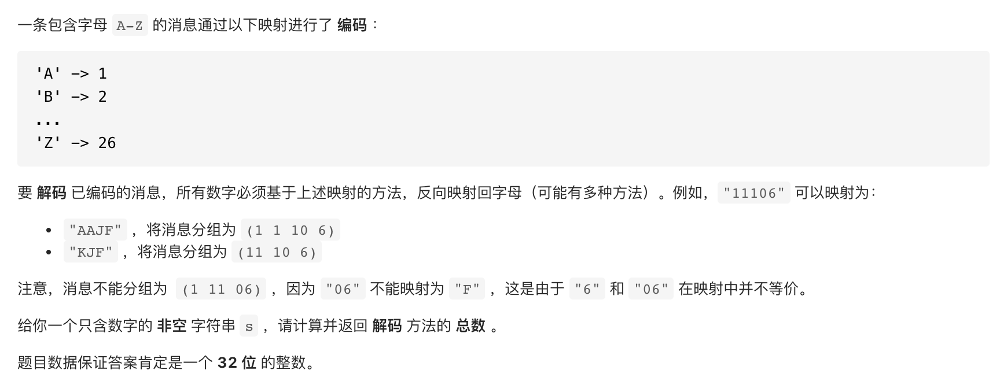
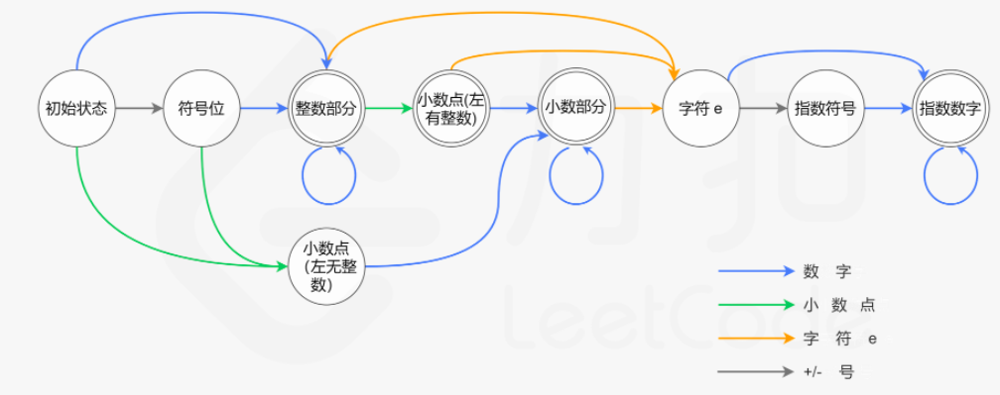
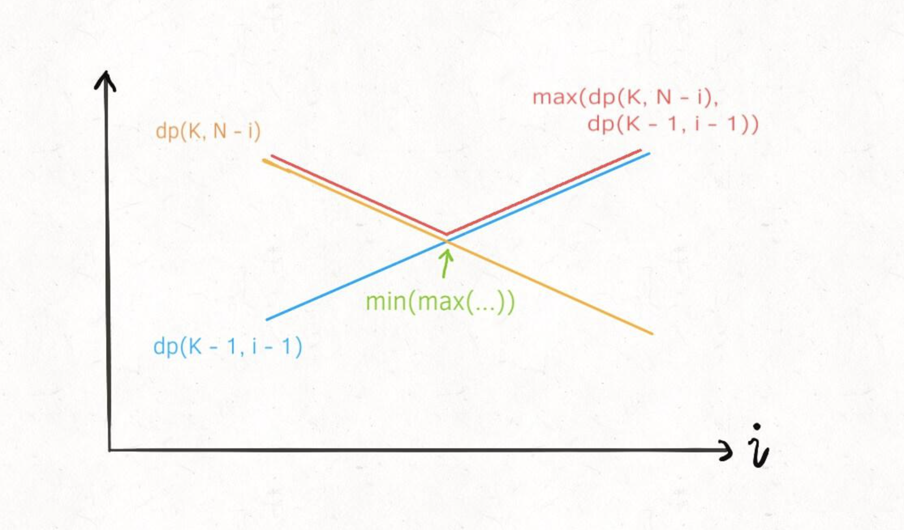
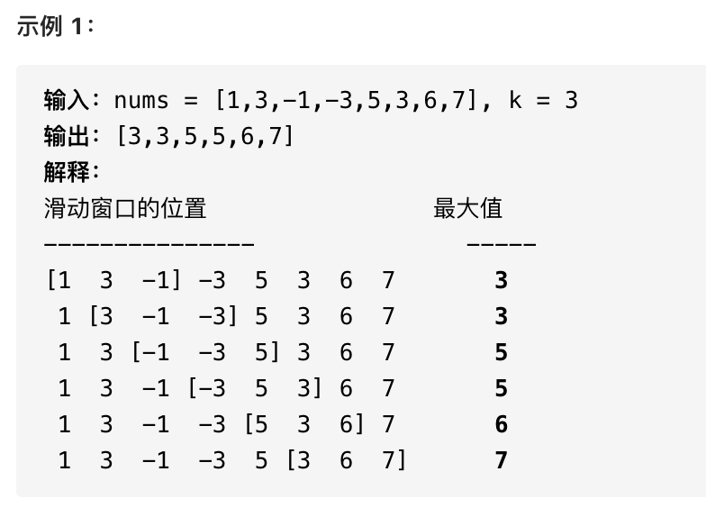
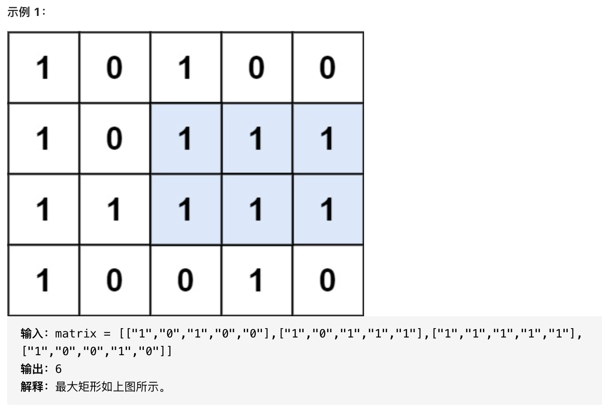
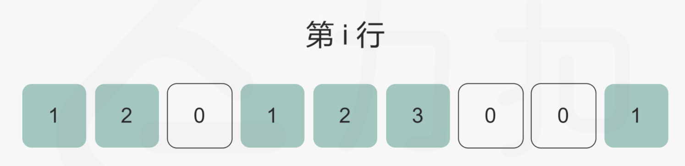
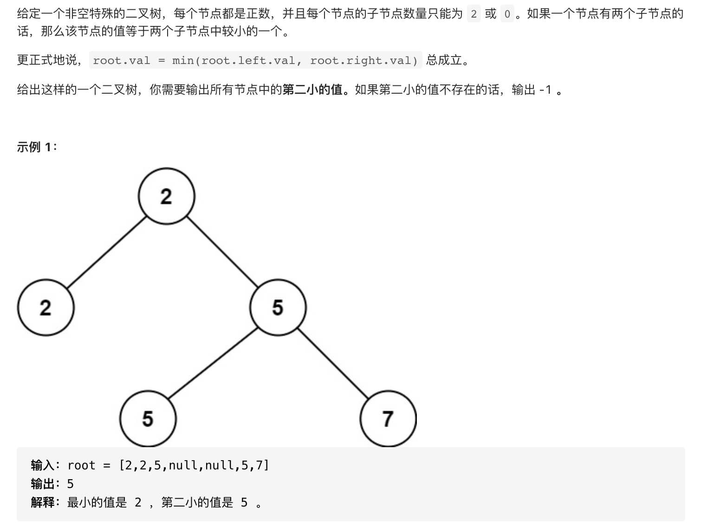
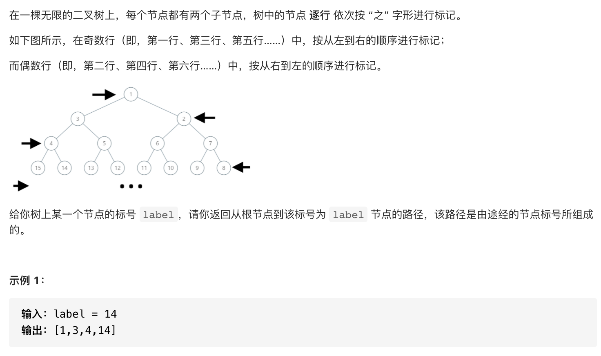

#                           总（348）

# 双指针（7）

## 167. easy 两数之和：输入是有序数组

给定一个已按照 **升序排列** 的整数数组 `numbers` ，请你从数组中找出两个数满足相加之和等于目标数 `target` 。

- 由于数组已经是有序的了，因此只需要构造两个移动方向相反且唯一的指针，当两数之和大时，将指针向和变小的方向移动；反之相反。
- 所以，设置两个指针，一个指向数组第一个元素，一个指向数组最后一个元素即可。

## 633. mid 平方数之和

给定一个非负整数 `c` ，你要判断是否存在两个整数 `a` 和 `b`，使得 `a2 + b2 = c` 。

- 类似167做法，只不过上界变成了sqrt(c)，下界为0。
  - 开平方 double Math.sqrt(double d)
  - 幂次函数 double Math.pow(double a,double b)
  - 取整方法
    - Math.ceil() 向上取整
    - Math.floor() 向下取整
    - Math.round() 四舍五入

## 345. easy反转字符串中的元音字母

编写一个函数，以字符串作为输入，反转该字符串中的元音字母。

- 做法一
  - 先遍历一遍字符串，将元音字母挑出来到一个StringBuffer里，然后reverse一下。再遍历一遍字符串，碰到元音就去元音SB里面拿一个替换即可。
  - 这种做法需要遍历两遍字符串，同时用到两个SB，引入了额外空间复杂度
- 做法二
  - 设置双指针，一个指向字符串头，一个指向字符串尾，两个指针向中间靠拢，直到两个都是元音时，交换。直到两个指针相遇。这种方法，只需要遍历一遍字符串，同时空间复杂度只是交换时的一个char变量，是O(1)

## 680. easy验证回文字符串

给定一个非空字符串 `s`，**最多**删除一个字符。判断是否能成为回文字符串。

- 就是用双指针，从两端向中间遍历，遇到不同的记录下一次，然后分成两头删除两边取并，去继续严格判断回文。

## 88. 合并两个有序数组

给你两个有序整数数组 `nums1` 和 `nums2`，请你将 `nums2` 合并到 `nums1` 中*，*使 `nums1` 成为一个有序数组。

初始化 `nums1` 和 `nums2` 的元素数量分别为 `m` 和 `n` 。你可以假设 `nums1` 的空间大小等于 `m + n`，这样它就有足够的空间保存来自`nums2` 的元素。

- 本题虽然很容易想到要用双工作指针，但是考虑方向的问题。如果从前往后的话，要么需要移动元素或者是需要新建一个新数组，这就造成了额外的时间或者空间开销。
- 究其本质，是因为我们把已经找好位置的元素放在了还未排序的元素的位置上，这就需要对该还未排序的元素进行处理。
- 所以较好的方法是从后往前进行，也就是说从大到小归并，这样的好处是每次找到位置的元素可以直接放置，而不用对原来在那个位置上的元素进行处理。

## 141.环形链表

给定一个链表，判断链表中是否有环。

- 思路很简单，设置两个指针，如果有环的话，让两个指针以不同的步幅前进，若干次后如果有环他们必然会相遇。若是走的较快的那个指针走到尽头了，则说明没有环。
- 需要注意的是，走的更快的那个指针，在.next.next的时候，需要判断.next是否为空

## 524. 通过删除字母匹配到字典里最长单词

给定一个字符串和一个字符串字典，找到字典里面最长的字符串，该字符串可以通过删除给定字符串的某些字符来得到。如果答案不止一个，返回长度最长且字典顺序最小的字符串。如果答案不存在，则返回空字符串。

- 对长字符串和短字符串分别设置工作指针，当指针指向相同时，同时移动一格。当不同时，长字符串移动。当指针到尽头时，如果短字符串的指针到尽头，则说明都匹配上了；否则则是没有匹配上。

# 排序（4）

## 912. 数组排序

给你一个整数数组 `nums`，请你将该数组升序排列。

- 快排
- 堆排序
  - 利用ProrityQueue自带的最小堆进行堆排序
  - 利用原数组中原地构建一个堆（用数组建立完全二叉树）来进行。节点i的子节点为2i+1和2i+2。
    - 调整就是将当前节点和 当前节点、左节点、右节点中的交换，并且继续向下调整。
    - 建堆的时候就从0-len/2进行调整就好了。

## 215. Top-K和K-th问题

在未排序的数组中找到第 **k** 个最大的元素。请注意，你需要找的是数组排序后的第 k 个最大的元素，而不是第 k 个不同的元素。

- 两种思路
  - 直接排序。一般使用快排，然后找到第k个。注意边界条件。时间复杂度O(n)
    - 由于只需要选择k-th，所以并不需要完整执行完整个快排，每次只需要执行一边，同时如果分界的刚好是第k个，就可以直接结束
  - **最小堆或者最大堆**。例如找第K大的元素，则可以维护一个最大堆的小顶堆，即最后最大堆里的全部元素就是Top-k大的，堆顶元素由于是堆中最小的，所以是K-th的。或者维护一个最大堆的大顶堆，删除k-1次顶之后，堆顶元素即为第k大的。
    - 可以不用链表实现，用完全二叉树的数据结构的话，可以直接使用数组，编号为i的节点的左右子节点为2i+1和2i+2

## 347. 前k个高频元素

<span id='451'>给定一个非空的整数数组，返回其中出现频率前 *k* 高的元素。</span>

- 桶排序思想：利用列表的索引值来排序
  - 首先肯定是遍历一遍数组，将元素和对应的频率存到一个hashmap里面，key是元素的值，value是元素的出现频率
  - 接着，创建一个索引值为频率，值为对应的元素组成的List（因为可能有多个元素拥有相同频率）的列表
  - 最后，从后往前遍历该列表，取出前k个元素即是频率前k大的
- 利用最小堆，排序的原则是出现的频率。
  - 可以利用优先级队列来便捷的构造最小堆，PriorityQueue会维护一个排序值最小的小顶堆，所以利用Compator来对频率的相反差值排序即可，然后取出k次头顶元素即为前k频率最高的

## 451. 按照字符出现频率排序

给定一个字符串，请将字符串里的字符按照出现的频率降序排列。

- 和347完全相同的思路
- StringBuffer和StringBuider的区别
  - 基本相同
  - 区别主要在于多线程，StringBuider适用于单线程，StringBuffer适用于多线程，引入了更多的同步操作，所以开销更大。

## 75. 国旗颜色分类

给定一个包含红色、白色和蓝色，一共 n 个元素的数组，原地对它们进行排序，使得相同颜色的元素相邻，并按照红色、白色、蓝色顺序排列。此题中，我们使用整数 0、 1 和 2 分别表示红色、白色和蓝色。

- 要点就是设置一个工作指针从前往后，设置两个指针分别标识红色区域和蓝色区域的界限，当工作指针指向的是红色时就和红色指针交换，是蓝色就和蓝色指针交换。需要注意的是，红色交换时，红色区域的指针和工作指针可以一起往前移，因为红色区域的指针指向的只有可能是白色，因为已经被工作指针扫描过一次了，不需要继续判断工作指针；而蓝色指针指向的指针交换后，工作指针必须原地再判断一次，因为此时的工作指针还有可能是红色。

# 链表（10）

## 160. 相交链表

编写一个程序，找到两个单链表相交的起始节点。


- 本质上就是要构造出一个步调一致的遍历方式来判断当前遍历的节点是不是相交节点
- 解法一：由于链表相交后的节点就完全一样了，所以如果能够计算出两个链表的长度差，然后从距离尾端相同距离的地方同时开始前进，就能同时到达相交节点。
- 解法二：由于两个链表的长度是不一样的，但是两个链表的长度加起来是长度一样的。因此，设置两个指针，一个先遍历一遍A结束后再从B开始遍历，另一个反之。这样的话，两个指针走过的长度都是L_a+L_b，步调一致。

## 206. 反转链表

反转一个单链表。

- 迭代的方法比较直观，直接每次从链表中摘下一个节点，然后插入新链表的头部即可

- 递归的方式，假设

  则我们需要利用到nk还是指向nk+1来找到新链表的尾部，将nk插入尾部即可，同时注意将nk的next设为null，不然会产生环。

## 21. 合并两个有序链表

将两个升序链表合并为一个新的 **升序** 链表并返回。新链表是通过拼接给定的两个链表的所有节点组成的。 

- 新建一个头节点，每次取第一个进行比较即可。

## 4. 从有序链表中删除重复节点

给定一个排序链表，删除所有重复的元素，使得每个元素只出现一次。

- 从头开始判断，首先需要判断当前节点和下一个节点非空，再进行值的比较

## 19.删除链表的第n个节点

给你一个链表，删除链表的倒数第 `n` 个结点，并且返回链表的头结点。

- 只用一趟扫描：因为删除的是倒数第n个节点，所以可以设置两个指针，一个指针指向头节点，一个指针领先该指针n个节点，两个指针同步往前走，当快指针指到尾部的时候，慢指针指向的就是倒数第n个节点。

## 24. 两两交换链表中的节点

给定一个链表，两两交换其中相邻的节点，并返回交换后的链表。

**你不能只是单纯的改变节点内部的值**，而是需要实际的进行节点交换。

- 设置一个头节点指向原来的头，然后读取下两个进行交换。需要注意的是交换后的位置，以及返回的值。

## 445. 两数相加

给你两个 非空 链表来代表两个非负整数。数字最高位位于链表开始位置。它们的每个节点只存储一位数字。将这两数相加会返回一个新的链表。

你可以假设除了数字 0 之外，这两个数字都不会以零开头。

- 做法一：反转链表，然后相加，加完记得处理进位。尤其是当最高位需要进位时要新建一个节点
- 做法二：不反转链表。分别统计两个链表的长度，然后从相同位数开始相加。最后进位可以递归判断
- 做法三：用栈。分别将两个链表压入两个栈中，然后相加。

## 234. 回文链表

请判断一个链表是否为回文链表。时间On,空间O1

- 先通过快慢指针找到列表中间，然后翻转后面的列表，然后逐个比对。需要遍历一遍半链表

## 725. 分隔链表

给定一个头结点为 root 的链表, 编写一个函数以将链表分隔为 k 个连续的部分。每部分的长度应该尽可能的相等: 任意两部分的长度差距不能超过 1，也就是说可能有些部分为 null。这k个部分应该按照在链表中出现的顺序进行输出，并且排在前面的部分的长度应该大于或等于后面的长度。返回一个符合上述规则的链表的列表。

举例： 1->2->3->4, k = 5 // 5 结果 [ [1], [2], [3], [4], null ]

- 先遍历一遍链表，得到链表长度，然后根据链表长度先切分好分组策略，即共k组，其中l mod k组的长度是l // k +1，其他的就是l // k。进而切分链表。可以加入头节点来处理边界情况。

## 328.  链表元素按奇偶聚集

给定一个单链表，把所有的奇数节点和偶数节点分别排在一起。请注意，这里的奇数节点和偶数节点指的是节点编号的奇偶性，而不是节点的值的奇偶性。

请尝试使用原地算法完成。你的算法的空间复杂度应为 O(1)，时间复杂度应为 O(nodes)，nodes 为节点总数。

- 边界情况：当链表元素<=2时，直接返回。
- 当链表元素>=3时，将第一个和第二个节点摘下来当作奇偶链表的头节点，然后依次加入链表中。最后需要判断是否还剩余一个奇数节点要加入奇链表中。然后将偶链表表头接到奇链表最后面，返回奇数链表的表头即可。

# 二叉树（31）

## 递归（14）

### 104. 二叉树的最大深度

给定一个二叉树，找出其最大深度。

- 递归，当根节点为0时，返回0。其他情况返回左右节点的深度更大值+1。

### 110. 平衡二叉树

给定一个二叉树，判断它是否是高度平衡的二叉树。

平衡二叉树：一个二叉树*每个节点* 的左右两个子树的高度差的绝对值不超过 1 。

- 做法一：用统计树高度的方法，递归的判断每个节点的左右子树的高度差。但此时从上到下计算高度时，会多次重复访问底部节点。
- 做法二：因此，考虑能不能每个节点只访问一次。对做法一进行改进，在进行计算高度时，由于是递归的从下面到上面，因此如果下面的节点已经不平衡的话，可以设置一个flag来直接终止后续访问，停止递归。因此，当访问节点时，如果节点已经不平衡，就不返回高度，而是直接返回-1。这样，在第一遍计算根节点的高度时，就可以得到是否是平衡树的信息，即只需要遍历一遍，时间复杂度O(N),空间复杂度为递归栈的深度，最差情况下为O(N)。平均为O(log2N)。

### 543. 二叉树的直径

给定一棵二叉树，你需要计算它的直径长度。一棵二叉树的直径长度是任意两个结点路径长度中的最大值。这条路径可能穿过也可能不穿过根结点。

- 思想和110判断平衡二叉树的情况是一样的，容易想到的是依次对每个节点计算高度来进行判断。其实可以把判断的过程放到计算高度的递归函数里面，即在递归过程中，每个节点的直径=左节点的长度+右节点的长度，和一个最大值进行判断即可。这样只需要计算一次根节点的高度就可以完成，时间复杂度O(N)。

### 226. 翻转二叉树

递归判断，不为空的话交换左右子树，然后递归翻转左右子树

### 617. 合并二叉树

给定两个二叉树，想象当你将它们中的一个覆盖到另一个上时，两个二叉树的一些节点便会重叠。

你需要将他们合并为一个新的二叉树。合并的规则是如果两个节点重叠，那么将他们的值相加作为节点合并后的新值，否则**不为** NULL 的节点将直接作为新二叉树的节点。

- ​	递归判断，需要注意判断空的情况。

### 112. 路径总和

给你二叉树的根节点 root 和一个表示目标和的整数 targetSum ，判断该树中是否存在 根节点到叶子节点 的路径，这条路径上所有节点值相加等于目标和 targetSum 。

- 特别需要注意判断根节点、叶节点的情况。必须是从根节点到叶子结点的路径。另外需要考虑只有一个节点，也就是自己到自己也是属于根节点到叶节点的情况。

### 437. 路径总和的条数

给定一个二叉树，它的每个结点都存放着一个整数值。找出路径和等于给定数值的路径总数。

- 和上题类似，不过判断的时候可以不用从头加到尾。需要注意的是，为了避免加了第一个节点没加第二个节点这种不允许的情况出现，需要设计一个标志位来判断之前是否有节点被加了，如果有则不允许此节点不加入，否则的话可以。

### 572.另一个树的子树

给定两个非空二叉树 s 和 t，检验 s 中是否包含和 t 具有相同结构和节点值的子树。s 的一个子树包括 s 的一个节点和这个节点的所有子孙。s 也可以看做它自身的一棵子树。

- 方法一：暴力搜索，即对每一个节点去判断是否和子树相等。

- 方法二：一棵子树上的点在深度优先搜索序列（即先序遍历）中是连续的。将树转换为序列来判断。
- **方法三：树哈希**：为每个节点设计一个哈希值，其中哈希值的自变量为节点自己的val，节点左子树节点的哈希值，节点右子树的哈希值。因此，当这些因素共同影响一个点的哈希值，所以出现冲突的几率较小，一般我们可以忽略。所以认为具有相同哈希的节点是具有相同的结构的。若觉得设计的哈希有的特殊情况冲突率比较高，可以多设计一个哈希进一步减少冲突率。

### 101. 对称二叉树

- 迭代可以设置两个指针进行深搜，一个从最左边开始，一个从最右边开始。当搜到根节点的时候结束，说明对称。

### 111.二叉树的最小深度

给定一个二叉树，找出其最小深度。

- 深搜,对每个节点判断是不是叶子结点
- 广搜会比较好，因为广搜的性质决定了第一个碰到的叶子结点就是最短的。

### 404. 左叶子之和

计算给定二叉树的所有左叶子之和。

- 以任何方式遍历都可以，反正在访问的时候判断是否有左叶子即可

### 687. 最长同值路径

给定一个二叉树，找到最长的路径，这个路径中的每个节点具有相同值。 这条路径可以经过也可以不经过根节点。

- 递归判断，重要的是找到怎么递归
- 设计一个函数getNo，返回的从经过当前节点往下最大的节点数。那么，递归判断左右节点时，将左右节点getNo函数值保存。并且判断当前节点和左右节点值是否相同，如果不同则可以直接丢弃那边。相同的话，加1。
  - 如果单边都相同，则路径长度为相同那边的返回长度加1。向上返回节点数也是
  - 如果两边都相同，则路径长度为两边返回长度相加再加上1，向上返回时就只能返回更长的那一边+1。和单边的情况不同。

### -->337. 间隔遍历

在上次打劫完一条街道之后和一圈房屋后，小偷又发现了一个新的可行窃的地区。这个地区只有一个入口，我们称之为“根”。 除了“根”之外，每栋房子有且只有一个“父“房子与之相连。一番侦察之后，聪明的小偷意识到“这个地方的所有房屋的排列类似于一棵二叉树”。 如果两个直接相连的房子在同一天晚上被打劫，房屋将自动报警。

- 方法一：直接递归完成。从根开始，最大值分为两种情况，第一种情况是包括根，然后跳过下一层，去到下下层的节点，作为新的根来递归判断。第二种情况是不包括根，直接等于下一层的作为根来递归计算。这种方法的缺点是会重复计算。

- 方法二：加入哈希表，速度提升很明显。方法一的重复计算来自于在计算爷爷辈的值时，两种情况分别需要计算儿子辈的值和孙子辈的值。而后续继续计算儿子辈的值时，又需要再算一遍孙子辈的值，造成了重复计算。因此，在计算孙子辈的值后，将值存起来，后续再一次需要时，就不需要再算一遍，而是直接取。每个节点只会被计算一次。

- 方法三：省去方法二的哈希表。很明显，加入哈希表的原因是为了避免孙子、儿子节点重复计算，需要记忆。而重复计算的根源是调用链并不是单向的，而是可能出现步调不一致的情况。因此，如果能够解决这个问题，就不会出现重复计算，就不用加入哈希表。之前，递归的公式中，有的情况直接跳到了孙子节点。现在就每次只递归一层，每个节点有两种状态，分别为偷和不偷，设计一个返回值数组，长度为2，0表示不偷，1表示偷。此方法同样没有进行重复计算，也没有引入哈希表的额外空间。

  - 当前节点不偷时，最大钱=左孩子返回的最大钱+右孩子返回的最大钱。即不在父节点考虑直接偷孙子的问题，避免跳跃递归，通过判断儿子返回值来让儿子给出结论。

    ```java
    ret[0]=Math.max(robInternal(root.left)[0],robInternal(root.left)[1])
             +Math.max(robInternal(root.right)[0],robInternal(root.right)[1]);
    ```

  - 当前节点偷的时候，左右孩子并不能偷，最大钱=左孩子选择不偷情况下得到的钱+右+自己的钱。

    ```java
    ret[1]=root.val+robInternal(root.left)[0]+robInternal(root.right)[0];
    ```

### 671. 二叉树中第二小的节点

给定一个非空特殊的二叉树，每个节点都是正数，并且每个节点的子节点数量只能为 2 或 0。如果一个节点有两个子节点的话，那么该节点的值等于两个子节点中较小的一个。更正式地说，`root.val = min(root.left.val, root.right.val)` 总成立。

给出这样的一个二叉树，你需要输出所有节点中的**第二小的值。**如果第二小的值不存在的话，输出 -1 **。**

- 主要就是判断当子节点的值大于或者等于第二最小值的时候，下面就不用继续搜索了
- 同时需要**处理边界情况**，即输入为int最大值，或者全部是相同值的情况。如何判断是否有第二最小值

## 层次遍历（2）

### 637.计算 每一层的平均值

- 用广度搜索，插入一个null作为一层的分界。注意的是极端情况，一层的和加起来超过了最大值，所以和的类型要用long
- 分界的方法，不只可以用插入桩，还可以通过个数来判断。每一层遍历完，队列中的个数即是下一层的总个数。

### 513. 找树左下角的值

给定一个二叉树，在树的最后一行找到最左边的值。

- 本题，由于需要判断第一个，因此用个数来判断分界要好一点。层次遍历，一次遍历一层，每次把第一个节点的值记录下来并且把下一层不为空的节点加入队列。当队列为空时，返回结束。

## 前中后序遍历（3）

### 144.二叉树的前序遍历

### 94. 二叉树的中序遍历

### 145. 二叉树的后序遍历

后序遍历需要注意加一个标志位记录右边节点是否被访问过或者设置一个指针指向上一个访问的节点，用来判断是从左子树返回的还是从右子树返回的。从左子树返回的，父节点需要再压进去，然后把右节点压进去。如果是从右子树返回的，则左右都访问过了，父节点出栈访问。

## 二叉查找树（10）

根节点大于左节点，小于右结点

### 699. 修剪二叉查找树

给你二叉搜索树的根节点 root ，同时给定最小边界low 和最大边界 high。通过修剪二叉搜索树，使得所有节点的值在[low, high]中。修剪树不应该改变保留在树中的元素的相对结构（即，如果没有被移除，原有的父代子代关系都应当保留）。 可以证明，存在唯一的答案。所以结果应当返回修剪好的二叉搜索树的新的根节点。注意，根节点可能会根据给定的边界发生改变。

- 递归来做，首先判断根节点，若根节点大于，则把根结点和右子树都直接删掉，做法是直接返回左子节点的返回值，反之亦然。否则，左指针等于左子树的返回值，右指针等于右子树的返回值。每个节点只会被访问一次，时间复杂度O(N), 空间复杂度为树的高度, 平均O(log N),最差O(N). 

### 230. 二叉搜索树中第K小的元素

给定一个二叉搜索树的根节点 `root` ，和一个整数 `k` ，请你设计一个算法查找其中第 `k` 个最小元素（从 1 开始计数）。

- 直接中序遍历，第k个遍历得到的就是第k个最小的元素。

### 1038. 把二叉搜索树转化为累加树

给出二叉 **搜索** 树的根节点，该树的节点值各不相同，请你将其转换为累加树（Greater Sum Tree），使每个节点 `node` 的新值等于原树中大于或等于 `node.val` 的值之和。

- 由于需要使每个节点的值等于整个树中大于该节点的值，所以在访问该节点前，必须访问所有比该节点大的节点。由于二叉搜索树的性质，所以把正常的左-根-右得到升序序列反过来，按右-根-左的顺序访问即可得到降序序列，也就是在访问每个节点前都会访问到比该节点大的节点，因此只需要设置一个累加和即可，访问每个节点将该节点的值置为累加和。时间复杂度和空间复杂度和一次中序遍历相同。

### 235. 236. 最近公共祖先

#### 二叉搜索树, 找到该树中两个指定节点的最近公共祖先。

- 因为二叉搜索树的性质，所以从根节点往下依次判断，若是当前节点在两节点之间，则说明判断的两个节点一个在左，一个在右，则当前节点必然是最近的祖先。否则，则依据大小关系继续往下判断。

#### 普通二叉树，找到该树中两个指定节点的最近公共祖先

- 方法一：直接后序遍历，当遍历到指定节点的时候，把栈里面的值复制出来一一比较。
- 方法二：递归判断，当找到p或q时返回p或者q，否则递归到叶节点返回null。

### 108. 从有序数组中构造平衡二叉搜索树

给你一个整数数组 `nums` ，其中元素已经按 **升序** 排列，请你将其转换为一棵 **高度平衡** 二叉搜索树。

- 因为是有序数组，所以每次取中间的节点作为根节点，左边的扔去左子树，右边的扔去右子树，递归即可。遍历一次，时间复杂度O(N)，由于是平衡二叉树，所以树的高度是logN，所以递归的空间复杂度O(logN)。

### 1382. 将二叉搜索树变为平衡二叉搜索树

给你一棵二叉搜索树，请你返回一棵 **平衡后** 的二叉搜索树，新生成的树应该与原来的树有着相同的节点值。

- 方法一：先构造升序序列，再从升序序列中构造平衡二叉搜索树。
  - 从108中可以看出，从一个升序序列中来建立平衡的二叉搜索树是非常简单而且只需要线性时间的。而二叉搜索树的中序遍历就是升序序列。因此，可以先中序遍历一遍二叉搜索树，将节点保存在一个ArrayList中，然后在和108一样建立一个二叉搜索树即可。总体需要遍历两边二叉搜索树，时间复杂度O(N)，需要一个数组保存所有节点，空间负杂度O(N)，递归的空间复杂度O(logN)，所以总的空间复杂度O(N)。
- 方法二：直接旋转二叉树，构造平衡二叉搜索树。通用性更强。

### 653. 二叉搜索树中的两数之和

给定一个二叉搜索树和一个目标结果，如果 BST 中存在两个元素且它们的和等于给定的目标结果，则返回 true。

- 方法一：使用HashSet。遍历一遍二叉搜索树，访问节点时，把当前节点的值放到一个set里，并且判断之前已经访问过的放到set里的值有没有当前互补的。
- 方法二：中序遍历一遍二叉搜索树得到升序序列，然后用双指针来做。

### 530. 二叉搜索树的最小绝对差

给你一棵所有节点为非负值的二叉搜索树，请你计算树中任意两节点的差的绝对值的最小值。

- 由于最小绝对差只有可能出现在升序序列相邻的两个节点之间，因此只需要中序遍历二叉搜索树，把上个节点的值记录下来，每次相减比较即可。总遍历一次，除了递归以外只有常数空间开销。

### 501. 二叉搜索树中的众数

给定一个有相同值的二叉搜索树（BST），找出 BST 中的所有众数（出现频率最高的元素）。

- 方法一：先遍历一遍二叉搜索树，然后把每个节点出现的频率统计出来，再遍历一遍把最高的打印出来。不仅要遍历两遍，还要额外的空间。下下等。
- 方法二：中序遍历二叉搜索树，重复出现的节点一定是访问顺序在一起的。记录下前一个访问的，如果一样就+1，不一样就重新从1开始。

## 前缀树（2）

### 208.实现trie（前缀树）

实现一个 Trie (前缀树)，包含 `insert`, `search`, 和 `startsWith` 这三个操作。

- 由于可能存在多个节点，因此子节点是一个数组，数组的个数取决于最小元素的取值个数。
- 同时，需要标记当前节点是否是叶子结点。

### 677. 键值映射

每一个字符串有一个值，写插入函数`void insert(String key, int val)` 。一个求和函数`int sum(string prefix)` 返回所有以该前缀 `prefix` 开头的键 `key` 的值的总和。

- 在叶子结点设置该字符串的值即可。

# 栈和队列（6）

### 232. 用栈实现队列

请你仅使用两个栈实现先入先出队列。队列应当支持一般队列支持的所有操作（`push`、`pop`、`peek`、`empty`）：

你能否实现每个操作均摊时间复杂度为 `O(1)` 的队列？换句话说，执行 `n` 个操作的总时间复杂度为 `O(n)` ，即使其中一个操作可能花费较长时间。

- 用两个栈实现队列，stack1和stack2。stack1的顺序和栈的顺序相同，先入后出，stack2的顺序和队列的顺序相同，先入先出。当需要输出时，把stack1的内容全部出栈入栈到stack2中；当需要输入时，把stack2的内容全部出栈入栈到stack1中。
- 其实并不是每一次输入输出都要保证其中一个栈是空的。当stack2中还有元素时，这些元素就是先进的而且顺序对的，可以直接pop。而push的时候，直接push到stack1即可，只有当stack2中没有元素时，才需要从stack1中全部出栈入栈stack2

### 225. 用队列实现栈

请你仅使用两个队列实现一个后入先出（LIFO）的栈，并支持普通队列的全部四种操作（`push`、`top`、`pop` 和 `empty`）。

- 用一个队列收集输入，收集到的是先入先出的，另一个用来腾挪。输出时因为要后入先出，所以把前n-1个都移到另一个队列中，顺序还是先入先出，剩下的就是最近加入队列的，输出即是后入先出。这样采用两个队列，输入的时间复杂度是O(1)，但每次输出时都需要O(N)。
- 双队列的思想其实也可以用单队列实现，当输入一个新值时，插到了队列尾部，则将其他元素出队入队即可。此时每次输入的时间复杂度为O(N),输出时间复杂度为O(1)。

### 155. 最小栈

设计一个支持 `push` ，`pop` ，`top` 操作，并能在常数时间内检索到最小元素的栈。getMin() —— 检索栈中的最小元素。

- 方法一：维护一个升序的链表，每次入栈的时候进行查询，然后找到合适位置插入。同理，出栈的时候也是。检索最小元素的时间复杂度是O(1)，但是入栈出栈的时间复杂度是O(N)。
- 方法二：为了一个和存储栈同步的最小值栈。因为栈元素的性质，当上面栈的元素没有出去时，下面的元素肯定也没有出去，因此当前栈入栈时候计算的最小值也是他在出栈时候的最小值。所以每次元素入栈时，和上一个元素绑定的最小值进行比较，然后在最小值里面加入一个和当前元素绑定的当前最小值。此时入栈出栈的时间复杂度只是一次比较的时间，复杂度都是O(1)。

### 20. 有效的括号

给定一个只包括 `'('`，`')'`，`'{'`，`'}'`，`'['`，`']'` 的字符串 `s` ，判断字符串是否有效。

- 使用栈，做括号就进栈，右括号就出栈判断，不一样直接结束返回不匹配，一样的话继续，最后返回匹配。

### 739. 每日温度

请根据每日 `气温` 列表，重新生成一个列表。对应位置的输出为：要想观测到更高的气温，至少需要等待的天数。如果气温在这之后都不会升高，请在该位置用 `0` 来代替。

例如，给定一个列表 `temperatures = [73, 74, 75, 71, 69, 72, 76, 73]`，你的输出应该是 `[1, 1, 4, 2, 1, 1, 0, 0]`。

- 可以维护一个单调递减栈，栈里面保存节点的值和索引，当温度比栈顶元素大时说明找到了该栈顶元素最近的增加节点，然后对栈顶元素重复判断，看可以弹出几个。

### 503. 下一个更大元素

给定一个循环数组（最后一个元素的下一个元素是数组的第一个元素），输出每个元素的下一个更大元素。数字 x 的下一个更大的元素是按数组遍历顺序，这个数字之后的第一个比它更大的数，这意味着你应该循环地搜索它的下一个更大的数。如果不存在，则输出 -1。

- 依然用单调栈来做，和上题类似。不同的是，需要先遍历一遍数组，找不到更大的需要压入栈。然后再遍历一遍数组，此时就只是单纯比较大小，不需要再压入栈了。

# 哈希表（4）

## 1. 两数之和

给定一个整数数组 `nums` 和一个整数目标值 `target`，请你在该数组中找出 **和为目标值** 的那 **两个** 整数，并返回它们的数组下标。

- 做法一：常见的直接排序，排序的时间复杂度为O(N*logN)，然后双指针查找O(N)。空间复杂度O(1)
- 做法二：用哈希表记录，去哈希表里查询目标值减当前值是否存在，存在则返回，不存在则加入哈希表。只需要遍历一遍即可，时间复杂度O(N)，空间复杂度O(N)。

## 217. 判断数组是否有重复元素

给定一个整数数组，判断是否存在重复元素。

如果存在一值在数组中出现至少两次，函数返回 `true` 。如果数组中每个元素都不相同，则返回 `false` 。

- 直接使用哈希集合

## -->594. 最长和谐序列

和谐数组是指一个数组里元素的最大值和最小值之间的差别 正好是 1 。

现在，给你一个整数数组 nums ，请你在所有可能的子序列中找到最长的和谐子序列的长度。

数组的子序列是一个由数组派生出来的序列，它可以通过删除一些元素或不删除元素、且不改变其余元素的顺序而得到。

- 做法一：对每个数组中的元素，去查询他+1的元素的个数。时间复杂度O(N<sup>2</sup>)，空间复杂度O(1)
- 做法二：因为做法一中只需要查询某个特定的元素的个数，所以可以先遍历一遍数组，把每个元素的个数纪录在哈希表中。然后遍历哈希表的key，去直接查询当前key+1的个数即可。这样做只需要遍历一遍数组，时间复杂度O(N)，空间复杂度O(N)。

## 128. 最长连续序列

给定一个未排序的整数数组 `nums` ，找出数字连续的最长序列（不要求序列元素在原数组中连续）的长度。

```java
输入：nums = [100,4,200,1,3,2]
输出：4
解释：最长数字连续序列是 [1, 2, 3, 4]。它的长度为 4。
```

- 做法一：直接先排序，然后遍历一遍即可。排序复杂度O(N log N)，空间复杂度O(N)
- 做法二：用哈希set。先遍历一遍数组，放入hashset中。在随便取一个数，分别往上和往下查询在hashset中是否存在，查询完就删除。直到hashset为空为止。由于每个节点只会被访问一次，再加上遍历一遍数组，所以时间复杂度为O(N)，空间复杂度为O(N)

# 字符串（15）

## 回文串（8）

### 409. 最长回文串

给定一个包含大写字母和小写字母的字符串，找到通过这些字母构造成的最长的回文串。

在构造过程中，请注意区分大小写。比如 `"Aa"` 不能当做一个回文字符串。

- 因为只需要取字母就可以了，不需要考虑源字符串中的顺序问题。所以直接计算个数即可。偶数个字符串的可以全部用上，奇数个的最多用上一个。因为只有大小写字母，所以保存个数的数组为常数空间，空间复杂度O(1)，时间复杂度为遍历字符串计算个数的，O(N)

### 9. 回文数

给你一个整数 `x` ，如果 `x` 是一个回文整数，返回 `true` ；否则，返回 `false` 。

回文数是指正序（从左向右）和倒序（从右向左）读都是一样的整数。例如，`121` 是回文，而 `123` 不是。

要求不能使用额外的空间，也就是不能将整数x转换为字符串。

- 将整数拆成两部分，左和右，然后把其中一部分翻转，比较两个值是不是相等或者差10倍（如12321变成12和123）。

### 647. 回文子串

<span id='647'>给定一个字符串</span>，你的任务是计算这个字符串中有多少个回文子串。

具有不同开始位置或结束位置的子串，即使是由相同的字符组成，也会被视作不同的子串。

- 中心扩展法：依次枚举中心点然后向外扩展。共需要枚举2n个中心点，每个中心点向外扩展最多n次。时间复杂度O(n<sup>2</sup>)，空间复杂度O(1)

- 动态规划法：其实就是利用当首尾两个字符相等时，是不是回文字符串取决于内部是不是回文字符串。设dp [ i ] [ j ] 代表[i,j] 是否是回文字符串，所以dp [ i ] [ j ] = dp [ i+1 ] [ j-1 ]当i处字符等于j处字符时。不等时直接等于false。但是遍历顺序是个难点。

  - 

  - 如果这矩阵是从上到下，从左到右遍历，那么会用到没有计算过的dp[i + 1] [j - 1]，也就是根据不确定是不是回文的区间[i+1,j-1]，来判断了[i,j]是不是回文，那结果一定是不对的。

    **所以一定要从下到上，从左到右遍历，这样保证dp[i + 1] [j - 1]都是经过计算的**。

### 131. 分割回文串

<span id='131'>给你</span>一个字符串 `s`，请你将 `s` 分割成一些子串，使每个子串都是 **回文串** 。返回 `s` 所有可能的分割方案。

**回文串** 是正着读和反着读都一样的字符串。

- 回溯的选择范围为当前字符到哪个位置可以构成回文字符串。如果每次都需要判断的话，浪费时间。
- 可以先用647中方法dp预处理得到回文字符串信息，再根据回文字符串信息进行回溯。

### 132. 分割回文串II

<span id=132>给你</span>一个字符串 `s`，请你将 `s` 分割成一些子串，使每个子串都是回文。

返回符合要求的 **最少分割次数** 。

- 动态规划法：确定状态转移方程。设dp[i]表示前i个字符的最少分割次数。
  - dp[i]=0，如果本身就是回文字符串
  - dp[i]=min{ dp[j] +1 }，如果[j+1,i]为回文字符串的话。其中j取值0到i-1。
  - 因此，可以看出，需要经常判断是不是回文字符串，所以可以利用647的代码，先把所有位置算出来。这样计算是否是回文字符串的时间就大大减少了。

### 1745. 分割回文串IV

给你一个字符串 s ，如果可以将它分割成三个 非空 回文子字符串，那么返回 true ，否则返回 false 。

当一个字符串正着读和反着读是一模一样的，就称其为 回文字符串 。

- 枚举两个分界点，然后根据这个分界点判断分割的三个是不是回文字符串即可。
- 需要用647中将所有字符串提前处理判断是不是回文字符串。

### 1278. 分割回文串III


- 首先找到状态转移方程：设`dp[i][k]`为前i个字符，分割成k个字符串的最少字符数。

- ```
  dp[j][k]=Math.min(dp[j][k],dp[l][k-1]+modify[l+1][j]);
  那么，就可以从分割k-1次的状态转移而来，枚举第k个分割的分界线，在加上新分割出来的修改次数即可
  ```

- 计算modify：和647中计算是否是回文子串差不多，只不过当两端不等的时候，修改次数+1即可。

### 516. 最长回文子序列

给你一个字符串 s ，找出其中最长的回文子序列，并返回该序列的长度。

子序列定义为：不改变剩余字符顺序的情况下，删除某些字符或者不删除任何字符形成的一个序列。

- 动态规划：设置`dp[i][j]`为从i到j的长度。

  - 那么，首先因为是子序列，所以`dp[i][j]=max(dp[i][j-1],dp[i+1][j])`
  - 然后当第i个元素和第j个元素相等时，`dp[i][j]=dp[i+1][j-1]+2`

  - 观察状态转移方程，发现i是要从比i大的状态推来，j要从比j小的状态推来。所以i要从大到小遍历，j在大于i的起点从小到大遍历。


## 28. 实现strStr()

### KMP算法

`next[i]`包含的是，前i元素往前的子串中，最长的相等的前后缀子串

计算next:

- `next[0]=0`
- 已知`next[0]到next[i-1]`求`next[i]`。从`next[i-1]`中我们知道，前面有`next[i-1]个`前后缀是相同的，等于是可以拿模式串自己和自己比，比较的对象是i和next[i-1]。如果相同，就在前面的基础上直接+1
- 不同的话，可以看作是在next[i-1]处匹配失败。因为有next[i-1]处有`next[next[i-1]]`个前后缀相等，所以则将指针移到`next[next[i-1]]`指向的数组继续匹配即可。
- 特别的，当next[k]为0时，停止匹配，直接赋0即可。

### 记忆方式

计算next数组的方式可以和匹配算法一样。可以也就是自己和自己匹配。即原始串为s，模式串为p。计算`next[i]`时其实就是在匹配第i个元素。当匹配第i个元素不等时，就把匹配串的指针从next数组往前走，类似匹配。相等时，就可以在当前前后缀长度相同的地方+1了。除非下一个是0，就直接赋0跳过即可。

## 字符串循环移位包含

```java
s1 = AABCD, s2 = CDAA
Return : true
```

给定两个字符串 s1 和 s2，要求判定 s2 是否能够被 s1 做循环移位得到的字符串包含。

- s1 进行循环移位的结果是 s1s1 的子字符串，因此只要判断 s2 是否是 s1s1 的子字符串即可。

## 字符串循环移位

```java
s = "abcd123" k = 3
Return "123abcd"
```

将字符串向右循环移动 k 位。

- 做法一：构建一个新的字符串，从旧的字符串里面copy过去
- 做法二：原地翻转，将 abcd123 中的 abcd 和 123 单独翻转，得到 dcba321，然后对整个字符串进行翻转，得到 123abcd。

## 字符串中的单词翻转

```java
s = "I am a student"
Return "student a am I"
```

- 将每个单词翻转，然后将整个字符串翻转。

## 242. 有效的字母异位词

给定两个字符串 *s* 和 *t* ，编写一个函数来判断 *t* 是否是 *s* 的字母异位词。你可以假设字符串只包含小写字母。

```java
输入: s = "anagram", t = "nagaram"
输出: true
```

- 因为字符串只包含小写字母，所以可以利用一个固定26长度的数组来保存每个字母的个数。就是先遍历s一遍保存各个字母的个数，再遍历一遍t保存个数，看每个是不是相等。

  **进阶:**
  如果输入字符串包含 unicode 字符怎么办？你能否调整你的解法来应对这种情况？

- 如果字符集很大，例如Unicode的话，就可以使用一个HashMap来实现

## -->205. 同构字符串


给定两个字符串 ***s*** 和 **t**，判断它们是否是同构的。

如果 ***s*** 中的字符可以按某种映射关系替换得到 **t** ，那么这两个字符串是同构的。

每个出现的字符都应当映射到另一个字符，同时不改变字符的顺序。不同字符不能映射到同一个字符上，相同字符只能映射到同一个字符上，字符可以映射到自己本身。

- 做法一：使用两个哈希表来保存双向的映射，对每个对应关系保存双向映射。当下一个对应关系存在且和已保存的不等时，就返回false，否则最后返回true。时间复杂度O(n)，空间复杂度O(n)。
- **做法二：记录对应的两个字符上一次出现的位置，如果两个字符上一次出现位置一样，就属于同构。**

## -->696. 计数二进制子串

给定一个字符串 `s`，计算具有相同数量 0 和 1 的非空（连续）子字符串的数量，并且这些子字符串中的所有 0 和所有 1 都是连续的。

重复出现的子串要计算它们出现的次数。

```
输入: "10101"
输出: 4
解释: 有4个子串：“10”，“01”，“10”，“01”，它们具有相同数量的连续1和0。
```

- 做法一：遍历一遍字符串，找到中心点，即找到01分界线，再往两边找。时间复杂度很高，有重复访问元素的情况。
- 做法二：遍历一遍字符串，将字符串重复出现0和1的次数保存成数组，例如00111011得到的数组是 [ 2,3,1,2 ]，因此数组中两个相邻的数代表的是不同的0和1。而其中满足条件的子串数目为更小的那个值。例如=min(2,3)+min(3,1)+min(1,2) =2+1+1=4。这样做法时间复杂度是O(n)，空间复杂度最差情况下也是O(n)。
- 做法三：从做法二中我们可以看到，我们其实只关心当前连续元素的个数和之前连续元素的个数，因此可以不用保存成一个数组，只需要在遍历的时候，连续结束时，取当前连续个数和之前连续个数的最小值加上去，再更新之前连续个数即可。这样做的时间复杂度和二一样，但是空间复杂变成了O(1)。

# 数组（12）

## 283. 把数组的0移到末尾

给定一个数组 `nums`，编写一个函数将所有 `0` 移动到数组的末尾，同时保持非零元素的相对顺序。

- 设置两个指针，一个指针A为工作指针用来扫描当前元素是否是0，一个指针B指向下一个非0元素需要放置的位置。因此，只需要A依次向后扫描，非零放到B上，B往后一格。最后把B后面的都置零即可。

## 566. 重塑矩阵

在MATLAB中，有一个非常有用的函数 reshape，它可以将一个矩阵重塑为另一个大小不同的新矩阵，但保留其原始数据。

给出一个由二维数组表示的矩阵，以及两个正整数r和c，分别表示想要的重构的矩阵的行数和列数。

重构后的矩阵需要将原始矩阵的所有元素以相同的行遍历顺序填充。

如果具有给定参数的reshape操作是可行且合理的，则输出新的重塑矩阵；否则，输出原始矩阵。

- 二维数组其实就是一维数组的数组，优先行排列

## 485. 最大连续1的个数

给定一个二进制数组， 计算其中最大连续 1 的个数。

- 遍历一遍，记录下当前连续1的个数，是1+1，不是1的话重置为0。

## 240. 搜索二维矩阵

编写一个高效的算法来搜索 `m x n` 矩阵 `matrix` 中的一个目标值 `target` 。该矩阵具有以下特性：

- 每行的元素从左到右升序排列。
- 每列的元素从上到下升序排列。


- 做法一：先从对角线入手，找到第一个对角线元素大于等于目标值的。将矩阵分割为四个部分。例如找15，因为对象线9小于15，17大于15，所以A、D两区域不可能有目标元素。则只有可能BC两区域有。可以递归的继续分割判断，或者直接查找。时间复杂度O(nlgn)，空间复杂度为递归的深度O(lgn)
- 
- **做法二**：设置一个初始指针指向最左下角，有效区域为指针右上角。那么当目标值小于指针时，则该指针同一行右边的可以舍弃掉，指针向上移动一格。当目标值大于指针时，指针同一列上边的可以舍弃掉，指针向右移动一格。直到找到目标值为止。时间复杂度O(n+m)，空间复杂度O(1)。

## 645. 错误的集合

集合 s 包含从 1 到 n 的整数。不幸的是，因为数据错误，导致集合里面某一个数字复制了成了集合里面的另外一个数字的值，导致集合 丢失了一个数字 并且 有一个数字重复 。

给定一个数组 nums 代表了集合 S 发生错误后的结果。

请你找出重复出现的整数，再找到丢失的整数，将它们以数组的形式返回。

- 做法一：从头遍历到尾，将每个元素放在他自己的位置上，交换。然后再判断。当两个元素相同时，发现重复，跳过该元素即可。最后，所有元素都在正确位置上，再遍历一遍找到不在自己位置上的元素，根据该元素位置即可确定哪个是缺失元素。此方法利用到了题目中集合s的取值范围，时间复杂度O(n)，空间复杂度O(1)
- 做法二：使用异或运算。这题和 **有一个集合中有一个数重复，其他数都不同** 的解法是不同的。因为我们知道集合S将重复的那个数去掉，引入新不同数的范围，这样的话，可以将原集合s和1-n的正确集合A做异或，这样的话，所有本来不重复的元素变成了两次，消除，原先重复的那个元素以及原先不存在的元素变成了奇数次。也就是可以得到重复数字^缺失数字的结果。进而，我们可以根据异或结果，找一个bit为1，根据该bit将集合s分为两部分，然后再将1-n的集合也通过该bit来分为两部分，同时对应异或。这样两边就单独剩下两个数，一个为重复，一个为缺失。这样只需要在遍历一遍，判断哪个是重复，哪个是缺失即可。
  - 可以看到，这一题利用到了完整集合应该是1-n的这一信息，所以才能用异或。因此，如果是**有一个集合中有一个数重复，其他数都不同** 这种情况，则不可以这么做，因为你没办法构造出另一个能异或得到奇数次重复元素的集合。
- 做法三：只用额外空间就很简单了，可以用哈希表、数组来计数。

## 287. 寻找重复数

给定一个包含 `n + 1` 个整数的数组 `nums` ，其数字都在 `1` 到 `n` 之间（包括 `1` 和 `n`），可知至少存在一个重复的整数。

假设 `nums` 只有 **一个重复的整数** ，找出 **这个重复的数** 。

- 做法一：使用额外空间，直接用hashset。时间复杂度O(n)，空间复杂度O(n)。
  - 优化：不是存完整的整数，而是存位图。用单个bit来代表某个数是否出现过。
- 做法二：不使用额外空间，类似于645中，将元素放置到正确位置上，当交换重复时即发现重复。时间复杂度O(n)，空间复杂度O(1)
- 做法三：不使用额外空间，不改变原有数组
  - 二分查找：通过抽屉原理，寻找一个分界线，看哪边的个数大于取值范围的个数，则重复一定在那个区间里面，否则根据数量关系，可以得出另一边用抽屉原理得到重复一定在另一边。时间复杂度O(n log n)，空间复杂度O(1)
  - **快慢指针**：假设数组中存在指针nums[i]->i。首先，不论从哪个节点出发，最后的路径都是一个环。而且，数组中，可能会存在很多个环。但是，如果我们从0号节点出发，因为数组中其他元素不可能取值为0，也就是说，0号节点不可能在环中，但是最后肯定是有环的，因为路径不可能无限长。所以必然在线和环的交点会有一个入度为0的节点，而入度为0意味着该节点为重复节点。因此，需要找到该入口。
    - 假设起点到环入口长度为m，环长度为c。当slow和fast指针相遇的时候，假设slow走了n步，则fast走了2n步。所以fast-slow的长度一定是环周长的整数倍，也就是说n%c==0。也就是说，如果把slow让slow再继续走m步，那么n+m就一定是在环的入口处。但是m是不可知的。所以可以设置一个指针从起点开始走，当和slow相遇时，就是环的入口。
    - 

## 667. 优美的排列

给定两个整数 `n` 和 `k`，你需要实现一个数组，这个数组包含从 `1` 到 `n` 的 `n` 个不同整数，同时满足以下条件：

① 如果这个数组是 [a1, a2, a3, ... , an] ，那么数组 [|a1 - a2|, |a2 - a3|, |a3 - a4|, ... , |an-1 - an|] 中应该有且仅有 k 个不同整数；.

② 如果存在多种答案，你只需实现并返回其中任意一种.

分析：即如何对一个长度为n，取值为1-n的数组排序，使得前减后得到的数组有且仅有k个不同的整数。

- 做法一：构造序列。因为需要差值k种，所以就设定为k，k-1，。。。1。序列为1,k+1,2,k,......t,t+1,k+2k+3...n。这样是可以刚好构造出来的。
- **做法二**：翻转序列。以1234567为基准，此时差值为1，因为我们知道翻转整个序列的话，整个序列的差值是不会变的。因此，如果需要增加差值，则固定第一个数不变，翻转后面的序列即可。需要多几个，就这样翻转几次。

## 697. 数组的度

给定一个非空且只包含非负数的整数数组 `nums`，数组的度的定义是指数组里任一元素出现频数的最大值。

你的任务是在 `nums` 中找到与 `nums` 拥有相同大小的度的最短连续子数组，返回其长度。

- 做法一：简单思路，先遍历一遍nums，将数和出现的频次放到hashmap中，在遍历的时候保存最大频次。然后遍历一遍hashmap，通过最大频次找到对应的数，可能有多个。然后对这些数去找最短连续子数组，其实就是从外向内收敛直到碰到该元素为止。
- 做法二：优化，其实在第一遍遍历nums的时候，不仅可以保存数出现的频次，还可以保存这个数第一次出现的位置和最后出现的位置，这样就只需要遍历一次数组。也不需要再对每个每个数去原数组中收敛。

## 766. 矩阵斜线元素相等

给你一个 `m x n` 的矩阵 `matrix` 。如果这个矩阵是托普利茨矩阵，返回 `true` ；否则，返回 `false` *。*

如果矩阵上每一条由左上到右下的对角线上的元素都相同，那么这个矩阵是 **托普利茨矩阵** 。

进阶：

如果矩阵存储在磁盘上，并且内存有限，以至于一次最多只能将矩阵的一行加载到内存中，该怎么办？
如果矩阵太大，以至于一次只能将不完整的一行加载到内存中，该怎么办？

- 设置一个和行长度相同的缓冲区用以保存上一行，然后每次读入下一行入内存，比较。
- 如果一次只能将不完整的一行加载，我们将整个矩阵竖直切分成若干子矩阵，并保证两个相邻的矩阵至少有一列是重合的，然后判断每个子矩阵是否符合要求。

## 565. 数组嵌套

索引从`0`开始长度为`N`的数组`A`，包含`0`到`N - 1`的所有整数。找到最大的集合`S`并返回其大小，其中 `S[i] = {A[i], A[A[i]],``A[A[A[i]]], ... }`且遵守以下的规则。

假设选择索引为`i`的元素`A[i]`为`S`的第一个元素，`S`的下一个元素应该是`A[A[i]]`，之后是`A[A[A[i]]]...` 以此类推，不断添加直到`S`出现重复的元素。

- 做法一：从第一个元素开始，往下找引用链，同时把链的长度记录在哈希表中。当哈希表中不存在时，标记为0，存在时直接返回长度，前面的返回长度+1。后面的元素，不在哈希表中的需要再来一遍，但不需要全部遍历。时间复杂度O(N)，空间复杂度O(N)。或者设置一个数组记录访问情况也可以。
- 做法二：在一的基础上，可以将额外的空间开销省去。因为只需要记录访问的情况，所以可以直接在原数组上记录，因为必然是环的存在，所以每访问一个节点，就将该节点置为-1，然后跳到下一个节点，直到遇到之前访问过的-1的节点，说明已经完整走完一圈，返回长度即可。这么做的原因是，不存在两个相同的值，任何循环外的元素都不会跳到循环内的元素,也就是说环是唯一的。时间复杂度O(N)，空间复杂度O(1)。

## 769. 最多能完成排序的块

数组`arr`是`[0, 1, ..., arr.length - 1]`的一种排列，我们将这个数组分割成几个“块”，并将这些块分别进行排序。之后再连接起来，使得连接的结果和按升序排序后的原数组相同。

我们最多能将数组分成多少块？

- 做法一：从前往后一步一步分割。假设前面的已经分割好了，现在剩下n到n+k的块，那么最短的分割，是首先必须包括n在内，同时全部是连续的。必须包括n可以设置一个标志位，全部是连续的可以通过最大值减最小值等于长度来保证，因为没有重复的元素。这样一步一步判断当前最短的，最后合起来就是最多的。时间复杂度O(N)，空间复杂度O(1)。
- 做法二：类似一，不过可以简化为保存一个到当前为止的最大值，当最大值等于下标时，说明可以从当前位置分割。思想和一类似，编码起来方便。

# 图（5）

## 785. 判断二分图

判断是否为二分图：如果能将一个图的节点集合分割成两个独立的子集 `A` 和 `B` ，并使图中的每一条边的两个节点一个来自 `A` 集合，一个来自 `B` 集合，就将这个图称为 **二分图** 。

- 做法一：通过一个节点大小的数组来标记节点是属于A或者属于B。先将一个节点放入A中，然后通过广搜确定所有和他相关的节点，先不进行判断，仅仅是将和他能到达的节点着色。然后依次将还未着色的节点同样步骤，直到所有节点都着色为止。然后遍历所有的边来判断是否有冲突。时间复杂度：需要遍历一遍所有节点着色，再遍历一遍所有的边判断冲突，时间复杂度为O(n+m)，空间复杂度O(n)。
- 其他做法：做法一是广搜，也可以用深搜，思路是一样的。也可以用并查集。

## 684. 冗余连接

在本问题中, 树指的是一个连通且无环的无向图。

输入一个图，该图由一个有着N个节点 (节点值不重复1, 2, ..., N) 的树及一条附加的边构成。附加的边的两个顶点包含在1到N中间，这条附加的边不属于树中已存在的边。

结果图是一个以边组成的二维数组。每一个边的元素是一对[u, v] ，满足 u < v，表示连接顶点u 和v的无向图的边。

返回一条可以删去的边，使得结果图是一个有着N个节点的树。如果有多个答案，则返回二维数组中最后出现的边。答案边 [u, v] 应满足相同的格式 u < v。

- 做法一：直接用并查集，把有连接的边的加入并查集中。当发现要加入的本身就已经连接了，就是有环了，而且是环的最后一条边，直接返回就可以了。时间复杂度O(N)，空间复杂度O(N)。

## 207. 课程表

你这个学期必须选修 numCourses 门课程，记为 0 到 numCourses - 1 。

在选修某些课程之前需要一些先修课程。 先修课程按数组 prerequisites 给出，其中 prerequisites[i] = [ai, bi] ，表示如果要学习课程 ai 则 必须 先学习课程  bi 。

例如，先修课程对 [0, 1] 表示：想要学习课程 0 ，你需要先完成课程 1 。
请你判断是否可能完成所有课程的学习？如果可以，返回 true ；否则，返回 false 。

- 拓扑排序。找到一个入度为0的顶点输出，然后删除这个节点而他的出边。知道网格中没有入度为0的顶点。如果此时还有节点，则说明有环，则拓扑排序失败，返回不能，否则则说明无环。**拓扑排序是用来判断是否是有向无环图**
  - 先遍历一遍所有边，将入度信息保存到数组里，同时建立二维数组建图。后续每次遍历入度信息，找到入度为0的节点，在二维数组中删去其所有边，同时把指向节点的入度信息更新。直到找不到入度为0的节点为止。时间复杂度O(m+n^2)，空间复杂度O(n+n^2)=O(n^2)
  - 对一进行优化，将二维数组变为二维链表来储存边信息。使用一个队列来存储入度为0的节点，并且在每次删除这个节点的时候判断他指向的节点入度是否为0来判断是不是要入队。这样可以节省重复遍历入度数组的时间。这样的话，时间复杂度O(n+m)，空间复杂度O(n+m)。

## 210.  课程表顺序

和207相同，不过要打印出顺序。

- 207采用了广搜，也可以用深搜。深搜的重点在于，需要将一个节点所能到达的所有节点访问过以后，才能访问当前节点。同时如果在同一个访问过程中，重复访问说明有环。可以设置节点的访问标志status，为0时还没开始访问，为1时正在访问即在往深搜，为2时访问结束。所以任取一个为0的节点往深搜，将状态设为1，当其连接的节点为1时，说明有环，直接返回。为0时，递归深搜该节点。为2时，说明搜完了这个，跳过。全部搜完以后将本身设为2。再找下一个未访问过的节点进行这一步骤。

## 743. 网络延迟时间

<span id='743'>有 n 个网络节点，标记为 1 到 n。</span>

给你一个列表 times，表示信号经过 有向 边的传递时间。 times[i] = (ui, vi, wi)，其中 ui 是源节点，vi 是目标节点， wi 是一个信号从源节点传递到目标节点的时间。

现在，从某个节点 K 发出一个信号。需要多久才能使所有节点都收到信号？如果不能使所有节点收到信号，返回 -1 。


- DFS：从当前节点出发访问所有节点，取最大的访问时间。当访问到一个节点，发现之前访问过并且时间比这次早，就不从这个节点继续往下深搜了。最后取到所有节点的最小值。**时间复杂度n<sup>n</sup>**。简单，不高效

- dijkstra算法：非常常用的求单源最短路径的算法。每次从还未确定最短路径的节点集合中选一个最近的加入确定最短路径的集合中，并用这个集合更新剩下节点的路径信息，知道将所有节点加入到最短路径集合中。

  - 外面最大的一层for循环，**共循环n次**。第一次肯定选择自己，自己到自己的距离是0。
    - 里面的第一个for循环，用来寻找剩下未确定最短路径的节点。找从原节点出发，最近的节点u。然后吧这个节点加入到最短路径的集合中。
    - 第二个for循环，用新确定的节点u，用以u为中转的到达其他节点的距离去更新以原节点为起始到其他节点的距离。
  - 外面的for循环共n次，里面共2n次，所以总时间复杂度**n<sup>2</sup>**

- floyd算法：非常常用的求多源最短路径的算法。可以确定整个网络中任意两个节点之间的最短距离。

  - for循环n次，每次选择一个节点k为中转

    - 然后去枚举起点i和终点j，用`[i,k]+[k,j]`的距离去更新`[i,j]`的距离。

  - 特别注意，遍历顺序，是先枚举中间节点。再枚举起点和终点，不然会出错

  - 简单有效，**时间复杂度n<sup>3</sup>**。
  
  - ```java
     for (int k = 1; k <= n; k++) {
                for (int i = 1; i <= n; i++) {
                    for (int j = 1; j <= n; j++) {
                            // 特别注意这里用了long 因为初始化的时候不可达的节点设为了Int最大值
                            // 如果不用long 会变成负数溢出 用Int最大值除以2初始化也行
                        if (graph[i][j] > (long) graph[i][k] + graph[k][j]) 
                            graph[i][j] = graph[i][k] + graph[k][j];
    ```

# 位运算（12）


## 461. 汉明距离

两个整数之间的[汉明距离](https://baike.baidu.com/item/汉明距离)指的是这两个数字对应二进制位不同的位置的数目。

给出两个整数 `x` 和 `y`，计算它们之间的汉明距离。0 ≤ `x`, `y` < 2^31.

- 要 求的是二进制位不同的数目。而在位运算中，两个二进制位不同以及相同的结果要不同的运算就是异或。因此，将x和y异或，相同的二进制位会变0，不同的二进制位会变1。然后用Integer.bitcount()来统计1的数量即可。
- 做法二：在异或之后，右移32次，每次判断最右边一位是不是1来统计1的个数。
- 做法三：在二中，我们是一位一位来移位判断的，需要32次判断。但是如果利用x&(x-1)可以移除自己最右边的一个1的这条性质，就只需要只需要判断n次即可，n即为1的个数。直到最后结果为0。

## 136. 只出现一次的数字

给定一个**非空**整数数组，除了某个元素只出现一次以外，其余每个元素均出现两次。找出那个只出现了一次的元素。

- 因为任何x异或自身结果都是0。而0异或任何x结果都是x。所以将整个数组全部异或，得到只出现一次的元素x。时间复杂度O(n)，空间复杂度O(1)。

## 268. 丢失的数字

给定一个包含 `[0, n]` 中 `n` 个数的数组 `nums` ，找出 `[0, n]` 这个范围内没有出现在数组中的那个数。

- 直接用[0,n]异或上数组nums即可。这样的话，所有nums出现过的元素都异或两次被消除，nums没有出现的元素只出现一次。

- 数学方法，首先计算出0-n的和sum1，再计算nums数组的和sum2。那么sum1-sum2就等于没有出现在数组中的元素。

## 260. 只出现一次的数字

给定一个整数数组 `nums`，其中恰好有两个元素只出现一次，其余所有元素均出现两次。 找出只出现一次的那两个元素。你可以按 **任意顺序** 返回答案。

- 假设两个重复元素为x和y。如果将nums全部异或，最后只能得到x^y，其他元素因为出现两次被消除了。因此，如果我们能单独分离出x或者y，那么和x^y异或就可以得到另一个。但这明显是不可能的，因为x和y就是我们要求的东西。陷入循环。因此，其实不只是x和x^y异或才能得到y，只要是x加上任何出现偶数次的元素和x^y异或就可以得到y。因此，我们可以从x^y的结果中，找到任意一位为1的。这一位为1就意味着x和y在这一位上不同。因为把整个元素按这一位分成两组，就会变成一组是x和偶数个元素，一组是y和偶数个元素。分别和x^y的结果异或，就可以得到y和x了。
- 其中，可以通过n&(-n)来得到第一位为1的掩码，通过x&掩码的结果是不是0就可以判断x在掩码这一位上是不是0来区分数组。
- 时间复杂度O(n)，空间复杂度O(1)

## 190. 颠倒二进制位

颠倒给定的 32 位无符号整数的二进制位。

- 每次判断n的第一位是否为1，是1的话，就给结果或上对应位置的掩码。n为整数位数，移位n-1次即可。时间复杂度O(n)，只需要判断固定次数，空间复杂度O(1)。
- 翻转的问题都可以转换话分治问题。因为翻转C=A+B，可以先翻转A在翻转B，然后将A放到B后面。对于这一题来说，翻转32位可以变为分别翻转前后16位，再通过移位操作将前16位变为后16位。翻转16位可以变为翻转前8位和后8位，再通过移位操作对调前后8位。以此类推。这样的时间复杂度会变成log(n)，空间复杂度O(1)。而bit的翻转通过与操作和移位实现，如下
  - 

## 231. 2的幂

给定一个整数，编写一个函数来判断它是否是 2 的幂次方。

- 调用java库函数的话，直接调用Integer.bitcount（）判断1的位数是不是一个即可，同时需要注意负数的情况。因为最小的负数的表示是10000....0000，所以需要加上判断条件大于0。
- 不调用库函数，直接通过位运算x&(x-1)消除最右边的一个1，然后判断剩下数是不是0即可。同样，需要开始判断是不是大于0.
- 不调用库函数，直接通过位运算x&(-x)只留下最右边的一个1，然后判断是不是和自己相等即可。同样，需要开始判断是不是大于0.

## 342 .4的幂

给定一个整数，写一个函数来判断它是否是 4 的幂次方。如果是，返回 `true` ；否则，返回 `false` 。

- 4的幂次方的数，的等价条件是：首先只有一个bit位是1，而且这个bit位是奇数个位。只有一个bit位是1可以判断是不是2的幂的方法来判断，是奇数位可以用过和1010...1010来进行与运算结果为0来保证，如果结果不为0，说明偶数位上有1。

## 693. 交替位二进制数

给定一个正整数，检查它的二进制表示是否总是 0、1 交替出现：换句话说，就是二进制表示中相邻两位的数字永不相同。

- 做法一：直接循环移位直到数为0，判断移出来的和之前的是否不同。
- 做法二：因为错位异或后，右边有值的部分会变成全1，左边本身为0的部分还是0。因此，对这个加1以后，就会变成只有一个1的情况。因此直接判断这个数是不是只有一个1.通过X&(X-1)和结果比较即可。

## 476. 二进制的补数

给你一个 **正** 整数 `num` ，输出它的补数。补数是对该数的二进制表示取反。

- 正整数num的二进制表示其实就是前面一堆无用的0，后面跟着代表大小的一段数据。而求他的补数，其实就是取反。但是取反的时候，前面的0会变成1。因此只需要计算num的位数，然后构造掩码和取反后的相与就可以了。

## 371. 两数之和

**不使用**运算符 `+` 和 `-` ，计算两整数 `a` 、`b` 之和。

- 类似计组里面加法器的设计，异或运算其实就和没进位的加法是等效的。但是有进位的话，假设bit为a和b，上一位的进位为c，其实当前位的结果s=a+b+c=a^b^c。接下来考虑进位的问题：进位等于(a^b)&c^(a&b)。
- 法二：直接将进位和加法分开。首先计算s=a+b=a^b，此时没有考虑进位。进位其实就是c=(a&b)<<1。然后a+b的问题就变成了s+c的问题，当c不等于0时。就这样递归的加。

## 318. 最大单词长度乘积

给定一个字符串数组 `words`，找到 `length(word[i]) * length(word[j])` 的最大值，并且这两个单词不含有公共字母。你可以认为每个单词只包含小写字母。如果不存在这样的两个单词，返回 0。

- 因为只包含小写字母，且需要判断是否有共同字母。所以可以将一个单词变为一个int型数字，每一个bit就代表是否包含这个字母。这个过程需要遍历一遍字符串数组，时间复杂度为O(n)，n为字符个数，空间复杂度为O(m)，m为单词个数。然后需要两两判断两个单词是否有重复的字符，等价于判断整形数a&b是否为0。若为0，则将长度相乘和最大值比较。时间复杂度为O(m^2)。所以总的时间复杂度为O(m^2+n)，空间复杂度为O(m)。

## 338. 比特位计数

给定一个非负整数 **num**。对于 **0 ≤ i ≤ num** 范围中的每个数字 **i** ，计算其二进制数中的 1 的数目并将它们作为数组返回。

进阶:

给出时间复杂度为O(n*sizeof(integer))的解答非常容易。但你可以在线性时间O(n)内用一趟扫描做到吗？
要求算法的空间复杂度为O(n)。
你能进一步完善解法吗？要求在C++或任何其他语言中不使用任何内置函数（如 C++ 中的 __builtin_popcount）来执行此操作。

- 最简单直接的做法，时间复杂度为O(n*sizeof(integer))，对范围中的每个数字去判断1进制的位数。对于一个数字来判断1的个数，时间复杂度一定是O(sizeof(integer))的。
- 时间复杂度为O(n)。因为对于单独的判断一个整数的1的个数，时间复杂度必然是和int的位数有关的。因此，判断一群需要线性时间扫描，必须要利用范围内数字之前的联系。发现c[1 0x,1 1x]=c[0x,1x]+1,其中0x代表连续x个0，1x代表连续x个1。也就是说，当新一轮10000....0000的1的个数可以从之前的范围数的1的个数来得到。例如，1000-1111的个数等于000-111的个数+1。因为从前往后计算的话，就不需要额外的计算，只有一个赋值+1的操作。时间复杂度O(n)，空间复杂度O(1)。只引入了固定变量和返回值的数组。
  - 核心思想是通过构造后面的bits[i]和前面的bits[j]的联系，来直接利用之前的值计算。动态规划的思想。

## offer15. 计算二进制中1的个数

请实现一个函数，输入一个整数（以二进制串形式），输出该数二进制表示中 1 的个数。例如，把 9 表示成二进制是 1001，有 2 位是 1。因此，如果输入 9，则该函数输出 2。

- 法一：循环移位判断第一位是不是为1，有多少位就需要判断多少位。
- 法二：通过n&(n-1)消去最右边的一个1，消除多少次就需要判断多少次，次数会比法一少。
- 法三：通过分组移位判断。
  - 第一次，先&01010101，再和右移一位&01010101的结果相加。这样每两位的值就代表这两位有几个1.
  - 再同样的操作&00110011，这样每四位的值就代表这四位有几个1
  - 继续，直到最后&00001111加上右移一半的位数&00001111，这样一半的位数就代表了整体二进制的个数。

# 贪心思想（11）

## 455. 分发饼干

假设你是一位很棒的家长，想要给你的孩子们一些小饼干。但是，每个孩子最多只能给一块饼干。

对每个孩子 i，都有一个胃口值 g[i]，这是能让孩子们满足胃口的饼干的最小尺寸；并且每块饼干 j，都有一个尺寸 s[j] 。如果 s[j] >= g[i]，我们可以将这个饼干 j 分配给孩子 i ，这个孩子会得到满足。你的目标是尽可能满足越多数量的孩子，并输出这个最大数值。

- 贪心：先找到最大的g，看s中是否能满足。可以满足的话，直接分配s给g。不能满足的话，就直接删去该s。因此，先对g和s排序，然后从最大值往最小值遍历，用贪心策略。时间复杂度O(nlog(n)+mlog(m))，n、m分别为小朋友和饼干的数目，空间复杂度O(1)。
  - 假设在某次选择中，贪心策略选择给当前满足度最大的孩子分配当前剩余的最大的第 m 个饼干。假设存在一种最优策略，可以给该孩子分配第 n 个饼干，并且 n<m。我们可以发现，经过这一轮分配，贪心策略和最优策略对比，不同的是贪心策略剩下了第n个饼干，最优策略剩下了第m个饼干。因为第n个饼干能满足胃口最大的孩子，所以在后续的分配过程中，和第m个饼干的作用是等效的。因此，即使存在n<m的第n块饼干能满足分配，贪心策略依然是和最优策略等效的。同时，在不存在n时，贪心策略更是有效的。证毕。

## 435. 无重叠区间

给定一个区间的集合，找到需要移除区间的最小数量，使剩余区间互不重叠。

```java
输入: [ [1,2], [2,3], [3,4], [1,3] ]输出: 1解释: 移除 [1,3] 后，剩下的区间没有重叠。
```

- 贪心：容易想到，如果从小到大来看的话，之前数组的右边界越小，留给后面的区间的空间就越大。因此，将所有区间根据最大值进行排序。然后一个一个进行比较，不重叠的跳过，重叠的直接删去。
  - 证明：我们假设某一种最优解法中的最左侧区间时[a,b]，该区间左侧没有任何区间，右侧的所有区间都是不重合的。那么如果集合中存在一个区间[c,d]，其中d<b的，那么将[a,b]替换为[c,d]对结果时没有任何影响的，因为该区间是最左侧的区间，此时贪心成立。如果不存在该区间[c,d]，则[a,b]就是右端点最小的区间，贪心同样成立。证毕。

## 452. 用最少的数量的箭引爆气球

在二维空间中有许多球形的气球。对于每个气球，提供的输入是水平方向上，气球直径的开始和结束坐标。由于它是水平的，所以纵坐标并不重要，因此只要知道开始和结束的横坐标就足够了。开始坐标总是小于结束坐标。

一支弓箭可以沿着 x 轴从不同点完全垂直地射出。在坐标 x 处射出一支箭，若有一个气球的直径的开始和结束坐标为 xstart，xend， 且满足  xstart ≤ x ≤ xend，则该气球会被引爆。可以射出的弓箭的数量没有限制。 弓箭一旦被射出之后，可以无限地前进。我们想找到使得所有气球全部被引爆，所需的弓箭的最小数量。

给你一个数组 points ，其中 points [i] = [xstart,xend] ，返回引爆所有气球所必须射出的最小弓箭数。

- 其实这一题和上一题是等效的。因为如果两个区间重合的话，就可以用一支箭射爆两个区间。
- 需要注意的是边界条件，上一题中端点相同认为是不重复，此题中端点相同为重复。同时，这一题的测试用例中有出现两个数相减溢出的情况，因此比较的时候可以不通过相减的正负来进行比较，可以用逻辑运算来判断，即a<b?-1:(a==b)?0:1来避免溢出的情况发生。

## 406. 根据身高重建队列

假设有打乱顺序的一群人站成一个队列，数组 people 表示队列中一些人的属性（不一定按顺序）。每个 people[i] = [hi, ki] 表示第 i 个人的身高为 hi ，前面 正好 有 ki 个身高大于或等于 hi 的人。

请你重新构造并返回输入数组 people 所表示的队列。返回的队列应该格式化为数组 queue ，其中 queue[j] = [hj, kj] 是队列中第 j 个人的属性（queue[0] 是排在队列前面的人）。

- 因为信息是在原本队列中，有多少比自己高的人排在自己前面，所以对于当前节点来说，比自己矮的人是不需要考虑的。因此，如果从小到大来回复队列的话，前面进队列里的都是比自己矮的，那么只需要确定从前往后数的空位留给后面待入队的比自己高的就可以了。

## 121 & 122 股票买卖问题

给定一个数组 `prices` ，其中 `prices[i]` 是一支给定股票第 `i` 天的价格。

设计一个算法来计算你所能获取的最大利润

- 一次买卖：只需保存之前所有的最小值，每次大于最小值时和最大利润比较即可。
- 多次买卖：保存单次买卖的起点，初始为第一天。当涨的时候，记录涨幅到最大值中比较。当跌的时候，把之前的最大值加入收入中，更新买卖的起点。

## 605. 种花问题

假设有一个很长的花坛，一部分地块种植了花，另一部分却没有。可是，花不能种植在相邻的地块上，它们会争夺水源，两者都会死去。

给你一个整数数组  flowerbed 表示花坛，由若干 0 和 1 组成，其中 0 表示没种植花，1 表示种植了花。另有一个数 n ，能否在不打破种植规则的情况下种入 n 朵花？能则返回 true ，不能则返回 false。

- 其实只要从前往后依次判断当前以及当前前后是否是空即可。
- 减少判断次数，从前往后遍历，如果当前不空，指针可以直接前移两个，直到当前为空，再判断前一个是不是空，如果前一个不空，就再向下移一个，重复判断。如果前一个空，则当前节点以及前面满足条件。此时只需要判断后面一个是不是空或者边界，如果不是的话，指针直接+3。

## 392. 判断子序列

给定字符串 s 和 t ，判断 s 是否为 t 的子序列。

字符串的一个子序列是原始字符串删除一些（也可以不删除）字符而不改变剩余字符相对位置形成的新字符串。（例如，"ace"是"abcde"的一个子序列，而"aec"不是）。

- 设置两个指针，当相等时同时向后移，不相等时，原始字符串向后移，直到判断相等为止。时间复杂度O(n)，n为原始字符串长度，空间复杂度O(1)。
- 如果有大量输入的 S，称作 S1, S2, ... , Sk 其中 k >= 10亿，你需要依次检查它们是否为 T 的子序列。在这种情况下，你会怎样改变代码？
  - 这种情况下，子字符串需要判断很多次，如果每次都需要判断原始字符串的话，太浪费了。因此，将原始字符串出现的字符位置保存下来，每个字符对应一个出现位置的list。然后对子字符串的元素去hashmap中找，需要满足的条件是找到的位置比上一个元素的位置靠后。

## 665. 非递减序列

给你一个长度为 `n` 的整数数组，请你判断在 **最多** 改变 `1` 个元素的情况下，该数组能否变成一个非递减数列。

- 首先从前往后遍历，当发现一个数A>大于下一个数B时，停顿来处理。设此时序列为HABC，此时A>B。因此，如果要非递减，有两种方式，一种是变为HBBC，一种是变为HAAC。
  - 当A>C时，HAAC不可能成立，所以此时只能改为HBBC，但此时H和B，B和C的大小关系未知，所以将指针退回到H继续判断，当发现递减时返回错误。
  - 当A<C时，直接改为HAAC，会满足H<A，A<C，所以直接将指针移到C继续判断即可。

- 这种方法，只需要遍历一次数组，没有额外的开销。

## 53. 最大子序和

给定一个整数数组 `nums` ，找到一个具有最大和的连续子数组（子数组最少包含一个元素），返回其最大和。

- 做法一：遍历一遍数组，记录下来之前的最大和，如果当前数加上最大和小于0。则从下一个元素重新开始判断，最大和设为0。否则，更新最大和，并保存最大的最大和。如果遍历完了返回值还是0，说明数组中全是负，则单独返回最大的负数即可。时间复杂度O(N)，空间复杂度O(1)。
- 做法二：分治法。

## 763. 划分字母区间

字符串 `S` 由小写字母组成。我们要把这个字符串划分为尽可能多的片段，同一字母最多出现在一个片段中。返回一个表示每个字符串片段的长度的列表。

- 对于一个字母，必须出现在同一个片段中的，是该字母的首尾。同时首尾包含的所有字母的首尾的延展。因此，如果从前往后来判断的话，就是从第一个确定一个区间，后续在这个区间内的所有字母的区间的延展。直到所有的都在区间内部，就可以切分。因此，先遍历一遍字符串，确定每一个字母的最后出现位置，保存。然后从前往后判断。时间复杂度O(n)，空间复杂度O(1)。因为只有26个字母，是常量。

# 二分查找（4）


## 69. 求开方

实现 `int sqrt(int x)` 函数。

- 做法一：二分查找
- 做法二：牛顿迭代。就是求y=x*x-C的零点。每次选定初始值做切线，然后和x相交的点作为下一次迭代。

## 540. 有序数组中的单一元素

给定一个只包含整数的有序数组，每个元素都会出现两次，唯有一个数只会出现一次，找出这个数。

- 做法一：用位运算。直接异或所有元素，然后最后剩下的就是那个只出现一次的。时间复杂度O(n)。
- 做法二：用二分查找。每次二分查找，通过中点和旁边节点是否相同，以及被分割的两部分节点的个数可以判断出来不重复的元素在哪一边。然后问题规模变为二分之一继续查找。时间复杂度O(logn)。

## 153. 寻找旋转数组中的最小值


- 二分查找。关键就是在计算中点后，如何确定最小元素出现在哪一边进而更新边界。可以通过mid和start、end的大小关系来判断。当mid比start和end都大时，说明mid位于大的那边，所以更新start=mid+1.否之更新end=mid-1.同时判断mid是不是最小元素，最小元素处有唯一一个降序，找到就直接返回。当二分查完都没有返回的话，说明旋转了n次等于没旋转，则返回第一个元素，

## 34. 在排序数组中查找元素的起终位置

给定一个按照升序排列的整数数组 nums，和一个目标值 target。找出给定目标值在数组中的开始位置和结束位置。

如果数组中不存在目标值 target，返回 [-1, -1]。

- 二分查找。第一次找元素的起始位置，第二次找元素的终止位置。

## -->378. 有序矩阵中的第K小的元素--

给你一个 `n x n` 矩阵 `matrix` ，其中每行和每列元素均按升序排序，找到矩阵中第 `k` 小的元素。

请注意，它是 **排序后** 的第 `k` 小元素，而不是第 `k` 个 **不同** 的元素。

- 做法一：利用归并排序排序n个序列，然后输出第k大的
- 做法二：二分查找
  - 
  - 我们可以以上一题中的第二种做法为例，如果有一个目标值的话，可以很轻松的得到一条这样的分界线。那么，我们初识可以以最小值作为下界，最大值作为上界，平均得到一个mid值，来走一条这样的曲线。注意，走的时候统计小于mid值的有多少，大于的有多少个。这样就可以知道矩阵中第k个元素是比mid更大还是更小，进而更新low或者high，走下一遍。这样，当low==high的时候，或者说统计得到的个数等于k时，就找到了。

# 分治法（2）

## -->241. 按不同顺序计算表达式

给定一个含有数字和运算符的字符串，为表达式添加括号，改变其运算优先级以求出不同的结果。你需要给出所有可能的组合的结果。有效的运算符号包含 +, - 以及 * 。

- 本题比较繁琐的是应该如何去计算并且保存中间变量。可以按照分治法，从符号将表达式切分为两部分，然后分别计算，同时将结果作为一个集合返回。这样在主进程中，只需要从两边的集合中取元素并按照符号计算即可。分治的终点是该部分没有运算符，就直接将整个表达式转为整数放到集合中返回。

## 95. 生成不同的二叉搜索树

给定一个整数 *n*，生成所有由 1 ... *n* 为节点所组成的 **二叉搜索树** 。

- 从1到n中依次取节点作为根节点，然后分治左边的二叉搜索树为根节点的左子树，右边为右子树。递归直到为空为止。特别注意，在循环的时候，如果为空，需要往集合中插入一个空节点null，不然可能会导致循环被跳过。

# 搜索（23）

## 广搜BFS（通常用来解决最短路径问题）（3）

### 1091. 二进制矩阵中的最短路径


给你一个 `n x n` 的二进制矩阵 `grid` 中，返回矩阵中最短 **畅通路径** 的长度。如果不存在这样的路径，返回 `-1` 。

二进制矩阵中的 畅通路径 是一条从 **左上角** 单元格（即，`(0, 0)`）到 右下角 单元格（即，`(n - 1, n - 1)`）的路径，该路径同时满足下述要求：

- 路径途经的所有单元格都的值都是 `0` 。
- 路径中所有相邻的单元格应当在 **8 个方向之一** 上连通（即，相邻两单元之间彼此不同且共享一条边或者一个角）。

**畅通路径的长度** 是该路径途经的单元格总数。

- 做法一：广搜。用一个队列，先将一个节点入队。每次将所有的节点取出，并且将它们周围的不为0的节点入队，并且标记为1（目的是为了找到最短路径，防止重复），然后将路径+1。即通过队列的size来控制当前处于第几层
- 做法二：深搜。这里不太好用深搜，深搜可以找到多条路径，然后从多条路径中选一条最短的。耗时比较大。因此如果是要求多条到达终点的路径，可以用深搜。但是题中之需要求一条最短的，使用广搜。

### 279. 完全平方数

给定正整数 n，找到若干个完全平方数（比如 1, 4, 9, 16, ...）使得它们的和等于 n。你需要让组成和的完全平方数的个数最少。

给你一个整数 n ，返回和为 n 的完全平方数的 最少数量 。

完全平方数 是一个整数，其值等于另一个整数的平方；换句话说，其值等于一个整数自乘的积。例如，1、4、9 和 16 都是完全平方数，而 3 和 11 不是。

- 还是用广搜。可以将每个整数看成图中的一个节点，如果两个整数之差为一个平方数，那么这两个整数所在的节点就有一条边。

  要求解最小的平方数数量，就是求解从节点 n 到节点 0 的最短路径。需要注意的一点是，在进行广搜时，顺序最后从大到小，先将大的入队，这样能更快找到答案。

### 127. 单词接龙

字典 wordList 中从单词 beginWord 和 endWord 的 转换序列 是一个按下述规格形成的序列：

序列中第一个单词是 beginWord 。
序列中最后一个单词是 endWord 。
每次转换只能改变一个字母。
转换过程中的中间单词必须是字典 wordList 中的单词。
给你两个单词 beginWord 和 endWord 和一个字典 wordList ，找到从 beginWord 到 endWord 的 最短转换序列 中的 单词数目 。如果不存在这样的转换序列，返回 0。

`输入：beginWord = "hit", endWord = "cog", wordList = ["hot","dot","dog","lot","log","cog"]
输出：5
解释：一个最短转换序列是 "hit" -> "hot" -> "dot" -> "dog" -> "cog", 返回它的长度 5。`

- 将每个单词看作一个节点，其实可以连接的转换序列就是相差一位并且在单词列表中的单词。因为是要求最短长度，所以使用广搜。对每个节点，将在单词列表中的单词依次进行比较，将只差一位的加入列表中。最后列表中就是能连接到的节点。因此，从其实单词开始，一层一层往下搜，需要注意的是，因为是最短路径，所以重复访问的不可能是最短，每个单词在加入队列后就可以删掉了。这样当单词列表长度为0还没有返回的话，就说明不存在这样的转换序列。
- 优化1：这样做有一个不好的地方在于，每次和单词列表中的单词进行比较的时候效率太低了。所以可以直接建图，这样做的同时通过设置虚拟节点，例如hit会连接到* it , h * t, hi * 节点中。这样就不需要枚举单词和单词之间的关系了，可以简化建图的开销。
- 优化2:因为广度搜索随着层数的增大，可能会导致搜索空间太大。因此可以双向广搜，示意图如下。
  - 

## 深搜DFS（通常用来解决可达性问题）（5）

### 695. 岛屿的最大面积

给定一个包含了一些 0 和 1 的非空二维数组 grid 。

一个 岛屿 是由一些相邻的 1 (代表土地) 构成的组合，这里的「相邻」要求两个 1 必须在水平或者竖直方向上相邻。你可以假设 grid 的四个边缘都被 0（代表水）包围着。

找到给定的二维数组中最大的岛屿面积。(如果没有岛屿，则返回面积为 0 。)

- 深搜：遍历整个表格，遍历过的节点标记以免下一次遍历，如果是岛屿则向四周探索，并递归的加起来返回。

### 200. 岛屿的数量

给你一个由 '1'（陆地）和 '0'（水）组成的的二维网格，请你计算网格中岛屿的数量。

岛屿总是被水包围，并且每座岛屿只能由水平方向和/或竖直方向上相邻的陆地连接形成。

此外，你可以假设该网格的四条边均被水包围。

- 深搜：和上题类似，只不过在遍历的时候加面积变成了算个数。可以在每个遍历的起点数量加一，深搜的时候只是将连接的标记而已，避免重复计数。

### 547.省份数量

有 n 个城市，其中一些彼此相连，另一些没有相连。如果城市 a 与城市 b 直接相连，且城市 b 与城市 c 直接相连，那么城市 a 与城市 c 间接相连。

省份 是一组直接或间接相连的城市，组内不含其他没有相连的城市。

给你一个 n x n 的矩阵 isConnected ，其中 isConnected[i][j] = 1 表示第 i 个城市和第 j 个城市直接相连，而 isConnected[i][j] = 0 表示二者不直接相连。

返回矩阵中 省份 的数量。

- 做法一：直接深搜。从任意一个节点开始，通过他的连接关系去找到其他节点，往下搜，搜的同时将中间节点的连接关系全部消除，避免重复遍历。
- 做法二：广搜。
- 做法二：并查集。对每个连接关系(使用一定顺序，例如从前往后，1-3和3-1的连接关系只使用1-3的，避免并查集循环)。使用并查集构成一个集合，最后遍历并查集，没有父节点的个数就是分割的个数。

### 130. 被围绕的区域

给你一个 `m x n` 的矩阵 `board` ，由若干字符 `'X'` 和 `'O'` ，找到所有被 `'X'` 围绕的区域，并将这些区域里所有的 `'O'` 用 `'X'` 填充。


- 假设边界上全是X，则不论里面的O怎么分布，都是被X包围的。因此，想要不被包围，则只有0的区域一直延伸到边界上。因此，从四条边界入手，将从边界的O开始，将所有可连接到的O标记为Y。标记为Y的就是不被X包围的，而还是O的就是被包围的。只需要再遍历一遍，把标记为O的变成X，标记为Y的变成O即可。

### 417. 太平洋大西洋水流问题

给定一个 m x n 的非负整数矩阵来表示一片大陆上各个单元格的高度。“太平洋”处于大陆的左边界和上边界，而“大西洋”处于大陆的右边界和下边界。

规定水流只能按照上、下、左、右四个方向流动，且只能从高到低或者在同等高度上流动。

请找出那些水流既可以流动到“太平洋”，又能流动到“大西洋”的陆地单元的坐标。

给定下面的 5x5 矩阵:

  太平洋 ~   ~   ~   ~   ~ 
       ~  1   2   2   3  (5) *
       ~  3   2   3  (4) (4) *
       ~  2   4  (5)  3   1  *
       ~ (6) (7)  1   4   5  *
       ~ (5)  1   1   2   4  *
          *   *   *   *   * 大西洋

返回:

[[0, 4], [1, 3], [1, 4], [2, 2], [3, 0], [3, 1], [4, 0]] (上图中带括号的单元).

- 设置一个和原矩阵大小相同的矩阵，用来标记访问情况。当从左上搜索时，访问的节点设为1，当碰到为1的节点就直接跳出，防止重复访问。当从右下访问时，先判断访问情况，为0时说明这个节点从没被访问过，标记为2，代表从右下访问。为1时，说明之前从左上访问过，是我们想要的节点，标记为3。为2或者为3时，说明已经从右下访问过了，直接跳出，避免重复访问。

# 回溯（15）

回溯法的本质是**穷举**，并不是什么高效的算法。

可以将回溯法解决的问题抽象成树形结构，因此如果需要让回溯法高效一些，可以加入一些剪枝操作。甚至可以通过改变穷举的顺序，来增加剪枝的效果。

回溯法一般用于解决的问题：

- 组合问题：N个数里按一定规则找出k个数的集合
- 切割问题：一个字符串按一定规则有几种切割方式
- 子集问题：一个N个数的集合里有多少符合条件的子集
- 排列问题：N个数按一定规则全排列，有几种排列方式
- 棋盘问题：八皇后、解数独等等


### 17. 电话号码的字母组合

给定一个仅包含数字 2-9 的字符串，返回所有它能表示的字母组合。答案可以按 任意顺序 返回。

给出数字到字母的映射如下（与电话按键相同）。注意 1 不对应任何字母。

- 通过每次将1位取下来，将可能性和后续n-1位返回的集合相组合即可。

### 93. 复原ip地址

给定一个只包含数字的字符串，用以表示一个 IP 地址，返回所有可能从 s 获得的 有效 IP 地址 。你可以按任何顺序返回答案。

有效 IP 地址 正好由四个整数（每个整数位于 0 到 255 之间组成，且不能含有前导 0），整数之间用 '.' 分隔。

例如："0.1.2.201" 和 "192.168.1.1" 是 有效 IP 地址，但是 "0.011.255.245"、"192.168.1.312" 和 "192.168@1.1" 是 无效 IP 地址。

- 做法一：递归。写一个函数，每次将字符串前面的0-255的分离出来，然后分离三次，组合构成大集合，再判断第四个数是不是符合要求。
- 做法二：回溯。搜索函数参数为字符串，已确定的IP段数，当前工作指针位置。

### 79. 单词搜索

给定一个 m x n 二维字符网格 board 和一个字符串单词 word 。如果 word 存在于网格中，返回 true ；否则，返回 false 。

单词必须按照字母顺序，通过相邻的单元格内的字母构成，其中“相邻”单元格是那些水平相邻或垂直相邻的单元格。同一个单元格内的字母不允许被重复使用。

- 回溯：从每个字母开始，向周围搜索，碰到不是的就退回，往另一个方向搜索。当所有方向都搜过的时候，该字母也退回。需要注意的是，为了避免重复搜索，每个字母在搜索中可以标记一下。

### 257. 二叉树的所有路径

给定一个二叉树，返回所有从根节点到叶子节点的路径。

- 回溯：对每个节点，如果不是叶子结点，则加入StringBuilder中，加入前需要记录长度，以便后面回溯，然后继续遍历他的左右子节点，在遍历前也要记录长度，因为有可能左节点是叶子结点，加入后需要回溯。是叶子结点则加上自身输出即可。

### 46. 全排列

给定一个 **没有重复** 数字的序列，返回其所有可能的全排列。

- 回溯。可以将问题划分为递归的问题。先从当前问题确定第一个，即将第一个元素不交换或者和后面的任意一个元素交换，然后确定第一个元素，设置一个指针标记已经确定的元素，然后递归判断后面的。当全部确定的时候就输出，同时需要注意回溯将之前的交换换回来。

### 47. 全排列2

给定一个可包含重复数字的序列 `nums` ，**按任意顺序** 返回所有不重复的全排列。

- 回溯。和上题对比，因为此时有重复数字，所以按上题的方法，即使不交换两个相同的数，也有可能在多次交换中产生相同的排列。做法是先统计各个数字出现的次数，然后分别按位来确定当前数字，这样就不会重复了。
- 回溯。去重时其实也是同样需要去同一层的重，也可以用一个set来保存当前层用过的元素或者用一个used数组来保存当前用过的元素。

### 77. 组合

给定两个整数 *n* 和 *k*，返回 1 ... *n* 中所有可能的 *k* 个数的组合。

- 回溯。设计一个cur代表下一个待选择元素的起始范围，pos代表返回数组的工作指针。每次选择以后回溯判断是不是选完了。
- 优化：剪枝。即提前剪去不可能有结果的分支，提前返回。当待选择元素的个数比待填满元素的个数还要少时，可以直接return。

### 39. 组合总和


给定一个**无重复元素**的数组 `candidates` 和一个目标数 `target` ，找出 `candidates` 中所有可以使数字和为 `target` 的组合。

`candidates` 中的数字可以无限制重复被选取。

**说明：**所有数字（包括 `target`）都是正整数。解集不能包含重复的组合。 

- 回溯。首先因为可以有重复的元素，所每次固定从所有元素中选择任意一个，再递归继续选后面的，直到和等于目标值，返回或者和大于目标值，回退。但是这样的做法，可能会选出很多重复的组合。因此，只需要设置一种策略不重复即可。因此，我们每次递归选择时候，只递归选择当前元素或者当前元素后面的，这样就可以保证不重复了。

### 40. 组合总和2

给定一个数组 candidates 和一个目标数 target ，找出 candidates 中所有可以使数字和为 target 的组合。

candidates 中的每个数字在每个组合中只能使用一次。

说明：

所有数字（包括目标数）都是正整数。
解集不能包含重复的组合。 

- 回溯。这题首先，每个数字最多用一次，所以肯定要标记当前待选择集合的起始位置cur。其次，为了避免重复，可以将元素排序，然后选择某一类元素时，只从第一个开始选。
- 剪枝：排序以后，如果当前元素就已经比和和目标值的差更大了，那后面的所有元素都不需要选择了，直接return

### 216. 组合总和3

找出所有相加之和为 n 的 k 个数的组合。组合中只允许含有 1 - 9 的正整数，并且每种组合中不存在重复的数字。

说明：

所有数字都是正整数。
解集不能包含重复的组合。 

- 回溯。

### 491. 递增子序列

给定一个整型数组, 你的任务是找到所有该数组的递增子序列，递增子序列的长度至少是 2 。

- 回溯。需要注意的是不能有重复数字。不能有的重复指的是同一层的重复。
- 
- 一般思路是通过排序，然后每次只取相同的第一个即可。但是本题要取原数组的递增子序列，所以不能排序。所以在每一层用一个set来保存当前层之前遍历过的元素，重复时直接跳过即可。

### 78. 子集

给你一个整数数组 `nums` ，数组中的元素 **互不相同** 。返回该数组所有可能的子集（幂集）。

解集 **不能** 包含重复的子集。你可以按 **任意顺序** 返回解集。

- 直接使用一个int型数据pos代表取法，例如四个元素，则pos从0-15，二进制序列0000-1111，其中0代表该位不取，1代表取。
- 回溯。设置两个指针，一个指向nums，代表取到哪了，一个指向结果数组，代表取了多少个，最后要根据这个来生成list返回。

### 90. 重复子集

给你一个整数数组 nums ，其中可能包含重复元素，请你返回该数组所有可能的子集（幂集）。

解集 不能 包含重复的子集。返回的解集中，子集可以按 任意顺序 排列。

- 先将nums排序，然后统计各个元素出现的次数，然后遍历nums的时候，分别对当前元素的个数进行循环，同时pos跳到下一个元素进行递归。

### 131. 分割字符串

见[回文字符串131](#131)

### 37. 解数独

编写一个程序，通过填充空格来解决数独问题。

数独的解法需 遵循如下规则：

数字 1-9 在每一行只能出现一次。
数字 1-9 在每一列只能出现一次。
数字 1-9 在每一个以粗实线分隔的 3x3 宫内只能出现一次。（请参考示例图）
数独部分空格内已填入了数字，空白格用 '.' 表示。

- 先将所有空白构成一个list，然后遍历这个list，对1-9进行循环判断回溯。每次填数之前先判断，如果冲突直接跳过， 不冲突则可以先填，如后面冲突再回溯。

### 51. N皇后

n 皇后问题 研究的是如何将 n 个皇后放置在 n×n 的棋盘上，并且使皇后彼此之间不能相互攻击。

给你一个整数 n ，返回所有不同的 n 皇后问题 的解决方案。

每一种解法包含一个不同的 n 皇后问题 的棋子放置方案，该方案中 'Q' 和 '.' 分别代表了皇后和空位。

- 和解数独类似，只不过冲突的条件变了而已。而且总共也只需要放n个棋子，进度比较好控制

### 332. 重新排列行程

```
给定一个机票的字符串二维数组 [from, to]，子数组中的两个成员分别表示飞机出发和降落的机场地点，对该行程进行重新规划排序。所有这些机票都属于一个从 JFK（肯尼迪国际机场）出发的先生，所以该行程必须从 JFK 开始。

提示：

如果存在多种有效的行程，请你按字符自然排序返回最小的行程组合。例如，行程 ["JFK", "LGA"] 与 ["JFK", "LGB"] 相比就更小，排序更靠前
所有的机场都用三个大写字母表示（机场代码）。
假定所有机票至少存在一种合理的行程。
所有的机票必须都用一次 且 只能用一次。
```

- 回溯。因为需要按自然排序返回。所以在回溯之前先把二维数组按字符顺序排序。遍历到机票，当前机票没有用过且等于之前的终点时，可以加入结果数组中，继续遍历。
  - 回溯前，将used数组置为1，将当前加入结果数组，将当前的pre保存下来，更新pre。回溯后，依次还原。
- 为了避免每次遍历都需要遍历used数组来确定哪些元素没有被用过。可以用一个map来保存每个起点对应的终点，在遍历时删去，在回溯时添加回去。

# 动态规划（33）

## 回文字符串（2）

### 647. 回文字符串个数

见[回文字符串647](#647)

### 132. 分割回文回文串

见[回文字符串132](#132)

## 70. 爬楼梯

计算斐波那契数列

- 动态规划：状态转移方程为
- 考虑到 dp[i] 只与 dp[i - 1] 和 dp[i - 2] 有关，因此可以只用两个变量来存储 dp[i - 1] 和 dp[i - 2]，使得原来的 O(N) 空间复杂度优化为 O(1) 复杂度。

## 198. 打家劫舍

你是一个专业的小偷，计划偷窃沿街的房屋，每间房内都藏有一定的现金。这个地方所有的房屋都 围成一圈 ，这意味着第一个房屋和最后一个房屋是紧挨着的。同时，相邻的房屋装有相互连通的防盗系统，如果两间相邻的房屋在同一晚上被小偷闯入，系统会自动报警 。

给定一个代表每个房屋存放金额的非负整数数组，计算你 在不触动警报装置的情况下 ，今晚能够偷窃到的最高金额。

- 定义dp[i]表示从当前往后开始偷，能偷到的最大金额，当前一个能偷到的为n[ i ]
- 状态转移方程为：dp[ i ]=max( n[ i ]+dp[ i+2 ] , dp[ i+1 ] )
- 考虑到 dp[i] 只与 dp[i +1] 和 dp[i + 2] 有关，因此可以只用两个变量来存储 dp[i + 1] 和 dp[i + 2]，使得原来的 O(N) 空间复杂度优化为 O(1) 复杂度。

## 213. 打家劫舍II

所有的房屋都 **围成一圈** 。**如果两间相邻的房屋在同一晚上被小偷闯入，系统会自动报警** 。

- 和198类似，不过要考虑两种情况，即第一间房子偷不偷，如果第一间房子不偷的话，就可以偷后面所有。第一间房子偷的话，就不能偷第二间和最后一间，剩下的做法和198一样，即状态转移方程是一样的，但需要分两种情况计算。

## 信件错排

有 N 个 信 和 信封，它们被打乱，求错误装信方式的数量。

- 定义一个数组 dp 存储错误方式数量，dp[i] 表示前 i 个信和信封的错误方式数量。假设第 i 个信装到第 j 个信封里面，而第 j 个信装到第 k 个信封里面。根据 i 和 k 是否相等，有两种情况：
  - i==k，交换 i 和 j 的信后，它们的信和信封在正确的位置，但是其余 i-2 封信有 dp[i-2] 种错误装信的方式。由于 j 有 i-1 种取值，因此共有 (i-1)*dp[i-2] 种错误装信方式。
  - i != k，交换 i 和 j 的信后，第 i 个信和信封在正确的位置，其余 i-1 封信有 dp[i-1] 种错误装信方式。由于 j 有 i-1 种取值，因此共有 (i-1)*dp[i-1] 种错误装信方式。
- 

## 母牛生产

题目描述：假设农场中成熟的母牛每年都会生 1 头小母牛，并且永远不会死。第一年有 1 只小母牛，从第二年开始，母牛开始生小母牛。每只小母牛 3 年之后成熟又可以生小母牛。给定整数 N，求 N 年后牛的数量。

- 每年牛的增值数量就是成熟的牛的数量，而成熟的牛的数量的增量其实就是三年的成熟的牛的数量生下来的小牛成熟的量。所以
- 

## 矩阵路径（2）

### 64. 矩阵的最小路径和

给定一个包含非负整数的 m x n 网格 grid ，请找出一条从左上角到右下角的路径，使得路径上的数字总和为最小。

说明：每次只能向下或者向右移动一步。


- 只需要计算dp，取左边和上面更小的那一个即可

### 62. 不同路径

一个机器人位于一个 m x n 网格的左上角 （起始点在下图中标记为 “Start” ）。

机器人每次只能向下或者向右移动一步。机器人试图达到网格的右下角（在下图中标记为 “Finish” ）。

问总共有多少条不同的路径？


- 法一：直接用数学法。其实路径的走法相当于m-1个A和n-1个B进行排列组合的数目。可以直接算出来。但是要注意溢出的问题，可以用long保存最终结果。同时注意乘除的顺序。
- 法二：动态规划。当前路径总数等于左边的路径数加上面的路径数。

## 数组区间（2）

### 303. 数组区间和

给定一个不可变整数数组  `nums`，求出数组从索引 `i` 到 `j`（`i ≤ j`）范围内元素的总和，包含 `i`、`j `两点。

- 直接在数组初始化时，保存的不是每个元素的值，而是到当前元素为止的前面所有元素和，这样求区间和就可以直接相减得到。

### 413. 等差数列划分

如果一个数列至少有三个元素，并且任意两个相邻元素之差相同，则称该数列为等差数列。函数要返回数组 A 中所有为等差数组的子数组个数。

- 从前往后依次判断三个数是不是等差，是的话，往后判断。直到不是直接break往后判断。

## 分割整数（3）

### 343. 整数拆分

给定一个正整数 *n*，将其拆分为**至少**两个正整数的和，并使这些整数的乘积最大化。 返回你可以获得的最大乘积。

- 动态规划。把每一个数的拆分最大值记录下来，这样循环判断即可。
- 针对拆分特性，可以得到公式，发现：
  - 
  - 

### 279. 完全平方数

给定正整数 n，找到若干个完全平方数（比如 1, 4, 9, 16, ...）使得它们的和等于 n。你需要让组成和的完全平方数的个数最少。

给你一个整数 n ，返回和为 n 的完全平方数的 最少数量 。

完全平方数 是一个整数，其值等于另一个整数的平方；换句话说，其值等于一个整数自乘的积。例如，1、4、9 和 16 都是完全平方数，而 3 和 11 不是。

- 计算出小于n的所有数的完全平方数，然后从n的开根号开始往下遍历，最小值就是。

### 91. 整数逆解码程字符串



- dp[ i ] += dp[ i-1 ]，如果第i个能单独解码，也就是不等于0
- dp[ i ] += dp[ i-2 ] ，如果第i个和第i-1个能单独解码，也就是在10和26之间
- 因为只与前两个有关，所以可以只用常数个变量来完成dp

## 最长递增子序列（3）

### 300. 最长递增子序列

<span id='300'>给你一个整数数组 nums ，找到其中最长严格递增子序列的长度。</span>

子序列是由数组派生而来的序列，删除（或不删除）数组中的元素而不改变其余元素的顺序。例如，[3,6,2,7] 是数组 [0,3,1,6,2,2,7] 的子序列。

```
输入：nums = [10,9,2,5,3,7,101,18]
输出：4
解释：最长递增子序列是 [2,3,7,101]，因此长度为 4 。
```

#### 动态规划

- 考虑用动态规划做时，如果定义前n个的最长递增子序列为dp[ n ]的话，状态转移方程没法定义。因为你不知道前n的子序列在哪里结尾。因此，可以加限定条件，限定dp[ n ]为必须以第n个元素结尾的最长递增子序列。这样并不会漏解，因为之前那种定义方式如果子序列在中间，则必然被包括在之前的新dp中。这样定义dp有一个好处就是，如果接下来的元素比当前元素小，就可以直接增加子序列的长度，状态转移方程清晰明了。时间复杂度n<sup>2</sup>，空间复杂n

  
  
- 优化：从上面可以看，首先我们遍历n是必须的，因此，我们需要考虑，在n之前元素寻找最长的满足小于条件的元素的过程能不能缩短。

  - 二分查找：如果我们记录一个映射，key是最长的长度，value是末尾元素的大小的话。该映射还是单调递增的，因为长度更长的末尾元素肯定比长度更短的末尾元素大。所以可以用二分查找。
    - 具体就是，在保存好每个长度对应的序列最小末尾元素的情况下，对长度进行二分查找。当然，如果直接比目前为止最长元素的末尾元素大的话，可以直接加。不然的话，就要看看当前元素是不是能替换之前的元素，查找方式就是找到第一个比当前元素大的长度，用当前元素替换那个元素。

#### 树状数组

见[树状数组300](#树状数组300)

### 646. 最长数对链

给出 n 个数对。 在每一个数对中，第一个数字总是比第二个数字小。

现在，我们定义一种跟随关系，当且仅当 b < c 时，数对(c, d) 才可以跟在 (a, b) 后面。我们用这种形式来构造一个数对链。

给定一个数对集合，找出能够形成的最长数对链的长度。你不需要用到所有的数对，你可以以任何顺序选择其中的一些数对来构造。

- 动态规划：因为并不需要以原定顺序，可以以任意顺序。所以考虑对原数对进行排序。那么究竟是按第一个元素排序还是第二个元素排序？只需要考虑会不会漏解即可。
  - 假设按第一个元素排序，当从前遍历到后面时，漏解即存在后面的[a,b]需要排在前面的[c,d]前面导致遍历不到。但是由于a>c,而b>a>c，所以b>c不可能出现这种情况，所以不可能漏解。按第一个元素排序，最后最大的长度肯定出现在最后一个元素中。
  - 假设按第二个元素排序，当从前遍历到后面时，漏解即存在后面的[a,b]需要排在前面的[c,d]前面导致遍历不到。由于b>d，所以推出b>d>c，所以b>c同样不可能出现这种情况，所以不可能漏解。按第二个元素排序，最后最大的元素可能出现在任意位置。
  - 所以都可以。在确定顺序之后，就可以按300中的方法类似，因为此时已经固定有序的，只需要选择选不选即可。

- 贪心算法：其实就是按第二个元素排序。那么每次记录下当前长度和前一个的尾端值。因为是按第二个元素排的，所以都是最小右端点。当能加的时候，直接长度加1，更新右端点即可。

### 376. 摆动序列

如果连续数字之间的差严格地在正数和负数之间交替，则数字序列称为 **摆动序列 。**第一个差（如果存在的话）可能是正数或负数。仅有一个元素或者含两个不等元素的序列也视作摆动序列。

- 例如， `[1, 7, 4, 9, 2, 5]` 是一个 **摆动序列** ，因为差值 `(6, -3, 5, -7, 3)` 是正负交替出现的。
- 相反，`[1, 4, 7, 2, 5]` 和 `[1, 7, 4, 5, 5]` 不是摆动序列，第一个序列是因为它的前两个差值都是正数，第二个序列是因为它的最后一个差值为零。

**子序列** 可以通过从原始序列中删除一些（也可以不删除）元素来获得，剩下的元素保持其原始顺序。

给你一个整数数组 `nums` ，返回 `nums` 中作为 **摆动序列** 的 **最长子序列的长度** 。

- 因为当前元素能否加入摆动序列的序列后面，只取决于两点，第一点是之前序列的差值正负，第二点是之前序列的最后一个元素的值的大小。因此，使用两套变量，分别记录到前一个元素为止的正负两套序列的长度和最后一个元素的大小。
  - 那么，当前元素，如果满足能够在前一个序列后面，则更新长度。例如，1，3，2，此时为差值负序列，如果当前元素为5，则可以添加到后面，变成差值正序列，并且长度+1.
  - 另外，如果当前元素，能够替代之前序列的最后一个元素使更好匹配后面的，就替代。例如，1，5，2，此时为差值负序列，如果当前元素为1，则无法添加到后面增加长度，但是1，5，1会比1，5，2更好匹配后面的元素，同时不会遗漏解，所以标记最后一个元素2替换为1.
  - 时间复杂度O(N)，空间复杂度O(1)

## 最长公共子序列（1）

### 1143. 最长公共子序列

给定两个字符串 text1 和 text2，返回这两个字符串的最长 公共子序列 的长度。如果不存在 公共子序列 ，返回 0 。

一个字符串的 子序列 是指这样一个新的字符串：它是由原字符串在不改变字符的相对顺序的情况下删除某些字符（也可以不删除任何字符）后组成的新字符串。

例如，"ace" 是 "abcde" 的子序列，但 "aec" 不是 "abcde" 的子序列。
两个字符串的 公共子序列 是这两个字符串所共同拥有的子序列。

- d p[ i ] [ j ]代表s1前i个字符和s2前j个字符的最长公共子序列的长度。
- 当s1第i个字符等于s2第j个字符时，最长公共子序列可以直接+1
- 不等时，等于s1前i-1和s2前j个的最长长度和s1前i和s2前j-1个的最长长度的更大值。
- 状态转移方程如下
  - 

## 0-1背包问题（8）

有一个容量为 N 的背包，要用这个背包装下物品的价值最大，这些物品有两个属性：体积 w 和价值 v。

定义一个二维数组 dp 存储最大价值，其中 dp[i][j] 表示前 i 件物品体积不超过 j 的情况下能达到的最大价值。设第 i 件物品体积为 w，价值为 v，根据第 i 件物品是否添加到背包中，可以分两种情况讨论：

- 第 i 件物品没添加到背包，总体积不超过 j 的前 i 件物品的最大价值就是总体积不超过 j 的前 i-1 件物品的最大价值，`dp[i][j] = dp[i-1][j]`
- 第 i 件物品添加到背包中，`dp[i][j] = dp[i-1][j-w] + v`。

第 i 件物品可添加也可以不添加，取决于哪种情况下最大价值更大。因此，0-1 背包的状态转移方程为：

- 

**关于背包问题的体会：背包问题不一定是要求最大价值，个人感觉在于对于一组可以选择的元素，可以选择可以不选择，最终达成某种结果，这种结果可能是最大价值，选择元素最少的组合数，计算可以有多少种拿法，计算和是否能达到某一个值。重点在于，选择和不选择，如果某道题涉及到这种关于选择和不选择的问题，可以考虑背包问题的思路**

### 416. 分割等和子集

给你一个 **只包含正整数** 的 **非空** 数组 `nums` 。请你判断是否可以将这个数组分割成两个子集，使得两个子集的元素和相等。

- 转换为背包问题。因为本质上就是当前元素是否选择产生不同的结果。设置dp行为不同的元素，列为元素之和。如果前i个元素能够刚好和等于列，则为true。否则为false。因此，根据选择不选，和上一行产生联系，来得到所有元素能组成的所有和的可能性。最后返回目标值的那一行。状态转移方程：
  - 
  - 因为当前值小于元素本身时，直接不能选，只能等于上一行的。
- 可以看到，状态转移过程中，元素只和上一行的产生关系，所以可以只用一个一维数组来保存dp。

### 494. 目标和

给定一个非负整数数组，a1, a2, ..., an, 和一个目标数，S。现在你有两个符号 + 和 -。对于数组中的任意一个整数，你都可以从 + 或 -中选择一个符号添加在前面。

返回可以使最终数组和为目标数 S 的所有添加符号的方法数。

- 用dp保存目标和的方法数，状态转移方程为
  - 
- 由于题目说了和不超过1000，所以设置一个2000列的数组用来保存和。
- 优化：因为状态只与上一栏有关，所以可以优化，不用那么多行，但是又是从两端都要向中间，没法单向一个一维数组遍历。所以使用两个一维数组。即设置一个临时数组，用来保存此次的结果，用完调换两个数组即可。

- 法二：将带入正负号的过程，等价为将原始数组分为两堆，假设为left和right，假设left对应正的部分，right对应负的部分。那么target就等于left-right，数组总和sum=left+right。所以。left=(sum+target)/2。因此，题目就变成了，在给定数组下，找出总和等于(sum+target)/2的取法的个数，因此就类似于416，只不过bool数组变成了int数组。

### 474. 一和零的个数

给你一个二进制字符串数组 strs 和两个整数 m 和 n 。

请你找出并返回 strs 的最大子集的大小，该子集中 最多 有 m 个 0 和 n 个 1 。

如果 x 的所有元素也是 y 的元素，集合 x 是集合 y 的 子集 。

- 多维的0-1背包问题。需要判断0 1条件同时满足才可以。

### 322. 零钱兑换

给定不同面额的硬币 `coins` 和一个总金额 `amount`。编写一个函数来计算可以凑成总金额所需的最少的硬币个数。如果没有任何一种硬币组合能组成总金额，返回 `-1`。

你可以认为每种硬币的数量是无限的。

- 法一：依次加入硬币，从之前的硬币集合转移到现在的硬币集合，通过硬币数量的减少来更新
  - 无限背包，每次遍历时判断当前硬币出几个对应上一硬币的数值。这样会循环多次重复计算。
  - 正确的方式是，从前往后，从当前面额出发，每次计算当前只出一个的，利用前面的结果
- 法二：依次增加面值，依次更新当面值为多少时的状态，每次选择不同的硬币，根据之前的面值状态来更新

###  518. 零钱兑换II

给定不同面额的硬币和一个总金额。写出函数来计算可以凑成总金额的硬币组合数。假设每一种面额的硬币有无限个。 

- 和上题类似，不同的是，存储的是组合数而不是需要的硬币数
  - 先直接去除边界条件amout=0
  - 然后初始所有都是0，数额为0的组合数为开始遍历。

### 139. 单词拆分

给定一个非空字符串 s 和一个包含非空单词的列表 wordDict，判定 s 是否可以被空格拆分为一个或多个在字典中出现的单词。

说明：

拆分时可以重复使用字典中的单词。
你可以假设字典中没有重复的单词。


- 动态规划：常规做法，用dp[ i ]保存前i个是否能利用字典里的完全组成。
- 

- 但是其实观察发现，不需要全部遍历，遍历i时需要遍历j从0到i，会多判断很多次
- 可以之前从前往后，对于false的，直接跳过，他不会对后面有丝毫影响。对于true的，判断后面紧跟着的字符串是不是字典中的，是的话将对应位置的置为true。可以设置两个set，一个用来判断字符串是否是字典中的，一个用来保存字典中所有单词的长度，用来判断。

### 139变形

如果是要求，对于给定的字符串，必须分割成worddict里面的单词且每个单词都必须出现至少一次

- 回溯法。设定一个已经匹配的单词集合，每次取出字典里面的单词，按长度往后取，匹配上并且不冲突的话，添加到已经匹配的单词里面，否则返回。当工作指针指到末尾的时候，看看匹配集合长度是否等于字典集合，相等则每个出现一次，返回true，否则返回false。
- 这题不能用动态规划法的原因是，每次选取不选的状态并不是一个变量，而是一个状态，并且需要修改回退遍历多种可能，所以用回溯法。

### 377. 组合总和


给你一个由 **不同** 整数组成的数组 `nums` ，和一个目标整数 `target` 。请你从 `nums` 中找出并返回总和为 `target` 的元素组合的个数。

题目数据保证答案符合 32 位整数范围。

- 回溯法。每次都取nums中的一个，然后更新target继续遍历，直到target=0，将组合数加一。但是这样，需要遍历太多层循环了，递归深度爆炸，当target很大时，无法进行。
- 动态规划。回溯法爆炸的原因本质上，就是在对每一个剩余的target进行遍历时候，都需要重头开始。因此，如果从小到大，先算出target=1有几种可能，在根据target=1的结果加上数组的值算出后续的target的取值，这样就可以利用到之前的信息，避免重复计算，只需要O(m*n)即可，m为数组长度，n为target大小。
  - 即dp[ i ]+=dp[ i- val ]，对于每一个nums中的val。初始迭代起始条件为target为0的选法只有1种，即不选，因为都是正数。
  - 而如果nums中的值可能出现负数的话，则无法确定dp[0]的值。因为，由于有负数，则必然存在无限长的序列能够为0.所以题目必须限制最大长度的排列，才能有结果。而当限制了最大长度的排列之后，就能够确定dp[0]然后按同样的方法确定。由于此时不一定是单向的，所以需要一个临时temp数组用来保存中间结果。

## 股票交易问题（4）

### 309. -->最佳买卖股票时机含冷冻期--

给定一个整数数组，其中第 i 个元素代表了第 i 天的股票价格 。

设计一个算法计算出最大利润。在满足以下约束条件下，你可以尽可能地完成更多的交易（多次买卖一支股票）:

你不能同时参与多笔交易（你必须在再次购买前出售掉之前的股票）。
卖出股票后，你无法在第二天买入股票 (即冷冻期为 1 天)。

```
输入: [1,2,3,0,2]
输出: 3 
解释: 对应的交易状态为: [买入, 卖出, 冷冻期, 买入, 卖出]
```

- 法一：因为此时当天的状态和前面的操作有关，所以状态转移方程是一个多状态的量。定义dp[ i ] [ 3 ]；

  - dp[ i ] [0]表示当前是持有股票的状态的收益
  - dp[ i ] [1]表示当前是不持有股票的且处于冷冻期状态的收益
  - dp[ i ] [2]表示当前是不持有股票的且处于非冷冻期状态的收益
  - 可以看出，状态转移只和上一时刻的状态有关，可以使用三个常量来保存，将空间复杂度降低到O(1)。


- 法二：设置两个dp数组，一个保存第i天以及第i天前买入，手上必须持有的状态收益，一个保存第i天以及第i天以前卖出，手上必须没有股票的状态收益。

  - 所以，第i天的buy等于 前一天的buy和前两天的sell减去当天股价 的更大值

  - 第i天的sell等于 前一天的sell和前一天的buy加上当天股价 的更大值

  - 需要注意的是边界条件，以及特殊情况天数小于等于2

  - ```
    buy[i]= max(buy[i-1],sell[i-2]-prices[i])      买入
    sell[i] = max(sell[i-1],buy[i-1]+prices[i])    卖出
    ```

  - PS.注意到，状态转移其实只和前两天中的`buy[i-1] sell[i-1] sell[i-2] `有关，所以可以设置三个常量保存，可将空间复杂度降低到O(1)。

### 714. 买卖股票的最佳时机含手续费

给定一个整数数组 prices，其中第 i 个元素代表了第 i 天的股票价格 ；非负整数 fee 代表了交易股票的手续费用。

你可以无限次地完成交易，但是你每笔交易都需要付手续费。如果你已经购买了一个股票，在卖出它之前你就不能再继续购买股票了。

返回获得利润的最大值。

注意：这里的一笔交易指买入持有并卖出股票的整个过程，每笔交易你只需要为支付一次手续费。

- 这题和上题类似，不同的只是状态转移方程

- ```
  buy[i]= max(buy[i-1],sell[i-1]-prices[i])      买入
  sell[i] = max(sell[i-1],buy[i-1]+prices[i]-fee)    卖出
  ```

- PS.注意到，状态转移其实只和前两天中的`buy[i-1] sell[i-1] `有关，所以可以设置三个常量保存，可将空间复杂度降低到O(1)

### 123. 买卖股票的最佳时机：两次交易

```
给定一个数组，它的第 i 个元素是一支给定的股票在第 i 天的价格。

设计一个算法来计算你所能获取的最大利润。你最多可以完成 两笔 交易。

注意：你不能同时参与多笔交易（你必须在再次购买前出售掉之前的股票）。
```

- 因为最多两次交易，所以设置四个状态：分别为持有股票的两个状态，包括第一次买入buy1,第二次买入buy2。不持有股票的两个状态卖出过一次sell1,卖出过两次sell2。从未卖出过股票且不持有股票就是没有交易过所以恒定是0。

- 状态转移方程为:

- ```
  buy_1=max(buy_1,-price[i])							//即只和当天的股价有关，即选定最低买入点
  buy_2=max(buy_2,sell_1-prices[i])				//第二次买入必须是在第一次卖出的基础上选择何时买入今天的股票
  sell_1=max(sell_1,buy_1+prices[i]))			//第一次卖出是在第一次买入的基础上选择何时卖出
  sell_2=max(sell_2,buy_2+prices[i])			//第二次卖出是在第二次买入的基础上选择何时卖出
  ```

- 因此，只需要遍历一次，设置常量个变量即可。时间复杂度O(n)，空间复杂度O(1)。

### 188. 买卖股票的最佳时机：k次交易

```
给定一个整数数组 prices ，它的第 i 个元素 prices[i] 是一支给定的股票在第 i 天的价格。

设计一个算法来计算你所能获取的最大利润。你最多可以完成 k 笔交易。

注意：你不能同时参与多笔交易（你必须在再次购买前出售掉之前的股票）。
```

- 和上题类似，只不过变成了k次交易，所以买入的状态共有k个，卖出的状态也共有k个。

- ```java
  sell[j]=Math.max(sell[j],buy[j]+prices[i]);
  buy[j]=Math.max(buy[j],sell[j-1]-prices[i]);
  
  sell[0]=Math.max(sell[0],buy[0]+prices[i]);
  buy[0]=Math.max(buy[0],-prices[i]);
  ```

- 分析状态转移图，可以得出转移链，所以从后往前调用，先计算sell后计算buy可以避免额外的空间存储，做到原地工作

- 所以最终时间复杂度O(nk)，空间复杂度O(k)。

## 字符串编辑（3）

### 583. 两个字符串的删除操作

给定两个单词 *word1* 和 *word2*，找到使得 *word1* 和 *word2* 相同所需的最小步数，每步可以删除任意一个字符串中的一个字符。

```
输入: "sea", "eat"
输出: 2
解释: 第一步将"sea"变为"ea"，第二步将"eat"变为"ea"
```

- 设置`dp[i][j]`为word1前i个字符和word2前j个字符穿相同的最小步数。因此，状态转移方程为

- ```
  dp[i][j]=dp[i-1][j-1] 如果word1[i]==word2[j]
  dp[i][j]=Math.min(dp[i-1][j],dp[i][j-1])+1 如果不等
  ```

- 设置边界条件，多设置一行作为空字符串，所以最小步数等于另一个的长度。从左往右 从上往下遍历

- P.S因为状态转移只和当前状态和上一步状态有关，所以可以将二维dp变为一维dp，但需要注意的是边界条件空字符串的最小步数要循环更新。

### 72. 编辑距离

```
给你两个单词 word1 和 word2，请你计算出将 word1 转换成 word2 所使用的最少操作数 。

你可以对一个单词进行如下三种操作：

插入一个字符
删除一个字符
替换一个字符
```

- 定义`dp[i][j]`为word1的前i个字符和word2的前j个字符的最少操作数，三种情况对应三种状态转移方程：

- ```
  add=dp[i][j-1]+1;
  delete=dp[i-1][j]+1;
  replace=dp[i-1][j-1];
  if(word1.charAt(i-1)!=word2.charAt(j-1)) replace++;
  dp[i][j]=Math.min(Math.min(add,delete),replace);
  ```

- P.S因为状态转移只和当前状态和上一步状态有关，所以可以将二维dp变为一维dp，但需要注意的是边界条件空字符串的最小步数要循环更新。

### 650. 只有两个键的键盘

```
最初在一个记事本上只有一个字符 'A'。你每次可以对这个记事本进行两种操作：

Copy All (复制全部) : 你可以复制这个记事本中的所有字符(部分的复制是不允许的)。
Paste (粘贴) : 你可以粘贴你上一次复制的字符。
给定一个数字 n 。你需要使用最少的操作次数，在记事本中打印出恰好 n 个 'A'。输出能够打印出 n 个 'A' 的最少操作次数。
```

- 从前往后遍历。设置`dp[i]`为得到i个A所需要的最小操作数。初始设置`dp[0]`=1，其余为int最大值。

- 每次遍历到某个dp[i]时，假设此时复制当前i个操作数，然后不停paste直到末尾。如果比记录的小，就更新。状态转移方程为:

- ```
  val为i后面的加上整数倍的i的值
  +1为copy操作的操作次数
  j为粘贴j次的操作次数
  dp[val]=Math.min(dp[val],dp[i]+j+1);
  ```

- 外层循环是n次，内层循环平均为根号n，所以时间复杂度为O(n的3/2次方)，空间复杂度O(n)。

# 数位dp（7）

```java

int dfs(int pos,/*state变量*/,bool lead/*前导零*/,bool limit/*数位上界变量*/)//不是每个题都要判断前导零
{
    //递归边界，既然是按位枚举，最低位是0，那么pos==-1说明这个数我枚举完了
    if(pos==-1) return 1;/*这里一般返回1，表示你枚举的这个数是合法的，那么这里就需要你在枚举时必须每一位都要满足题目条件，也就是说当前枚举到pos位，一定要保证前面已经枚举的数位是合法的。不过具体题目不同或者写法不同的话不一定要返回1 */
    //第二个就是记忆化(在此前可能不同题目还能有一些剪枝)
    if(!limit && !lead && dp[pos][state]!=-1) return dp[pos][state];
    /*常规写法都是在没有限制的条件记忆化，这里与下面记录状态是对应，具体为什么是有条件的记忆化后面会讲*/
    int up=limit?a[pos]:9;//根据limit判断枚举的上界up;这个的例子前面用213讲过了
    int ans=0;
    //开始计数
    for(int i=0;i<=up;i++)//枚举，然后把不同情况的个数加到ans就可以了
    {
        if() ...
        else if()...
        ans+=dfs(pos-1,/*状态转移*/,lead && i==0,limit && i==a[pos]) //最后两个变量传参都是这样写的
        /*这里还算比较灵活，不过做几个题就觉得这里也是套路了
        大概就是说，我当前数位枚举的数是i，然后根据题目的约束条件分类讨论
        去计算不同情况下的个数，还有要根据state变量来保证i的合法性，比如题目
        要求数位上不能有62连续出现,那么就是state就是要保存前一位pre,然后分类，
        前一位如果是6那么这意味就不能是2，这里一定要保存枚举的这个数是合法*/
    }
    //计算完，记录状态
    if(!limit && !lead) dp[pos][state]=ans;
    /*这里对应上面的记忆化，在一定条件下时记录，保证一致性，当然如果约束条件不需要考虑lead，这里就是lead就完全不用考虑了*/
    return ans;
}
```

讲解 https://blog.csdn.net/wust_zzwh/article/details/52100392

leetcode 题目合集 https://www.acwing.com/blog/content/4753/

数位dp的题目，一般就是要统计一个区间[le,ri]内满足一些条件数的个数。

具体做法就是对当前位进行取值。

最关键的是找到高位取完以后对低位是如何影响的。也就是说高位取完以后对应的状态state。

核心思想是如果state相同，就不用重复计算了。

## 233. 数字中1的个数

<span id='233'>给定一个整数 `n`，计算所有小于等于 `n` 的非负整数中数字 `1` 出现的个数</span>

- 数位dp：
  - 状态state：当我们枚举当前位往后的1的个数时，之前前面已经枚举过的状态我们只需要知道共有几个1就可以了。例如，当我们枚举最后两位所有取值共有几个1时，如果之前已经有2个1了，那么就需要再加上2*10^2。也就是说，我们不用保存每个state和当前位对应的状态。因为state对应的额外个数可以直接算出来。
  - 前导零标记lead：这一题前导零不会影响题目，所以可以不用处理这个标记
  - 数位上界变量limit：初始的时候传入true，意义是说最高位不能从0取到9，取到多少（也就是up的值）取决于数对应的位

## 357. 计算各个位不同

给定一个**非负**整数 n，计算各位数字都不同的数字 x 的个数，其中 0 ≤ x < 10n 。

- 数位dp：

  - 状态state：因为每一位要求不同，所以当我们取pos位的时候，我们只需要知道之前取完的都有哪些数。因为总共就只有10个数。所以可以用一个int数来代表状态，第0位为1说明0之前用过了，第1位为1说明之前1用过了。

    - 在当前位取值时，需要对state和当前想取的i做与操作，如果之前取过就直接continue。

  - 前导零标志位：这一题是需要前导0标志位的，因为对于000101，是有效数字。也就是说，对于前导零我们认为是无效的。

    - 因此，如果当前位的前导0标志为true的时候，当前位如果取0是不用更新状态state的，直接往下传递即可

    - ```java
      if(lead&&i==0) res+=dfs(pos-1,state,true);
      ```

  - limit：其实这题是所有n位的，所以可以不设置limit。

## 600. 不含连续1的非负整数

给定一个正整数 n，找出小于或等于 n 的非负整数中，其二进制表示不包含 **连续的1** 的个数。

- 分析题目，首先要用二进制表示。因此，且不能包含连续的1，因此我们在确定当前位的时候，需要记录前一位是否为1，前一位为1且当前位为1时直接continue。
  - 状态state：需要记录前一位是否为1。1表示为1，0表示为0。当state==1且i==1时，直接continue
  - 前导零标记lead：不需要，因为0不影响连续1的判断，如果改为连续0的话，就需要记录了
  - 数位上界变量limit：最高位为1，因为是二进制

## 902. 最大为N的组合

我们有一组排序的数字 D，它是  {'1','2','3','4','5','6','7','8','9'} 的非空子集。（请注意，'0' 不包括在内。）

现在，我们用这些数字进行组合写数字，想用多少次就用多少次。例如 D = {'1','3','5'}，我们可以写出像 '13', '551', '1351315' 这样的数字。

返回可以用 D 中的数字写出的小于或等于 N 的正整数的数目。

- 数位dp：我们换种说法，我们求小于等于N的正整数中，每一位全部由给定集合里的元素构成的数的个数。因此，我们只需要枚举每一位然后用dp数组来记忆化即可。
  - 状态state：这题其实没有状态。因为前面的不合法直接就剪枝剪掉了。前面的如果合法就不会对后面的有影响。
  - 前导零标记：这一题是需要前导零标记的。因为给定集合是没有0的，但是我们写数字的时候，11在我们的表示中是00011其实是有效的。因此，我们的判断条件为当有前导零时，当前位也是可以取0的，尽管0不在集合中。并且需要特别注意的是，全0的数是不符合要求的。不然会多返回一个。

## 1012. 至少有1位重复的数字

给定正整数 `N`，返回小于等于 `N` 且具有至少 1 位重复数字的正整数的个数。

- 数位dp：是357的逆问题。我们求出不重复的次数减去就可以了。
  - state状态：保存高位都用了哪些数。
  - 前导零标志：需要，因为前导零不能算在重复里面。

## 1067. 范围内的数字计数

给定一个在 0 到 9 之间的整数 d，和两个正整数 low 和 high 分别作为上下界。返回 d在 low 和 high 之间的整数中出现的次数，包括边界 low 和 high。

- 数位dp：首先，由于整数d是有可能取0的，因此0的情况要分开讨论，并和前导零一起判断。其他的就类似233中计算1的个数一样。最后我们返回`[0,high]-[[0,low-1]`即可。
  - state：高位元素取了多少个d。

## 1088. 易混淆数II

本题我们会将数字旋转 180° 来生成一个新的数字。

比如 0、1、6、8、9 旋转 180° 以后，我们得到的新数字分别为 0、1、9、8、6。

2、3、4、5、7 旋转 180° 后，是 无法 得到任何数字的。

易混淆数（Confusing Number）指的是一个数字在整体旋转 180° 以后，能够得到一个和原来 不同 的数，且新数字的每一位都应该是有效的。（请注意，旋转后得到的新数字可能大于原数字）

给出正整数 N，请你返回 1 到 N 之间易混淆数字的数量。

- 数位dp。我们可以利用数位dp求出所有由0 1 6 8 9构成的数字的个数。类似于902最大为N的组合。
  - 状态state是高位是否满足要求。
- 然后我们可以用中心扩展，不断往两边加对应的元素，例如左边+6，右边+9。计算这样所能得到的个数，这样是为了求出旋转以后等于自身的数的个数。
- 最后用第一步求出的个数减去第二步求出的个数即可。

# 树状数组（4）

## 307. 区域和检索

```
给你一个数组 nums ，请你完成两类查询，其中一类查询要求更新数组下标对应的值，另一类查询要求返回数组中某个范围内元素的总和。

实现 NumArray 类：

NumArray(int[] nums) 用整数数组 nums 初始化对象
void update(int index, int val) 将 nums[index] 的值更新为 val
int sumRange(int left, int right) 返回子数组 nums[left, right] 的总和（即，nums[left] + nums[left + 1], ..., nums[right]
```

- <span id="307">首先</span>，我们要知道，我们要完成的操作有两个：第一个是修改数组中单个元素的值。第二个是求数组某个范围内的所有元素的和。

- 因此，如果采用前缀和的形式来做的话，在不修改元素的情况下，是可以在常数时间内求出元素和的。但是如果我们要修改元素的值的话，对应的时间复杂度就变成了O(n)。

- <span id='307'>树状数组</span>：类似于用二进制保存数的思想，我们用一个新的数组C来保存元素的和。不过规则是当前数往前数lowbit个数的元素的和。

  - 例如，i=6(110)，保存的就是最低的二进制位代表2，也就是往前数2两个，就是第5第6个元素的和。i=8(1000)，就是往前数8个元素的和，也就是1-8个元素的和。
  - 因此，`C[i] = A[i - 2^k+1] + A[i - 2^k+2] + ... + A[i];`，也就是前面说的前lowbit个元素的和。lowbit=x&(-x)，就是x最小的1那个位代表的数
  - 而当我们求和的时候，**SUMi = C[i] + C[i-2^k1] + C[(i - 2^k1) - 2^k2] + .....；**其中后面减的那个也就是lowbit。例如，sum7=C7+C6+C4；因为C7只包含一个元素就是自己，C6是包含6和5的，C4是包含1-4的。
  - 这样的话，当我们改变元素值的时候，就要改变这个元素所有参与的C。而获取和的时候，就要加上比这个元素小的C，不能重复。时间复杂度都是logn，由二叉树的高度决定。
  - 更改元素的时候，我们从当前元素出发，一步一步遍历lowbit，找到下一个包含当前元素的C更改即可
  - 当获取和的时候，从当前元素出发，一步一步遍历lowbit，直到边界
  - 初始化数组的时候，起始状态是全0的，可以看作是一个满足条件的全0的nums数组。然后分别调用更改元素的函数即可。
  - 在做到这些之后，题中的update就是调用add加上新元素和现在元素的差即可，然后更新nums。范围的就是调用前缀和相减得到指定区间即可。

- **变种：**原题是单点更新，区间查询

  - 详情可见https://www.cnblogs.com/xenny/p/9739600.html
  - 1.区间更新，单点查询。即题目反过来，我们需要对一个区间进行更新，但是查询只查询一个值。但修改的点不止一个而是一个区间增加减少一个值的话，就不针对原数组建树状数组。而是针对原数组的差值建数组。这样当一个区间整体变化一个值的话，原数组的差值只有首尾的两个点会变化。也就是我们从之前的更新一个点变为更新两个点。求原值的时候，只要计算最后所有差值的区间和即可。
  - 2.区间更新，区间查询。如果我们既要对区间进行更新，又要对区间进行查询怎么办？

  首先，我们知道Ai=Sum（Dj）其中j是属于1到i的
  因此Sum(Ai)其实就等于两次Dj的求和

  

  因此，我们可以保存两个树状数组，一个保存D[i]，一个保存D[i]*(i-1)。这样就能转换为两个树状数组求和得到结果。

  而更新的时候，就和情况一一样了，还是要更新两个端点的值，也就是调用两次add。一次+val，一次-val。

  - ```java
    class NumArray {
        int[] nums;
        int[] tree;
        int len;
        public NumArray(int[] _nums) {
            nums=_nums;
            len=nums.length;
            tree=new int[len+1];
            for (int i = 0; i < len; i++) {
                add(i+1,nums[i]);
            }
        }
        public int lowbit(int x){
            return x&(-x);
        }
        public int sum(int pos){
            int sum=0;
            for (int i = pos; i >0 ; i-=lowbit(i)) {
                sum+=tree[i];
            }
            return sum;
        }
        public void add(int pos,int val){
            for (int i = pos; i <=len; i+=lowbit(i)) {
                tree[i]+=val;
            }
        }
    }
    ```

  - 


## 300. 最长递增子序列

```
给你一个整数数组 nums ，找到其中最长严格递增子序列的长度。

子序列是由数组派生而来的序列，删除（或不删除）数组中的元素而不改变其余元素的顺序。例如，[3,6,2,7] 是数组 [0,3,1,6,2,2,7] 的子序列。

-10^4 <= nums[i] <= 10^4
```

[最长递增子序列300](#300)之前是使用二分查找来查找前面最大的比当前元素小的序列长度。

也就是说，我们在当前查找时，希望知道的是小于当前元素的区间的最大的序列长度。

因此，如果用<span id='树状数组300'>树状数组</span>，我们下标为元素本身的大小，值为以该元素结尾的最大的递增序列的长度，就可以通过求区间的最大值来得到当前元素的最大值。

- 直接建立数组：因为题目中提到元素大小范围在10^4量级，不是很大，所以直接以元素本身的值来建立树状数组。树状数组保存的是区间的最大值。
- 离散化后建立数组：能进行离散化的原因是我们并不关心值到底有多大，我们只关心大小关系，这样就可以进行离散化。可以将原数组添加到TreeSet中进行排序+去重，然后导出一个有序的到新数组中。通过将原数组的值在新数组中进行二分查找确定下标值来进行离散化。离散化的时间复杂度是nlogn。
- 对于树状数组，查找一个区间的复杂度是logn，和二分查找一样。最后总时间复杂度也是nlogn

**总结**：什么情况下我们可以使用树状数组？当我们需要对一个区间的所有数据一起做一个操作，且这个操作可以叠加的时候。例如：

- 求和，sum(a+b+c)=sum(a+b)+sum(c)。
- 求最大值，Max(a,b,c)=Max(c,Max(a,b))
- 异或，Xnor(a,b,c)=Xnor(Xnor(a,b),c)
- 可以看到，他们的共同点，都有相同的从子节点到父节点的处理逻辑，不会因为子节点的状态而改变处理逻辑。这样的话，一个区间的就可以通过树状数组来转换成树形结构加快计算。
- 因此，如果题目是要求区域的最大值/和/异或值，同时还有可能会修改其中的某个元素，就可以用树形数组

## 354. 俄罗斯套娃

<span id="354">给你</span>一个二维整数数组 envelopes ，其中 envelopes[i] = [wi, hi] ，表示第 i 个信封的宽度和高度。

当另一个信封的宽度和高度都比这个信封大的时候，这个信封就可以放进另一个信封里，如同俄罗斯套娃一样。

请计算 最多能有多少个 信封能组成一组“俄罗斯套娃”信封（即可以把一个信封放到另一个信封里面）。

注意：不允许旋转信封。

**示例 1：**

```
输入：envelopes = [[5,4],[6,4],[6,7],[2,3]]
输出：3
解释：最多信封的个数为 3, 组合为: [2,3] => [5,4] => [6,7]。
```

- 首先，我们思考如果我们选取k个信封，他们需要满足


- 控制两个维度比较复杂，我们考虑对其中一个维度进行排序，对w进行排序，就会有`w0≤w1≤⋯≤wk−1`
- 这样的话，题目就可以完全抛弃w维度，变成了一个一维数组中，我们应该如何选取h维度下最长递增子序列的问题。但是，在这种情况下，在w相同h不同的时候，我们需要考虑该如何排序。如果我们将64 65排序成64 65的话，在去除w维度后就变成了4 5，就会导致本不该是递增序列的变成了递增序列。而如果排序成65 64的话，去除w维度后编程5 4，这样就还是保持正确。
- 因此，当我们按照w排序，w相同按h逆序排序的时候，对于i<j，有`wi<=wj`。当wi==wj时，有hi>hj。也就是说，对于任意的i<j时的hi<hj，也就是我们按照第二维度找到的递增序列，有`wi!=wj`，也就是wi<wj。因此，就同时满足了`wi<wj和hi<hj`
- 因此，本题就通过排序将题目转换为对一维数组寻找最大严格递增子序列长度的问题，和[300最长递增子序列](#300)一样。可以使用普通动态规划法或者（二分+动态规划法或者树形数组记录）减少时间复杂度。

## 315. 计算右侧小于当前元素的个数

给定一个整数数组 nums，按要求返回一个新数组 counts。数组 counts 有该性质： counts[i] 的值是  nums[i] 右侧小于 nums[i] 的元素的数量。


- 右侧左侧没关系，翻转一下就可以了。
- 将元素离散化，树状数组中下标是元素的离散化值，值是出现的次数。每次当前元素查找所有小于当前元素的频率相加即可。
- 时间复杂度nlogn，空间复杂度n

# 数学（15）

### 204. 质数的个数

统计所有小于非负整数 *`n`* 的质数的数量。

- 法一：埃氏筛选法。从前往后，倍乘当前的值，被访问到的说明是某个数的倍数，所以不是素数。遍历完后，没被访问到的就是素数。时间复杂度O(n*n)，空间复杂度O(n)。
  - 优化一：如果当前访问到的数是合数，则当前元素无需往后倍乘，因为当前元素的倍数必然被之前该元素的公因数访问过。否则，将素数数量加一，将该素数的倍数置为合数。
  - 优化二：不需要从2x 3x开始访问，可以从x*x开始访问，因为2x 3x必然被小于x的之前的2和3访问过了
  - 这样可以保证每个合数只被判断一次，所以不用再遍历一遍数组来确定个数。

- 法二：线性筛。因为埃氏筛还是会重复标记元素，例如6就会被2和3同时标记，45就会被3和5同时标记。如果能保证每个元素最多被遍历一次，时间复杂度就会是O(n)。
  - 为了避免重复标记，我们可以发现，如果一个数可以被拆分为`x*p1，y*p2`，其中p1<p2且为质数。那么x>y。那么按照埃氏筛选，该数是会被p1和p2重复访问并且标记。这样情况出现的原因是我们用来倍乘的数是质数，我们不能判断一个质数的倍数是不是另一个质数的倍数。但如果我们用来判断的数是普通数，而用来倍乘的数是质数，那么同一普通数乘以任何质数的乘积都是不同的。
  - 也就是说，我们可以维护一个小于当前元素的质数集合，并且访问当前元素乘以所有已保存的质数。这样可以避免35同时会被7和5标记的问题。但是会有另一个问题，比如`30=6*5=10*3`。
    - 为了避免这种情况，我们发现`30=6*5=10*3=15*2`，为了避免这种情况发生，我们需要让每个合数只会被他最小的质因数标记。
    - 假如一个数`n=x*p1=y*p2`，其中p1>p2且为质数。那么x<y。那么按照我们遍历的方式，是先遍历到x的。
      - 如果x是质数，`n=x*y且p1=y,p2=x`.由于x<y，所以才判断x时，质数集合里不会有y，所以只有在判断y的时候才访问一次，不需要额外操作。
      - 如果x是合数，那么`x=z1*q1`，其中q是大于最小质因子p2的质数因子。因此，当对x进行判断的时候，如果x能整除某个质数，说明`x=z1*q1=z2*q2`，也就是说`n=z1*q1*p1=z2*q2*p2`，因此我们从小往大选，当发现第一个能整除的素数就停止的话，就能避免这种重复。

### 最大公约数

- 法一

```java
int gcd(int a, int b) {
    return b == 0 ? a : gcd(b, a % b);
}
```

- 法二：使用位操作和减法求解最大公约数
  - 如果a，b都是偶数，则f(a, b) = 2*f(a/2, b/2);即将2提取出来作为因子
  - 如果 a 是偶数 b 是奇数，f(a, b) = f(a/2, b);因为2不可能是公因子，直接排除
  - 如果 a 和 b 均为奇数，f(a, b) = f(b, a-b);和上面取mod意义类似，其中a>b。
  - 此方法的优点是*2 /2操作可以通过位运算来实现，也避免了mod运算，用减法来提

### 最小公倍数

最小公倍数等于两个数的成绩除以最大公约数

```java
int lcm(int a, int b) {
    return a * b / gcd(a, b);
}
```

### 504. 7进制

每次计算除以7的商和余数，然后添加即可。

### 405. 16进制

java本身的存储方式就是按照题目说的，所以只要每次取出4位即可。

### 168. 26进制

<span id='168'>给定一个正整数，返回它在 Excel 表中相对应的列名称。</span>

    1 -> A
    2 -> B
    3 -> C
    ...
    26 -> Z
    27 -> AA
    28 -> AB 
    ...

- 因为并不像正常进制中0->A，所以我们必须构建一个1-26对应A-Z的集合。其实我们很容易通过mod和除法运算构建0-25到A-Z的集合，因此我们只需要每次将数减一后再对应即可。

### 172. 阶乘后的0

给定一个整数 *n*，返回 *n*! 结果尾数中零的数量。

- 统计n!中因子5的数量。首先，对于每一个5的倍数，都有一个因子5，对于每一个25的倍数，都有两个因子5.。。因此，先算出小于的有多少个5的倍数，加到5的因子数中，再统计有多少个25的倍数，因为之前加过一次了，所以还是加一个。再统计125的。。。直到大于n为止。所以，所有的5的数量等于2的因子数就是0的个数。而2的因子数必然是大于5的，所以5的因子数就是0的个数。时间复杂度O(logn)
- 变种：这种方法可以很清楚的统计每一个质数有多少个。
  - 
  - 因此，如果需要统计数的二进制表示中末尾的0有多少个，也就是统计因子2的个数。方法一样。

### 67. 二进制加法

给你两个二进制字符串，返回它们的和（用二进制表示）。

输入为 **非空** 字符串且只包含数字 `1` 和 `0`。

- 直接逆序加即可，计算出来的结果可能比原来多一位，所以提前补0，然后最后判断是不是要删除前导0即可。

### 415. 字符串相加

给定两个字符串形式的非负整数 `num1` 和`num2` ，计算它们的和。

- 设置一个当前和carry，每次从num1和num2取当前位的减去`'0'`加上，然后mod10放当前位，/10作为下一位的进位，知道两边都取完且进位为0为止。将StringBuilder反转输出

### 462. 最少移动次数让元素相等

给定一个非空整数数组，找到使所有数组元素相等所需的最小移动数，其中每次移动可将选定的一个元素加1或减1。 您可以假设数组的长度最多为10000。

- 其实就是找一个数，让数组元素到这个数的差值绝对值的和最小。其实就是序列的中位数。

### 169. 多数元素

给定一个大小为 *n* 的数组，找到其中的多数元素。多数元素是指在数组中出现次数 **大于** `⌊ n/2 ⌋` 的元素。

你可以假设数组是非空的，并且给定的数组总是存在多数元素。

- 因为存在一个元素总是占大部分以上。所以，对每一个元素，统计当前元素个数，如果出现不同的就抵消一次，相同的话+1.这样两两消除，最后肯定是大部分的那个元素数量为正。

### 367. 判断完全平方数

判断一个数num是不是完全平方数

- 从1判断到n，如果n*n=num，就是完全平方数。需要注意乘法可能溢出的问题。时间复杂度O(根号n)
- 注意到n平方减n-1的平方等于2n-1，是一个等差数列，所以可以很轻松的通过加减法得到，时间复杂度也是根号n
- 二分查找，每次取终点看大小，舍去一半的区间。时间复杂度O(log n)
- 牛顿迭代法找x平方-n的零点，时间复杂度也是O(log n)

### 326. 判断3的幂次

- 当大于1时，每次对3取余，如果不是0，返回false。否则除到等于1返回true。时间复杂度O(log n)
- 不用循环和递归判断：我们知道输入必然是int数据，所以我们可以知道输入最大的3的幂次是1162261467。那么所有出现的可能3的幂次必然能整除该数，所以只要判断一次。

### 238. 除自身以外数组的乘积

给你一个长度为 n 的整数数组 nums，其中 n > 1，返回输出数组 output ，其中 output[i] 等于 nums 中除 nums[i] 之外其余各元素的乘积。

提示：题目数据保证数组之中任意元素的全部前缀元素和后缀（甚至是整个数组）的乘积都在 32 位整数范围内。

说明: 请不要使用除法，且在 O(n) 时间复杂度内完成此题。

- 方法一：遍历一遍数组，统计两个数组，一个是当前元素前面所有元素的乘积，一个是当前元素后面所有元素的乘积。然后再遍历一遍，结果数组中的元素等于前面所有元素乘以后面所有元素的乘积。时间复杂度O(n)，空间复杂度O(n)

**进阶：**你可以在常数空间复杂度内完成这个题目吗？（ 出于对空间复杂度分析的目的，输出数组**不被视为**额外空间。）

- 因为输出数组不算额外空间，所以可以利用输出数组来保存。先遍历一遍，得到左边乘积。再从右边遍历回来，将左右乘起来保存。

### 628. 三个数的最大乘积

给你一个整型数组 `nums` ，在数组中找出由三个数组成的最大乘积，并输出这个乘积。

- 最大乘积只有可能是三个最大的数相乘，或者是一个最大正数乘以两个绝对值最大的负数。因此我们可以只记录数组中最大的三个数和最小的两个数，然后取三个最大数乘积和最大数和两个最小数乘积的更大值即可。

# 剑指offer

## hard

### 1.正则表达式匹配

见[10.正则表达式](#正则表达式匹配)

### 2. 数据流中的中位数

对于一个数据流表示的中位数，我们需要在每一刻都返回当前已接受的数据的中位数。


- 使用最小堆和最大堆。我们将所有数据分为左右两部分，左边的全部小于右边，且左边的为大根堆，即可以在常数时间返回最大值，右边的为小根堆，可以在常数时间返回最小值。这样的话，我们就可以直接返回中位数。
  - 当一个新数据进来时，我们交替插入小根堆大根堆中。
  - 当插入更大的小根堆时，如果新元素比左边的大根堆全部更大（只要和大根堆的堆顶比较即可），则可以直接插入。
  - 若新元素不比左边的大根堆更大，则将新元素插入大根堆，同时将大根堆的堆顶移到小根堆中，这样仍然可以满足我们的要求。
  - 插入大根堆同理。
  - 这样每次插入的时间复杂度O(log n)，读取中位数的时间复杂度O(1)

### 3. 序列化二叉树

可以采用任意顺序，需要注意的是空节点要加入序列化中用来标明，但是空节点的空节点是不加入的。

### 4. 1-n整数中出现1的次数

数位dp，见[233.计算1的个数](#233)

### 5. 数组中的逆序对


- 分治：我们如果将数组拆分成两半，那么总体的逆序对就是每个数组内部的逆序对加上跨数组的逆序对数。假设不对拆分后的数组做任何处理的话，还是要n方复杂度来处理。但是如果我们将拆分后的数组进行排序，这样统计逆序对就可以用双指针法。这样的递推时间复杂度为

```
T(n)=2T(n/2)+2*(n/2)*log(n/2)
所以T(n)=n*log(n)
```

- 树状数组：我们考虑假如我们当前元素是t，那么以当前元素作为逆序对的情况就是之前的元素比当前元素更大的情况。那么，我们可以用树状数组来保存所有元素出现的次数，然后在logn的时间复杂度内求出大于当前元素的所有元素出现的次数。时间复杂度同样是nlogn

### 6. 滑动窗口的最大值

见[239.滑动窗口](#239)

## mid

### 重建二叉树

输入某二叉树的前序遍历和中序遍历的结果，请构建该二叉树并返回其根节点。

前序遍历的形式是

```
[ 根节点, [左子树的前序遍历结果], [右子树的前序遍历结果] ]
```

中序遍历的形式是

```
[ [左子树的中序遍历结果], 根节点, [右子树的中序遍历结果] ]
```

因此，我们取前序遍历的第一个节点，这个就是根节点，然后去中序遍历的结果中找。找到分界线以后，在根据这个分界线，划分成左子树和右子树递归的进行。

- 优化：为了避免每次都需要遍历中序遍历的序列，我们可以提前扫描一遍中序遍历的序列，将值-index保存到map里面。将时间复杂度降到O(n)

### 剪绳子


### 动态规划

**时间复杂度O(n<sup>2</sup>)，空间复杂度O(n)**

- 定义数组dp[n]用来保存当绳子长度为i时，剪成m段（m不定）的最大乘积。因此状态转移方程为：

- ```
  dp[i]=Max(dp[j]*dp[i-j])，其中j从0到i/2
  ```

### 贪心

**时间复杂度O(1)，空间复杂度O(1)**

我们观察，假设长度为n的绳子，剪一段长度为1的下来，两段乘积为1*(n-1)<n，得不偿失

剪一段长度为2的下来，两段乘积为`2*(n-2)=2n-4`当n>=2时是大于等于n的

剪一段长度为3的下来，两段乘积为`3*(n-3)=3n-9`当n>=5时是大于n的。

因此，当n>=5时，最优拆分方案中一定可以剪一个2或者3。当n=4时，可等价于`2*2>1*3`。

因此，当n大于等于5时，最优拆分方案中只会出现2和3。

同时，如果有3个2，`2+2+2=3+3且2*2*2<3*3`，所以此时应该拆分为2个3.

因此，最优拆分方案为全部拆成3，最后剩下2个2或者一个2，对应余数为1或者为2的情况。

### 复杂链表的复制

给定一条链表，链表节点不仅有next域指向下一个节点，还有一个random域指向链表中的一个随机节点。要求复制这条链表。

- 首先如果只有next域的话，复制是非常简单的。那么我们如果先复制next域，能得到一条新的链表。那么问题的关键就是如果通过原链表random域指向的旧节点找到对应的新链表的新节点。
- 哈希法：要求对应。那么可以在复制next域的时候，将旧节点和新节点的对应关系保存起来。这样我们需要遍历一遍，复制链表以及保存对应关系。再遍历一遍，通过random域和map来设置新节点的random域。`时间复杂度O(n)，空间复杂度O(n)`
- 不使用辅助空间。我们使用辅助空间的目的是为了保存新旧节点之间的对应关系。那么如果能不使用额外空间来保存这种对应关系，就能做到空间复杂度为1。因此，我们用位置来保存对应关系。
- 
  - 第一次遍历，我们复制节点的时候，并不复制到一条新的链表中，而是直接在原节点后面复制一个相同的节点。这样做的话，新节点的位置就固定在旧节点后面，对应关系通过位置关系来保存。
  - 第二次遍历，通过位置关系设置random指针
  - 第三次遍历，最后遍历一遍将新旧节点拆成两个链表。
  - 需要注意的是，这个方法需要比哈希法多遍历一遍链表。第一遍和第二遍不能合并的原因是当前节点的random可能指向的是后面的暂时还没复制的节点。第二遍和第三遍不能合并的原因是当前节点的random域可能指向的是前面的节点，如果边设置边拆，就会找不到新节点，因为拆完之后位置关系已经没了。

### 表示数值的字符串

见[有效数字：有限状态机](#65)

### 数值的整数次方

实现 `pow(*x*, *n*)`，即计算 x 的 n 次幂函数（即，x^n）。不得使用库函数，同时不需要考虑大数问题。

- 简单二分：从n开始二分，n为偶数直接二分，为奇数再乘一个x。
- 快速幂：将n表示成二进制，例如n=7，二进制为111，其实就代表7=1+2+4。因此，2的7次方就等于`2^1*2^2*2^3`。这样做的好处是乘法操作的次数是固定的，每次2的幂次最多乘一次。


# 提前批做题（20）

## 虾皮（3）

### 1. 花的数目

给一个数组，对于数组中每个元素，都可以进行一次操作将值减1或者减2。

问将所有的元素减到0最少需要几次操作。

每个元素需要n/2次操作，如果n是奇数再加一。

遍历一遍就可以

### 2. 字符串重复字母表示

对一个字符串，如果有字符连续重复出现，就用字符+出现次数来代替。

例如aaa就表示为a3

记录下之前的字符，如果相同就加+1。不相同就输出之前的字符和次数，为1时不输出次数。

### 3. 矩阵可达问题。

给定一个二维矩阵，矩阵中的值代表走到这里会扣血或者加血。例如为2，代表走到这一格会+2点血。-2代表扣两点血

计算从起点到终点，如果要保证中途时刻血量大于零，最少初始血量是多少。

- 深搜。每次深搜的时候维护一个当前血量和过程中的最大血量。
  - 剪枝：当最大血量大于之前到达的最大血量时，后面遍历也没意义了，直接返回

## Vivo（6）

### 1. 手机屏幕解锁模式

```
现有一个 3x3 规格的 Android 智能手机锁屏程序和两个正整数 m 和 n ，请计算出使用最少m 个键和最多 n个键可以解锁该屏幕的所有有效模式总数。

其中有效模式是指：

1、每个模式必须连接至少m个键和最多n个键；

2、所有的键都必须是不同的；

3、如果在模式中连接两个连续键的行通过任何其他键，则其他键必须在模式中选择，不允许跳过非选择键（如图）；

4、顺序相关，单键有效（这里可能跟部分手机不同）。

输入：m,n

代表允许解锁的最少m个键和最多n个键
输出：满足m和n个键数的所有有效模式的总数
```


- 回溯法。对于当前的每个点，总共有多少种走法。每次走过去之前判断那个点是不是可以走的，即之前有没有被连接过。所以用一个二维矩阵保存走过的点，然后记录下当前走过的点的个数。当符合m和n的要求的时候，就在总数目上+1.
- 需要特别注意的是，对于跨点连接的情况，比如1 1连到3 3，会经过2 2。这种情况下的后续是会和1 1连到2 2再连到3 3重复的，所以直接跳过。但是不能不设置这种走法，因为有可能2 2之前被连接过了，此时就是新情况。所以条件是，11连到33且中间的这个节点没有被连过，那么就可以等价于先连22再连33，直接跳过，避免重复

### 2. 找最小数，使各位相乘等于目标值

现给定任意正整数 n，请寻找并输出最小的正整数 m（m>9），使得 m 的各位（个位、十位、百位 ... ...）之乘积等于n，若不存在则输出 -1。

- 贪心。因为数字的位数越少，数字的值越小。所以从9开始往下试，看能不能被m除尽。可以的话，作为结果的一个位保存，m更新。循环。最后将之前得到的所有位，按从小到大排列即可。可以使用一个优先级队列来完成。

### 3. 计算手机数量

在vivo产线上，每位职工随着对手机加工流程认识的熟悉和经验的增加，日产量也会不断攀升。

假设第一天量产1台，接下来2天(即第二、三天)每天量产2件，接下来3天(即第四、五、六天)每天量产3件 ... ... 

以此类推，请编程计算出第n天总共可以量产的手机数量。

- 纯数学，可以计算出计算公式。

### 4. 判断包含或者是7的倍数

给定一个数字序列，判断其中每个数是不是7的倍数或者包含7这个数字。

- 对于每个数字，通过%7等于0判断倍数。转化成char序列，对每个进行判断7是不是。

### 5. 01背包

给定背包大小，给出物品重量和价值，求不超过背包大小的最大价值。

- 典型的01背包问题。需要注意的是，最后求最大值的时候，需要求所有重量的最大值。

### 6. 并行计算

有一个拓扑排序的图，要求按顺序来，求出最后完成所有任务的总时间。

- 按照拓扑排序的思想，先对输入建图。采用的是连接矩阵的方式。然后还需要维护一个被引用数，代表当前节点前面还有多少任务被完成。然后用一个队列，先将前面没有被引用的加入队列中。然后不断从队列中取出元素，代表这个任务可以做了，然后去更新他指向的任务的被引用数和最早开始的时间。同时更新全局完成时间。最后所有节点都出队了以后返回全局更新值。
- 最后只通过了90的用例，没找出原因

## 华为（9）

### 自己练习

#### HJ16 购物单

给定商品，商品有价格、权重、前置商品。当购买的商品有前置商品的时候，要一起购买。

最后的目标函数是所有商品的权重*价格，求给定钱的情况下最大的目标函数。

- 分析：肯定是用动态规划。如果没有权重，没有前置商品的话，就是简单的01背包问题。
- 加上权重的话，无非就是状态转移方程从`dp[i]=max(dp[i],dp[i-price]+val)`变为了`dp[i]=max(dp[i],dp[i-price]+price*val)`
- 但是加上前置商品就很麻烦了，这意味对于每一个dp，我们需要记录下来当前这种买法，之前都购买了哪些商品，来看前置商品是否被购买
- 观察题目中，发现商品总数不超过60，所以可以用64位的long来代表，每一个bit代表是否购买。例如，第1位为1说明当前买法购买了第一件商品，第0位为0说明没有购买第0件商品。
- 需要注意的是要记得更新位图

#### HJ103 Redraiment的走法

最长递增子序列的问题

见[之前最长递增子序列](#最长递增子序列)

#### HJ6 质数因子

功能:输入一个正整数，按照从小到大的顺序输出它的所有质因子（重复的也要列举）（如180的质因子为2 2 3 3 5 ）

- 一开始用的线性筛将所有质数筛出来，然后依次判断，后面发现在大数情况下，空间复杂度炸了
- 因此，题目肯定不需要将所有质数筛出来
- 最后发现，如果从小往大遍历，第一个能被整除的数肯定就是最小质因子，不需要求出所有质数。
- 这样直接做的话，时间复杂度也超了。因此，不需要遍历到数本身，只需要遍历到数开根号附近即可。

#### HJ59 找出字符串中第一个出现一次的字符

使用map记录每个字符第一次出现的位置，如果之前已经存过则标记一下。

后面按照出现位置对key进行排序取出第一个即可

#### HJ107 求解立方根

牛顿迭代法。从当前的切线和x轴的交点去找下一个迭代点。

当两个点距离很小的时候返回即可，题目要求保留1位小数。

#### HJ102 字符统计

使用map记录每个总共出现的次数

然后按次数和acsii码大小排序

#### HJ96 表示数字

将一个字符中所有的整数前后加上符号“*”，其他字符保持不变。连续的数字视为一个整数。

```
示例1
输入：
Jkdi234klowe90a3
5151

输出：
Jkdi*234*klowe*90*a*3*
*5151*
```

类似于将字符串中的每个空格替换为两个字符。先第一次遍历，统计个数，然后分配足够大小的空间，双指针即可。

如果是那种给好额外空间的话，需要从后面往前双指针，这样就可以不用移动元素。

#### HJ8 合并表记录

数据表记录包含表索引和数值（int范围的正整数），请对表索引相同的记录进行合并，即将相同索引的数值进行求和运算，输出按照key值升序进行输出。

直接用map，map.put(key,map.getOrDefault(key,0)+val);

然后按key大小输出，需要排个序

#### HJ45 名字的漂亮度

给出一个名字，该名字有26个字符组成，定义这个字符串的“漂亮度”是其所有字母“漂亮度”的总和。
每个字母都有一个“漂亮度”，范围在1到26之间。没有任何两个不同字母拥有相同的“漂亮度”。字母忽略大小写。

给出多个名字，计算每个名字最大可能的“漂亮度”。

要想漂亮度最大，所以必须给出现次数多的字符分配大的权重。

所以直接统计字符的频率，然后从大到小分配权重加起来即可

## 蓝湖（2）

### 135. 分发糖果

老师想给孩子们分发糖果，有 N 个孩子站成了一条直线，老师会根据每个孩子的表现，预先给他们评分。

你需要按照以下要求，帮助老师给这些孩子分发糖果：

每个孩子至少分配到 1 个糖果。
评分更高的孩子必须比他两侧的邻位孩子获得更多的糖果。
那么这样下来，老师至少需要准备多少颗糖果呢？

- 使用数组记录：可以将「相邻的孩子中，评分高的孩子必须获得更多的糖果」这句话拆分为两个规则，分别处理：
  - 左规则：当n[i]>n[i-1]时，i 号学生的糖果数量将比 i - 1号孩子的糖果数量多。
  - 右规则：当n[i]>n[i+1]时，i 号学生的糖果数量将比 i + 1号孩子的糖果数量多。
  - 然后分别从左右个方向遍历，取更大的那一个。
- 不使用数组的话，当我们位于递增序列时，可以直接得出结论。但是当我们下降的时候，我们不知道前方的最低点有多低，就没法知道从该最低点往现在推能到多少。因此，我们可以记录下来递减序列的长度，就可以计算出结果了。这样就不需要空间复杂度。

### 32. 最长有效括号数

```
给你一个只包含 '(' 和 ')' 的字符串，找出最长有效（格式正确且连续）括号子串的长度。
```

**实例1:**

```
输入：s = "(()"
输出：2
解释：最长有效括号子串是 "()"
```

- 动态规划。设`dp[i]`为以第i个元素结尾的最长有效括号的长度。

```
n[i]=(	dp[i]=0，
n[i]=):
	n[i-1]=( dp[i]=dp[i-2]+2
	n[i-1]=) 如果dp[i-1]>0且n[i-1-dp[i-1]]=( 那么dp[i]=dp[i-1]+dp[i-dp[i-1]-2]+2
	
时间复杂度O(n)，空间复杂度O(n)
```

- 用栈进行匹配。将匹配成功的部分标记为0。然后将问题变为求最长连续0的长度，只用扫描一遍就可以。时间复杂度O(n)，空间复杂度O(n)

# 5月每日一题（32）

## -->5.7｜1486. 数组异或操作

给你两个整数，n 和 start 。

数组 nums 定义为：nums[i] = start + 2*i（下标从 0 开始）且 n == nums.length 。

请返回 nums 中所有元素按位异或（XOR）后得到的结果。

- 法一：直接按题目中顺序异或。时间复杂度O(n)，n为元素个数
- 法二：
  - `定理：任意i属于整数,4i^(4i+1)^(4i+2)^(4i+3)=0。`
  - 因此，我们想办法将2的步长变成1的步长。设原来的异或结果为x。如果对原来数组中每个元素除以2，就能得到步长为1的序列。而同时，除以2可以看作是右移一位。所以除以2后的序列异或结果为y的话，y就是x右移一位。因为异或是每一位独立的。因此，我们可以求出y以后右移一位，再确定x的第0位。
    - 确定x的第0位。如果start为偶数，则所有元素第0位都为0，最终异或当然也为0。如果start为奇数，如果共有偶数个数，第0位异或结果也是0，奇数个才是1.因此，当且仅当n为奇数start为奇数时，第0位为1。
    - 求y。我们如果要求`[i,j]`的异或。只需要求`[0,i-1]和[i,j]`再异或即可。所以问题变成如何求`[0,i]`的异或。因为`任意i属于整数,4i^(4i+1)^(4i+2)^(4i+3)=0`。所以，我们对i%4的情况讨论
      - i%4==3，则刚好可以完整分组，所以值为0；
      - i%4==0，则刚好多出自己这一个，所以为本身i
      - i¥4==1，则是i^(i-1)。因为i-1是偶数，所以i和i-1就差一，且其他位都相同，第0位多了一个1，所以为1
      - i%4==2,等于1^本身。也就是其他不变，第0位取反。因为自身为偶数，所以等于+1.所以为i+1
    - 因此，最终结果为y<<1 + x的第0位。

## -->5.8｜1723. 完成所有工作的最短时间

给你一个整数数组 jobs ，其中 jobs[i] 是完成第 i 项工作要花费的时间。

请你将这些工作分配给 k 位工人。所有工作都应该分配给工人，且每项工作只能分配给一位工人。工人的 工作时间 是完成分配给他们的所有工作花费时间的总和。请你设计一套最佳的工作分配方案，使工人的 最大工作时间 得以 最小化 。

返回分配方案中尽可能 最小 的 最大工作时间 。

- 暴力做法。然后优化。首先，用回溯法，对每份工作来说，依次尝试分配给每个工人后的最大工作时间。并且在当前最大工作时间大于前面得到的最大工作时间时直接返回，也就是剪枝。但是这样的方法会超时。我们发现，这样迭代的话，前期的工作分配主要是集中分配在前面的工人身上，导致后面的工人会是空闲的。因此导致最大值很大，剪枝效果也不好。因此，我们如果调整回溯遍历的顺序，优先将所有工人都分配上。这样能够得到一个相对较小的最大值，剪枝效果会更好。
  - 在这种情况下，我们除了工作指针指向当前分配哪份工作之外，我们还应该设置一个指针指向最前面哪个工人还没分配工作。当这个指针小于k时，说明还有人没有分配工作，我们就分配给他回溯。在这种情况下，我们只考虑了对于每份工作来说，分配给空闲工人的。所以在这块代码下面，还要加上正常的循环回溯，但是不用循环到最后，因为分配给空闲工人的已经访问过了。只要循环到已分配的情况即可。
  - **本质上，我们并没有主动的否决某些方案（也就是我们并没有改动递归树），我们只是调整了搜索顺序来剪枝掉了一些「必然不是最优」的搜索路径。**
- 二分法+回溯。深搜是通过遍历节点，找到所有分配情况的最大时间。然后通过剪枝来减少遍历。我们发现，如果x天不能够满足k个工人工作完的话，那么[0,x]也不能，可以直接丢弃。因此，可以用二分法。最小值可以是总工作量除以工人数，最大值可以是总工作量。因此，问题就变成了，在给定的天数下，怎么判断能不能完成？
  - 依然是用回溯法。道理是遍历所有分配方案，看是否有可以完成的，有的话直接结束。
  - 剪枝减少复杂度。
    - 1 可以从大到小遍历工作
    - 2 优先分配没有拿到工作的人
    - 3 如果在分配结束的时候，发现当前工人不论怎么分配都没法满足，只能为0时，直接提前结束。因为对于后面的工人也是一样的。

## -->5.9|二分查找确定答案

### 二分的边界条件的确定：

先将区间分为两部分，一部分是必不可能包括的，那部分mid+1或mid-1.剩下一部分就直接等于mid。这样肯定不会把正确答案丢弃。

然后再去避免死循环。

再看在这样的条件下，mid=low+(high-low)/2会不会出现死循环

- 比如high=mid-1,low=mid。如果low=2，high=3，那么mid=2，这样的话，更新high=mid-1=1!=low不好判断，更新low=mid，出现死循环。所以此时mid=low+(high-low+1)/2，这样low=2，high=3，mid=3.更新high时=mid-1=2=low，跳出循环。更新low=mid=3也不会出现死循环。
- 同理，如果high=mid,low=mid+1，mid=low+(high-low+1)/2的话，如果high=3，low=2，计算mid=3.更新high时=mid=3，出现死循环。更新low时=mid+1=4！=high，不好判断返回哪个。因此，此时应该mid=low+(high-low)/2

**总结，先判断区间应该怎么丢弃，将不可能包括答案的区间丢去**。这样保证正确性。然后判断循环，根据high和low的计算式来判断应不应该+1

### 1482. 制作m束花所需的最少天数

给你一个整数数组 bloomDay，以及两个整数 m 和 k 。

现需要制作 m 束花。制作花束时，需要使用花园中 相邻的 k 朵花 。

花园中有 n 朵花，第 i 朵花会在 bloomDay[i] 时盛开，恰好 可以用于 一束 花中。

请你返回从花园中摘 m 束花需要等待的最少的天数。如果不能摘到 m 束花则返回 -1 。

- 动态规划。设置`dp[i][j]`从第j个位置开始采，采i朵所需要的天数。所以状态转移方程为

```
dp[i][j]=min{dp[i][j+1],dp[i-1][j+k]+max(这k朵的天数)}
```

但是最后优化后，时间复杂度O(m*n)，n为数组长度，空间复杂度O(n)。会超时

- 制作花朵最少的时间必然是我们选择的那些花的开花天数所需要最多天数的那朵花。也就是说，最终的答案一定是在花盛开时间的区间里。同时，假设最终答案为x，则[0,x)范围内无法完成任务，[x,正无穷]必定可以完成任务。具有很好的二段性。因此可以通过二分法查找。

### 1011. 在D天送达包裹的能力

传送带上的包裹必须在 D 天内从一个港口运送到另一个港口。

传送带上的第 `i` 个包裹的重量为 `weights[i]`。每一天，我们都会按给出重量的顺序往传送带上装载包裹。我们装载的重量不会超过船的最大运载重量。

返回能在 `D` 天内将传送带上的所有包裹送达的船的最低运载能力。

- 二分法。同样，我们分析，假设最后答案是x，那么`[0,x-1]`是不能在规定的天数载完的，而`[x,+∞]`是一定可以载完的。也就是解答具有明显的二段性。因此用二分法。low可以设为1，也可以设为总重量除以天数，high可以设为总重量。然后每次判断mid能不能在规定天数载完，来更新low或者high。

## 410. 分割数组的最大值

给定一个非负整数数组 `nums` 和一个整数 `m` ，你需要将这个数组分成 `m` 个非空的连续子数组。

设计一个算法使得这 `m` 个子数组各自和的最大值最小。

- 动态规划。假设`f[i][j]`代表将`[0,i]`区间的元素分割成`j`段的最小和。那么有状态转移方程：

时间复杂度O(`n*n*m`)，空间复杂度O(n)


- 二分法。假设答案为x，那么在区间`[0,x-1]`范围内，不可能将这个数组分成m个非空连续子数组，至少都是m+1个。如果在区间[x,+∞]，则可以将数组分割称为m个连续子数组，其中后面可能有空数组。这和m个非空连续子数组是等价的，因为可以从前面任意不止一个的区间里，拆一个出来单独构成区间。那么，对x进行二分搜索，搜索出来的就是m个非空连续子数组。时间复杂度O(n*log(取值范围)

## 5.10｜872. 叶子相似的树

请考虑一棵二叉树上所有的叶子，这些叶子的值按从左到右的顺序排列形成一个 **叶值序列** 。

如果给定的两个根结点分别为 `root1` 和 `root2` 的树的叶值序列是一样的，则返回 `true`；否则返回 `false` 。

- 法一：设置两个节点头指针保存叶值序列。分别遍历两颗树，当遇到叶子节点的时候，将该节点头插法插到头指针后面。最后同步遍历两个叶值序列即可。因为头插法，所以其实是叶值序列的逆序，但结果是一样的。
- **法二：同步遍历检测**：法一中，不管叶值序列怎么分布，我们总是遍历完整颗树来判断是不是相等。如果第一个就不等的话，其实可以提前结束。需要使用非递归的遍历方法。当碰到叶子节点时，同步判断一下。这样还可以不用存储叶值序列。

## -->5.11|1734. 解码异或后的排列

给你一个整数数组 perm ，它是前 n 个正整数的排列，且 n 是个 奇数 。

它被加密成另一个长度为 n - 1 的整数数组 encoded ，满足 encoded[i] = perm[i] XOR perm[i + 1] 。比方说，如果 perm = [1,3,2] ，那么 encoded = [2,1] 。

给你 encoded 数组，请你返回原始数组 perm 。题目保证答案存在且唯一。

- 回溯。依次枚举第一个元素应该是多少，后面的元素可以直接计算得到。时间复杂度太高，会超时。
- 应当想办法得到第一个或者是最后一个元素。因为题目说了，n必须是个奇数。因为编码后的元素是由之前的元素两个异或得到，所以如果从编码后的数组中，以步长为2进行异或，就能得到前n-1个元素的异或值。又因为元素全部是从1-n的。所以可以求出，最后一个元素的值。然后直接计算剩下的即可。

## 5.12｜1310. 子数组异或查询

有一个正整数数组 arr，现给你一个对应的查询数组 queries，其中 queries[i] = [Li, Ri]。

对于每个查询 i，请你计算从 Li 到 Ri 的 XOR 值（即 arr[Li] xor arr[Li+1] xor ... xor arr[Ri]）作为本次查询的结果。

并返回一个包含给定查询 queries 所有结果的数组。

- 动态规划，从前往后算前i个元素的异或结果保存在数组中。对于i到j的异或和，只需要将前j个的异或和与前i-1个的异或和再异或一次即可
- 如果题目中还要求，比如可能会更改数组中某个元素的值，我们就要用树状数组来做。具体类似[树状数组leetcode307](#307)。只不过保存的树状数组从求和变成了异或。

## 5.13｜1269. 停在原地的方案数

有一个长度为 arrLen 的数组，开始有一个指针在索引 0 处。

每一步操作中，你可以将指针向左或向右移动 1 步，或者停在原地（指针不能被移动到数组范围外）。

给你两个整数 steps 和 arrLen ，请你计算并返回：在恰好执行 steps 次操作以后，指针仍然指向索引 0 处的方案数。

由于答案可能会很大，请返回方案数 模 10^9 + 7 后的结果。

- 动态规划，状态转移方程为

- ```
  dp[s][pos]=dp[s-1][pos-1]+dp[s-1][pos]+dp[s-1][pos+1]，其中需要判断pos-1和pos+1的边界
  ```

- 由于只和上一个状态有关，所以可以变为一维数组

- **特别注意，如果直接做的话，会超时。原因是，如果pos很大，但是step比较小时，会计算到后面没用的，不可能返回到原点的状态。所以，数组的大小可以只计算到step即可，避免计算无用的状态。**

- 甚至，可以只计算到step/2+1。

## 5.14｜12. 整数转换为数字

将整数转换为数字

- 每次对1000 100 10 1商进行判断，分为4 9 大于5的情况
- 将所有组合都记录下来，每次从最大的开始转换

## 5.15｜13. 罗马数字转换为数字

给定一个罗马数字，将其转换成整数。输入确保在 1 到 3999 的范围内。

- 将罗马数字先和数字做一个映射hashmap。然后如果当前数字比下一个小，说明是特殊情况，减去。其他直接加

## -->5.16｜421. 数组中两个数的最大异或值

```
给你一个整数数组 nums ，返回 nums[i] XOR nums[j] 的最大运算结果，其中 0 ≤ i ≤ j < n 。

进阶：你可以在 O(n) 的时间解决这个问题吗？
```

- 暴力解法：直接双层循环遍历，时间复杂度O(n^2)
- 按位确定：首先，如果我们从高位往低位看的话，假设有一群数对，满足更高位异或结果为1的话，那么最大值只有可能是在这些数对中选。换句话说，如果高位满足为1的话，则可以确定最后的最大值这一位也是为1。因此，我们可以依次从高到低循环位数，因为小于2<sup>31</sup>。所以，从第31位开始，先假设结果最大值中这一位为1，然后依次和每个数异或，看看结果位是否存在于数组中，不存在就把自己加入集合中。也就是说，一位一位的确定最大值的位数，并通过假设一位来看看是否有满足的情况，如果没有就置0。每判断一位都是O(n)，最多31位是常数，空间复杂度也是O(n)。
- 优化：其实并不需要从31位开始。假设全部元素都小于128，则不管怎么异或，128的那一位永远是0，所以只需要从64的那一位开始计算即可。做法是先遍历一遍数组，找出最大值，然后确定位数。

## 5.17｜993. 二叉树的堂兄弟节点

在二叉树中，根节点位于深度 0 处，每个深度为 k 的节点的子节点位于深度 k+1 处。

如果二叉树的两个节点深度相同，但 父节点不同 ，则它们是一对堂兄弟节点。

我们给出了具有唯一值的二叉树的根节点 root ，以及树中两个不同节点的值 x 和 y 。

只有与值 x 和 y 对应的节点是堂兄弟节点时，才返回 true 。否则，返回 false。

- 不管采用何种方式遍历，反正就是要记录下x和y节点的深度以及父节点。可以用采用传入父节点的深度遍历，每次传入要遍历的节点和父节点，传入实际参数为子节点，这样就很好记录下父节点。

## 5.18｜1442. 形成两个异或相等数组的个数

```
给你一个整数数组 arr 。

现需要从数组中取三个下标 i、j 和 k ，其中 (0 <= i < j <= k < arr.length) 。

a 和 b 定义如下：

a = arr[i] ^ arr[i + 1] ^ ... ^ arr[j - 1]
b = arr[j] ^ arr[j + 1] ^ ... ^ arr[k]
注意：^ 表示 按位异或 操作。

请返回能够令 a == b 成立的三元组 (i, j , k) 的数目。
```

- 其实就是将一个两个以上的连续子数组，拆分成为前后两部分，要求前部分的异或值等于后部分的异或值。其实，就是找有多少个异或值为0的连续子数组，因为子数组异或值为0的话，前后两部分不管分界线在哪里都满足前后相等。
- 因此，最直观的思路是采用动态规划，求出每一个i到j的异或值，判断是否为0，时间空间复杂度O(n<sup>2</sup>)
- 另外，可以通过减少动态规划数组维数，将空间复杂度变成O(n)。
- 但是，因为是连续子数组，所以对于每一个`[i,j]`的连续子数组，如果他的异或和为0，则必然有`[0,i+1]和[0,j]`的异或和相等。因此，可以将问题转换为求从开始的异或和，这样的话，就不需要两层循环。但是，假设`k`和前面的`i1,i2,i3`的异或和相等，则k可以和每个i构成一对，也就是说`[i+1,k]`的异或和为0，可以得到k-(i+1)个满足题意的数组。所以，总共可以得到`m*k-总和(i)-m`个。也就是说，我们只需要在遍历的时候，将异或值保存下来，并且将迄今为止的所有相同异或和的标号加起来保存下来即可。这样做可以将时间空间复杂度都控制在O(n)

## 5.19｜1738. 找出第k大的异或坐标值

```
给你一个二维矩阵 matrix 和一个整数 k ，矩阵大小为 m x n 由非负整数组成。

矩阵中坐标 (a, b) 的 值 可由对所有满足 0 <= i <= a < m 且 0 <= j <= b < n 的元素 matrix[i][j]（下标从 0 开始计数）执行异或运算得到。

请你找出 matrix 的所有坐标中第 k 大的值（k 的值从 1 开始计数）。
```

- 其实就是从0，0开始的连续左上角矩阵所有元素的异或值中的大小问题。可以用一维数组动态规划问题计算，然后将计算出来的值用优先级队列来进行小顶堆或者大顶堆的排序，为优先级队列存储所有异或值的大小

- 优化空间复杂度：可以不用存储所有的计算值，可以维护一个最大元素组成的堆，大小为k，但是堆内部是小顶堆。这样空间复杂度可以优化为`O(max(min(m,n),k))`
- 优化时间复杂度：可以使用基于快速排序的快速选择算法，因为每次只要处理一边，最后时间复杂度是是线性的

## 5.20｜692. 前k个高频单词

给一非空的单词列表，返回前 *k* 个出现次数最多的单词。

返回的答案应该按单词出现频率由高到低排序。如果不同的单词有相同出现频率，按字母顺序排序。

- 用两个HashMap，一个记录每个单词出现的频率，一个记录每个频率对应的单词。然后从频率最大的往前遍历，依次输入到输出List中。记录频率时间复杂度O(n)，遍历时候需要排序，所以时间复杂度O(nlog n)，空间复杂度O(n)
- 优先级队列

## 5.20｜242. 有效的字母异位词

给定两个字符串 *s* 和 *t* ，编写一个函数来判断 *t* 是否是 *s* 的字母异位词。

- 其实就是判断两个字符串里面各个字母的数量是否相等。很容易想到用哈希表来记录各个字母的数量，但是需要额外的空间。
- 如果为每个字符串设置一个字母哈希，如果哈希相等，则字符串中各个字母的数量相等
  - 第一个哈希，可以是各个字母到`'a'`的距离加起来
  - 第二个哈希，不可以是将第一个乘以某个数，因为这样还是线性的，如果3+7==5+5那么相乘之后还是相等，因此取平方
  - 第三个哈希，在很多测试用例下，发现第二个哈希还是有可能碰撞，因此继续取四次方。
  - 三个哈希，当字母数量相等时哈希值必然相等，字母数量不等时，巧合碰撞的概率可以认为极低。这样时间复杂度还是只需要遍历一遍，计算哈希即可，空间复杂度也为0.

## --> 5.21|1035. 不相交的线

```
在两条独立的水平线上按给定的顺序写下 nums1 和 nums2 中的整数。

现在，可以绘制一些连接两个数字 nums1[i] 和 nums2[j] 的直线，这些直线需要同时满足满足：

- nums1[i] == nums2[j]
- 且绘制的直线不与任何其他连线（非水平线）相交。
请注意，连线即使在端点也不能相交：每个数字只能属于一条连线。

以这种方法绘制线条，并返回可以绘制的最大连线数。
```

- **最长公共子序列**

- k条不相交的线分别连接了k对相等的元素，也就是说这k对相等的元素在数组中的相对顺序是一致的。也就是说，组成的序列是两个的公共子序列，所以可采用二维动态规划做。状态转移方程为：

  - ```
    if nums1[i]==nums2[j] dp[i][j]=dp[i-1][j-1]+1
    else dp[i][j]=Math.max(dp[i-1][j],dp[i][j-1])
    ```

  - 因为看出状态转移方程只和上一行有关，所以可以将二维dp转为一维dp

<a name="最长递增子序列"></a>

## 5.21|300. 最长递增子序列

给你一个整数数组 nums ，找到其中最长严格递增子序列的长度。

子序列是由数组派生而来的序列，删除（或不删除）数组中的元素而不改变其余元素的顺序。例如，[3,6,2,7] 是数组 [0,3,1,6,2,2,7] 的子序列。

- 用动态规划。因为下一状态从上一状态的转移，需要知道当前元素能否加入到上一状态的递增序列中，如果只是定义状态为前i个元素的递增子序列的长度的话，就没法判断当前元素能不能加入。因此，如果定义`dp[i]`为前i个元素中必须包含第i个元素的递增子序列的长度的话，判断就可以直接将当前元素和第i个元素比较大小就知道能不能加入了。这样的话，必须遍历当前元素前所有的，状态转移方程为:

  - ```
    dp[i]=nums[i]>nums[j]&&dp[j]+1(j从0到i-1)
    ```

  - 时间复杂度O(n<sup>2</sup>)，空间复杂度O(n)

- 你能将算法的时间复杂度降低到 `O(n log(n))` 吗？
  - 考虑一个简单的贪心，如果我们要使上升子序列尽可能的长，则我们需要让序列上升得尽可能慢，因此我们希望每次在上升子序列最后加上的那个数尽可能的小。
  - 因为要降到log n，所以必须构造单调或者说有序的能用二分查找的序列出来。
  - 定义d[i]为长度为i的递增子序列的末尾的最小值。则d[i]是单调的。如果后面的d[j]比前面的d[i]小，那么取d[j]对应序列的前i个，那么该序列第i个必然比d[i]小，就和d[i]是最小值矛盾。所以他是单调的。
  - 每次，当前元素去判断可以加到前面的哪里，如果比前面的d[i]小，说明可以替代当前的d[i]，如果找不到，说明可以将整体+1，即最长子序列的长度+1。因为，替换第一个更大的d，可以用前一个d加上现在的这个构成的序列替换原来的序列，而后面的前部分依然可以这样替换。

## -->5.22｜810. 黑板异或游戏

```
黑板上写着一个非负整数数组 nums[i] 。Alice 和 Bob 轮流从黑板上擦掉一个数字，Alice 先手。如果擦除一个数字后，剩余的所有数字按位异或运算得出的结果等于 0 的话，当前玩家游戏失败。 (另外，如果只剩一个数字，按位异或运算得到它本身；如果无数字剩余，按位异或运算结果为 0。）

换种说法就是，轮到某个玩家时，如果当前黑板上所有数字按位异或运算结果等于 0，这个玩家获胜。

假设两个玩家每步都使用最优解，当且仅当 Alice 获胜时返回 true。
```

- 这种轮流先后手的胜负问题，考虑用博弈论的思想。去判断在哪种情况下，先手必败或者先手必胜。

- 首先，如果在第一次先手擦除前，异或结果就为0的话，直接获胜。

- 讨论，先手擦除前，异或结果不为0的情况：

  - 如果擦除一个数后，剩下的数中，擦除任意一个数都会导致异或结果为0的话，就是先手必胜的。
  - 假设此时处于擦除任意一个数都会导致异或结果为0，设总异或结果为S，那么`S^n1=S^n2...=S^ni=0`，那么`i个S和n1,n2...ni`异或结果也是0，也就是i+1个S异或结果为0。又因为S！=0，所以i+1必然是偶数。也就是说，如果要被逼到去掉任何一个元素都会导致异或结果为0输掉比赛的话，前提条件就是做选择前是奇数。

- 总结：因此，在某次做选择前，如果异或结果为0的话，就直接获胜。不为0时，如果当前是偶数个元素，则必然可以找到一个数导致去除后异或结果不为0，也就是说，如果选择的人选择前是偶数个元素，是立于不败之地的。又因为，0也是偶数个元素，也就意味着如果一直分不出胜负，最后没有元素了，还是偶数个元素的人胜利。

- 总结：在Alice作出第一次选择前，如果元素个数是偶数，则必然是Alice获胜。如果是奇数，如果异或和为0则是alice获胜，否则后手的Bob偶数个就立于不败之地了。

- ```
  如果元素个数是偶数｜｜异或和为0，Alice胜
  否则（元素个数是奇数，异或和不为0），Bob胜
  ```

## -->5.23｜1707. 与数组元素中的最大异或值

```
给你一个由非负整数组成的数组 nums 。另有一个查询数组 queries ，其中 queries[i] = [xi, mi] 。

第 i 个查询的答案是 xi 和任何 nums 数组中不超过 mi 的元素按位异或（XOR）得到的最大值。换句话说，答案是 max(nums[j] XOR xi) ，其中所有 j 均满足 nums[j] <= mi 。如果 nums 中的所有元素都大于 mi，最终答案就是 -1 。

返回一个整数数组 answer 作为查询的答案，其中 answer.length == queries.length 且 answer[i] 是第 i 个查询的答案。
```

```
输入：nums = [0,1,2,3,4], queries = [[3,1],[1,3],[5,6]]
输出：[3,3,7]
解释：
1) 0 和 1 是仅有的两个不超过 1 的整数。0 XOR 3 = 3 而 1 XOR 3 = 2 。二者中的更大值是 3 。
2) 1 XOR 2 = 3.
3) 5 XOR 2 = 7.
```

- 不考虑优化的话，最直接的方法就是对每个que，都直接将元素和数组中所有小于上限值的元素异或，然后保留最大值即可。
- 但是，这样的话，等于每次都要遍历一遍数组。因此，考虑到如果将数组中的数用位来表示，保存成前缀树的形式。这样，我们求异或的时候，只需要将que中元素每一位取反去前缀树中取即可。
- 但是，又必须要考虑不大于第二个上限值。一开始的想法是先将全部元素加入前缀树，然后遍历的时候，如果加上当前位大于上限值，就不加了。但是这样有一个问题，比如上限值是两万一，当前的两万加上了满足条件，但是后面加上可能就会冲突了，所以不能贪心的来做。
- 因此，做法是，将nums排序，将queries按照上限值排序。这样，当遍历到当前queries时，就可以只把小于当前上限值的元素加入前缀树即可。这样做，两个数组都是单调的，每个元素只会被加入一次，从本质上和一次性全部加入只是多了排序的开销而已。
- 这样做法需要注意的是，queries排序之后顺序乱了，所以可以设置一个有三个元素的数组的数组来替换queries，其中第三个元素保存之前的index，然后按第二个元素排序。
- 法二：同样，如果将全部元素都加入前缀树的话，为了避免不知道后续结果会不会超过上限值的话，我们可以为每个元素加上一个域，就是往这里走的最小值是多少，如果发现最小值都比上限值高的话，就不能从这里走。

## -->5.24｜664. 奇怪的打印机

```
有台奇怪的打印机有以下两个特殊要求：

打印机每次只能打印由 同一个字符 组成的序列。
每次可以在任意起始和结束位置打印新字符，并且会覆盖掉原来已有的字符。
给你一个字符串 s ，你的任务是计算这个打印机打印它需要的最少打印次数。
```

**示例1:**

```
输入：s = "aaabbb"
输出：2
解释：首先打印 "aaa" 然后打印 "bbb"。
```

- 动态规划：设置`dp[i][j]`为从i打印到j需要的最少打印次数。所以

- ```
  当第i个元素等于第j个元素时，打印第i个元素可以顺便打印第j个元素，对中间的没有影响，此时dp[i][j]=dp[i][j-1]
  
  当不等时：将字符串分为两部分打，dp[i][j]=min{dp[i][k]+dp[k+1][j]}，其中k属于[i,j-1]
  ```

- 从动态转移方程中确定迭代顺序，对于j，状态转移依赖j-1，所以j必然从小往大迭代。对于i，状态转移依赖于大于等于i的k，所以i必然从大往小迭代。

## -->5.25｜1787. 使所有区间的异或结果为零

```
给你一个整数数组 nums 和一个整数 k 。区间 [left, right]（left <= right）的 异或结果 是对下标位于 left 和 right（包括 left 和 right ）之间所有元素进行 XOR 运算的结果：nums[left] XOR nums[left+1] XOR ... XOR nums[right] 。

返回数组中 要更改的最小元素数 ，以使所有长度为 k 的区间异或结果等于零。
```

示例：

```
输入：nums = [3,4,5,2,1,7,3,4,7], k = 3
输出：3
解释：将数组 [3,4,5,2,1,7,3,4,7] 修改为 [3,4,7,3,4,7,3,4,7]
```

- 很明显，需要满足题目条件，数组必然修改成为每k个区间都是完全相同的循环。也就是说，如果将数组分割成k组，我们需要求出的就是将k组变为组内完全相同的最小修改次数，同时最后k组相同元素异或还要为0。

- 假设我们已经求出了前i组异或完为mask的修改次数，那么根据下一组的取值，我们就可以求出下一组异或完的修改次数。设`f[i][xor]`为第i列，异或结果为xor的最少修改次数，状态转移方程为：

- ```
  f[i][xor^cur]=f[i−1][xor]+cnt−map.get(cur)
  ```

- 需要注意的是，这样只考虑到了当前组中有的元素，还需要考虑将当前组全部元素全部修改，此时可以从以上组最少修改的次数转移而来，修改成任意元素，此时

- `f[i][任意]=f[i−1][最小值]+cnt`

- 因此，最终只需要取最小值即可。最后返回`f[k-1][0]`

## 5.26｜1190. 反转每对括号间的子串


给出一个字符串 `s`（仅含有小写英文字母和括号）。

请你按照从括号内到外的顺序，逐层反转每对匹配括号中的字符串，并返回最终的结果。

注意，您的结果中 **不应** 包含任何括号。

```
输入：s = "(abcd)"
输出："dcba"
```

- 用栈来匹配括号。记录下每对括号的区间，然后遍历这些区间，反转区间。

- 用栈+队列的方式。将所有的符号除了反括号加到栈中，当匹配到反括号时，在栈中往前遍历到正括号为止，这部分元素就是需要逆序一次。因此，将这些元素出栈入队列在入栈，即可逆序一次。直到匹配到最后为止。但是此时如果按照出栈的顺序，是正常的整体逆序。所以整体再逆序一次即可。

- 法二中，需要用栈的方式是因为需要先处理后面的括号。因此，如果直接采用数组的方式，也就是类似双端队列，最后就可以直接输出了。先将字符串变为char数组，然后从前往后遍历，当遇到反括号时，就往前找到正括号，将这两者区间的全部反序。然后将正反括号删除，因为数组删除元素需要移动，所以直接赋值一个特殊值即可，例如空格。这样，最后之前从前往后遍历数组输出到StringBuilder中即可，注意跳过特殊值。

## 5.27 | 461. 整数的汉明距离

两个整数之间的[汉明距离](https://baike.baidu.com/item/汉明距离)指的是这两个数字对应二进制位不同的位置的数目。

给出两个整数 `x` 和 `y`，计算它们之间的汉明距离。

- 解法一：汉明距离即这些整数的对应二进制位不同。也就是异或以后位为1。也就是要计算异或之后位为1的位数。通过`x=x&(x--1)`可以消去最右边的一个1，消去的同时计数，最后返回计数值即可。

## 5.28｜477. 汉明距离总和

两个整数的 [汉明距离](https://baike.baidu.com/item/汉明距离/475174?fr=aladdin) 指的是这两个数字的二进制数对应位不同的数量。

计算一个数组中，任意两个数之间汉明距离的总和。

**示例**

```
输入: 4, 14, 2

输出: 6

解释: 在二进制表示中，4表示为0100，14表示为1110，2表示为0010。（这样表示是为了体现后四位之间关系）
所以答案为：
HammingDistance(4, 14) + HammingDistance(4, 2) + HammingDistance(14, 2) = 2 + 2 + 2 = 6.
```

- 因为求的是总和。所以原来是怎么排序的不管。假设总共有n个数，在某一位上，共有x个1，y个0（x+y==n）。则，这一位上汉明距离总和为x*y。因此，只需要遍历一遍数组，记录下每一位上1或0的个数。最后再遍历一个这个数组乘积加和即可。时间复杂度`O(n*log C)`，空间复杂度`O(log C)`，C为元素的取值范围

## -->5.29｜二维前缀和

### 304. 二维区域和

给定一个二维矩阵，计算其子矩形范围内元素的总和，该子矩阵的左上角为 (row1, col1) ，右下角为 (row2, col2) 。

上图子矩阵左上角 (row1, col1) = (2, 1) ，右下角(row2, col2) = (4, 3)，该子矩形内元素的总和为 8。


- 用动态规划。定义二维前缀和`sum[i][j]`为从第0行第0列，到第i行第j列的矩阵区域的总和。因此，有状态转移方程

- ```
  sum[i][j]=sum[i-1][j]+sum[i][j-1]-sum[i-1][j-1]+num[i][j]
  ```

- 当有了前缀和之后，可以在常数时间内求出给定矩形区域的面积。例如`(r1,c1,r2,c2)`的面积等于`(r2,c2)`的前缀和减去`(r1-1,c1-1)`的前缀和。

- 时间复杂度`O(m*n)`，空间复杂度`O(m*n)`。如果在原数组上覆盖的话，`O(1)`。

### 1074. 元素和为目标值的子矩阵数量

```
给出矩阵 matrix 和目标值 target，返回元素总和等于目标值的非空子矩阵的数量。

子矩阵 x1, y1, x2, y2 是满足 x1 <= x <= x2 且 y1 <= y <= y2 的所有单元 matrix[x][y] 的集合。

如果 (x1, y1, x2, y2) 和 (x1', y1', x2', y2') 两个子矩阵中部分坐标不同（如：x1 != x1'），那么这两个子矩阵也不同。
```

- 当计算出前缀和之后，可以在常数时间计算出每个子矩阵的和。因此，采用暴力法计算每一块子矩阵的总和，时间复杂度`O(m^2*N^2)`，空间复杂度`O(m*n)`
- 优化：
- 
- 我们暴力搜索时，其实就是确定围区域的四条边。但其实我们并不需要真正的进行四层遍历来求出每一块的总和。我们只需要判断有没有一块区域总和是目标值即可。因此，我们假设固定行不变，那么对于列的变化，其实就是对一维数组来判断是否有两个元素和等于目标值。不同的是，计算方式变成后面减前面。那么，我们遍历到某一列时，第0列到当前列和为s1，只需要判断前面的列中，有没有出现过s1-target的列即可。因此，我们需要用一个哈希表来存储之前遍历过的列的总和。
- 这样可以将时间复杂度变为`O(m^2*n)`，空间复杂度`O(m*n+n)=O(m*n)`

### 363. 矩形区域不超过K的最大数值和

```
给你一个 m x n 的矩阵 matrix 和一个整数 k ，找出并返回矩阵内部矩形区域的不超过 k 的最大数值和。

题目数据保证总会存在一个数值和不超过 k 的矩形区域。
```


- 首先，和上题一样，如果我们暴力搜索的话，由于先求出前缀和，所以求每一个区域的时间为常数。所以时间复杂度`O(m^2*n^2)`。
- 和上题类似，我们并不需要真的求出每一个区域的和。不过不同的是，上题是要寻找一个前一列的前缀和，使得和当前列的前缀和相减等于目标值。是存在性的判断。因此，可以用哈希表来将存在性保存下来。
- 但是这一题，对于一个当前列的前缀和s1，我们需要找到一个之前列的前缀和s2，使得s1-s2在小于target的范围内尽可能大。换句话说，**对于每个当前列的前缀和s1和目标值target，我们需要找到一个大于s1-target的最小值**。且如果刚好等于，则可以直接返回。不等的话，和原值比较更新。
- 那么，如果我们将前面的列的前缀和全部不加操作的保存下来，然后一个一个判断的话，那和直接遍历是一样的。因此，我们希望有一个数据结构，能够将我放入的元素自动的排序，这样的话，当我需要找值的时候，就能用二分法返回。就能将时间复杂度变为`O(logn)`。
- 这样，时间复杂度可以从`O(m^2*n^2)`变为`O(m^2*n*log(n))`
  - **这个数据结构就是`TreeSet`。采用红黑树的数据结构。有着很丰富的api，在需要集合的特性且需要对数据的大小操作时，考虑这个。**
    - 继承自AbstractSe类，具有所有集合的特性。
    - 同时，实现了NavigableSet接口
    - lower、floor、ceiling 和 higher 分别返回小于、小于等于、大于等于、大于给定元素的元素，如果不存在这样的元素，则返回 null。


- PS.需要注意的，并不是一定要固定行，然后从列来降维成一维。当行很长时，可以交换行列的顺序，这样能降低时间复杂度
- PS.因为，我们在原矩阵搜索目标子矩阵的过程是严格的「从上到下」&「从左到右」的。所以可以把动态规划计算前缀和的数组简化，可以减少一点空间复杂度。

## 5.30｜231. 2的次幂

给定一个数n，判断是不是2的次幂

- 首先，一个数的次幂必然大于0.所以小于等于0直接返回false
- 因为2的次幂，所以以二进制来表示的话，只有一位是1，其他都是0
- 法一：消去最右边的1.用x&（x-1），可以消去x最右边的一个1.然后判断是否等于0
- 法二：求出n的lowbit，判断是否和自身相等
  - 1. n&（-n）。负数的表示，是会将所有位取反，然后再+1.所以对于xxxx10000来说，就会变成yyyy01111+1=yyyy10000.也就是在第一位为1之前都是之前的相反，后面都是相同。所以与之后，前面的都消掉了，后面的还是原来的。所以最后变成000010000.判断是否和自身相等即可。此方法运用到了负数的补码表示形式
    2. n&（n^(n-1)。n^(n-1)，xxxx1000^xxxx01111=00001111，也就是得到到lowbit那一位的掩码，然后和原来的相与即可求出lowbit。

## -->5.30｜11. 盛最多水的容器

```
给你 n 个非负整数 a1，a2，...，an，每个数代表坐标中的一个点 (i, ai) 。在坐标内画 n 条垂直线，垂直线 i 的两个端点分别为 (i, ai) 和 (i, 0) 。找出其中的两条线，使得它们与 x 轴共同构成的容器可以容纳最多的水。
```


- 法一：最简单的方法，依次枚举每块板和他后面的那块板，时间复杂度O(n^2)。超时
- 法二：首先，面积的长等于两块板的index差值，高度等于两块板的高度的更小值。所以，如果选左板时，从小往大遍历时候，右边的板的高度小于当前板的话，那么距离变小，高度变小，面积肯定变小。那么不可能获得更大的面积。右边也是一样的。所以，可以分别得到一个左右的板可能最大值的集合，然后遍历这些可能的板求出最大值。能通过，但是时间复杂度还是O(n^2)
- 法三：我们看面积的公式，长度对于两块板来说是对称的，但是高度不是。高度是两块板的更小值决定的。因此取决于更矮的那块板有多矮。因此，如果我们固定原先更高的不动，移动更矮的话，高度是有可能变大又可能变小的。如果固定更矮的不动，移动更高的柱子话，如果高度是只有可能变小的。因此，每次对于当前情况，怎么移动更高的都是不会对结果产生影响的。也就是说，我们不移动更高的不会漏解。因此，我们用双指针，每次移动更矮的那根柱子往中间，直到指针相遇，时间复杂度O(n)

## 5.31｜342. 4的幂

给定一个整数，写一个函数来判断它是否是 4 的幂次方。如果是，返回 true ；否则，返回 false 。

整数 n 是 4 的幂次方需满足：存在整数 x 使得 n == 4x

- 法一：先判断是不是2的幂次，即判断二进制是不是只有1位为1。通过`n&(n-1)==0`来判断。然后再判断是不是在偶数位上，即`&0xAAAAAAAA!=0`或者`&0x55555555=0`来判断
- 法二：取模性质：先判断是2的幂次。然后如果n是4的幂次。所以`n=(3+1)^x`，根据二项式展开定理，n%3==1。而如果n不是4的幂次，那么n又是2的幂次，则n=某个4的幂次*2。这时n%3==2。所以可以通过%3的余数来判断。
- 法三：通过判断log4(n)是不是整数来判断。`a - (double)((int)a) < eps,eps=1e-10`来判断

# 6月每日一题（35）

## 6.1｜1744. 你能在你最喜欢的那天吃到你喜欢的糖果吗？

```
给你一个下标从 0 开始的正整数数组 candiesCount ，其中 candiesCount[i] 表示你拥有的第 i 类糖果的数目。同时给你一个二维数组 queries ，其中 queries[i] = [favoriteTypei, favoriteDayi, dailyCapi] 。

你按照如下规则进行一场游戏：

你从第 0 天开始吃糖果。
你在吃完 所有 第 i - 1 类糖果之前，不能 吃任何一颗第 i 类糖果。
在吃完所有糖果之前，你必须每天 至少 吃 一颗 糖果。
请你构建一个布尔型数组 answer ，满足 answer.length == queries.length 。answer[i] 为 true 的条件是：在每天吃 不超过 dailyCapi 颗糖果的前提下，你可以在第 favoriteDayi 天吃到第 favoriteTypei 类糖果；否则 answer[i] 为 false 。注意，只要满足上面 3 条规则中的第二条规则，你就可以在同一天吃不同类型的糖果。

请你返回得到的数组 answer
```

- 有了每天吃的最大糖果的颗数，以及每天吃的最少一颗，再加上天数限定，我们可以很轻松的求出到那一天，最多和最少吃的糖果的颗数。也就是，可以得到吃糖果的范围。然后我们求出想吃的糖果前面有多少颗，包括自己总共有多少颗。判断两个区间是否重合即可。

## 6.1｜15. 三数之和

```
给你一个包含 n 个整数的数组 nums，判断 nums 中是否存在三个元素 a，b，c ，使得 a + b + c = 0 ？请你找出所有和为 0 且不重复的三元组。

注意：答案中不可以包含重复的三元组。
```

- 排序+双指针：借鉴之前两数之和的思路。我们先确定第一个元素，那么剩下的两个元素的和就确定了。因此就将问题转化成了两数之和问题。
  - 因此，我们先将数组排序，然后依次枚举第一个元素i
  - 在确定第一个元素后，第二个元素的指针指向i+1，第三个元素的指针指向最后
  - 来判断第二个和第三个的和，来移动指针即可。
  - 需要注意的是，为了避免重复，对每一个元素的列举都必须去重。
    - 对第一个元素，保证选取的时候和前一个不同即可，即选连续重复元素的第一个
    - 当找到满足题意的结果时，当前的第二个和第三个元素都不可能被继续用到了
    - 因此第二个元素也直接移到下一个不等的地方，第三个元素同样。
  - 时间复杂度O(n^2)。空间复杂度O(1)
- 排序+哈希法。不重复的本质是什么，就是不会取到相同的数。如果我们将元素进行排序，分别取a、b、c。如果我们能保证，索引严格保持某种顺序，就即可以保证同一个数不会取两次，同时也可以保证排列后的顺序不会被重复取到。
  - 因此，我们可以对原数组进行排序，将所有元素的索引的最右边的保存到hashmap里。
  - 然后先取第一个元素，当第一个元素和前一个重复时跳过，边界为0。然后在第一个元素后面取第三个元素，当第二个元素和前一个重复时跳过，边界为第一个元素，即可以和第一个元素相同，此时不能跳过。然后根据第一第二个元素确定第三个元素，然后通过哈希表找到第三个元素。如果找得到并且第三个元素的索引值在第一个第二个右边，说明找到了a<b<c的索引值，且他们的和为0。这样可以保证不会重复并且不会漏解。

## 6.2|523. 连续的子数组和

```
给你一个整数数组 nums 和一个整数 k ，编写一个函数来判断该数组是否含有同时满足下述条件的连续子数组：

子数组大小 至少为 2 ，且
子数组元素总和为 k 的倍数。
如果存在，返回 true ；否则，返回 false 。

如果存在一个整数 n ，令整数 x 符合 x = n * k ，则称 x 是 k 的一个倍数。
```

- 直接两层循环。时间会超。
- 考虑到只需要总和为k的倍数。所以设`x[i]`为从0到i个元素的总和对k的余数。如果存在`x[i]==x[j]`，那么从x+1到j的元素和就必然能被k整除。因此，只需要判断x+1到j有没有两个元素即可。
  - 设置一个hashmap用来保存x[i]的最早的索引。当出现重复时，判断有没有两个元素，如果有直接返回true。最后返回false。
  - 鸽笼原理：因为对k的余数总共只有k种可能，所以如果有k+1种取值，则必然有重复的。但是又考虑到必须两个以上。所以间隔取。因此，如果数组总数/2还大于k，则必然有，直接返回true。

## 6.3｜525. 连续子数组

给定一个二进制数组 `nums` , 找到含有相同数量的 `0` 和 `1` 的最长连续子数组，并返回该子数组的长度。

- 暴力。直接两重循环，从前往后计算0和1的个数。并且更新最大长度。时间复杂度O(n)，空间复杂度O(1)
- 哈希表。连续子数组可以看成两个前缀数组的差。所以如果两个前缀数组中0和1的个数差相同，剪出来的连续子数组的0、1个数就相同。用哈希表，将每个前缀数组的1的个数-0的个数放入哈希表中，如果哈希表中已有，就计算索引差更新长度，否则就放入哈希表中。时间复杂度O(n)，空间复杂度O(n)
- 用数组来代替哈希表，访问数组比访问哈希表快。需要new一个两倍数组大小的数组，用`0~2n+1表示-n~+n`。原理相同，时间复杂度和空间复杂度都相同。

## -->6.3｜10. 正则表达式匹配

<span id='正则表达式匹配'>给你一个字符串 s 和一个字符规律 p，请你来实现一个支持 '.' 和 '*' 的正则表达式匹配。</span>

'.' 匹配任意单个字符
'*' 匹配零个或多个前面的那一个元素
所谓匹配，是要涵盖 整个 字符串 s的，而不是部分字符串。

- 动态规划：假设需要匹配s和p，从p的最后一位开始看，如果是普通的或者'.'，就直接匹配，然后指针都往前移1位。如果是*，则首先将p往前移两格，即直接忽略，看是不是true，如果是就不用继续了。否则，需要看是否需要匹配多个，匹配上将s往前移一格，p不变，递归判断。状态转移方程:
- 

## 6.4｜160. 相交链表

给你两个单链表的头节点 headA 和 headB ，请你找出并返回两个单链表相交的起始节点。如果两个链表没有交点，返回 null 。

图示两个链表在节点 c1 开始相交：


题目数据 保证 整个链式结构中不存在环。

注意，函数返回结果后，链表必须 保持其原始结构 。

- 直接统计长度，从相同长度的地方同步前进。
- 双指针。一个指针先遍历A然后从B开始，一个指针遍历B然后从A开始，也能同步前进。

## 6.5｜203. 移除链表元素

给你一个链表的头节点 `head` 和一个整数 `val` ，请你删除链表中所有满足 `Node.val == val` 的节点，并返回 **新的头节点** 。

- 为了避免处理特殊情况，直接先给链表加上一个空头节点new。从new出发，每次判断下一个，如果相等，则直接移除。

## 6.6｜474. 一和零的个数

给你一个二进制字符串数组 strs 和两个整数 m 和 n 。

请你找出并返回 strs 的最大子集的大小，该子集中 最多 有 m 个 0 和 n 个 1 。

如果 x 的所有元素也是 y 的元素，集合 x 是集合 y 的 子集 。

- 多个0-1背包问题。单个01背包时，第二维为背包的容量。因此，这里需要第二维为0的容量，第三维为1的容量。

## 6.7｜494. 目标和

给你一个整数数组 nums 和一个整数 target 。

向数组中的每个整数前添加 '+' 或 '-' ，然后串联起所有整数，可以构造一个 表达式 ：

例如，nums = [2, 1] ，可以在 2 之前添加 '+' ，在 1 之前添加 '-' ，然后串联起来得到表达式 "+2-1" 。
返回可以通过上述方法构造的、运算结果等于 target 的不同 表达式 的数目。

- 分为两部分。正的部分和负的部分。因为数组已知，且正的减负的部分的目标和也已知。所以可以求出某部分的和。将问题转换为从数组中选一部分出来，和为某个值的题目。
- 暴力搜索。+-状态其实如果对应01的话，0-2^n-1数的位状态就对应了正负情况。

## -->6.8｜1049. 最后一块石头的重量

```
有一堆石头，用整数数组 stones 表示。其中 stones[i] 表示第 i 块石头的重量。

每一回合，从中选出任意两块石头，然后将它们一起粉碎。假设石头的重量分别为 x 和 y，且 x <= y。那么粉碎的可能结果如下：

如果 x == y，那么两块石头都会被完全粉碎；
如果 x != y，那么重量为 x 的石头将会完全粉碎，而重量为 y 的石头新重量为 y-x。
最后，最多只会剩下一块 石头。返回此石头 最小的可能重量 。如果没有石头剩下，就返回 0。
```

- 动态规划：应该思考，如何将一堆石头分为重量最接近的两堆。这样最后粉碎出来的石头最小。因此，题目就变成了，如何在一堆石头中选取，让选出来的那一堆最接近总和的一半。变成了经典的动态规划问题。

## -->6.9｜879. 盈利计划

```
集团里有 n 名员工，他们可以完成各种各样的工作创造利润。

第 i 种工作会产生 profit[i] 的利润，它要求 group[i] 名成员共同参与。如果成员参与了其中一项工作，就不能参与另一项工作。

工作的任何至少产生 minProfit 利润的子集称为 盈利计划 。并且工作的成员总数最多为 n 。

有多少种计划可以选择？因为答案很大，所以 返回结果模 10^9 + 7 的值。
```

- 动态规划：约束条件有两个，员工个数和利润大小。所以需要用三维数组来动态规划，值就是计划的总数。因为利润大小为至少，所以第一维是依次加入工作的类型，第二维的需要用到的员工的个数，第三维是至少产生多少的利润。也就是说`dp[i][j][k]`代表的是，前i个工作中，如果总共有k个工人，那么产生至少k利润的计划总数。因此状态转移方程为

- ```
  如果当前工作需要的工人数比当前状态的总工人数还多的话，就不能加入此工作，直接等于上一状态的，跳过
  if(j<=groups[i]) continue;
  否则，就等于加入此份工作，加等于上一状态的方案数以及不加入此工作的上一状态的数量
  dp[i][j][k]=dp[i-1][j][k]+dp[i-1][j-group[i]][k-profit[i]]
  因为k-profit[i]可能为负，此时代表的是利润超出，因此取0即可
  即dp[i][j][k]=dp[i-1][j][k]+dp[i-1][j-group[i]][max(0,k-profit[i])]
  ```

- 可以看出，状态转移只与上一行有关，所以可以将三维数组变为二维数组

## 6.10｜518. 零钱兑换II

给定不同面额的硬币和一个总金额。写出函数来计算可以凑成总金额的硬币组合数。假设每一种面额的硬币有无限个。 

- 动态规划。双层循环，一层是金额，一层是硬币的种类。先遍历硬币种类得到的是组合数，遍历金额的话得到的是排列数。

## 6.10｜581. 最短无序连续子数组

```
给你一个整数数组 nums ，你需要找出一个 连续子数组 ，如果对这个子数组进行升序排序，那么整个数组都会变为升序排序。

请你找出符合题意的 最短 子数组，并输出它的长度。

进阶：你可以设计一个时间复杂度为 O(n) 的解决方案吗？
```

**示例 1：**

```
输入：nums = [2,6,4,8,10,9,15]
输出：5
解释：你只需要对 [6, 4, 8, 10, 9] 进行升序排序，那么整个表都会变为升序排序。
```

- 题中的最短连续子数组，我们可以看出有这样的性质：该最短子数组左边必然是升序，且该最短子数组的最小值要大于等于左边子数组的最大值。同理，最短子数组右边也必然是升序，最短子数组的最大值要小于等于右边子数组的最小值。因此，如果对于一个元素i来说，如果i左边是升序，且i小于右边所有元素的最小值，则必然不可能是最短连续子数组内的元素，右边同理。因此，构建一个当前元素右边最小值的数组和当前元素左边最大值的数组，并分别从左右遍历，如果当前元素小于右边所有元素，则直接++。这样就可以从两边确定边界，时间复杂度O(n)，空间复杂度O(n)
- 我们考虑将数组分为左-短-右三部分。首先可以确定的是左和右必然是升序的。因此，我们先双指针确定两边最长的升序部分，然后可以得到一个中间结果。
  - 先找到升序的分界线，然后分界线处初始化最小最大值，然后遍历中间子数组更新最小最大值。最小值指的是右边+中间的最小值，其实就是右边升序边界和中间所有元素的最小值，最大值就是左边+中间的最大值。
  - 如果最小值大于最左边的边界且最大值小于最右边的边界，那么就是符合题意的子数组。
  - 如果最小值比最左边的边界大，则将左边边界加入中间数组，即left--，同时可能需要更新max，直到最小值比最左边的边界小为止。右边同理。
  - 时间复杂度O(n)，空间复杂度O(1)

## 6.11｜279. 完全平方数

```
给定正整数 n，找到若干个完全平方数（比如 1, 4, 9, 16, ...）使得它们的和等于 n。你需要让组成和的完全平方数的个数最少。

给你一个整数 n ，返回和为 n 的完全平方数的 最少数量 。

完全平方数 是一个整数，其值等于另一个整数的平方；换句话说，其值等于一个整数自乘的积。例如，1、4、9 和 16 都是完全平方数，而 3 和 11 不是。
```

- 动态规划：设`dp[i]`为数i完全平方数的最少数量，则有状态转移方程

- ```
  dp[i]=min(dp[i-j*j]+1)，其中j*j从1到i
  ```

## 6.12｜1449. 数位成本和为目标值的最大数

```
给你一个整数数组 cost 和一个整数 target 。请你返回满足如下规则可以得到的 最大 整数：

给当前结果添加一个数位（i + 1）的成本为 cost[i] （cost 数组下标从 0 开始）。
总成本必须恰好等于 target 。
添加的数位中没有数字 0 。
由于答案可能会很大，请你以字符串形式返回。

如果按照上述要求无法得到任何整数，请你返回 "0" 。

输入：cost = [4,3,2,5,6,7,2,5,5], target = 9
输出："7772"
解释：添加数位 '7' 的成本为 2 ，添加数位 '2' 的成本为 3 。所以 "7772" 的代价为 2*3+ 3*1 = 9 。 "977" 也是满足要求的数字，但 "7772" 是较大的数字。
 数字     成本
  1  ->   4
  2  ->   3
  3  ->   2
  4  ->   5
  5  ->   6
  6  ->   7
  7  ->   2
  8  ->   5
  9  ->   5
```

- 动态规划。用字符串，比较长度。二维数组dp`[i][j]`表示使用1-i的数字，在j的代价下，最大的整数的字符串。因为，可以使用的数字可以从小到大，所以当长度小于等于加入当前数字的长度时，就可以更新。状态转移方程为：

  - ```
    dp[i+1][j]="i+1"+dp[i][j-cost] if len(dp[i][j-cost]+1==dp[i+1][j])
    ```

  - 因为状态只由上一状态转移而来，所以可以化为一位数组

- 动态规划。用int数组。这里的int数组并不是用来保存最后得到的最大整数的数值，因为数字很大，必定会溢出。而是用来保存最大整数的位数。那么，如何通过位数来得到各个位的值呢？那么我们就需要知道当前状态是由之前的哪个状态转移来的。如果保存的是位数，状态转移方程为

  ```
  dp[i+1][j]=Math.max(dp[i][j],dp[i][j-cost]+1)
  ```

  - 我们可以看到，只有当前代价减去某个数字的代价后的长度+1等于当前代价的长度时，才是状态转移的发生时。
  - 因此，我们在恢复时，按照数字从大到小的来判断代价，当当前的长度等于由这个数字转移来的长度+1时，就说明可以由这个数字转移而来，那么按照贪心策略，这个数字就肯定在首位，且最大。
  - 例如，目标是10，dp[10]=5,dp[8]=4,dp[6]=4。数字9的代价是4，数字7的代价是2。那么我们知道，在10的代价下，最大数字的位数是5位。我们从9到7依次判断，因为dp[10]=dp[10-4]+1=dp[6]+1，所以9是可以由目标为6，最大位数为4的状态转移而来的。所以第5位必然是5。虽然dp[8]=dp[10-2]也等于dp[10]-1。但是第五位是7显然没有第五位是9的大，无论后面四位是啥。

## 6.15｜852. 山脉数组的峰顶索引

```
符合下列属性的数组 arr 称为 山脉数组 ：
arr.length >= 3
存在 i（0 < i < arr.length - 1）使得：
arr[0] < arr[1] < ... arr[i-1] < arr[i]
arr[i] > arr[i+1] > ... > arr[arr.length - 1]
给你由整数组成的山脉数组 arr ，返回任何满足 arr[0] < arr[1] < ... arr[i - 1] < arr[i] > arr[i + 1] > ... > arr[arr.length - 1] 的下标 i 。

输入：arr = [24,69,100,99,79,78,67,36,26,19]
输出：2
```

- 其实对于这样一个山脉数组，峰顶的那个是恒定的，只有一个。因为单调性。所以，我们只需要找到唯一的那一个，既比左边大，又比右边大的即可。
- 直接遍历一遍数组，判断是不是比左右大，是的话直接返回。时间复杂度O(n)
- 法二：因为数组有很明显的单调性，所以可以考虑用**二分法**。换种思路，因为数组是先递增，再递减。我们可以找到第一个递减的元素，就是我们要找的元素。所以二分的条件就是判断和下一个元素的大小，条件变得很简单好判断。然后二分，找到第一个递减的元素即可。

## -->6.16｜877. 石子游戏

```
亚历克斯和李用几堆石子在做游戏。偶数堆石子排成一行，每堆都有正整数颗石子 piles[i] 。

游戏以谁手中的石子最多来决出胜负。石子的总数是奇数，所以没有平局。

亚历克斯和李轮流进行，亚历克斯先开始。 每回合，玩家从行的开始或结束处取走整堆石头。 这种情况一直持续到没有更多的石子堆为止，此时手中石子最多的玩家获胜。

假设亚历克斯和李都发挥出最佳水平，当亚历克斯赢得比赛时返回 true ，当李赢得比赛时返回 false 。

输入：[5,3,4,5]
输出：true
解释：
亚历克斯先开始，只能拿前 5 颗或后 5 颗石子 。
假设他取了前 5 颗，这一行就变成了 [3,4,5] 。
如果李拿走前 3 颗，那么剩下的是 [4,5]，亚历克斯拿走后 5 颗赢得 10 分。
如果李拿走后 5 颗，那么剩下的是 [3,4]，亚历克斯拿走后 4 颗赢得 9 分。
这表明，取前 5 颗石子对亚历克斯来说是一个胜利的举动，所以我们返回 true 。
```

- 使用回溯法，可以很轻松的列举出最终结果。亚力克斯可以随意选择，只要有一种是true即可，相反李必须两种都是true才可。但是这种情况，时间复杂度是2<sup>n</sup>。

- 时间复杂度是2<sup>n</sup>的原因是因为存在了大量的重复计算，因此，只需要消除重复计算就可以将复杂度降低至多项式。使用动态规划。用`dp[i][j]`表示在目前只有i到j堆石子中自己的最优数量。所以状态转移方程为:

  - ```
    dp[i][j]=max(piles[i]−dp[i+1][j],piles[j]−dp[i][j−1])
    ```

  - 同样，可将二维数组变为一维数组减少时间复杂度

- 数学。先手必胜。奇偶分组。因为，先手的人选奇数时，留给后手的人的选择只有两个偶数可以选。同样，先手的人选偶数时，留给后手的人选择只有两个奇数可以选。因此，先手的人可以采用这样的策略，固定选择全奇数或者全偶数。因为总和为奇数个石子，所以一定存在奇偶组总和不等，先手的只要选择总和更大的组就必胜。

## 6.16｜486. 预测赢家

给定一个表示分数的非负整数数组。 玩家 1 从数组任意一端拿取一个分数，随后玩家 2 继续从剩余数组任意一端拿取分数，然后玩家 1 拿，…… 。每次一个玩家只能拿取一个分数，分数被拿取之后不再可取。直到没有剩余分数可取时游戏结束。最终获得分数总和最多的玩家获胜。

给定一个表示分数的数组，预测玩家1是否会成为赢家。你可以假设每个玩家的玩法都会使他的分数最大化。

如果最终两个玩家的分数相等，那么玩家 1 仍为赢家。

- 和上题类似，不同的是此时数组长度不一定为偶数。因此，此时不存在先手必胜。但数组长度为偶数时还是先手必胜，因为平局也算赢。数组长度为奇数时，可以和上题一样用动态规划。

## 6.17｜65. 有效数字

<span id='65'>有效数字</span>（按顺序）可以分成以下几个部分：

一个 小数 或者 整数
（可选）一个 'e' 或 'E' ，后面跟着一个 整数
小数（按顺序）可以分成以下几个部分：

（可选）一个符号字符（'+' 或 '-'）
下述格式之一：
至少一位数字，后面跟着一个点 '.'
至少一位数字，后面跟着一个点 '.' ，后面再跟着至少一位数字
一个点 '.' ，后面跟着至少一位数字
整数（按顺序）可以分成以下几个部分：

（可选）一个符号字符（'+' 或 '-'）
至少一位数字
部分有效数字列举如下：

["2", "0089", "-0.1", "+3.14", "4.", "-.9", "2e10", "-90E3", "3e+7", "+6e-1", "53.5e93", "-123.456e789"]
部分无效数字列举如下：

["abc", "1a", "1e", "e3", "99e2.5", "--6", "-+3", "95a54e53"]
给你一个字符串 s ，如果 s 是一个 有效数字 ，请返回 true 。

- 对于这种转移条件太复杂，如果用条件分支来做的话，非常麻烦。可以用有限状态机来做。定义若干种状态，然后将条件和转移状态放到表中查询进行转移。最后判断输入结束时的状态是不是完成状态。
- 
- 

## -->6.18｜483. 最小好进制

对于给定的整数 n, 如果n的k（k>=2）进制数的所有数位全为1，则称 k（k>=2）是 n 的一个好进制。

以字符串的形式给出 n, 以字符串的形式返回 n 的最小好进制。

- 直接做。对2到n-1的所有进制，一直累加到大于等于n看是否相等。累加的时间复杂度是log n，循环的时间复杂度是n。总时间复杂度O(n)。会超时
- 利用数学减少遍历的次数。
  - 根据等比数列求和公式，可以算出当k进制下共有m位的话，和是多少。然后放缩，可以得到一个m的取值范围。也就是m最多能有多少位，其实就是n在2进制下最多的位数。
  - 根据二项式定理，能够求出当位数m确定时，可能的k是多少，则判断即可。
  - 当确定m后，进行判断的时间复杂度是log n。对m进行遍历也是log n。所以总时间复杂度为(log n)<sup>2</sup>

- 二分法。上面根据二项式定理得到当m确定时，直接计算可能的k不太好想到。那我们直接遍历所有的k的话，时间复杂度又太高了。我们发现，当位数确定时，随着进制数的增加，有着很明显的单调性，因此可以用二分法。对m进行遍历时间复杂度log n，对k进行二分遍历时间复杂度log n，确定m和k进行判断时间复杂度log n。所以总时间复杂度O(log n)<sup>3</sup>

  - 特别要注意的是在进行二分遍历的时候，上下界的确定。因为如果上界取得太大的话，在很大的m和k下，最后结果会爆掉。所以尽量选一个小一点的。

  - 根据等差数列求和公式，有

  - 
    $$
    \frac{(k^m-1)}{(k-1)}=n
    $$

  - 因此，通过放缩可以得到n>k<sup>m-1</sup>，所以k的上界可以取n<sup>1/(m-1)</sup>。为了保险，可以再+1，保证不漏解，且对二分没什么影响。

## 6.18｜698.划分为k个相等的子集

```
给定一个整数数组  nums 和一个正整数 k，找出是否有可能把这个数组分成 k 个非空子集，其总和都相等。

示例 1：

输入： nums = [4, 3, 2, 3, 5, 2, 1], k = 4
输出： True
说明： 有可能将其分成 4 个子集（5），（1,4），（2,3），（2,3）等于总和。
```

- 回溯法。即一次枚举当前元素是否加入当前轮。通过判断总和和已经产生的目标数来判断。已经被选择的元素在回溯前置为0，回溯后重置即可。遍历过程是很多很多颗树，因此时间复杂度是2^n。最后消耗时间也是挺多的。
- 因此，进一步优化，考虑剪枝。将原数组排序以后，从大到小遍历，这样可以显著减少遍历的次数。例如对于目标值6而言，如果有1，3，4三个数据。在遍历1时，会加3，然后再去判断+4满不满足。但是在从大到小的时候，4+3直接就大于目标值了，不会再去判断1 3 4这个组合。
- 也就是说，从大到小判断，可以提前筛掉那个肯定不可能满足条件的大数。避免这些不可能的大数和小数的无用判断。时间最后1ms，超越99

## 6.19｜1239. 串联字符串的最大长度

给定一个字符串数组 arr，字符串 s 是将 arr 某一子序列字符串连接所得的字符串，如果 s 中的每一个字符都只出现过一次，那么它就是一个可行解。

请返回所有可行解 s 中最长长度。

- 回溯。依次判断每个字符串放入不放入，并且回溯。
  - 可以优化的点，因为字符集合大小已知。所以可以用数组来表示，加快速度。
  - 要考虑单个字符串内部就有重复的字母，可以提前遍历一遍直接删去
  - **在删去的时候需要注意，在list中，使用foreach遍历，也就是隐式使用迭代器遍历的时候**。不能直接在迭代过程中使用list.remove()或者list.add()方法，这样会造成迭代的混乱。
  - 原因是在迭代器内部是采用一个工作指针nextIndex来保存当前迭代的情况，并且和列表的size判断来判断和取下一个元素。因此，如果用列表的remove方法，会导致size变化而迭代器内部工作指针没变化，就会出错。
  - 
  - 例如，共有两个元素，当前工作指针为0，size=2。迭代过一次之后，工作指针变为1，size还是2。此时还有第二个元素，但是如果用列表的remove，只会将size变为1，nextIndex不会变。此时nextIndex<size判断就不通过，迭代器就认为没有元素了。
  - **正确做法应该是**调用迭代器的remove方法，他会相应的对nextIndex作出改变。add方法也是同理。
  - 

## 6.21｜401. 二进制手表

二进制手表顶部有 4 个 LED 代表 **小时（0-11）**，底部的 6 个 LED 代表 **分钟（0-59）**。每个 LED 代表一个 0 或 1，最低位在右侧。

给你一个整数 `turnedOn` ，表示当前亮着的 LED 的数量，返回二进制手表可以表示的所有可能时间。你可以 **按任意顺序** 返回答案。

- 二进制。因为是二进制的单位，所以直接枚举计算二进制是1的位的数量即可。
- 若是题目不是二进制的单位， 则需要用到回溯。

## 6.22｜454. 四数相加

给定四个包含整数的数组列表 A , B , C , D ,计算有多少个元组 (i, j, k, l) ，使得 A[i] + B[j] + C[k] + D[l] = 0。

为了使问题简单化，所有的 A, B, C, D 具有相同的长度 N，且 0 ≤ N ≤ 500 。所有整数的范围在 -228 到 228 - 1 之间，最终结果不会超过 231 - 1 。

- 因为总共有四个数组，如果对四个数组进行循环的话，时间复杂度是O(n<sup>4</sup>)
- 考虑优化，如果我们将A的结果保存在哈希表中，再去循环遍历BCD，这样就将四数之和变为三数之和，成功用哈希表降了一次方
- 因此，如果我们将两个对半分，遍历AB将AB的和保存在哈希表中同时保存次数，然后去循环遍历CD，根据CD的取值去AB中找相应的值。就能将时间复杂度降为O(n<sup>2</sup>)，空间复杂度O(n<sup>2</sup>)

## 6.22｜18. 四数之和

这题和15三数之和是一个思路。

- 通过循环确定前面的元素，然后留最后两个数用双指针来做。将最后的n<sup>2</sup>复杂度通过双指针变为n
- 值得注意的是去重思路
- 第一个元素，必须选择连续重复元素的第一个，`i>0&&nums[i]==nums[i-1]`时候++即可
- 第二个元素，`j>i+1&&nums[j]==nums[j-1]` 的时候++即可，为什么需要大于i+1呢，因为第二个元素是可以和第一个元素取相同的值，这样不算重复
- 第三个元素和第四个愿就从第二个元素后面一个以及最后一个元素开始双指针。当匹配目标值后，这两个值都不可能被其他匹配了就移动指针到下一个不相等的元素处。

## 6.22｜38. 字符串的排列

输入一个字符串，打印出该字符串中字符的所有排列。

你可以以任意顺序返回这个字符串数组，但里面不能有重复元素。

- 其实为了避免重复，我们需要做的就是在当前还未选择的连续重复元素中选择最前面的。
- 例如122333，假设此时都还没选择，如果我们要选择2就必须选择第一个2，如果第一个2没被选择，后面一个也不能选。因为会重复。
- 但是，如果第一个2被选了，那么第二个2就是未选择的连续重复元素的前面的了。就可以选了


- 因此，可以使用一个used数组来记录当前元素是否被选择，如果如果当前元素和前一个元素重复并且前一个元素没有被选择的话，我们就不选他。
- 另一种做法，也可以使用一个不出现的占位符来代替当前元素，这样等于就更新了当前未选择连续重复元素的边界。
  - 例如，当122333中的第一个2被选择以后，我们用占位符0来代替，就变成了102333，这样第二个2就满足了条件可以被选择。
  - 这样做的好处是不需要额外空间。

## 6.23｜offer15. 计算二进制中1的个数

见位运算节

## 6.24｜149. 直线上最多的点数

给你一个数组 `points` ，其中 `points[i] = [xi, yi]` 表示 **X-Y** 平面上的一个点。求最多有多少个点在同一条直线上。


- 先循环遍历一遍数组，在每个点的时候，假设当前点是p1，在循环遍历一遍计算从p1出发到其他点p2的斜率。并且保存在哈希表中，这样就能得到从当前点出发，相同斜率的点有多少个。相同斜率的点就是能用一条直线连起来的点。然后每次更新最大值返回即可。
  - 避免了如果从中间节点出发，判断条件变的复杂
  - 即如图中的三个点，我们只能从边上的两个点得到答案，中间的是得不出的。但是没有关系，我们只需要保证不会漏解即可。

## 6.24｜295. 数据流的中位数

对于一个数据流表示的中位数，我们需要在每一刻都返回当前已接受的数据的中位数。


- 使用最小堆和最大堆。我们将所有数据分为左右两部分，左边的全部小于右边，且左边的为大根堆，即可以在常数时间返回最大值，右边的为小根堆，可以在常数时间返回最小值。这样的话，我们就可以直接返回中位数。
  - 当一个新数据进来时，我们交替插入小根堆大根堆中。
  - 当插入更大的小根堆时，如果新元素比左边的大根堆全部更大（只要和大根堆的堆顶比较即可），则可以直接插入。
  - 若新元素不比左边的大根堆更大，则将新元素插入大根堆，同时将大根堆的堆顶移到小根堆中，这样仍然可以满足我们的要求。
  - 插入大根堆同理。
  - 这样每次插入的时间复杂度O(log n)，读取中位数的时间复杂度O(1)

## 6.25｜752. 打开转盘锁

```
你有一个带有四个圆形拨轮的转盘锁。每个拨轮都有10个数字： '0', '1', '2', '3', '4', '5', '6', '7', '8', '9' 。每个拨轮可以自由旋转：例如把 '9' 变为 '0'，'0' 变为 '9' 。每次旋转都只能旋转一个拨轮的一位数字。

锁的初始数字为 '0000' ，一个代表四个拨轮的数字的字符串。

列表 deadends 包含了一组死亡数字，一旦拨轮的数字和列表里的任何一个元素相同，这个锁将会被永久锁定，无法再被旋转。

字符串 target 代表可以解锁的数字，你需要给出最小的旋转次数，如果无论如何不能解锁，返回 -1。
```

```
示例 1:

输入：deadends = ["0201","0101","0102","1212","2002"], target = "0202"
输出：6
解释：
可能的移动序列为 "0000" -> "1000" -> "1100" -> "1200" -> "1201" -> "1202" -> "0202"。
注意 "0000" -> "0001" -> "0002" -> "0102" -> "0202" 这样的序列是不能解锁的，
因为当拨动到 "0102" 时这个锁就会被锁定。
```

- 广搜。可以将问题抽象为一个四维的数组的最短路径问题。因此可以使用广搜。使用一个队列，初始的时候将目标节点入队。以后每次从队列中取出元素，将该元素附近还未访问过的元素设置路径长度然后再入队。直到访问到0000即可。
  - 另外，如果需要打印出最短路径怎么走。可以在路径长度的基础上直接打印。例如0000到目标值0202的路径长是4，那么就找0000附近的8个点路径长度为3的，然后递归的查找，直到目标值0202即可。

## 6.26｜773. 滑动谜题

在一个 2 x 3 的板上（board）有 5 块砖瓦，用数字 1~5 来表示, 以及一块空缺用 0 来表示.

一次移动定义为选择 0 与一个相邻的数字（上下左右）进行交换.

最终当板 board 的结果是 [[1,2,3],[4,5,0]] 谜板被解开。

给出一个谜板的初始状态，返回最少可以通过多少次移动解开谜板，如果不能解开谜板，则返回 -1 。

- DFS：深搜。
- BFS：广搜。用广搜会快很多，因为深搜可能会做很多无用的搜索。
- 启发式搜索

## 6.27｜909. 蛇梯棋

```
N x N 的棋盘 board 上，按从 1 到 N*N 的数字给方格编号，编号 从左下角开始，每一行交替方向。

例如，一块 6 x 6 大小的棋盘，编号如下：
```


```
r 行 c 列的棋盘，按前述方法编号，棋盘格中可能存在 “蛇” 或 “梯子”；如果 board[r][c] != -1，那个蛇或梯子的目的地将会是 board[r][c]。

玩家从棋盘上的方格 1 （总是在最后一行、第一列）开始出发。

每一回合，玩家需要从当前方格 x 开始出发，按下述要求前进：

选定目标方格：选择从编号 x+1，x+2，x+3，x+4，x+5，或者 x+6 的方格中选出一个目标方格 s ，目标方格的编号 <= N*N。
该选择模拟了掷骰子的情景，无论棋盘大小如何，你的目的地范围也只能处于区间 [x+1, x+6] 之间。
传送玩家：如果目标方格 S 处存在蛇或梯子，那么玩家会传送到蛇或梯子的目的地。否则，玩家传送到目标方格 S。 
注意，玩家在每回合的前进过程中最多只能爬过蛇或梯子一次：就算目的地是另一条蛇或梯子的起点，你也不会继续移动。

返回达到方格 N*N 所需的最少移动次数，如果不可能，则返回 -1。
```

- 最短路径。用广搜。
  - 首先需要做的是No和二维坐标之间的转换。
  - 然后将一号入队，距离标记为0。
  - 接着每次从队列中取出节点，进行move操作。move操作是遍历后面的六个节点，当该节点处的值为-1且之前没有被访问的话距离加1，入队。该节点的值为非-1，说明是传送，则去判断传送的那个节点距离是不是为-1，是的话距离变成现在的加一，入队。

## 6.28｜815. 公交路线

```
给你一个数组 routes ，表示一系列公交线路，其中每个 routes[i] 表示一条公交线路，第 i 辆公交车将会在上面循环行驶。

例如，路线 routes[0] = [1, 5, 7] 表示第 0 辆公交车会一直按序列 1 -> 5 -> 7 -> 1 -> 5 -> 7 -> 1 -> ... 这样的车站路线行驶。
现在从 source 车站出发（初始时不在公交车上），要前往 target 车站。 期间仅可乘坐公交车。

求出 最少乘坐的公交车数量 。如果不可能到达终点车站，返回 -1 。
```

```
示例 1：

输入：routes = [[1,2,7],[3,6,7]], source = 1, target = 6
输出：2
解释：最优策略是先乘坐第一辆公交车到达车站 7 , 然后换乘第二辆公交车到车站 6 。
```

- 法一：以车站作为节点进行搜索。当以车站作为节点进行搜索时，由于车站的数目很大，不能用矩阵来存储。而如果需要存储每个车站能到的另一个车站又不太好做到。因此，记录下每个车站能乘坐的车，从当前站出发能到达的节点就是所有车能到达的节点。然后用广度优先从起始车站进行遍历，直到遍历到目标车站。
- 法二：以公交路线作为节点进行搜索。需要建立以公交路线的图。还是需要通过车站作为中介，先遍历记录每个车站能乘坐的公交路线。并且在同一个车站能乘坐的公交路线之间，连接起来。然后就通过公交路线进行搜索即可。在遍历过程中还可以记录下起始公交路线和终止公交路线。
  - 需要注意的有两点，第一点，一个公交路线到另一个公交路线距离为x，但其实是需要乘坐x+1次公交车的
  - 第二点，如果起始车站和目的车站是同一个，是直接返回0

## 6.29｜168. Excel表列名称

见[数学168.](#168)

## 6.30｜二叉树的序列化和反序列化

序列化是将一个数据结构或者对象转换为连续的比特位的操作，进而可以将转换后的数据存储在一个文件或者内存中，同时也可以通过网络传输到另一个计算机环境，采取相反方式重构得到原数据。

请设计一个算法来实现二叉树的序列化与反序列化。这里不限定你的序列 / 反序列化算法执行逻辑，你只需要保证一个二叉树可以被序列化为一个字符串并且将这个字符串反序列化为原始的树结构。

- 其实使用任何遍历方式都可以
- 我使用的是层次遍历。每个空节点会被保存一次。这样回复的时候用两个队列来进行，一个队列是还需要添加孩子的节点，一个队列是尚未处理过的节点。当尚未处理过的节点队列为空时返回。

# 7月每日一题（41）

## 7.1｜lCP 07.传递消息

给定一个单向传播的关系，比如0可以到2，2不能到0。然后求出从0到n-1如果只能走k步，总共有几种走法？

- 搜索。根据传播关系，相当于建立了一个有向图。那么从起点到终点只需要深度搜索或者广度搜索都可以。不过需要注意的是，搜索时是可以重复访问的，应该由走过的步数来控制中止。

- 动态规划。我们定义`dp[pos,k]`为从pos节点出发，走k步能到达终点的种类。因此，有状态转移方程

  - ```
    dp[pos,k]=Sum( dp[next,k-1] )，其中next是pos能到达的所有节点。
    迭代条件为dp[target,0]=1。
    当步数剩下为0时，只有刚好访问到目标节点才为1，其他为0
    ```

## 7.2｜1833. 雪糕的最大数量

```
夏日炎炎，小男孩 Tony 想买一些雪糕消消暑。

商店中新到 n 支雪糕，用长度为 n 的数组 costs 表示雪糕的定价，其中 costs[i] 表示第 i 支雪糕的现金价格。Tony 一共有 coins 现金可以用于消费，他想要买尽可能多的雪糕。

给你价格数组 costs 和现金量 coins ，请你计算并返回 Tony 用 coins 现金能够买到的雪糕的 最大数量 。

注意：Tony 可以按任意顺序购买雪糕。
```

- 首先，可以看作是背包问题。手上有的钱就是背包的大小，雪糕的价格就是物品的大小。只不过物品的价值是任意一个都为1
- 法一：按背包问题做的话,`dp[i][j]`代表的是背包大小为i时，在前j个雪糕中能买到的最多雪糕，有状态转移方程为
  - `dp[i][j]=Max{dp[i-cost[j][j-1]+1,dp[i][j-1]]}`
  - 这样做的话，时间复杂度是O(m*n)的，m是现金数量，n是雪糕的个数。空间复杂度可以缩减为O(m)
- 法二：排序+贪心。因为每个物品的价值是一样的，但是价格不一样。因此，我们可以用贪心，优先购买那些便宜的。所以，先对数组进行排序，然后从便宜的开始买，直到买不起为止。
  - 时间复杂度`O(n*logn)`，空间复杂度O(logn)
- 法三：观察到题目的提示中有特别说明，价格是1<=costs[i]<=10<sup>5</sup>。因此，可以用桶排序，将时间复杂度降到`O(n)`，空间复杂度为O(C)，C=10<sup>5</sup>.

## 7.2｜307. 区域和检索——树状数组

见[树状数组：307区域与检索](#307)

## -->7.2｜354. 俄罗斯套娃

见[树状数组:354](#354)

## 7.3｜451. 根据字符串出现频率排序

见[451](#451)。

## 7.4｜645. 错误的集合

集合 s 包含从 1 到 n 的整数。不幸的是，因为数据错误，导致集合里面某一个数字复制了成了集合里面的另外一个数字的值，导致集合 丢失了一个数字 并且 有一个数字重复 。

给定一个数组 nums 代表了集合 S 发生错误后的结果。

请你找出重复出现的整数，再找到丢失的整数，将它们以数组的形式返回。

- 排序：时间`n*log n`，空间`n*logn`
- 哈希表记录出现频率：时间n，空间n
- 数学：用所有集合中的和减去利用set去重的元素的和就是重复元素。将1-n加起来减去set去重元素和就是缺失元素。时间n，空间n
- 交换：将整数按着值找位置，将值为n的放到n-1位置上，这样不在自己对应位置的就是重复的，该位置的索引+1就是缺失的。时间n，空间1
- 异或：将集合s全部和1-n的元素异或之后，设缺失为x，重复为y。异或结果`t=x^y`。所以按照异或结果中任意一位不为1的，将集合分为两组，分别和1-n分为两组异或，结果就是分别x和y。

## 7.5｜726. 原子的数量

```
给定一个化学式formula（作为字符串），返回每种原子的数量。

原子总是以一个大写字母开始，接着跟随0个或任意个小写字母，表示原子的名字。

如果数量大于 1，原子后会跟着数字表示原子的数量。如果数量等于 1 则不会跟数字。例如，H2O 和 H2O2 是可行的，但 H1O2 这个表达是不可行的。

两个化学式连在一起是新的化学式。例如 H2O2He3Mg4 也是化学式。

一个括号中的化学式和数字（可选择性添加）也是化学式。例如 (H2O2) 和 (H2O2)3 是化学式。

给定一个化学式 formula ，返回所有原子的数量。格式为：第一个（按字典序）原子的名字，跟着它的数量（如果数量大于 1），然后是第二个原子的名字（按字典序），跟着它的数量（如果数量大于 1），以此类推。
```

**示例1:**

```
输入：formula = "K4(ON(SO3)2)2"
输出："K4N2O14S4"
解释：
原子的数量是 {'K': 4, 'N': 2, 'O': 14, 'S': 4}。
```

- 用一个map的栈来记录元素的频率。一开始压入一个总map，记录。当出现括号的时候，再压入一个新的map。出现反括号时，根据后面的数字来将map合并。遍历时我们只需要正常遍历元素和个数，统计到栈上最顶层的map里面即可。

## 7.7｜1711. 大餐计数

```
大餐 是指 恰好包含两道不同餐品 的一餐，其美味程度之和等于 2 的幂。

你可以搭配 任意 两道餐品做一顿大餐。

给你一个整数数组 deliciousness ，其中 deliciousness[i] 是第 i道餐品的美味程度，返回你可以用数组中的餐品做出的不同大餐的数量。结果需要对 109 + 7 取余。

注意，只要餐品下标不同，就可以认为是不同的餐品，即便它们的美味程度相同。
```

- 初始方法：将美味程度放到Map中，然后两次循环枚举美味程度加起来是2的幂次的话，就计算加数量即可。这样的时间复杂度是n<sup>2</sup>，其中n是美味程度的取值个数，因为需要两次循环遍历。
- 改进时间复杂度：考虑到这个是两数之和等于一个特定的值，假设我们知道这个特定的值的话，我们是可以直接计算出应该需要的第二个值然后线性时间去Map中查找的。这样就能把时间复杂度降为n。但是，2的幂次又有特别多种情况，但是如果我们考虑对每个x只查找小于等于x的范围的话，最后的和不会超过2x，也就是说，不会越过离x最近的那个幂次到达下一次幂次。例如，对7，我们如果只计算1-6的和的话，不可能越过8最后和到16。也就是说，最后的和只有可能是离得最近且大于的幂次，也就说这样可以唯一确定目标和，就可以计算第二个值线性去Map中查找，时间复杂度n
  - 需要注意的点，当x本身就是2的幂次时，需要枚举两种情况，一个是0，另一个是其本身取两个=`n*(n-1)/2`。
  - 对于如何计算离自己本身最近且更大的2的幂次，采用`Math.pow(2,(long) (Math.log(a)/Math.log(2))+1)`计算
  - 最后数量会很大，仅仅取余的话，可能在计算过程中就溢出了，所以最好都用long。

## 7.8｜930. 和相同的二元子数组

给你一个二元数组 `nums` ，和一个整数 `goal` ，请你统计并返回有多少个和为 `goal` 的 **非空** 子数组。

**子数组** 是数组的一段连续部分。

**示例 1：**

```
输入：nums = [1,0,1,0,1], goal = 2
输出：4
解释：
如下面黑体所示，有 4 个满足题目要求的子数组：
[1,0,1,0,1]
[1,0,1,0,1]
[1,0,1,0,1]
[1,0,1,0,1]
```

- 哈希表+前缀和。因为两数之和为目标值可以用哈希表做，而子数组连续和在计算出前缀和以后，就可以变为求两前缀和之差为目标值。因此，用哈希表+前缀和。每次遍历到当前位置，用当前位置的前缀和减去目标值去哈希表里查找即可。这种方法并不局限于数组取值为1或者为0，任何取值都可以。
- 双指针：因为数组元素没有负值，这意味着当右端点向右移动时，左端点也必然向右移动。因此，可以用两个左端点l1和l2来代表给定右端点r下的左端点的集合。同时使用 `s1 和 s2 `分别代表两个端点到 r*r* 这一段的和。其中，l1代表的满足目标值的最左端，因此当s1大于目标值时才需要移动，s2代表满足目标值的最右端，因此当等于的时候还是需要移动。

## 7.8｜743. 网络延迟时间

见[图743](#743)

## 7.8｜887. 扔鸡蛋

给你 k 枚相同的鸡蛋，并可以使用一栋从第 1 层到第 n 层共有 n 层楼的建筑。

已知存在楼层 f ，满足 0 <= f <= n ，任何从 高于 f 的楼层落下的鸡蛋都会碎，从 f 楼层或比它低的楼层落下的鸡蛋都不会破。

每次操作，你可以取一枚没有碎的鸡蛋并把它从任一楼层 x 扔下（满足 1 <= x <= n）。如果鸡蛋碎了，你就不能再次使用它。如果某枚鸡蛋扔下后没有摔碎，则可以在之后的操作中 重复使用 这枚鸡蛋。

请你计算并返回要确定 f 确切的值 的 最小操作次数 是多少？

- 动态规划。设`dp[k][n]`为k个鸡蛋确定n层楼。我们不确定第一次要从哪一层楼扔是最优解，假设第x层楼扔，如果鸡蛋破了，我们就只要用k-1个鸡蛋确定x-1层楼就可以了。假设鸡蛋没破，我们就可以用k个鸡蛋确定剩下的n-x层楼。即x+1，x+2。。。到第n（x+n-x）。
  - 因此，我们只需要枚举第一次从哪一层楼扔即可，范围为1到n
  - 所以状态转移方程为`dp[i][j]=Min(x从1到n，Max(dp[k-1][x-1],dp[k][n-x]))`
  - 这样的时间复杂度为kn<sup>2</sup>，会超时

- 动态规划+二分查找。因为我们每次枚举x的操作其实是可以优化的。因为`dp[i][j]`会随着j的增大而增大，具有单调性。
  - 因此，我们可以通过二分查找来找到交点附近的两个点，取两者最大值的最小值的就可以了
  - 时间复杂度`k*n*logn`
  - 
- 动态规划+单调队列。时间复杂度`kn`
  - 
  - dp的状态转移方程如上，假设我们固定k不变时，计算不同n时，左边的`dp[k-1][x-1]`是不受n影响的，受影响的只是`t=dp[k][n-x]`。对应于上面的曲线，意思是上升的蓝色曲线是不会随着n变化而变动的，而黄色的曲线会随着n变大上移。因此，当n变大时，我们的最优决策点也就是两个的交点是不断右移的。
    - 类比于下面那题239，只不过239中的g就是元素本身的值，这里的g是一个式子
    - 但是需要注意的，239中的g时元素的值，并不会随着窗口的变动而变化。而此题的g是会的。因此，不能和加入队列的过去的元素进行比较。但是这题由于没有窗口一说，所以不用队列，只要时刻维护最小值对应的下标就可以了。
    - 另外，由于单调性，当n增大时，我们不需要从1重新开始枚举x，而是可以从上一次的最优的x开始枚举。这样的话，最后计算了n次，x总共就移动了n次，且判断操作也都是常数时间，所以最后的时间复杂度是`kn`

## 7.8｜239. 滑动窗口最大值

```
给你一个整数数组 nums，有一个大小为 k 的滑动窗口从数组的最左侧移动到数组的最右侧。你只可以看到在滑动窗口内的 k 个数字。滑动窗口每次只向右移动一位。

返回滑动窗口中的最大值。
```



- <span id='239'>优先队列。</span>即将所有当前窗口最右边的元素加入到最大堆构成的优先队列中。每次要求最大值的时候，直接从堆中取即可。如果取出的不在窗口范围内，则弹出继续取，直到取到窗口内元素为止，不需要弹出。每个元素都最多入堆一次，出一次。所以时间复杂度`nlogn`
- 单调队列：我们设`f[i]`为从第i个元素往左一个窗口中，窗口元素的最大值。因此，`f[i]=Max(n[j])`，其中`j`范围为`i-k+1到i`。当我们在决定i最后是从哪个j转移来的时候，我们发现，如果在j的范围里，存在k，l，而k<l并且n[k]<=n[l]，那么k这个是毫无用处的。也就是说，如果存在一个更靠前的元素值还更小，那他不可能会成为最大值的那个元素。因此，根据这个原理，维护一个单调队列。
  - 当我们加入一个新元素的时候，将队尾的所有比该元素靠前并且值更小的元素踢出队列，知道满足此单调性或者队列为空
  - 当我们获取最大值的时候，直接获取队头元素的值就可以，如果队头元素不在窗口中，说明过期了直接弹出继续即可。
  - 最后每个元素最多入队出队一次，所以时间复杂度是`n`

## 7.9｜17.10. 主要元素

数组中占比超过一半的元素称之为主要元素。给你一个 整数 数组，找出其中的主要元素。若没有，返回 -1 。请设计时间复杂度为 O(N) 、空间复杂度为 O(1) 的解决方案。

- 哈希表。直接用哈希表保存每个元素出现的次数，如果大于一半长度直接返回。时间复杂度n，空间复杂度1
- 投票法：用一个变量记录之前元素和次数，如果当前元素相同就次数+1，不同就-1.如果次数为0就更新元素。这样如果存在大于一半的元素，则最后必然是当前元素。特别注意，最后的当前元素不一定是大于一半的元素。所以还要再遍历一遍判断是不是主元素。总共需要遍历两遍，时间复杂度n，空间复杂度1

## 7.9｜236. 二叉树的最近公共祖先

给定一个二叉树, 找到该树中两个指定节点的最近公共祖先。

百度百科中最近公共祖先的定义为：“对于有根树 T 的两个节点 p、q，最近公共祖先表示为一个节点 x，满足 x 是 p、q 的祖先且 x 的深度尽可能大（一个节点也可以是它自己的祖先）。”


- 递归判断：若root是p和q的最近公共祖先，则只能为以下情况之一
  - p和q分别在root的左右两侧
  - root=p，q在root的子树中
  - root=q，p在root的子树中
  - 因此，当我们找到p或者q的时候，直接返回。如果最后只有一个返回值，说明另一个在返回的那个p或q的子树中，那么那个节点就是最近公共祖先。否则的话，就应该有一个节点有左右两个返回值分别返回了p和q，那么这个节点就是最近的公共祖先。

## -->7.9｜1277. 221. 最大正方形

在一个由 `'0'` 和 `'1'` 组成的二维矩阵内，找到只包含 `'1'` 的最大正方形，并返回其面积。


- 动态规划。状态转移方程为：定义`dp[i][j]`为[i,j]的最大正方形的边长。


## -->7.9｜84. 柱状图中最大的矩形


- 分析：首先我们确定，一个符合题意的矩形由宽和高两个维度确定。
  - 一：如果我们分别枚举矩形的左边界left和右边界right，那么高也就是left到right这段区间最矮的那个柱状图。因此，当我们枚举的时候不断更新区间最矮的柱子，最后时间复杂度就是n^2。
  - 二：如果我们枚举的是柱子，那么从这根柱子向两边延伸的话，找到第一个比该柱子矮的就停下，就能确定左右边界。这样枚举的时间复杂度是n，延伸的时间复杂度也是n。最后复杂度还是n^2
- 优化：第一种方法中，时间复杂度来源于枚举的操作，不好优化。那么我们就考虑优化如果给定某个柱子的高度的话，怎么找到比这个柱子更低的前一个和后一个柱子。
  - **利用单调栈**。单调栈的定义是栈内元素都是单调的，例如单调增栈，有以下几种性质
    - 栈内元素都是单调递增的
    - 当来一个新的元素new比栈顶元素小的时候，不能够直接入栈，必须把栈顶元素弹出来，假设为top
      - 那么对top节点来说，new元素就是top元素的下一个更小的节点
      - 同时对top节点来说，此时栈顶的元素peek就是top元素的前一个更小的节点
  - 由于单调栈这样的性质，我们就可以在单调栈每一次弹元素的时候，以这个元素为高，计算矩阵长度
  - 小trick：为了避免单调栈空的边界条件，我们可以先加一个特别小的元素进去。同时，为了避免最后元素全部加完的后处理，我们同样可以再额外加一个很小的元素进单调栈来把单调栈清空。需要注意的是，这个元素应当比刚开始加入的要大一点点，避免将哨兵也弹出来。

## -->7.9｜最大矩形

给定一个仅包含 `0` 和 `1` 、大小为 `rows x cols` 的二维二进制矩阵，找出只包含 `1` 的最大矩形，并返回其面积。





- 我们假设第i行中绿色的是1，白色的是0。我们记录下连续出现的1的个数。
- 枚举：我们枚举每个点，计算以这个点为右下角的点的矩阵大小。因为我们记录了行信息，所以我们枚举该点构成的矩阵能有几行，当只有一行时，矩阵就是当前行连续1的个数，当有两行时，宽度就是这两行连续1个数的更小值。因此，我们需要枚举m*n个节点，每个节点需要枚举i行，所以总时间复杂度**mn<sup>2</sup>**
- 转换问题：如果我们将问题转换成84题最大矩阵的面积，每次枚举的是x轴的位置，就能将复杂的问题转换成为更简单的单次柱状图中的最大矩形。共枚举n次，每次时间复杂度m，总共时间复杂度`mn`


## 7.10｜981. 基于时间戳的键值对存储

```
创建一个基于时间的键值存储类 TimeMap，它支持下面两个操作：

1. set(string key, string value, int timestamp)

存储键 key、值 value，以及给定的时间戳 timestamp。
2. get(string key, int timestamp)

返回先前调用 set(key, value, timestamp_prev) 所存储的值，其中 timestamp_prev <= timestamp。
如果有多个这样的值，则返回对应最大的  timestamp_prev 的那个值。
如果没有值，则返回空字符串（""）。
```

- 因为要查询任意时间戳之前的最近数据，所以必须保存所有的历史值。又由于时间的单向性，所以可以利用单调递增的特性来加快查找。
- 利用哈希+有序数组二分查找
- 哈希+有序二叉树查找

## 7.11｜274. H指数

```
给定一位研究者论文被引用次数的数组（被引用次数是非负整数）。编写一个方法，计算出研究者的 h 指数。

h 指数的定义：h 代表“高引用次数”（high citations），一名科研人员的 h 指数是指他（她）的 （N 篇论文中）总共有 h 篇论文分别被引用了至少 h 次。且其余的 N - h 篇论文每篇被引用次数 不超过 h 次。

例如：某人的 h 指数是 20，这表示他已发表的论文中，每篇被引用了至少 20 次的论文总共有 20 篇。
```

- 二分：因为h指数有很明显的二段性。所以采用二分法来解决。每次二分之后，遍历一遍数组即可确定 当前h是否满足。总时间复杂度`nlogn`

## 7.12｜275. H指数

和上题类似，只不过变成了有序。

- 二分。我们通过二分找到了mid，那么在mid右边包括mid，引用次数都是大于等于num[mid]的，共有n-mid个。因此，如果num[mid]>=n-mid的话，就会有

```
共有n-mid个元素的引用次数是大于等于num[mid]的，而num[mid]又大于等于n-mid。
因此，共有n-mid个元素的引用次数大于等于n-mid。
因此，n-mid算是一个有效解，且任何h小于n-mid都不是有效解，n-mid要变大，mid要变小。所以high=mid，low=mid+1
需要注意边界条件是考虑最后的h指数是0的情况。因此我们通过mid来确定h，mid只有0到n-1 n个取值
而最后的h可能有0到n n+1个取值
```

## -->7.13｜218. 天际线问题


- 首先，最朴素的方法，我们如果用一一个所有位置的数组来保存每个位置的高度，高度取决于所有建筑在经过这里的最高高度，那么，我们只需要遍历一遍所有位置，当当前位置和前一个位置的高度不同时，就是关键点。
- 从这里我们能够看出，首先，高度发生变化的点只有可能是建筑的左边缘和右边缘。其次，我们需要记录的其实只是包含该店的所有建筑在这里的最大高度。
- 因此，第一步优化，我们并不需要求出所有位置，只需要遍历所有建筑的左边缘和右边缘集合即可。第二，求最大高度，可以使用优先队列，将包含该边缘点的依次加入优先队列，然后直接可以得到最大值，当最大高度和上一次的不同时，说明是关键点。当得到的最大值所在的区间不包含关键点时，直接弹出继续取即可。
- 复杂度：需要遍历一遍建筑，将左右边缘都加入一个列表中，再对这个列表进行排序。时间复杂度`nlogn`。后面加入优先队列，共加入n次，每次logn。所以总时间复杂度`nlogn`

## 7.14｜1818. 绝对差值和


- 采用TreeSet来进行查找nums1集合中最接近nums2的元素。首先将所有nums1元素加入treeset集合中。然后对每一个元素都尝试找最接近nums2的元素，计算是否能使差值变小。最后取使差值变小幅度最大的。
  - `加入TreeSet并组织成红黑树时间复杂度nlogn，每次查找也要logn，共n次查找，也是nlogn。所以总时间复杂度nlogn，空间复杂度n`
- 其实找nums集合中最接近nums2的元素，可以复制通过将nums1进行排序然后进行二分查找，时间复杂度也是nlogn

## 7.15｜1846. 减小和重新排列后的最大元素


- 因为在调整后，相邻位的绝对差值绝对值不超过1.所以数组的分布只有三种，单调增、单调减、存在波动。
- 又因为是求最大值，所以单调减直接不可能。存在波动的情况，如果我们将波动减小的部分调整到单调增的部分，也就是排序，就能将数组变为单调增，且最大值不变。因此，我们只需要求单调增的情况就可以了。
- 另外，当我们有一个a b需要调整时，将b调整为a+1肯定比调整为a最后得到的最大值要大。
- 因此，我们先将原来的元素进行排序，然后将首元素置1，依次往后判断，能不能取到比前一个元素大1，能的话就取。不能的话说明是相等，直接跳过即可。
  - 根据排序的方式不同，时间复杂度不同，如果采用常规排序，就是nlogn
  - 如果采用桶排序，因为元素大小为10^9，还是挺大的，时间复杂度为n。**注意到当长度为n时，最大的最大值不会超过n，因此，那些超过n的可以视作即可。**

## 7.16｜offer53-I 在排序数组中查找数字

统计一个数字在排序数组中出现的次数。

- 二分查找。先查找元素第一次出现的位置，再查找元素最后出现的位置。查找完需要判断找到的是不是该元素。

## 7.16｜offer53-II 0-n-1中缺失的数字

一个长度为n-1的递增排序数组中的所有数字都是唯一的，并且每个数字都在范围0～n-1之内。在范围0～n-1内的n个数字中有且只有一个数字不在该数组中，请找出这个数字。

- 利用总和已知。因为如果不缺失的情况，总和是已知的。因此我们可以求出总和，再减去当前数组的总和，就能得到缺失的元素。时间复杂度n
- 如果题目中的数组不是有序的，就只能用至少是时间复杂度n的做法。但是题目中说数组还是有序的。因此可以考虑用二分。假设缺失元素为t，那么在范围`[0,t-1]`的元素下标值都是等于自身的，在范围`[t+1,n-1]`的元素下标总是比值小1。根据这个二段性，可以找出第一次下标不是自身的，此时的下标就是缺失的元素。需要注意特殊情况，如缺失的是最大的元素，此时缺失的下标不在数组下标范围内，只能找到最后一个元素的下标，所以还要判断下。

## 7.16｜1411. 给Nx3网格图涂色的方案数

```
你有一个 n x 3 的网格图 grid ，你需要用 红，黄，绿 三种颜色之一给每一个格子上色，且确保相邻格子颜色不同（也就是有相同水平边或者垂直边的格子颜色不同）。

给你网格图的行数 n 。

请你返回给 grid 涂色的方案数。由于答案可能会非常大，请你返回答案对 10^9 + 7 取余的结果。
```


- 动态规划。首先水平相邻颜色不同，可以预处理，通过回溯将所有状态枚举出来。本题中得到了12种状态，是水平不相邻的。但是我们需要考虑如何设计数据结构能够比较好的判断垂直不相邻。最容易想到的就是用一个n元组，每个元素代表对应位置的颜色，判断不想等来进行。但是这样太麻烦了。我们可以用3个bit来表示一个颜色，不同颜色对应的bit为1。3个块就对应9个bit。这样做的好处是比较好判断垂直能不能相邻，垂直能相邻的条件是两个方案与为0。这样就可以用动态规划了。时间复杂度`(T*T*n)`，T为状态总数
  - `if(connect[j][k]) dp[i][j]=(dp[i][j]+dp[i-1][k])%MOD;`

- 找规律。发现其实水平不相邻在本题中最后只剩下了ABA和ABC两种状态，每种状态6种。根据轮转对称，所以可以将其认为只有两种状态。这样可以将时间复杂度变为`n`
  - 

## -->7.19｜面试题10.02 变位词组


- 为了避免每次都需要两两判断相同，我们需要为相同的变位词生成一个唯一的标示。
- 法一：将字符串排序。当字符串排序后，变位词就是完全相同的字符串了，就可以用哈希表链起来。
- 法二：因为字符全部由小写字母构成，所以可以将每个字母出现的次数组成字符串。这样可以省去排序的开销。
- 法三：字符串哈希。利用每个数都有唯一的质数表示。设置一个哈希值为质数的成绩。比如a对应第一个质数2，b对应第二个质数3。这样比如abc的哈希就等于`2*3*5`。这样，拥有相同哈希的就是同位词。但是有可能会出现溢出的情况，可以看作是取模操作。因此有一定概率碰撞。

## -->7.19｜1838. 最高元素的频数


- 首先，最高频数对应的元素一定是数组中本身就有的。因为只能增加，是单调的。
- 其次，如果我们确定了最高频数对应的元素，最优解肯定是优先从最接近该元素的开始加。
- 法一：依次枚举最高频数对应的元素t，并往前走，判断当前元素能不能加到t，然后频率++，时间复杂度n方
- 法二：枚举最高频数对应的元素t的过程不变，但是判断能加到哪个元素的过程我们可以优化。因此每次操作我们是+1。所以当前所有元素能够加到最高频数其实就等价于当前区间的元素和加上k能够大于等于最高频数乘以长度。利用这一点，我们可以计算前缀和在常数时间计算得到当前区间的元素和并且用二分法来加快查找。这样时间复杂度为nlogn

## 7.20｜1877. 数组中最大数对和的最小值


- 贪心：将当前未选的最大值和最小值进行组合。
- 排序：nlogn时间复杂度
- 桶排序：因为题目中有提到数据值范围为10<sup>5</sup>，所以可以用桶排序。时间复杂度n

## 7.21｜offer52. 两个链表的第一个公共节点

输入两个链表，找出它们的第一个公共节点。若不存在公共节点，则返回null

## 7.22｜offer35/138. 复杂链表的复制

见[复杂链表的复制](#offer35)

## 7.23｜1893. 检查是否区域内所有整数都被覆盖


- 暴力解法：直接定义一个left到right大小的数组，将ranges里面所有在这个区间内的值标记，最后再遍历一遍数组看是不是全部被标记了。

可以看到，暴力解法最暴力的地方是要求对ranges区间内部的每个点都标记一次，那么如果这个区间很大就需要很大的时间开销。

- 排序：如果我们按起点从小到大排序，然后根据终点，例如当前range是`[1,3]`，`leftright是[2,8]`，那么就可以知道`[2,3]`是覆盖了，问题简化为了剩下range里面，leftright是`[4,8]`的情况。只需要从端点进行判断。
- 差分：暴力解法中，需要对区间内部的节点进行判断。但其实1 1 1 1 1这样的序列，对应的差分序列是+1 0 0 0 0 0 -1。因此，如果转换成差分的形式，同时可以只判断端点来减少时间复杂度。且对差分求前缀和时，前缀和为正数的点就是原值大于0的点，也就是被覆盖的节点。

## 7.25｜1743. 从相邻元素还原数组

题目给出n-1个相邻元素的信息，要求还原出原来的数组。

- 用哈希表记录每个元素相邻的元素。
- 法一：通过最左和最右的元素相邻的只有一个找到最左或最右，然后依次从哈希表中得到下一个元素。
- 法二：直接开一个更大的数组，按任意元素开始还原。最后再复制一遍到指定大小的即可。

## 7.26｜1713. 得到子序列的最少操作次数


分析：要求arr增加元素后使target成为arr的子序列。因此，我们找出arr中target的子序列长度a，添加的次数就是target的长度l减去a。

因此，题目就变成了，要求arr中target的最长子序列的长度。

因此，如果我们将arr中的元素全部换为在target中的下标（不存在的变为-1即可），例如上图中示例2中，arr变为`[1,-1,0,5,4,2,0,3]`。题目就变成了求arr的最长递增子序列。

就可以采用动态规划+二分查找或者树状数组来做。见[最长递增子序列](#300)

## 7.26｜148. 链表排序

- 快排。我们首先将头节点摘下来。将小于该头节点的元素插入到左边，大于等于的插入到右边。因为最后我们需要将几个连接起来，因此需要传输一个连接点。可以将拍完序后需要连接的节点传入，和最右边的连起来。
  - 因此，可以看到，我们需要有最右边的节点，以及最左边的节点即头节点用来返回。
  - 所以对左边的采用头插法，右边的采用尾插法。插入完毕后需要将
  - 插入完毕后对左边，将中节点传入左边，连接到左边的最右边，这样左边就连完了。在将本来的next传入右边，同时将右边返回的头节点连接到中节点，并且将next连接到右边的最右边。

## 7.27｜671. 二叉树中第二小的节点



- 首先，如果对于普通二叉树，可以直接遍历所有节点，然后用两个变量保存最小值和第二小的值即可。
- 对于有该性质的二叉树，每个非叶子节点的值一定小于等于所有子节点。因此，如果出现节点的值大于等于第二小的值，该树就可以不用访问了，直接返回。

- 需要注意一点是题目中提到节点的最大值为2<sup>31</sup>-1，因此如果采用Integet.MAXINE来初始化，会有特殊用例通不过。所以可以用long来保存，最后返回的时候再判断

## -->7.28｜863. 二叉树中所有距离为k的节点


 

- 假如每个节点之间的连线是双向的话，我们就可以从目标节点中心往外进行搜索，在搜索过程中记录路径长度。但是问题在于树中只有父节点到子节点的引用。因此，我们可以先遍历一遍，将子节点到父节点的指针保存下来。然后再从目标节点开始往外搜索。

## 7.28｜k个一组翻转链表

给你一个链表，每 k 个节点一组进行翻转，请你返回翻转后的链表。

k 是一个正整数，它的值小于或等于链表的长度。

如果节点总数不是 k 的整数倍，那么请将最后剩余的节点保持原有顺序。

- 我们将问题拆分。
- 第一步：将前k个节点拆下来，变为一个单独的链表`L1`。若不足k个直接返回
- 第二步：翻转`L1`
- 第三步：递归调用k个一组翻转链表后面的，返回头节点`p`
- 第四步：将L1的尾和p连接起来
- 第五步：返回L1的头

因此，我们可以看，我们在过程中需要用到`L1`的头和尾，因此，在第一步遍历的时候就要保存下来。

## 7.29｜1104. 二叉树寻路



- 数学。首先确定第i层的第j个节点，和编号为x的节点，是一一对应的。找出这个关系的话，就很简单。

- ```
  确定在第几层 i=log 2 (x)
  在偶数层的话，x=2^(i+1)-1-j
  在奇数层，x=2^(i)+j
  ```

- 第i层的第j个节点的父亲是第i-1层的第j/2个节点。

## 7.30｜Excel表列序号

## 7.31｜987. 二叉树的垂序遍历


- 直接遍历一遍，保存遍历节点的row col val三元组，然后直接排序即可。时间复杂度nlogn
- 因为题目中如果同行同列上有多个节点，则按结点值从小到大排序。如果没有这一条件的话，那么可以使用层次遍历，将每个节点添加到对应col的list中。又因为是层次遍历，所以row小的肯定先被加入list中。这样，最后按照col从小到大得到的链表就是垂序遍历序列。

# 8月每日一题

## 8.1｜1337. 矩阵中战斗力最差的排行


- 分为两部分：第一部分是需要统计出每一行的1的个数。第二部分是需要利用这个数据进行排序
- 第一部分：简单来说就可以遍历一遍一行。但是因为1总是出现在0之前，所以可以用二分查找来找。
- 第二部分：直接用一个大小为k的优先队列即可。

## 8.2｜743. 网路延迟时间


- dijkstra算法求单源最短路径

## 8.3｜581. 最短无序连续子数组


- 首先，一个数组如果整体有序的话，是唯一的。
- 因此，如果只对某个连续子数组进行排序就能达到整体有序的话，那么剩下的两部分和整体排完序肯定是一样的。
- 法一：复制数组进行排序，分别从左和右设置一个双指针，最开始不同的就是起点和终点。时间复杂度nlogn，空间复杂度n
- 法二：将数组看成三部分，A｜B｜C，其中B为待排序的连续子数组。
  - 那么A中元素首先必须是升序的，其次A中所有元素都要小于B中元素。因此，只需要保证A是升序的且A的最右边一个元素是小于B的最小值即可。C同理。
  - 因此，可以先从两边入手，设置left和right指针，指针指向升序的最大边界。
  - 在去统计left+1到right-1的最大最小值。
  - 然后让left减少以及right增加，直到满足left的元素小于B的最小值和right元素大于B最大值。
  - 时间复杂度n，空间复杂度1

## 8.3｜146. 实现LRU

采用链表+哈希表的方式来实现。

链表要采用双向链表，因为要删除元素，要能直接获得前一个节点。

## 8.3｜460. LFU

采用两个哈希表来实现。一个哈希表用来存频率对应的链表，也是双向链表。

一个哈希表用来存对应的节点Node，该Node可以得到pre和next，key和value等。

## 8.4｜611. 有效三角形的个数


- 最简单的方法，三层循环枚举三条边，再判断三条边能不能构成三角形。时间复杂度n<sup>3</sup>
- 排序+二分。由于在枚举完前两条边后，第三条边的最大值已经确定了。所以如果对数组进行排序以后，就可以用二分查找来找到第三条边的最大值，通过索引计算个数。时间复杂度n<sup>2</sup>log n
- 排序+双指针。由于第三条边a3<a2+a1。所以当a1固定时，a3必然随着a2的增大而增大，也就是说此时两个都是同方向的，不会回溯指针。所以可以采用双指针法，时间复杂度n<sup>2</sup>

## 8.5｜802. 找到最终安全的状态


- 搜索+标记：因为可能出现环，所以在搜索过程中需要加入一个正在搜索的标记。
  - 标记：0表示还没搜索过，1表示正在搜索，2表示搜索完但不是安全的，3是搜索完是安全的
  - 对于每个节点，依次遍历他指向的所有节点，如果都是状态3，则将本节点也置为状态3。如果有状态2，说明不安全，也置为状态2。如果有状态1，说明有环，也不安全，也置为状态1。所以可以看出，可以将1和2合并。
- 拓扑排序：其实，必然在有限步内到达终点。那么如果从终点反向出发，安全节点的每一条边都会被访问到。因此，统计节点的出度，并且保存逆向边。从初始出度为0的安全节点逆向出发，搜索到的出度-1。如果减为0说明也是安全的，继续递归。

## -->8.6｜847. 访问所有节点的路径


- 因为需要记录下来每个节点是否被访问过，最多12个节点。所以用状态压缩，用一个int型的state来保存，第i位为1说明第i个节点访问过了。

- 状态不止包含访问状态state，还应该包含当前节点位置。

- BFS：将每个起点都作为起点加入队列中，然后BFS更新state和节点下的距离d。如果d小于之前保存的才需要继续，不然的话就是重复的直接跳过。这样当第一个state等于完成状态就是找到了最短路径，直接返回d即可。

- 启发式搜索：首先，启发式搜索意思是当我们下一步有很多条搜索方向的时候，我们应该优先搜索哪一条。

  - 代价为F=g+h，其中g是从起点到节点的实际距离，h是我们预估的到终点的距离。只要保证h<=真实的节点到终点的距离就能保证正确性。

  - ```
    启发式搜索就是在状态空间中的搜索对每一个搜索的位置进行评估，得到最好的位置，再从这个位置进行搜索直到目标。这样可以省略大量无谓的搜索路径，提高了效率。在启发式搜索中，对位置的估价是十分重要的。采用了不同的估价可以有不同的效果。
    启发中的估价是用估价函数表示的，如：f(n) = g(n) + h(n)
    其中f(n) 是节点n的估价函数，g(n)是在状态空间中从初始节点到n节点的实际代价，h(n)是从n到目标节点最佳路径的估计代价。
    ```

  - 这一题中，可以设置h为当前state和完成状态state的bit差的个数。也就是说，我们认为未访问的节点越少，代表越接近完成状态。

  - 但是在这一题中，采用这样启发并没有加快速度。这说明启发式搜索策略不合适的时候，不会更快。但是，只要保证h<=真实代价，肯定也能得到正确的结果。

## -->8.7｜458. 环形数组是否存在环


- 模拟：直接枚举每个节点，然后按指针往后走。如果指针走了n次还没有回到起点，说明肯定不是这个节点为起点的环。枚举开始的时候看看下一个是不是本身，防止环长度为1.时间复杂度n<sup>2</sup>
- 标记：可以用一个和原数组大小相同的数组来标记访问情况，避免重复访问。以第i个节点出发，就标记为i。当访问的时候发现为i的，说明找到了环，判断上一个元素是不是等于当前元素即可，不等的话就找到了大于1的环。访问的时候发现标记不为i，说明是之前标记过了，就不用继续往下了。
  - 时间复杂度O(n)，因为正常访问每个节点就访问一次，每个节点起点最多重复访问一次。空间复杂度O(n)
  - 优化：因为nums范围为1000以下，所以可以直接在原数组上做标记。用不可能出现的一个值例如2000+i来做标记，将空间复杂度降为1.

## -->8.9｜313. 超级丑数


- 最小堆。将所有丑数放入最小堆中，然后每次取堆顶的，再分别乘primes元素入堆即可。

## -->8.11｜446. 等差数列划分II—子序列


- 动态规划：假设f[i]为以i结尾的所有等差子序列的数目。那么状态转移的时候，不知道前面的等差子序列差值是多少，没有办法进行状态转移。进行状态转移必须知道差值对应的等差子序列是多少。因此，f应该是一个map，记录的是差值d对应的等差子序列的数目。
  - 这样，对于f[i]，就可以遍历`[0,i-1]的j`，计算出`d=nums[[i]-nums[j]`。根据这个d去匹配f[j]中对应差值。此时差值子序列的个数为`f[j][d]+1`。前面`f[j][d]`为在原有的差值子序列上加上当前i元素，后面+1代表只有两个元素f[j]和f[i]。这样不用考虑初始情况。
  - 但是这样包含了只有两个元素的情况，最后减去所有两个元素的情况即可。也就是减去C<sup>2</sup><sub>n</sub>

