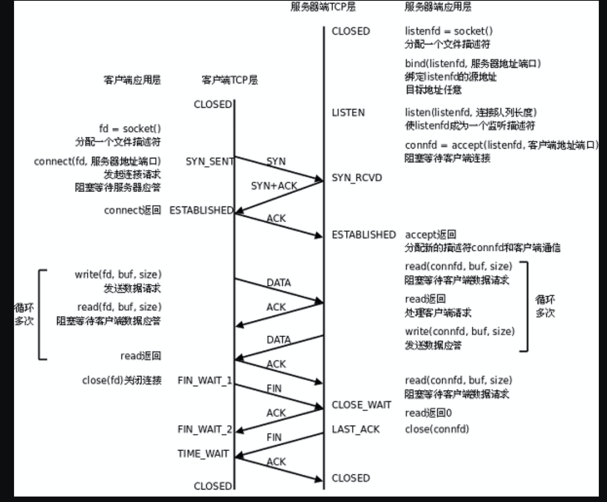
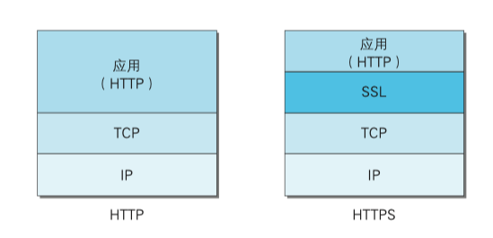
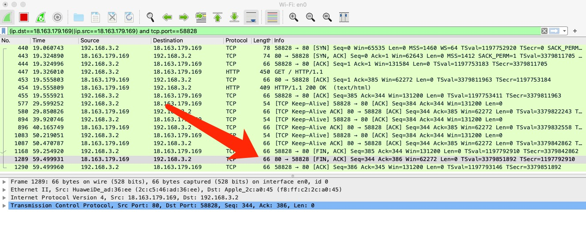

# Socket通信



- 首先服务端和客户端都需要预先分配文件描述符

- bind()绑定文件描述符和地址端口
- listen()使listenfd成为一个监听描述符，进入监听连接请求状态。建立两个队列
  - **SYN队列和ACCEPT队列**
  - 当客户端调用connect的时候，也就是第一次握手，会把请求方放入SYN队列，然后回一个第二次握手
  - 客户端收到第二次握手时connect返回，并回第三次握手
  - 服务器收到第三次握手的时候，就会把请求方从SYN队列中移除，放到ACCEPT队列中
  - 然后在服务器在调用accept函数以后，才会从ACCEPT队列中取出请求
- accept()阻塞直到有连接过来。从连接队列里取出并且分配一个新的文件描述符来进行通信

也就是说，SYN队列是用来保存半连接的，这部分并没有数据

而ACCEPT是用来保存建立好连接后传来的数据的

当传数据来以后并不需要马上处理，可以在任意时候调用accept函数进行处理。避免一直阻塞

---

在java中，只需要new一个ServerSocket对象，即可完成分配文件描述符和bind地址以及使文件描述符成为监听文件描述符的作用

原因是在构造函数中调用了bind函数，而bind函数进行了bind操作和listen操作。

```java
ServerSocket server = new ServerSocket(50001)
  
    public ServerSocket(int port, int backlog, InetAddress bindAddr) throws IOException {
  			
        setImpl();
        if (port < 0 || port > 0xFFFF)
            throw new IllegalArgumentException(
                       "Port value out of range: " + port);
        if (backlog < 1)
          backlog = 50;
        try {
            bind(new InetSocketAddress(bindAddr, port), backlog);
        } catch(SecurityException e) {
            close();
            throw e;
        } catch(IOException e) {
            close();
            throw e;
        }
    }
```

同样，在客户端，只需要new一个Socket对象，就完成了分配文件描述符以及connect函数的操作。

```java
//客户端代码
import java.io.IOException;
import java.io.ObjectInputStream;
import java.io.ObjectOutputStream;
import java.net.Socket;


public class TestClient {
    public Object send(String String, String host, int port) {
        try (Socket socket = new Socket(host, port)) {
            ObjectOutputStream objectOutputStream = new ObjectOutputStream(socket.getOutputStream());
            objectOutputStream.writeObject(String);
            ObjectInputStream objectInputStream = new ObjectInputStream(socket.getInputStream());
            return objectInputStream.readObject();
        } catch (IOException | ClassNotFoundException e) {
            System.out.println(("occur exception:"+e));
        }
        return null;
    }
    public static void main(String[] args) {
        TestClient helloClient = new TestClient();
        String string = (String) helloClient.send("content from client", "192.168.3.2", 50001);
        System.out.println("client receive String:" + string);
    }
}

//*********************************************************************************************************

//服务器代码
import java.io.IOException;
import java.io.ObjectInputStream;
import java.io.ObjectOutputStream;
import java.net.ServerSocket;
import java.net.Socket;

public class TestServer {
    public static void main(String[] args) throws IOException {
        //1.创建 ServerSocket 对象并且绑定一个端口
        try (ServerSocket server = new ServerSocket(50001);) {
            Socket socket;
            //2.通过 accept()方法监听客户端请求
            while ((socket = server.accept()) != null) {
                System.out.println(("client connected"));
                try (ObjectInputStream objectInputStream = new ObjectInputStream(socket.getInputStream());
                     ObjectOutputStream objectOutputStream = new ObjectOutputStream(socket.getOutputStream())) {
                    //3.通过输入流读取客户端发送的请求信息
                    String message = (String) objectInputStream.readObject();
                    System.out.println(("server receive message:" + message));
                    //4.通过输出流向客户端发送响应信息
                    objectOutputStream.writeObject(message);
                    objectOutputStream.flush();
                } catch (IOException | ClassNotFoundException e) {
                    System.out.println(("occur exception:"+e));
                }
            }
        } catch (IOException e) {
            System.out.println(("occur exception:"+e));
        }
    }
}
```


# http协议

## 请求

#### get和post请求的区别？

- 数据的位置
  - get请求的数据是包含在url里面的，形式是?key1=value1。因此请求数据的长度受到url的长度限制。
  - 而post请求的数据是包含的http请求包的请求体中，形式是key1=value1，没有大小限制。
- get数据直接被明文放在地址栏中，虽然post的数据也可以被抓包看到，但是get还可能被保存在历史记录中，web日志中，安全性更低一点
- 根据http的设计原则，希望get请求是对服务器没有修改的，post是对服务器进行了修改的
- get是幂等的，也就是多次操作得到的结果一样的。而post是不幂等的，这也是在post请求时刷新页面的话，浏览器会提示你可能会重复进行所有操作，是否继续的原因。

## 响应

### 常用状态码：三位数字

- 1xx：服务接受客户端消息，但没有完成需要进一步处理。
  - 例如100，客户端有一个较大的文件需要上传并保存，但是客户端不知道服务器是否愿意接受这个文件，所以希望在消耗网络资源进行传输之前，先询问一下服务器的意愿。此时，如果服务器愿意接受，就会返回 100 Continue 状态码，反之则返回 417 Expectation Failed 状态码。对于客户端而言，如果客户端没有发送实际请求的打算，则不应该发送包含 100 Continue Expect 的报文，因为这样会让服务器误以为客户端将要发送一个请求。
- 2xx：此次响应成功。代表值200，代表请求成功。
- 3xx：代表值301永久重定向302临时重定向，304访问缓存
- 4xx：请求错误，错误在客户端处。404请求路径没有资源、405请求方式没有对应方法，比如get请求但是服务端没有doget方法
- 5xx：服务器端错误。代表500服务器内部异常

## 输入网址后发生了什么？

#### 1. 生成http报文

解析URL，生成需要发送给web服务器的请求信息

#### 2. 查询ip地址

通过dns用域名查询到ip地址

接下来将发送交给协议层

#### 3. 通过ip地址和端口建立TCP连接

#### 4. 生成TCP报文

即在http报文上加上TCP头部，组装好报文后，交给网络层处理

TCP头部标示的是端口号

#### 5. IP协议将数据封装成网络包

生成IP报文，加上了IP头部。

IP头部标示的是IP地址

#### 6. MAC层

现在本地arp缓存中查询目的ip地址，查询到的话，直接发。

本地arp缓存没有的话，先判断该ip地址是不是和自己一个网段。

如果是一个网段，就在子网中广播，对应的目的就会回复告诉mac地址

如果不是一个网段，就会填默认网关的mac地址，转发给网关。然后网关再重复上述过程，不断转发、修改mac地址直到目的地。

MAC标示的是MAC地址

#### 7. 网卡发送

网卡驱动获取到包后，会加上一些分界符和校验值等，然后变为电信号通过网线发送出去

#### 8. 路由

通过ip地址不断转发到对应的端口。在这个过程中，包的ip地址是一直不变的，但是目的mac地址是一直变的，需要更改为下一个中间节点的mac地址

**发送过程是一层一层加头部，接收过程是一层一层解头部**


# https（http secure/over SSL）协议

https其实就是在TCP协议之上再加了一层SSL协议



## http协议的缺点：

- 通信使用明文（不加密），内容可能会被窃听
- 无法证明报文的完整性，可能已遭篡改
- 不验证通信方的身份，可能遭遇伪装

针对这些问题，需要引入https协议来解决。

### 1. 通信使用明文，会被窃听

对明文进行加密。

#### 只采用普通加密方式的局限性

如果采用对称加密，由于我们加密解密的密钥是同一个，服务器必须要将密钥发送给客户端。因此，在发送的过程中就有可能被监听，而泄漏密钥，无法保证安全的转交。

而如果采用非对称加密，服务器将自己的公钥发送给客户端，倒是不用担心私钥泄漏的风险。但是有可能会出现公钥被替换的情况。客户端有可能收到的公钥并不是服务器的公钥，而是攻击者发送的。这样的话，攻击者就能很轻松的破解密文。

而要想解决这个问题，客户端就必须能够知道我收到的这个公钥确实是服务器发送的公钥。

#### 引入第三方机构：数字证书

为了解决这个问题，就出现了数字证书。数字证书是由通信双方都信赖的第三方机构颁发的。

数字证书机构将服务器的公开密钥和证书机构的数字签名一起作为数字证书发给客户端。

然后客户端通过验证数字签名来保证该数字证书确实是来自证书机构，然后确定该公开密钥确实是来自服务器。

- 数字签名：私钥和公钥在加密上其实是对称的，也就是私钥加密的东西用公钥能解答。因此，用私钥对一段信息如a进行加密得到b，b就是a的数字签名。拥有公钥的人只需要用公钥对b进行解密看是不是得到a，如果能得到a说明这个信息确实是没有被篡改的，也就是可靠的。

也就是通过证书来证明收到的公钥确实是服务器发送的公钥，然后用这个公钥进行加密传送。

### 2. 无法证明报文完整性

在1中保证了顺利交换了密钥后，可以采用对文件进行摘要，然后对摘要进行数字签名的方式。如果验证电子签名最后得到的摘要信息和计算得到的摘要信息一致，说明没有被篡改。

### 3. 无法验证通信方的身份

- http的认证：
  - BASE64认证：将用户名和密码进行Base64编码传输，约等于明文传输，不存在安全性。
  - DIGEST认证：不发送密码的明文，而是发送密码的摘要，避免泄漏
- https的认证
  - 使用客户端证书来确定认证客户端计算机
  - 使用基于表单的用户名+密码来保证人是本人

# 网络协议

## TCP协议

#### 三次握手的过程？

三次握手指的是建立连接的一方A和接受建立连接请求另一方B，按以下情况建立连接：

- A发送一个建立连接请求报文给B，其中SYN位为1，代表我要建立连接，ACK位为0，代表ack号字段无效，第一个序列号seq=x是本地随机产生的。并等待B的回复
- B收到建立连接请求报文后，发现SYN位=1，说明是建立连接的请求。因此回复确认建立连接请求给A，其中SYN也是为1，ACK为1代表ack位有效，ack号字段=x+1，也随机生成第一个序列号seq=y。
- A收到回复后，SYN位为1，说明是确认建立连接的请求，回复给A，此时可以携带需要传输的数据了。SYN此时为0，ACK位为1，ack号字段=y+1，seq=x+1。
- 当B收到第三次报文时，连接建立成功

#### 为什么一定需要三次握手？两次行不行？

- 第一点，如果要进行两次往返的话，至少是三次。前两次，A知道了自己发去B的链路和B发回自己的链路是通畅的，能正常收发。但是此时B只知道A是能正常发送给自己的，不确定自己发的报文是不是能正常到达A。
- 第二点，如果只两次的话，如果A之前发送的建立连接请求因为网络原因被阻塞了，超时以后A又发送，这样当之前的请求到达B时，他就又会为A建立连接。而三次握手的话，A没有发第三次确认就不会真正建立连接。

#### 四次挥手的过程？

- 客户端A发送连接释放报文给服务端B，并停止发送数据，FIN=1，序列号seq等于之前用到的+1假设为x，进入等待回复状态
- 服务端B收到该报文时，回复确认报文，ACK=1，ack号=x+1，自己的序列号seq=y。发送出去之后，在服务器端看来，从客户端到服务器端的这条链路就被单向关闭了，但此时服务器端可能还有数据要发送给客户端，所以此时只是半关闭状态。
- 在服务器端将最后的数据发送完毕后，就向客户端发送释放连接报文，FIN=1，seq=z，ACK=1，**ack=x+1**。并等待客户端的确认
- 客户端收到服务端的连接释放报文时，回复确认，ACK=1，ack=z+1，seq=x+1。对客户端来说，此时还需要等待2*最长的报文段寿命才进入彻底的关闭状态。而服务器端在收到该确认报文的时候，就马上进入彻底的关闭状态。因此，服务器端结束的早一点。

#### 为什么建立连接需要三次而释放连接却必须要四次？

- 因为，当建立连接时，服务器收到建立连接的请求，可以将建立连接的请求和回复合成一个进行回复，因此在三次握手的过程中，服务器只发送的一个包。但是在释放连接的时候却不行，因为服务器此时可能还有数据需要发送，因此只能先回复报文，半释放连接，等到要发的数据全部发完才发送释放连接的请求。
- 事实上，如果服务器在接收到释放连接的请求后，没有数据需要发送的话，是可以将第二次和第三次合并在一起的。此时ACK=1，FIN=1。如下图



#### 为什么客户端在发送第四次挥手后需要经过2MSL(最大报文段生存时间)才能返回到CLOSE状态？

因为网络有可能不可靠。如果客户端第四次挥手的该报文没有到服务端的话，服务端没有收到第四次回复的话，会继续发送FIN片段，告诉客户端我没有收到回复，可能丢失了，你需要再发送一个给我。但是如果客户端在发送第四次挥手就关闭连接的话，也就收不到服务端的重发FIN了。

也就是说，这个时间是用来重发可能丢失的ACK报文，如果在这个时间内没有收到服务端的FIN的话，说明服务端成功收到了，可以安全释放连接了。收到的话，就继续第四次挥手的步骤。

## ARQ协议（自动重传请求）

自动重传请求，是通过接收方请求发送方重传出错的数据报文来恢复出错的报文，是用不可靠的信道提供可靠的服务的必要条件。

主要分为三种：停止等待ARQ、回退n个ARQ、选择性重传ARQ

### 停止等待

发送窗口接受窗口大小都是1，每发一个都必须停止等待回复才能发下一个。

信道利用率很低

### 回退n个

发送窗口大于1，接受窗口等于1。允许发送法可以连续发送多个请求，接收方只对最后顺序接收到的一个做回复，发送方收到回复就知道之前的全部被收到了。

例如，发送方发送12345，接收方只收到了1245，因此只能回复2，然后丢弃45。发送方收到2知道接收方已经接收到了1和2，必须重新发送345。

可以看出，虽然通过提高发送方的发送效率提升了信道利用率，但是45被丢弃需要重传还是浪费传输的能力

### 选择性重传

在选择性重传中，发送方的窗口和接收方的窗口都大于1，接收方对错误或者不连续丢失的做回复，要求重传。

例如之前的例子，发送方发送12345，接收方只收到了1245，此时就回复要求发送方重新传输3，并且不丢弃45，将45缓存下来。